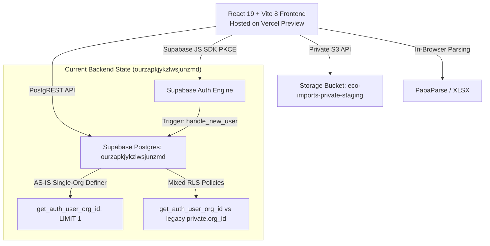
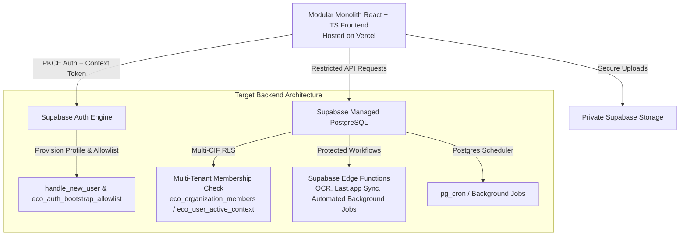

# ARCHITECTURE SPECIFICATION — HORECA MODULAR

## 1. Executive Summary
This document provides a clear demarcation between the **CURRENT AS-IS ARCHITECTURE** operating on the `dev` branch and the **APPROVED TARGET TO-BE ARCHITECTURE** specified under the VEGEN Software Product System.

---

## 2. CURRENT AS-IS ARCHITECTURE

### AS-IS Technical Inventory
- **Frontend Stack**: React 19, JavaScript ES Modules, Vite 8, Tailwind CSS v4, Lucide React icons.
- **Hosting & CI/CD**: Vercel Frontend Hosting connected to GitHub repository `amoresemiliano/horeca_modular` (`dev` branch -> Preview, `main` branch -> Production).
- **Authentication**: Native Supabase Auth (`auth.users`) using PKCE flow. DEV environment features temporary email/password auth (`VITE_DEV_PASSWORD_AUTH=true`). Legacy Firebase dependencies remain in `package.json` pending cleanup in WP-001.
- **Database Backend**: Canonical Supabase Staging project `ourzapkjykzlwsjunzmd` (`https://ourzapkjykzlwsjunzmd.supabase.co`).
- **Authorization Primitive**: `get_auth_user_org_id()` helper function that queries `eco_organization_members` and returns `LIMIT 1` active organization UUID for initial bootstrap.
- **Database RLS Policies**: Mixed state — newly migrated operational tables (`empleados`, `fichajes`, `produccion_registros`, `eco_financial_movements`) evaluate `get_auth_user_org_id()`, while legacy tables (`eco_audit_events`, `eco_import_issues`, `eco_normalized_records`) evaluate legacy helper `private.org_id()`.
- **Storage**: Single private storage bucket `eco-imports-private-staging` (`public = false`, max file size 20MB). RLS policy evaluates legacy `(storage.foldername(name))[1] = (private.org_id())::text`.
- **In-Browser Processing**: Bank CSV/XLS statement parsing handled in-browser using `papaparse` and `xlsx`.
- **State Management Residue**: Prototype/mock state stored in React local state and localStorage for Purchases (`src/modules/pedidos`) and Inventory.

---

## 3. APPROVED TARGET TO-BE ARCHITECTURE

### TO-BE Architecture Principles
1. **Modular Monolith Pattern**: Decoupled domain modules (`src/modules/*`) operating within a unified single-repository runtime.
2. **Multi-CIF / Multi-Organization Membership**: Full support for users managing multiple corporate entities (CIFs) and organizations. Users select an active organization context (`eco_user_active_context` / session claim), and RLS policies validate authorization against `eco_organization_members` for the specific target `organization_id`.
3. **Strict Database Row-Level Security**: 100% of application tables enforce RLS `TO authenticated` without any public/anon access or single-tenant default fallbacks.
4. **Supabase Edge Functions**: Heavy computational tasks, secure external API webhooks (Last.app POS integration, AI/OCR parsing), and background tasks execute within protected Edge Functions rather than client-side UI threads.
5. **Postgres-Native Background Tasks**: Automated reconciliation, recurring report generation, and status checks handled by backend triggers and database scheduling.
6. **Provider Adapters**: Standardized adapter interfaces for external services (Last.app POS, bank parsers, OCR engines) to ensure seamless maintainability.
7. **Environment Segregation**: Complete separation between DEV, UAT, and PROD environments across Git branches, Vercel deployments, and Supabase projects.

---

## 4. ENVIRONMENT MAPPING MATRIX (DEV vs UAT vs PROD)

| Environment Parameter | Development (DEV) | User Acceptance Testing (UAT / Staging) | Production (PROD) |
| :--- | :--- | :--- | :--- |
| **Git Target Branch** | `dev` | `feature/*` / PR tracking branches | `main` |
| **Hosting Platform** | Vercel Preview Deployment | Vercel Preview Deployment (PR Isolated) | Vercel Production Deployment |
| **Canonical URL** | `https://horecamodular-git-dev-vegen-s-projects.vercel.app/` | Generated per-PR Vercel Preview URL | `https://horecamodular.vercel.app/` |
| **Supabase Project Ref** | `ourzapkjykzlwsjunzmd` | `ourzapkjykzlwsjunzmd` | Production Supabase Instance Ref |
| **Supabase Project Name** | `horeca_modular_staging` | `horeca_modular_staging` | `horeca_modular_production` |
| **Publishable Client Key** | `VITE_SUPABASE_PUBLISHABLE_KEY` (`sb_publishable_...`) | `VITE_SUPABASE_PUBLISHABLE_KEY` (`sb_publishable_...`) | `VITE_SUPABASE_PUBLISHABLE_KEY` (Prod Key) |
| **Auth Configuration** | Email/Password (`VITE_DEV_PASSWORD_AUTH=true`) + PKCE | Google OAuth + GitHub OAuth + PKCE | Google OAuth + GitHub OAuth (`VITE_DEV_PASSWORD_AUTH=false`) |
| **Storage Bucket** | `eco-imports-private-staging` | `eco-imports-private-staging` | `eco-imports-private-prod` |
| **Database Data Reset** | Allowed (Isolated Dev Test Data) | Restricted (Controlled QA Test Fixtures) | Strictly Prohibited (Production Audit Data) |
