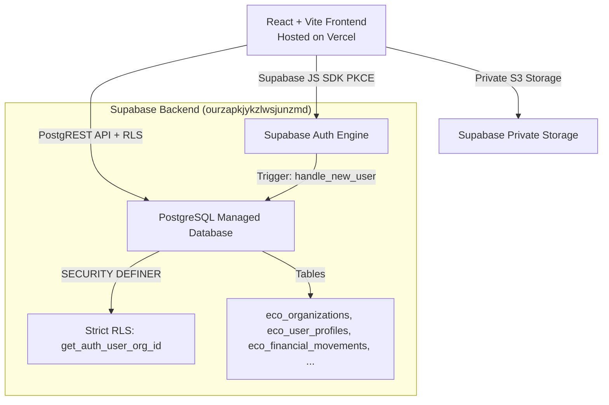

# ARCHITECTURE SPECIFICATION — HORECA MODULAR

## 1. High-Level System Architecture
HORECA Modular is structured as a **Modular Monolith** web application designed for fast deployment, low latency, and single-codebase maintainability.



## 2. Technology Stack
- **Frontend Core**: React 19, JavaScript ES Modules, HTML5.
- **Styling**: Vanilla CSS with custom CSS variable design system (`index.css`), Tailwind CSS v4 for utility components.
- **Build System**: Vite v8.
- **Hosting**: Vercel Frontend Hosting with automated branch previews (`dev` -> Preview, `main` -> Production).
- **Backend Infrastructure**: Supabase Managed Backend (`ourzapkjykzlwsjunzmd` Staging/Dev).
- **Database Engine**: PostgreSQL with `pgcrypto`, `uuid-ossp` extensions.
- **Authentication**: Supabase Auth (PKCE flow).

## 3. Directory Layout & Module Boundaries
```
/src
  /assets          # Brand images, client logos, static SVGs
  /components      # Core layout (MainLayout.jsx, Login.jsx)
  /context         # Global AuthContext (AuthProvider, fail-closed state)
  /lib             # Supabase client singleton (supabase.js)
  /modules         # Decoupled domain modules
    /bancos        # Extractos statement parsing & allocation
    /configuracion # User access & company settings
    /escandallos   # Recipe costing UI & calculators
    /extractos     # Statement parsing app
    /horarios      # Personal & fichajes management
    /inventario    # Inventory & stock management
    /kpis          # KPI analytics & executive dashboards
    /pedidos       # Purchases & supplier orders
    /prediccion    # Predictive analytics
    /produccion    # Production line tracking
    /ventas        # Sales & Last.app POS integration
```
