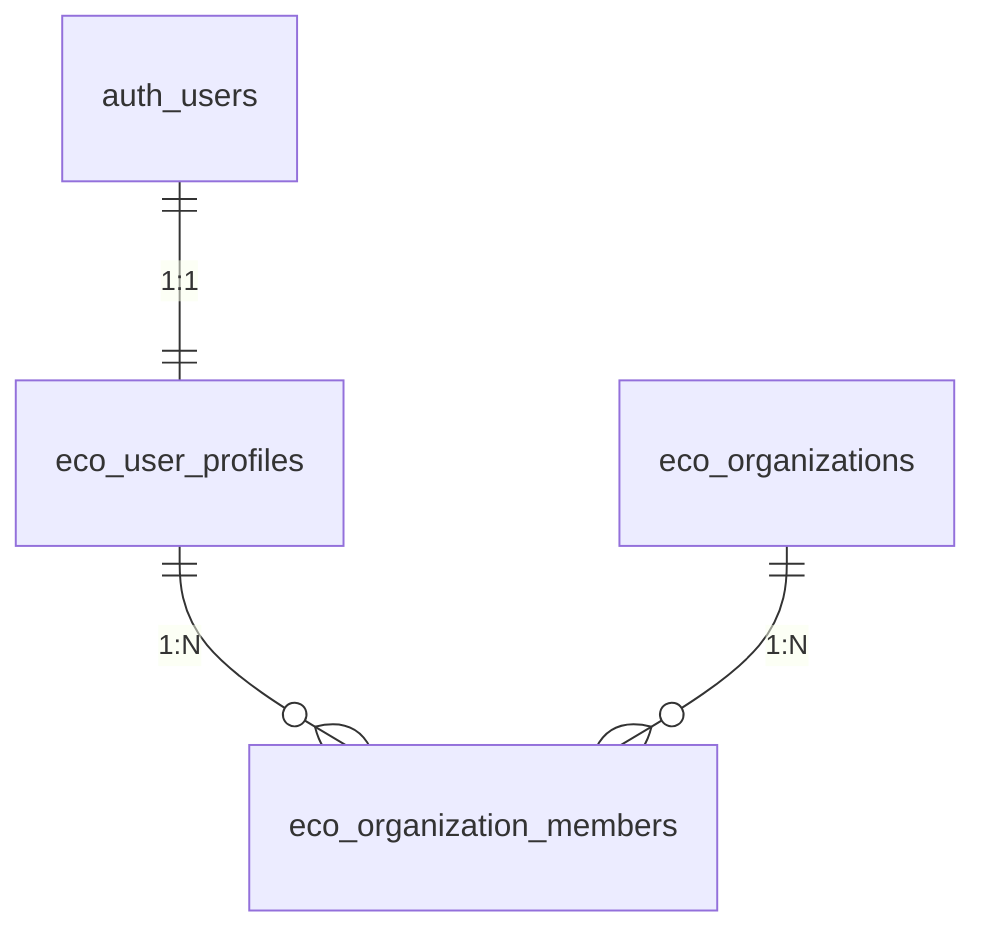

# DOMAIN MODEL — HORECA MODULAR

## 1. Multi-Tenant Core Domain
The foundation of HORECA Modular relies on a three-tier identity and organizational hierarchy:
- `eco_organizations`: Represents tenant accounts (e.g., El Criollo, client restaurants).
- `eco_user_profiles`: Extends Supabase `auth.users` with global user attributes, active status, and primary profile reference.
- `eco_organization_members`: Maps `eco_user_profiles.id` to `eco_organizations.id` with assigned operational role (`SUPERADMIN`, `ADMIN`, `GERENTE`, `OPERADOR`, `CONSULTA`).

## 2. Banking & Financial Domain (Extractos)
Manages statement processing, normalized records, and accounting allocations:
- `eco_source_files`: Stores imported file metadata, file SHA hashes, and upload status.
- `eco_source_imports`: Tracks import jobs linked to financial accounts.
- `eco_import_rows`: Raw statement rows parsed from bank CSV/XLS files.
- `eco_financial_movements`: Standardized movement entries with transaction dates, amounts, counterparties, and unique row hashes.
- `eco_movement_allocations`: Editable economic allocations linking movements to tax categories and cost centers.
- `eco_classification_rules`: Deterministic rules matching movement descriptions to automated categories.
- `eco_counterparties`: Vendor and customer registry for financial reconciliation.

## 3. Personal & HR Domain
Tracks personnel, shifts, and attendance:
- `empleados`: Employee master table linked to `organization_id`.
- `fichajes`: Time clock records (entrance/exit timestamps, entry type).
- `incidencias`: Absences, sick leave, medical notes, and schedule exceptions.

## 4. Production Domain
- `produccion_registros`: Batch logs capturing date, production line, product, quantity, unit, lot number, and assigned operator.

## 5. Escandallos (Recipe Costing) Domain
*(Defined in `20260901000000_init_escandallos.sql`)*
- `escandallo_platos`: Dish catalog, category, target selling price, and target food cost percentage.
- `escandallo_ingredientes`: Ingredient master list, unit of measure, purchase cost, and waste percentage.
- `escandallo_recetas`: Recipe breakdown mapping dishes to ingredients with exact quantities.

## 6. Compras & Inventario Domain
- Historical purchases catalog, supplier orders, invoice tracking, and stock movement logs.
