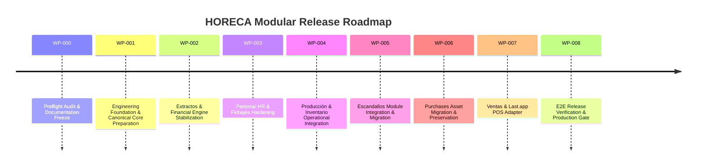

# MIGRATION ROADMAP — HORECA MODULAR

## 1. Roadmap Overview
The migration roadmap structures system development into sequential, autonomous Work Packages (WPs). Each WP must be fully audited, implemented, tested, and validated before proceeding to the next.

## 2. Work Package Breakdown

### WP-000: Foundation Preflight & Documentation Freeze *(Current)*
- **Objective**: Machine-verifiable forensic audit of repo, Supabase DB, migrations, and storage. Freeze approved VEGEN documentation set.
- **Deliverables**: Comprehensive audit reports, 16 documentation files in `/docs` and `/agent`, database drift report.

### WP-001: Engineering Foundation & Canonical Core Preparation
- **Objective**: Refactor legacy RLS policies to multi-tenant standards, consolidate database schema migrations, sanitize legacy Firebase dependencies, configure modern Supabase publishable keys, and establish Edge Function scaffolding.

### WP-002: Extractos & Financial Engine Stabilization
- **Objective**: Finalize multi-format bank statement parsing (BBVA/Sabadell), duplicate detection, row allocation engine, and financial reporting.

### WP-003: Personal / HR & Fichajes Hardening
- **Objective**: Secure employee registry (`empleados`), daily clock-in/out (`fichajes`), and incident reporting (`incidencias`) with strict multi-tenant RLS.

### WP-004: Producción & Inventario Operational Integration
- **Objective**: Replace prototype state in Production and Inventory modules with persistent DB schema and stockout analytics.

### WP-005: Escandallos Module Integration & Migration
- **Objective**: Audit, refactor RLS policies, run migration `20260901000000_init_escandallos.sql`, and merge branch `feature/escandallos-2485206073148743544` into `dev`.

### WP-006: Purchases Asset Migration & Data Preservation
- **Objective**: Migrate historical purchase data and establish persistent purchase order tracking.

### WP-007: Ventas & Last.app Adapter Integration
- **Objective**: Implement automated sales ingestion from Last.app POS, ticket itemization, and revenue reconciliation.

### WP-008: Release Hardening, E2E Testing & Production Gate
- **Objective**: Complete end-to-end regression testing on DEV/Preview, audit security policies, and promote validated `dev` branch to `main` for Production deployment.
