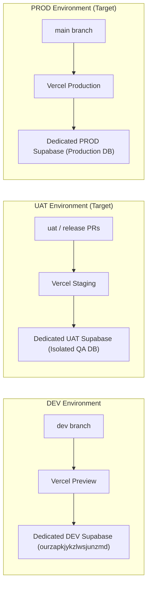

# PROJECT STATE — HORECA MODULAR

## 1. Current Verified Environments Matrix

| Environment | Git Branch | Git SHA | Vercel URL | Supabase Project Ref | Status | Verification |
| :--- | :--- | :--- | :--- | :--- | :--- | :--- |
| **DEV** | `dev` | `4274f39204a4321cb20a0a7ec4dac78052be9555` | `https://horecamodular-git-dev-vegen-s-projects.vercel.app/` | `ourzapkjykzlwsjunzmd` | **ACTIVE** | `VERIFIED_BY_LOCAL_AGENT` |
| **UAT** | *None* | *None* | *None* | *None* | **NOT PROVISIONED** | `NOT PROVISIONED` |
| **PROD** | `main` | `8a1fcb1a502a291165aff53dcd3005048c01cd65` | `https://horecamodular.vercel.app/` | *Unproven* | **ACTIVE (FRONTEND ONLY)** | `NOT VERIFIED (BACKEND)` |

> **PROD BACKEND CLARIFICATION**: The production Vercel frontend deployment is active, but the exact target production Supabase backend project reference cannot be verified from current accessible evidence. Legacy reference `vmxjqwlfwnphorthhcwu` is deprecated and must not be assigned to PROD without explicit cryptographic verification.

---

## 2. Target Environment Topology (Future State)

In the target architecture, environments will be strictly isolated across three tiers:

---

## 3. Infrastructure & Repository Snapshot
- **Canonical Repository**: `https://github.com/amoresemiliano/horeca_modular`
- **Default Branch**: `main`
- **Active Development Branch**: `dev`
- **Staging Database Project**: `ourzapkjykzlwsjunzmd` (`https://ourzapkjykzlwsjunzmd.supabase.co`)
- **Key Fingerprint (Publishable)**: `sb_publishable_...Smhggsu`
- **Storage Bucket**: `eco-imports-private-staging` (1 private bucket in staging)
- **Active Database Tables**: 34 public tables in staging

---

## 4. Work Package WP-000 Status
- **Preflight Audit**: COMPLETE
- **Documentation Freeze**: COMPLETE
- **Database Drift Report**: GENERATED (`./DATABASE_DRIFT_REPORT.md`)
- **Status**: TECHNICALLY_READY_FOR_FINAL_ACCEPTANCE

---

## 5. Local Documentation Synchronization

- **Sync Status**: `VERIFIED_BY_LOCAL_AGENT`
- **Local Root Path**: `c:\Users\Emiliano\Documents\1. Sistemas\El Criollo\documentación_procesos\`
- **Synchronization Timestamp**: `2026-09-09T01:20:00Z`
- **Files Synchronized**: 19 canonical documentation markdown files
- **Independent Verification**: `NOT AVAILABLE FROM REPOSITORY` (Local filesystem operation only)
