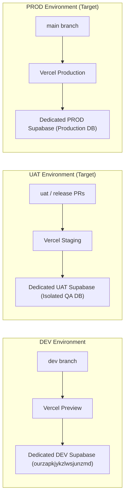

# PROJECT STATE — HORECA MODULAR

## 1. Current Verified Environments Matrix

| Environment | Git Branch | Git SHA | Vercel URL | Supabase Project Ref | Status | Verification |
| :--- | :--- | :--- | :--- | :--- | :--- | :--- |
| **DEV** | `dev` | `a90724d47b2a6aea2248187b1806bfd13bb8d9fa` (baseline) | `https://horecamodular-git-dev-vegen-s-projects.vercel.app/` | `ourzapkjykzlwsjunzmd` | **ACTIVE** | `VERIFIED_BY_LOCAL_AGENT` |
| **UAT** | *None* | *None* | *None* | *None* | **NOT PROVISIONED** | `NOT PROVISIONED` |
| **PROD** | `main` | `8a1fcb1a502a291165aff53dcd3005048c01cd65` | `https://horecamodular.vercel.app/` | *Unproven* | **ACTIVE (FRONTEND ONLY)** | `NOT VERIFIED (BACKEND)` |

> **PROD BACKEND CLARIFICATION**: The production Vercel frontend deployment is active, but the exact target production Supabase backend project reference cannot be verified from current accessible evidence. Legacy reference `vmxjqwlfwnphorthhcwu` is deprecated and must not be assigned to PROD without explicit cryptographic verification.

---

## 2. Target Environment Topology (Future State)

In the target architecture, environments will be strictly isolated across three tiers:

---

## 3. Infrastructure & Repository Snapshot
- **Canonical Repository**: `https://github.com/amoresemiliano/horeca_modular`
- **Default Branch**: `main`
- **Active Development Branch**: `dev`
- **Active Working Package Branch**: `wp/001-engineering-foundation`
- **Staging Database Project**: `ourzapkjykzlwsjunzmd` (`https://ourzapkjykzlwsjunzmd.supabase.co`)
- **Key Fingerprint (Publishable)**: `sb_publishable_...Smhggsu`
- **Storage Bucket**: `eco-imports-private-staging` (1 private bucket in staging)
- **Active Database Tables**: 34 public tables in staging

---

## 4. Work Package Status

- **WP-000**: CLOSED & APPROVED (SHA: `a90724d47b2a6aea2248187b1806bfd13bb8d9fa`)
- **WP-001 (Engineering Foundation & Canonical Core Preparation)**:
  - TypeScript 5.8 & Vite Tooling: **PASS**
  - Canonical Source Layer Boundaries: **PASS**
  - Vitest Automated Test Runner & 34 Tests: **PASS**
  - GitHub Actions CI Workflow: **PASS**
  - Runtime Environment Contract: **PASS**
  - Firebase Dependency Sanitization: **PASS (REMOVED)**
  - Canonical DB Reconstruction Plan: **PASS** (`docs/CANONICAL_DB_RECONSTRUCTION_PLAN.md`)
  - Tenancy & Authorization Technical Design: **PASS** (`docs/TENANCY_AUTHORIZATION_TECHNICAL_DESIGN.md`)
  - Security Isolation Acceptance Contract (10 Scenarios): **PASS**
  - Status: **TECHNICALLY_READY_FOR_INDEPENDENT_REVIEW**

---

## 5. Local Documentation Synchronization

- **Sync Status**: `VERIFIED_BY_LOCAL_AGENT`
- **Local Root Path**: `c:\Users\Emiliano\Documents\1. Sistemas\El Criollo\documentación_procesos\`
- **Files Synchronized**: Canonical documentation markdown files in `/docs` and `/agent`
- **Independent Verification**: `NOT AVAILABLE FROM REPOSITORY` (Local filesystem operation only)
