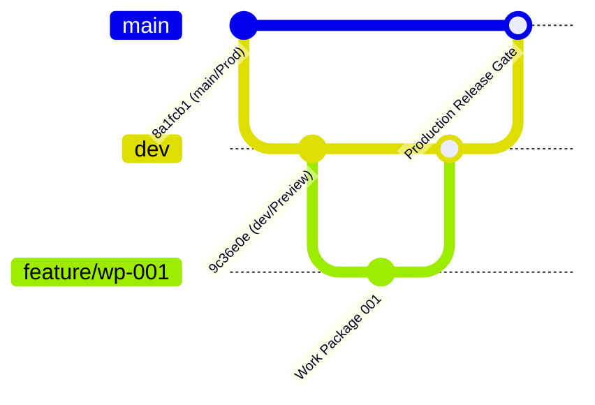

# RELEASE WORKFLOW — HORECA MODULAR

## 1. Branching & Deployment Strategy
HORECA Modular follows a strict two-branch environment model:

- **`dev` branch**: Target branch for all active Work Packages. Pushes automatically build to Vercel Preview environment (`https://horecamodular-git-dev-vegen-s-projects.vercel.app/`). Connected to Supabase Staging (`ourzapkjykzlwsjunzmd`).
- **`main` branch**: Production release branch. Pushes deploy to Vercel Production domain (`https://horecamodular.vercel.app/`). Connected to Supabase Production instance.

## 2. Work Package Execution Protocol
1. **Dedicated Feature Branch**: Created from `dev` for every Work Package (e.g. `feature/wp-001-auth-hardening`).
2. **Implementation & Local Test**: Complete code modifications, run `npm run build`, and execute local test scripts in `scratch/`.
3. **Validation & PR Merge to `dev`**: Validate on Vercel Preview. Merge PR to `dev`.
4. **Product Owner Gate**: PO performs functional UX validation on DEV Preview.
5. **Production Promotion**: Upon formal PO signoff at WP completion milestones, `dev` is merged into `main`.

## 3. Mandatory Safety Rules
- NEVER push unvalidated code directly to `main`.
- NEVER run destructive schema migrations on live database instances without snapshot backups.
- NEVER weaken database Row-Level Security (RLS) to bypass authorization errors.
