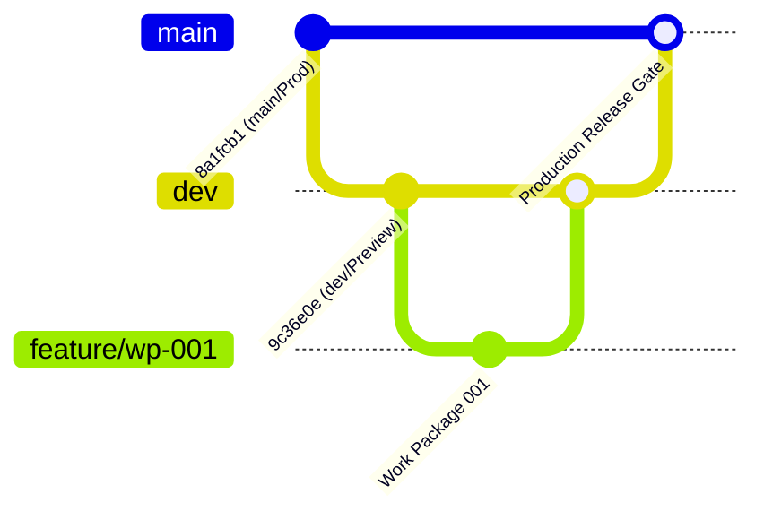

# RELEASE WORKFLOW — HORECA MODULAR

## 1. Branching & Deployment Strategy
HORECA Modular follows a strict two-branch environment model:

```mermaid
gitGraph
    commit id: "8a1fcb1 (main/Prod)"
    branch dev
    checkout dev
    commit id: "9c36e0e (dev/Preview)"
    branch feature/wp-001
    checkout feature/wp-001
    commit id: "Work Package 001"
    checkout dev
    merge feature/wp-001
    checkout main
    merge dev id: "Production Release Gate"
```

- **`dev` branch**: Target branch for all active Work Packages. Pushes automatically build to Vercel Preview environment (`https://horecamodular-git-dev-vegen-s-projects.vercel.app/`). Required Supabase target: `vmxjqwlfwnphorthhcwu` (`horeca_modular_staging`). Local configuration is verified; hosted Preview environment variables require separate verification. See [DEV rebaseline](DEV_SUPABASE_REBASELINE.md).
- **`main` branch**: Production release branch. Pushes deploy to Vercel Production domain (`https://horecamodular.vercel.app/`). DEV and PROD intentionally share canonical Supabase `vmxjqwlfwnphorthhcwu`. El Criollo is REAL PRODUCTION ONLY. DEV/UAT fixtures and destructive tests must target HORECA DEV LAB or another explicitly disposable tenant. See [production state](PRODUCTION_STATE.md) and [operating rules](SHARED-PRODUCTION-OPERATING-RULES.md).

## 2. Work Package Execution Protocol
1. **Dedicated Feature Branch**: Created from `dev` for every Work Package (e.g. `feature/wp-001-auth-hardening`).
2. **Implementation & Local Test**: Complete code modifications, run `npm run build`, and execute reviewed local test scripts only; never execute `scratch/quarantine-mica/` evidence.
3. **Validation & PR Merge to `dev`**: Validate on Vercel Preview. Merge PR to `dev`.
4. **Product Owner Gate**: PO performs functional UX validation on DEV Preview.
5. **Production Promotion**: Upon formal PO signoff at WP completion milestones, `dev` is merged into `main`.

## 3. Mandatory Safety Rules
- NEVER push unvalidated code directly to `main`.
- NEVER run destructive schema migrations on live database instances without snapshot backups.
- NEVER weaken database Row-Level Security (RLS) to bypass authorization errors.

## 4. Local Documentation Synchronization Protocol
- **Product Owner Local Root**: `1. Sistemas/El Criollo/documentación_procesos` (Full local path: `c:\Users\Emiliano\Documents\1. Sistemas\El Criollo\documentación_procesos`).
- **Sandbox File System Isolation**: Direct automated tool writes from agent execution to directories outside workspace root (`c:\Users\Emiliano\Documents\1. Sistemas\El Criollo\el-criollo-ecosistema\el_criollo_modular`) are restricted by IDE security policy.
- **Source of Truth & Synchronization Protocol**: The canonical version-controlled source of truth for all technical and product documentation is maintained inside the repository at `/docs/*.md` and `/agent/*.md`. Upon release tagging or WP completion, the Product Owner or release script copies `/docs/*.md` directly into `1. Sistemas/El Criollo/documentación_procesos`.
