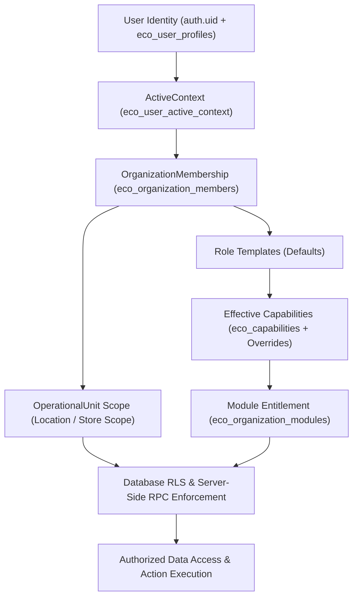
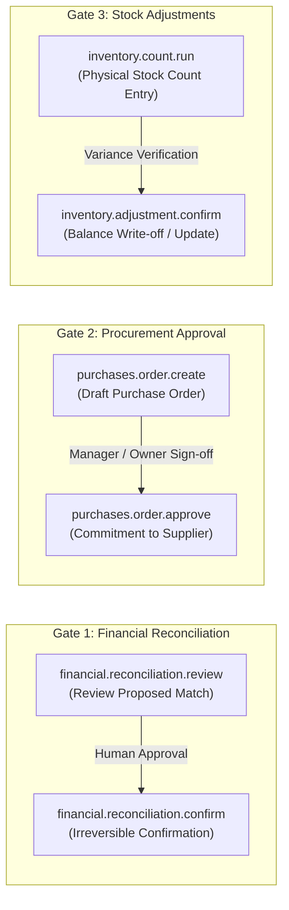

# CANONICAL AUTHORIZATION & ROLE CAPABILITY MATRIX — HORECA MODULAR

## 1. Canonical Authorization Model

Authorization in HORECA Modular follows the approved VEGEN target 6-element evaluation chain:

$$\text{Authorization} = \text{User} + \text{OrganizationMembership} + \text{Effective Capabilities} + \text{OperationalUnit Scope} + \text{Module Entitlement} + \text{ActiveContext}$$

### Core Axioms & Architectural Rules:
- **Role $\neq$ Authorization**: Roles are descriptive starting templates only. Authority is determined strictly by granular, validated capabilities.
- **ActiveContext $\neq$ Access**: Selecting an active organization context in the UI does not grant access. Database Row Level Security (RLS) validates membership and active state on every query (Fail-Closed).
- **Entitlement $\neq$ Capability**: A module being enabled for an organization (`eco_organization_modules`) does not give all members access to it; users must also possess the required capability.
- **Platform Admin $\neq$ Tenant Owner**: Platform control (`VEGEN_PLATFORM_ADMIN`) is segregated from tenant operational data access. Platform administration covers infrastructure, tenant provisioning, and platform-level support, not routine access to tenant private operational data.
- **Holding Access $\neq$ Organization Operational Access**: Holding-level management provides aggregated oversight and governance, but operational actions within a specific legal entity (CIF) require explicit organization-level capabilities.
- **Multi-Organization / Multi-CIF Flexibility**: A single User may belong to multiple Organizations/CIFs. The same User may hold entirely distinct roles, capability overrides, and operational unit scopes in each Organization.
- **No Client-Side / JWT Metadata Authority**: JWT `app_metadata` is **never** the canonical source of authorization. Persistent authorization is resolved directly from authoritative database state (`eco_organization_members`, `eco_capabilities`, `eco_membership_capability_overrides`, `eco_organization_modules`) enforced by Postgres RLS and security-definer RPCs.
- **Capability Immutability**: Tenant administrators may assign VEGEN-defined capabilities and configure scopes, but they may **NOT** invent custom capability primitives or redefine capability semantics.

---

## 2. Canonical Scope Hierarchy

| Scope Level | Key | Definition & Security Boundary |
| :--- | :--- | :--- |
| **Platform** | `PLATFORM` | Cross-tenant administrative scope reserved for platform maintenance and global configuration. |
| **Holding** | `HOLDING` | Multi-organization governance scope spanning all legal entities (CIFs) within a defined corporate holding group. |
| **Organization** | `ORGANIZATION` | Tenant boundary isolated to a single legal entity / CIF (`eco_organizations`). Canonical isolation boundary for RLS. |
| **Operational Unit** | `OPERATIONAL_UNIT` | Granular operational scope restricting access to specific store locations, kitchens, or points of sale (`eco_operational_units`). |
| **Sensitive Data** | `SENSITIVE_DATA` | Restricted data scope protecting salaries, hourly wage rates, personal banking details, and confidential financial metrics. |

---

## 3. Approved Role-Template Vocabulary

Roles in HORECA Modular are predefined templates that bundle default capabilities. They simplify initial user provisioning while allowing granular capability overrides.

### A. Platform Level
- **`VEGEN_PLATFORM_ADMIN`**: Global platform operator responsible for tenant provisioning, system health, platform migrations, and global telemetry. Does not perform routine tenant-level operations.

### B. Holding Level
- **`HOLDING_OWNER`**: Legal owner or principal executive of a multi-CIF corporate group. Possesses global oversight, consolidated reporting, and governance across all child organizations.
- **`HOLDING_ADMIN`**: Administrative manager of a holding group. Manages cross-company module entitlements, centralized reporting, and organization provisioning within the holding.

### C. Organization Level (Tenant / CIF)
- **`OWNER`**: Legal entity owner / franchisee principal. Holds complete operational, financial, HR, and configuration authority within the organization.
- **`MANAGER`**: Unit general manager or store director. Full operational authority across daily sales, inventory, purchasing, recipe viewing, and personnel scheduling within assigned operational units.
- **`ADMINISTRATIVE`**: Back-office administrator. Manages invoicing, supplier metadata, basic accounting preparation, employee records, and routine compliance documents.
- **`PURCHASING`**: Dedicated procurement manager. Manages supplier catalogs, price comparisons, and purchase order drafting and tracking.
- **`RECEPTION_FLOOR`**: Front-of-house or delivery reception staff. Manages goods receipt confirmations, delivery note scanning, and floor inventory counts.
- **`PRODUCTION`**: Kitchen production staff / central prep cook. Logs production batches, kitchen waste/merma, and recipe execution steps.
- **`COOK_COST_SHEET_MANAGER`**: Executive chef or kitchen manager. Manages recipe formulation, ingredient composition, yield testing, and cost sheet adjustments.
- **`HR_PERSONNEL`**: Human resources / payroll supervisor. Manages employee onboarding, time tracking (fichajes), shift scheduling, and incident records.
- **`EXTERNAL_ACCOUNTANT`**: External gestoría / accounting firm. **Read-oriented by default**. Granted read access to bank movements, reconciliation logs, tax summaries, POS tickets, and expense categories for tax preparation and reporting.
- **`CONSULTANT`**: External advisor / auditor. Read-only access to operational metrics, sales performance, and cost analytics within scoped timeframes.

---

## 4. Capability Families & Primitives

Capabilities are the true atomic unit of authorization in HORECA Modular.

### 1. Platform Administration (`platform.*`)
- `platform.tenants.provision`: Create and configure new organizations and holdings.
- `platform.system.monitor`: View global telemetry, error logs, and infrastructure health.
- `platform.migrations.apply`: Execute platform-level database migrations and maintenance tasks.

### 2. Organizations & Memberships (`org.*`, `membership.*`)
- `org.config.read`: View organization legal data, CIF, and configuration settings.
- `org.config.write`: Modify organization metadata, settings, and business profile.
- `membership.users.invite`: Invite new users to an organization.
- `membership.roles.assign`: Assign role templates and capability overrides to members.
- `membership.users.remove`: Revoke organization membership.

### 3. Operational Units (`opunit.*`)
- `opunit.manage`: Create, edit, and configure store locations, kitchens, and points of sale.
- `opunit.assign_scope`: Assign user visibility to specific operational units.

### 4. Sales & POS (`sales.*`)
- `sales.view`: View sales summaries, daily revenue figures, and historical trends.
- `sales.tickets.read`: Inspect itemized POS tickets, payment breakdowns, and diner counts.
- `sales.import.upload`: Upload Last.app POS CSV/XLS sales reports.
- `sales.import.process`: Execute automated POS sales parsing and ticket generation.

### 5. Purchases & Suppliers (`purchases.*`, `suppliers.*`)
- `suppliers.manage`: Create and update supplier master data, CIFs, payment terms, and contacts.
- `purchases.order.create`: Draft new purchase orders (Subject to approval gate).
- `purchases.order.approve`: Formally approve and commit purchase orders to suppliers.
- `purchases.reception.confirm`: Confirm goods receipt against supplier delivery notes.
- `purchases.invoices.manage`: Register and verify supplier purchase invoices.

### 6. Catalog & Products (`catalog.*`, `products.*`)
- `catalog.products.read`: Browse product and ingredient catalog.
- `catalog.products.write`: Create, edit, and categorize raw ingredients and saleable items.
- `catalog.pricing.manage`: Update supplier price lists and historical ingredient costs.

### 7. Recipes & Cost Sheets (`recipes.*`, `costsheets.*`)
- `recipes.view`: View recipe compositions, allergen lists, and preparation methods.
- `costsheets.view`: Inspect recipe cost breakdowns, theoretical margins, and food cost %.
- `costsheets.edit`: Modify recipe ingredients, proportions, waste percentages, and target margins.

### 8. Production (`production.*`)
- `production.batch.log`: Record central kitchen prep batches and finished quantities.
- `production.waste.log`: Record kitchen shrinkage, spoilage, and preparation waste.

### 9. Inventory & Stock (`inventory.*`)
- `inventory.stock.view`: View current stock levels, storage locations, and valuations.
- `inventory.count.run`: Perform physical stock count entries (Subject to adjustment gate).
- `inventory.adjustment.confirm`: Authorize and confirm inventory adjustments and write-offs.

### 10. Financial & Statements (`financial.*`, `statements.*`)
- `statements.import.upload`: Upload bank statement files (CSV/XLS/OFX/Norma 43).
- `statements.import.process`: Parse, validate, and normalize bank movement records.
- `financial.reconciliation.review`: Review proposed automated reconciliation matches.
- `financial.reconciliation.confirm`: Commit and confirm bank-to-ledger / POS reconciliations.
- `financial.allocation.edit`: Classify transactions into tax subcategories and cost centers.

### 11. Documents & OCR (`documents.*`, `ocr.*`)
- `documents.upload`: Upload invoices, delivery notes, and receipts to secure storage.
- `documents.ocr.process`: Trigger automated OCR text and table extraction.
- `documents.ocr.verify`: Review and manually correct OCR-extracted data fields.

### 12. Personnel & HR (`personnel.*`, `hr.*`)
- `personnel.employees.manage`: Create and maintain employee profiles and contract data.
- `personnel.fichajes.write`: Submit daily clock-in / clock-out records (fichajes).
- `personnel.fichajes.audit`: Review, adjust, and approve employee time entries.
- `personnel.incidencias.manage`: Record medical leaves, vacation requests, and labor incidents.

### 13. Reporting, P&L & Metrics (`reporting.*`, `pnl.*`, `metrics.*`)
- `reporting.operational.view`: View daily operational KPIs (ticket average, table turnover).
- `reporting.pnl.view`: View comprehensive operational Profit & Loss statements.
- `reporting.tax_summary.view`: View periodic tax summaries (IVA, Retenciones) for gestoría.

### 14. Integrations (`integrations.*`)
- `integrations.config.manage`: Configure API credentials for Last.app, delivery aggregators, or banks.
- `integrations.sync.trigger`: Manually trigger synchronization webhooks and data pipelines.

### 15. Deletion & Recovery (`deletion.*`, `recovery.*`)
- `data.records.delete_soft`: Soft-delete operational records with audit trail logging.
- `data.records.purge_hard`: Permanently purge records (Restricted to OWNER / Platform Admin).
- `data.records.restore`: Restore previously soft-deleted records.

### 16. Sensitive Data (`sensitivedata.*`)
- `sensitivedata.salaries.read`: Access employee hourly wage rates, salaries, and payroll totals.
- `sensitivedata.banking.read`: View full bank account numbers (IBAN) and financial account credentials.

---

## 5. Explicit Human Gates

To prevent accidental data corruption, fraud, and unverified financial commitments, HORECA Modular strictly enforces separation of authority via distinct capabilities across three critical operational human gates:

| Human Gate Process | Entry Capability | Gated Confirmation Capability | Architectural Rationale |
| :--- | :--- | :--- | :--- |
| **Financial Reconciliation** | `financial.reconciliation.review` | `financial.reconciliation.confirm` | Reviewing algorithmic candidate matches is exploratory; confirming writes irreversible ledger links. |
| **Procurement Commitment** | `purchases.order.create` | `purchases.order.approve` | Kitchen / bar staff can draft stock replenishment orders; financial commitment requires authorized approval. |
| **Inventory Shrinkage / Count** | `inventory.count.run` | `inventory.adjustment.confirm` | Floor staff log physical count numbers; stock write-offs and ledger adjustments require supervisor authorization. |

---

## 6. Canonical Role Template vs Capability Matrix

| Capability Family | VEGEN_PLATFORM_ADMIN | HOLDING_OWNER | OWNER | MANAGER | ADMINISTRATIVE | PURCHASING | RECEPTION_FLOOR | PRODUCTION | COOK_COST_SHEET | HR_PERSONNEL | EXTERNAL_ACCOUNTANT | CONSULTANT |
| :--- | :---: | :---: | :---: | :---: | :---: | :---: | :---: | :---: | :---: | :---: | :---: | :---: |
| **Platform Ops** | `FULL` | `DENIED` | `DENIED` | `DENIED` | `DENIED` | `DENIED` | `DENIED` | `DENIED` | `DENIED` | `DENIED` | `DENIED` | `DENIED` |
| **Org & Membership** | `SCOPED` | `FULL` | `FULL` | `VIEW` | `DENIED` | `DENIED` | `DENIED` | `DENIED` | `DENIED` | `DENIED` | `DENIED` | `DENIED` |
| **Sales & POS** | `DENIED` | `READ` | `FULL` | `OPERATE` | `READ` | `DENIED` | `DENIED` | `DENIED` | `DENIED` | `DENIED` | `READ` | `READ` |
| **Purchases & Suppliers** | `DENIED` | `READ` | `FULL` | `APPROVE` | `OPERATE` | `FULL` | `RECEIVE` | `DENIED` | `READ` | `DENIED` | `READ` | `DENIED` |
| **Catalog & Products** | `DENIED` | `READ` | `FULL` | `FULL` | `OPERATE` | `OPERATE` | `READ` | `READ` | `FULL` | `DENIED` | `READ` | `READ` |
| **Recipes & Cost Sheets** | `DENIED` | `READ` | `FULL` | `READ` | `DENIED` | `READ` | `DENIED` | `READ` | `FULL` | `DENIED` | `READ` | `READ` |
| **Kitchen Production** | `DENIED` | `READ` | `FULL` | `MANAGE` | `DENIED` | `DENIED` | `DENIED` | `FULL` | `MANAGE` | `DENIED` | `DENIED` | `DENIED` |
| **Inventory & Stock** | `DENIED` | `READ` | `FULL` | `MANAGE` | `READ` | `MANAGE` | `COUNT` | `COUNT` | `READ` | `DENIED` | `READ` | `READ` |
| **Financial & Statements** | `DENIED` | `READ` | `FULL` | `ALLOCATE` | `OPERATE` | `DENIED` | `DENIED` | `DENIED` | `DENIED` | `DENIED` | `READ_ALLOCATE` | `DENIED` |
| **Documents & OCR** | `DENIED` | `READ` | `FULL` | `OPERATE` | `FULL` | `OPERATE` | `UPLOAD` | `DENIED` | `DENIED` | `OPERATE` | `READ` | `DENIED` |
| **Personnel & HR** | `DENIED` | `READ` | `FULL` | `MANAGE` | `OPERATE` | `DENIED` | `SELF_ONLY` | `SELF_ONLY` | `SELF_ONLY` | `FULL` | `DENIED` | `DENIED` |
| **Reporting & P&L** | `DENIED` | `FULL` | `FULL` | `UNIT_ONLY` | `BASIC` | `BASIC` | `DENIED` | `DENIED` | `RECIPE_ONLY` | `HR_ONLY` | `FULL_FINANCIAL` | `SCOPED` |
| **Integrations** | `MAINTAIN` | `MANAGE` | `FULL` | `DENIED` | `DENIED` | `DENIED` | `DENIED` | `DENIED` | `DENIED` | `DENIED` | `DENIED` | `DENIED` |
| **Deletion & Recovery** | `MAINTAIN` | `PURGE` | `PURGE` | `SOFT_ONLY` | `DENIED` | `DENIED` | `DENIED` | `DENIED` | `DENIED` | `DENIED` | `DENIED` | `DENIED` |
| **Sensitive Data** | `DENIED` | `FULL` | `FULL` | `DENIED` | `DENIED` | `DENIED` | `DENIED` | `DENIED` | `DENIED` | `FULL` | `TAX_ONLY` | `DENIED` |

*Note: `EXTERNAL_ACCOUNTANT` is explicitly read-oriented across all core business domains, with specialized capability to review allocations and financial metrics without altering transactional sources.*

---

## 7. Multi-Organization Resolution & Fail-Closed RLS Enforcement

In multi-tenant, multi-CIF operations (such as group franchise operations):

1. **Multi-Membership Scoping**: A global identity (`auth.uid()`) is linked to one or more rows in `eco_organization_members`.
2. **Independent Capabilities**: Roles and capability overrides are evaluated per active organization membership.
3. **ActiveContext Verification**: The client sends `active_organization_id`. The database RLS layer verifies that:
   - `auth.uid()` has an active membership row (`is_active = true`) in the specified `organization_id`.
   - The user possesses the requisite capability in `eco_capabilities` / `eco_membership_capability_overrides`.
   - The requested record falls within the member's assigned `OperationalUnit` scope.
4. **Fail-Closed Principle**: If any element in the authorization chain is missing, unverified, or mismatched, the database query immediately returns zero rows or raises an access violation error.
