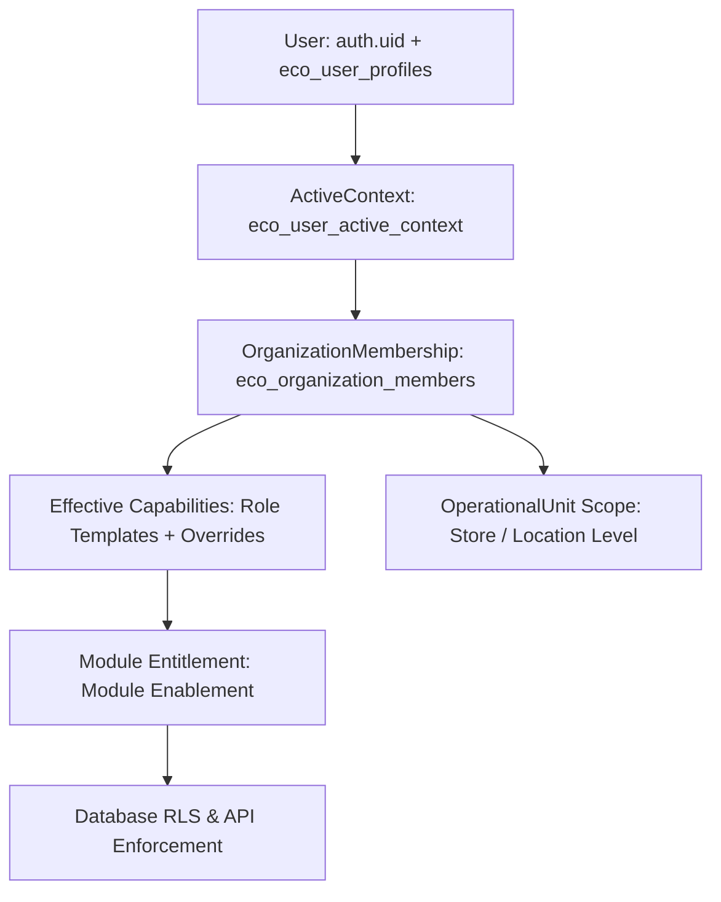

# CANONICAL AUTHORIZATION & ROLE CAPABILITY MATRIX — HORECA MODULAR

## 1. Canonical Authorization Model
Authorization in HORECA Modular follows the Product Owner-approved 6-element evaluation chain:

$$\text{Authorization} = \text{User} \times \text{OrganizationMembership} \times \text{Effective Capabilities} \times \text{OperationalUnit Scope} \times \text{Module Entitlement} \times \text{ActiveContext}$$

### Element Breakdown:
1. **User (`auth.uid()` & `eco_user_profiles`)**: Authenticated global user identity tied to active profile (`is_active = true`).
2. **OrganizationMembership (`eco_organization_members`)**: Assigns user profile to a specific tenant (`organization_id`) with a primary role template (`SUPERADMIN`, `ADMIN`, `GERENTE`, `OPERADOR`, `CONSULTA`).
3. **Effective Capabilities (`eco_capabilities`)**: Granular permissions (e.g. `bank.import`, `hr.fichajes.write`, `escandallos.recipes.edit`) calculated via role template mappings (`eco_role_template_capabilities`) plus platform/membership overrides (`eco_membership_capability_overrides`).
4. **OperationalUnit Scope**: Restricts operational data visibility to specific stores, locations, or production lines within an organization.
5. **Module Entitlement**: Enablement flags dictating which modules (Extractos, Personal, Escandallos, Compras, Ventas) are active for the organization.
6. **ActiveContext (`eco_user_active_context`)**: Session state holding the user's currently selected active organization context in multi-CIF environments.

---

## 2. Granular Capability Definitions

| Capability Key | Description | Minimum Allowed Role |
| :--- | :--- | :--- |
| `platform.superadmin` | Cross-tenant administration & global overrides | `SUPERADMIN` |
| `org.config.write` | Company parameters, users, & role assignments | `ADMIN` |
| `financial.import.upload` | Bank CSV/XLS statement uploading & file storage | `GERENTE` |
| `financial.import.process` | Movement parsing, row normalization, & classification | `GERENTE` |
| `financial.allocation.edit` | Modifying tax categories & cost center allocations | `GERENTE` |
| `sales.view` | Viewing sales dashboards & Last.app POS reconciliations | `CONSULTA` |
| `sales.import` | Processing daily POS sales CSVs / webhooks | `GERENTE` |
| `hr.employees.manage` | Creating/editing employee master records (`empleados`) | `GERENTE` |
| `hr.fichajes.write` | Clock-in / clock-out entries (`fichajes`) | `OPERADOR` |
| `hr.incidencias.manage` | Logging medical notes, absences, and incident reports | `OPERADOR` |
| `production.log.write` | Logging daily production batches & lot numbers | `OPERADOR` |
| `inventory.stock.manage` | Stock adjustments, manual counts, & movement logs | `OPERADOR` |
| `escandallos.recipes.view` | Viewing dish cost breakdowns & target margins | `CONSULTA` |
| `escandallos.recipes.edit` | Modifying recipe ingredients, quantities, & merma % | `GERENTE` |
| `purchases.order.create` | Generating purchase orders to suppliers | `GERENTE` |

---

## 3. System Role Template Capability Matrix

| Capability Category | SUPERADMIN | ADMIN | GERENTE | OPERADOR | CONSULTA |
| :--- | :---: | :---: | :---: | :---: | :---: |
| **Platform Management** | `FULL` | `DENIED` | `DENIED` | `DENIED` | `DENIED` |
| **Company & User Admin** | `FULL` | `FULL` | `DENIED` | `DENIED` | `DENIED` |
| **Financial & Banking (Extractos)** | `FULL` | `FULL` | `EXECUTE` | `DENIED` | `READ_ONLY` |
| **Sales & POS (Ventas)** | `FULL` | `FULL` | `EXECUTE` | `DENIED` | `READ_ONLY` |
| **HR & Fichajes (Personal)** | `FULL` | `FULL` | `FULL` | `OPERATIONAL` | `DENIED` |
| **Production Line Logs** | `FULL` | `FULL` | `FULL` | `OPERATIONAL` | `DENIED` |
| **Inventory & Stock** | `FULL` | `FULL` | `FULL` | `OPERATIONAL` | `DENIED` |
| **Escandallos & Costing** | `FULL` | `FULL` | `FULL` | `DENIED` | `READ_ONLY` |
| **Purchases & Suppliers** | `FULL` | `FULL` | `FULL` | `DENIED` | `DENIED` |

---

## 4. Multi-Organization & Multi-CIF Context Resolution
When a user belongs to multiple organizations:
1. `eco_user_active_context` tracks `(auth_user_id, active_organization_id)`.
2. All database queries pass `active_organization_id` which is validated against `eco_organization_members`.
3. If `active_organization_id` does not match an active membership row, database RLS blocks access (Fail-Closed).
