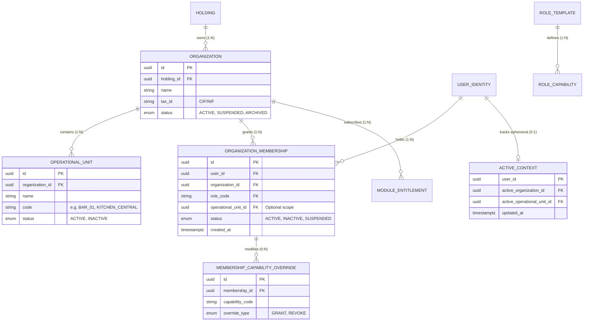

# TENANCY & AUTHORIZATION TECHNICAL DESIGN — HORECA MODULAR

> **Status**: APPROVED TECHNICAL DESIGN (WP-001)  
> **Target Standard**: Multi-Tenant, Multi-CIF, Capability-Driven Access Control  
> **Source-Layer Boundary**: Implemented in `src/domain/tenancy/authorization/` and `src/application/tenancy/`

---

## 1. Executive Summary

This specification defines the canonical tenancy and authorization model for HORECA Modular. It translates the domain security principles into precise, implementation-ready TypeScript primitives and database RLS contracts.

### Core Axioms
1. **Roles are Not Authorization Authorities**: Roles are named bundles of capability templates. The atomic authority for any operation is an explicit **Capability** evaluated against a specific **Organization** and **Operational Scope**.
2. **ActiveContext is UX Focus, Not Authorization**: The user's active UI selection (ActiveContext) is a convenience mechanism for front-end view routing. Every backend query and RLS policy validates the explicit target `organization_id` against verified server-side memberships, ignoring client-side context claims.
3. **Fail-Closed Default**: Any missing membership, revoked capability, inactive state, or disabled module entitlement results in immediate **DENY**.
4. **Platform Control != Tenant Data Access**: Platform administrators have infrastructure management capabilities, but **never** obtain automatic access to tenant financial, commercial, or operational business data.

---

## 2. Entity Model & Relationship Schema



---

## 3. Canonical Evaluation Function: `can()`

All authorization decisions evaluate through the pure canonical domain evaluator `can(ctx)` defined in [`src/domain/tenancy/authorization/evaluator.ts`](file:///c:/Users/Emiliano/Documents/1.%20Sistemas/El%20Criollo/el-criollo-ecosistema/el_criollo_modular/src/domain/tenancy/authorization/evaluator.ts):

```typescript
export interface AuthorizationEvaluationContext {
  userId: string;
  capability: AtomicCapability;
  targetOrganizationId: string;
  targetOperationalUnitId?: string;
  memberships: OrganizationMembership[];
  isPlatformAdmin?: boolean;
  moduleEntitlements?: ModuleEntitlement[];
}
```

### Evaluation Pipeline
1. **User Identity Validation**: Verify user ID is valid and non-empty.
2. **Platform Admin Segregation**: If the user is a platform administrator without an explicit active organization membership, evaluate only platform-level capabilities. Business tenant data operations return `DENY`.
3. **Membership Existence**: Locate the active membership for the specific `targetOrganizationId`. If none exists or `status !== 'ACTIVE'`, return `DENY`.
4. **Module Entitlement**: If the capability belongs to a specific module (e.g. `EXTRACTOS_IMPORT`), verify that the module entitlement is active for the target organization. If disabled, return `DENY`.
5. **Operational Scope Enforcement**: If the membership is scoped to a specific `operationalUnitId`, verify that the target resource belongs to that operational unit. Cross-unit access returns `DENY`.
6. **Capability Resolution**:
   - Compute base capabilities from the membership's `roleTemplate`.
   - Apply explicit `REVOKE` overrides (takes precedence over role grants).
   - Apply explicit `GRANT` overrides.
   - If the requested capability is present, return `ALLOW`; otherwise, return `DENY`.

---

## 4. Multi-CIF Architecture & Forbidden Anti-Patterns

### Strictly Forbidden Anti-Patterns
- ❌ **`LIMIT 1` Organization Lookup**: Resolving a user's organization by selecting the first row from `memberships` without validating the requested resource's organization ID.
- ❌ **`eco_user_profiles.organization_id` as Authority**: Storing a static tenant ID on the user profile record. In a multi-CIF enterprise, a user belongs to multiple legal entities.
- ❌ **JWT Role Claims as Authoritative Source**: Relying on stale roles stored in JWT tokens for authorization decisions.
- ❌ **ActiveContext-Based RLS**: Filtering database rows using `eco_user_active_context.active_organization_id` instead of verifying membership directly.

### Target Multi-CIF RLS Contract
Every tenant-scoped table uses row-level security policies structured as:

```sql
-- Pattern for tenant isolation
CREATE POLICY tenant_isolation_select_policy ON eco_financial_movements
FOR SELECT
USING (
  organization_id IN (
    SELECT m.organization_id 
    FROM eco_organization_members m
    WHERE m.user_id = auth.uid()
      AND m.status = 'ACTIVE'
  )
);
```

---

## 5. Security Acceptance Test Contract (Scope L)

The following 10 security test scenarios are implemented and executed in `tests/integration/security_isolation.test.ts`:

| Test ID | Test Scenario Description | Target Expected Result |
| :--- | :--- | :--- |
| **SEC-01** | User A with Membership in Org A attempts to read Org B data. | **DENY** (`false`) |
| **SEC-02** | User A with Membership in Org A attempts to write to Org B. | **DENY** (`false`) |
| **SEC-03** | User with valid memberships in Org A and Org B explicitly accesses Org A. | **ALLOW** (`true`) |
| **SEC-04** | User with valid memberships in Org A and Org B explicitly accesses Org B. | **ALLOW** (`true`) |
| **SEC-05** | ActiveContext tampering (client requests Org B without membership). | **DENY** (`false`) |
| **SEC-06** | Removed / Deleted membership evaluation. | **DENY** (`false`) |
| **SEC-07** | Inactive / Suspended membership evaluation. | **DENY** (`false`) |
| **SEC-08** | Missing atomic capability for target operation. | **DENY** (`false`) |
| **SEC-09** | Out-of-scope Operational Unit access (Kitchen staff accessing Bar records). | **DENY** (`false`) |
| **SEC-10** | Platform admin attempting business tenant data operation without membership. | **DENY** (`false`) |

---

## 6. Implementation References
- Domain Evaluator: [`src/domain/tenancy/authorization/evaluator.ts`](file:///c:/Users/Emiliano/Documents/1.%20Sistemas/El%20Criollo/el-criollo-ecosistema/el_criollo_modular/src/domain/tenancy/authorization/evaluator.ts)
- Capability Families: [`src/domain/tenancy/authorization/capabilities.ts`](file:///c:/Users/Emiliano/Documents/1.%20Sistemas/El%20Criollo/el-criollo-ecosistema/el_criollo_modular/src/domain/tenancy/authorization/capabilities.ts)
- Role Templates: [`src/domain/tenancy/authorization/roles.ts`](file:///c:/Users/Emiliano/Documents/1.%20Sistemas/El%20Criollo/el-criollo-ecosistema/el_criollo_modular/src/domain/tenancy/authorization/roles.ts)
- ActiveContext Use Case: [`src/application/tenancy/useCases/ValidateActiveContextUseCase.ts`](file:///c:/Users/Emiliano/Documents/1.%20Sistemas/El%20Criollo/el-criollo-ecosistema/el_criollo_modular/src/application/tenancy/useCases/ValidateActiveContextUseCase.ts)
- Security Test Suite: [`tests/integration/security_isolation.test.ts`](file:///c:/Users/Emiliano/Documents/1.%20Sistemas/El%20Criollo/el-criollo-ecosistema/el_criollo_modular/tests/integration/security_isolation.test.ts)
