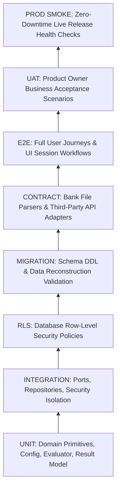

# TEST STRATEGY & QUALITY GATES — HORECA MODULAR

> **Status**: APPROVED TEST STRATEGY (WP-001)  
> **Test Runner**: Vitest (`v5.0.0`)  
> **CI Integration**: GitHub Actions `.github/workflows/ci.yml`

---

## 1. Testing Philosophy & Architecture

The testing strategy for HORECA Modular follows a layered, automated pyramid ensuring that domain logic, security policies, data persistence, and UI workflows are systematically validated without requiring manual developer intervention.

---

## 2. Defined Testing Layers

### 1. UNIT Layer
- **Scope**: Pure domain functions, value objects, error containers (`Result<T, E>`), environment parsing, and capability resolution (`can()`).
- **Tooling**: Vitest (`tests/unit/`).
- **Execution Speed**: Fast (< 100ms per file).
- **Current Suites**:
  - `tests/unit/env.test.ts`: Environment validation and masking.
  - `tests/unit/errors.test.ts`: AppError classification and Result mapping.
  - `tests/unit/authorization.test.ts`: Canonical role and capability resolution.
  - `tests/unit/useCases.test.ts`: Use case port invocation and Result handling.

### 2. INTEGRATION Layer
- **Scope**: Repository adapters, application use cases, and multi-tenant security isolation.
- **Tooling**: Vitest (`tests/integration/`).
- **Current Suites**:
  - `tests/integration/security_isolation.test.ts`: 10 canonical tenant-isolation scenarios (SEC-01 through SEC-10).

### 3. RLS Layer
- **Scope**: PostgreSQL Row-Level Security policies in staging/test database instances.
- **Verification**: Asserts that unauthenticated or out-of-tenant queries return 0 rows (`403 / fail-closed`).

### 4. MIGRATION Layer
- **Scope**: Clean replay of migration scripts against blank scratch databases.
- **Verification**: Asserts idempotency, foreign key integrity, and zero schema drift.

### 5. CONTRACT Layer
- **Scope**: Bank statement file formats (BBVA, Sabadell CSV/XLS) and external integrations (Last.app POS, AFIP/ARCA).
- **Current Suites**:
  - `tests/extractos.test.js`: Validates 9 bank parser contract scenarios for BBVA and Sabadell statements.

### 6. E2E Layer
- **Scope**: Full browser flows executing on preview deployments.
- **Tooling**: Playwright / Headless Browser Subagents.
- **Workflows**: Login, MFA/password change, active context switching, statement upload, recipe costing calculation.

### 7. UAT Layer
- **Scope**: Targeted, non-technical business scenarios executed by the Product Owner.
- **Design Principle**: Zero developer tooling required for the Product Owner.

### 8. PROD SMOKE Layer
- **Scope**: Post-deployment verification on `main` / Production.
- **Verification**: Health endpoint `/api/health`, authenticated session handshake, and asset bundle integrity.

---

## 3. Test Runner Scripts & Quality Gates

| Script | Purpose | CI Gate? |
| :--- | :--- | :---: |
| `npm run typecheck` | Validates TypeScript types across `src/` and `tests/`. | **YES (Blocking)** |
| `npm run lint` | ESLint static code analysis for code quality & formatting. | **YES (Blocking)** |
| `npm run test` | Starts Vitest in interactive watch mode for local development. | NO |
| `npm run test:run` | Single-pass test execution of all unit and integration suites. | **YES (Blocking)** |
| `npm run build` | Compiles production bundle with Vite. | **YES (Blocking)** |

---

## 4. Acceptance Criteria for Pull Requests
A pull request targeting `dev` or `main` will be automatically blocked by CI unless:
1. `npm ci` installs cleanly without lockfile drift.
2. `npm run lint` passes with 0 errors.
3. `npm run typecheck` passes with 0 errors.
4. `npm run test:run` passes 100% of tests.
5. `npm run build` completes successfully.
6. Secret scanning detects 0 leaked tokens or private `.env` files.
