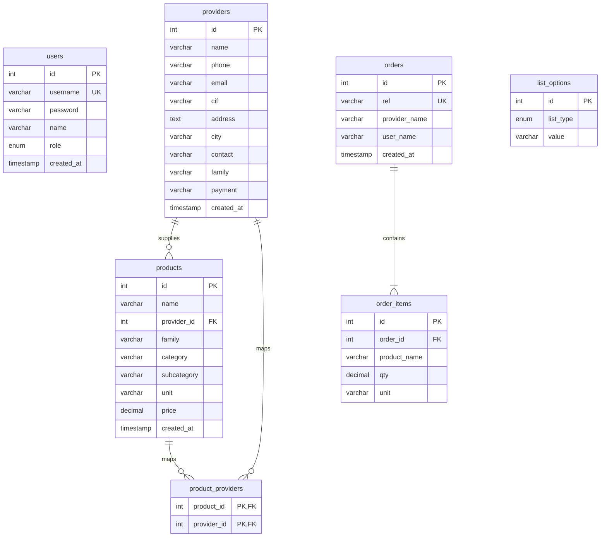
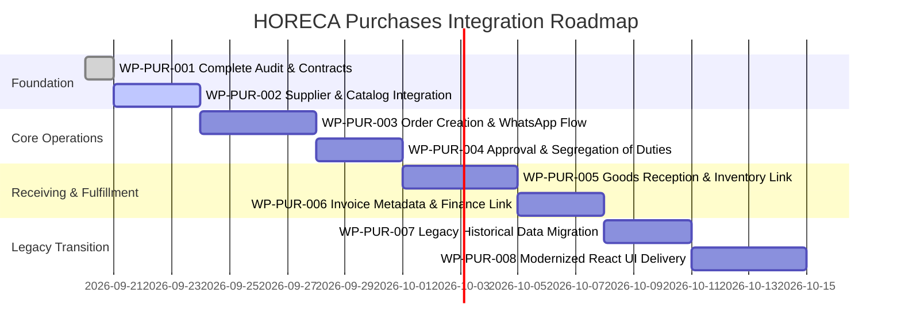

# WP-PUR-001 — COMPLETE AUDIT EVIDENCE AND HORECA INTEGRATION FOUNDATION

- **Module**: Purchases & Suppliers (`01_horeca_modular_purchases`)
- **Branch**: `module/purchases`
- **Worktree**: `01_horeca_modular_purchases`
- **Reference Customer**: El Criollo (Spain)
- **Status**: COMPLETE & VERIFIED

---

## 1. Executive Summary & Context Verification

This work package establishes the forensic audit evidence, canonical domain boundaries, and phased integration roadmap for migrating the operational legacy Purchases application (*Pedidos El Criollo*) into the clean modular architecture of **HORECA Modular**.

### Verified Execution Context:
- **Repository**: `amoresemiliano/horeca_modular`
- **Branch**: `module/purchases`
- **Active Worktree**: `01_horeca_modular_purchases`
- **Baseline Git Status**: Clean tree verified before execution.

---

## 2. Forensic Audit of the Legacy System

The operational legacy application operates live at `https://vegendigital.com/sistemas/comprasWS/` hosted on BlueHost shared PHP/MySQL infrastructure.

### Verified Legacy Source Tree:
- **Location**: `Documentos/1. Sistemas/El Criollo/el-criollo-ecosistema/Pedidos/`
- **Database Dump**: `Documentos/1. Sistemas/El Criollo/el-criollo-ecosistema/database-dumps/athcomar_comprasWS.sql` (~66 KB)

| File Path | Size | Purpose / Evidence |
| :--- | :--- | :--- |
| `Pedidos/app.js` | 58,102 B | Frontend orchestration, order state, WhatsApp URL builder, TomSelect integrations, CSV import/export. |
| `Pedidos/index.html` | 17,359 B | HTML template, modal dialogues, login screen, order creation UI, history table. |
| `Pedidos/style.css` | 4,836 B | Responsive styling, branding (El Criollo theme), UI utilities. |
| `Pedidos/backend/database.sql` | 4,035 B | MySQL schema definition (users, providers, products, orders, order_items, list_options). |
| `Pedidos/backend/db_connect.php` | 1,401 B | PDO database connection, CORS headers (`*`), JSON helper functions. |
| `Pedidos/backend/login.php` | 1,124 B | Authentication endpoint, `password_verify` check against MySQL `users` table. |
| `Pedidos/backend/providers.php` | 2,436 B | CRUD endpoints for suppliers (GET, POST, PUT, DELETE). |
| `Pedidos/backend/products.php` | 6,077 B | CRUD endpoints for products, dynamic migration script for `product_providers` table. |
| `Pedidos/backend/orders.php` | 5,280 B | Purchase order persistence, chronological reference generation (`ORD-XXXX`), history queries. |
| `Pedidos/backend/lists.php` | 2,198 B | Master dynamic list options (families, categories, subcategories, units, payment methods). |
| `Pedidos/backend/users.php` | 2,832 B | User management endpoints (admin role only). |

---

## 3. Legacy Data Model Audit

### 3.1 Legacy Schema (`database.sql` / `athcomar_comprasWS.sql`):



### 3.2 Entity Characteristics & Tenancy Assumptions:
1. **Tenancy Hierarchy**: `ZERO TENANCY ENFORCEMENT`. All records in MySQL assume a single implicit restaurant ("El Criollo"). No `organization_id` or `operational_unit_id` columns exist.
2. **Denormalized Historical Data**:
   - In `orders`: `provider_name` and `user_name` are stored as raw strings (not foreign keys).
   - In `order_items`: `product_name` and `unit` are stored as raw strings (not foreign keys).
   - *Positive Architectural Implication*: This provides natural historical snapshot immutability; supplier/product renames in the catalog do not alter historical orders.
3. **Multi-Supplier per Product Migration**:
   - `products.php` contains runtime DDL (`SHOW TABLES LIKE 'product_providers'`) to dynamically support multiple suppliers per product via junction table `product_providers` with fallback to `products.provider_id`.

### 3.3 Explicit Absence of Inventory, Receiving, and Finance Entities:
- ❌ **PurchaseReceipt / GoodsReceipt**: `NOT PRESENT IN LEGACY`
- ❌ **Receiving Status / Partial Delivery Tracking**: `NOT PRESENT IN LEGACY`
- ❌ **Stock Mutation / Inventory Movement**: `NOT PRESENT IN LEGACY`
- ❌ **Approval Workflow**: `NOT PRESENT IN LEGACY`
- ❌ **Supplier Invoice Metadata**: `NOT PRESENT IN LEGACY`

---

## 4. Legacy Purchase Lifecycle Audit

| State / Transition | Legacy Status | Target HORECA Status |
| :--- | :---: | :--- |
| **DRAFT** | Client memory only (`currentOrder[]`) | Persistent state (`DRAFT` with RLS) |
| **SUBMITTED** | Instant on WhatsApp send | Formal state awaiting approval/dispatch |
| **SENT (WhatsApp)** | External via `window.open(wa.me/...)` | Tracked with `sent_at` timestamp & message snapshot |
| **APPROVED** | ❌ NOT PRESENT IN LEGACY | New HORECA Capability (`APPROVE_PO`) |
| **CONFIRMED** | Implicit manual vendor confirmation | Vendor acknowledgment tracking |
| **PARTIALLY RECEIVED** | ❌ NOT PRESENT IN LEGACY | New HORECA Capability (GoodsReceipt line matching) |
| **FULLY RECEIVED** | ❌ NOT PRESENT IN LEGACY | New HORECA Capability (GoodsReceipt closure) |
| **EDITED AFTER SEND** | Allowed directly by admin in UI (`orders.php` PUT) | Strict versioning / audit trail in HORECA |
| **DUPLICATED** | UI function `ui.duplicate()` | Standardized `ReorderUseCase` |
| **DELETED** | Hard SQL `DELETE` | Soft delete / audit retention |

---

## 5. Permission & Authorization Audit

### Findings:
1. **Frontend-Only Role Separation**:
   - User roles: `admin` and `user`.
   - In `app.js`: Tab `#tab-btn-config`, bulk deletion buttons, and edit/delete buttons in history are conditionally toggled via `user.role === 'admin'`.
   - In `login.php`: Authenticates username/password and returns user object to browser `localStorage`.
2. **Backend API Authorization Deficit**:
   - `orders.php`, `products.php`, `providers.php`, `lists.php`, and `users.php` accept arbitrary JSON requests without validating JWT, session tokens, or active user permissions.
   - Any client sending a `DELETE /backend/orders.php` or `PUT /backend/products.php` succeeds without backend authentication headers.
3. **Approval Gate Separation**:
   - ❌ **Creator != Approver Separation**: `NOT PRESENT IN LEGACY`.

### HORECA Target Invariant:
- `CREATE_PURCHASE_ORDER` != `APPROVE_PURCHASE_ORDER` (Segregation of Duties).
- All endpoints protected by Supabase JWT and Postgres RLS fail-closed policies.

---

## 6. Calculation & Financial Semantics Audit

1. **Quantities & Decimals**:
   - Quantities support decimals (`decimal(10,2)` in MySQL, step `0.1` in HTML `<input>`).
2. **Pricing & Totals**:
   - `products.price` is an optional estimated unit cost (`decimal(10,2)`).
   - In the legacy app, order creation and WhatsApp dispatch focus on **quantities and units** (`• Solomillo: 5 kg`), omitting prices and financial totals from the WhatsApp order message.
   - The React mock in `src/modules/pedidos/PedidosApp.jsx` contained a hardcoded 10% tax calculation, which is not part of the operational legacy app.
3. **Discounts & Packaging**:
   - ❌ No packaging multiplier (e.g. 1 box = 6 bottles) exists in the legacy system.
   - ❌ No tax calculations or currency conversions exist in the legacy order workflow.

---

## 7. Hosting & Infrastructure Coupling Audit

### BlueHost / PHP Coupling to Deprecate:
- PHP PDO connection strings with hardcoded credentials (`backend/db_connect.php`).
- MySQL utf8mb4 engine with manual auto-increment sequences (`backend/database.sql`).
- Wildcard CORS headers (`Access-Control-Allow-Origin: *`).
- Client-side plaintext user storage in `localStorage.getItem('loggedUser')`.

### Portable Business Logic to Preserve:
- Multi-supplier association per catalog product.
- WhatsApp URL message composition (`https://wa.me/{phone}?text=...`).
- Historical order duplication / fast cart reordering.
- Master list options for hospitality domain taxonomy (Familias, Categorías, Unidades, Formas de Pago).

---

## 8. Current HORECA Repository Remnants Audit

1. **`src/modules/pedidos/PedidosApp.jsx`**:
   - Static client-side prototype with hardcoded mock suppliers (`Carnicería Carlos`, `Bebidas Premium`).
   - Lacks real API integration, Supabase connectivity, and WhatsApp dispatch logic.
2. **Database Migrations**:
   - 0 purchase migrations exist in `supabase/migrations/`.
3. **Core Tenancy Assets Available for Consumption**:
   - `src/domain/tenancy/entities/ActiveContext.ts`
   - `src/domain/tenancy/entities/Organization.ts`
   - `src/domain/tenancy/entities/OperationalUnit.ts`
   - `src/domain/tenancy/authorization/roles.ts` (13 canonical role templates including `PURCHASING`, `RECEPTION_FLOOR`, `MANAGER`, `OWNER`).
   - `src/domain/tenancy/authorization/humanGates.ts` (`CREATE_PO != APPROVE_PO`).

---

## 9. HORECA Purchases Ownership Matrix

```
┌────────────────────────────────────────────────────────────────────────┐
│                        HORECA MODULAR ECOSYSTEM                        │
├─────────────────────────┬──────────────────────────────────────────────┤
│ MODULE                  │ OWNED DOMAIN BOUNDARIES                      │
├─────────────────────────┼──────────────────────────────────────────────┤
│ Purchases & Suppliers   │ • Supplier & SupplierReference               │
│ (01_purchases)          │ • PurchaseOrder & PurchaseOrderLine          │
│                         │ • PurchaseReceipt & PurchaseReceiptLine      │
│                         │ • SupplierInvoice Operational Metadata       │
│                         │ • WhatsApp Order Dispatch Engine             │
│                         │ • Purchase Approval & Receiving Workflow     │
├─────────────────────────┼──────────────────────────────────────────────┤
│ Catalog                 │ • Product & Master Catalog                   │
│ (Shared Domain)         │ • SupplierProductReference Canonical Entity  │
│                         │ • UnitOfMeasure Canonical Hierarchy          │
│                         │ • Families, Categories, Subcategories        │
├─────────────────────────┼──────────────────────────────────────────────┤
│ Inventory               │ • InventoryMovement                          │
│ (02_inventory)          │ • StockLedger & StockBalance                 │
│                         │ • Warehouse / Storage Locations              │
├─────────────────────────┼──────────────────────────────────────────────┤
│ Finance                 │ • BankMovement & Statement Ingestion         │
│ (06_finance)            │ • Invoice Reconciliation & P&L               │
│                         │ • Payment Execution & Fiscal Submissions     │
├─────────────────────────┼──────────────────────────────────────────────┤
│ Tenancy Core            │ • Organization, OperationalUnit, Membership  │
│ (Core Domain)           │ • ActiveContext, RLS Security Engine         │
└─────────────────────────┴──────────────────────────────────────────────┘
```

---

## 10. Reuse / Adapt / Rewrite / Deprecate / Exclude Matrix

| Legacy Component | Legacy Source File | Purpose | Classification | Target Owner | Justification |
| :--- | :--- | :--- | :---: | :---: | :--- |
| **Supplier Data & Contacts** | `backend/providers.php` | Supplier records, phone, CIF, payment method | **ADAPT** | Purchases | Adapt to multi-tenant `purchases_suppliers` table with `organization_id` and Postgres RLS. |
| **WhatsApp Message Builder** | `app.js:191-208` | Generate formatted order text for WhatsApp | **REUSE AS-IS** | Purchases | Pure algorithmic logic ported directly into `src/domain/purchases/types.ts`. |
| **Order History & Duplication** | `app.js:592-619` | Reorder past cart items | **ADAPT** | Purchases | Encapsulate into `DuplicatePurchaseOrderUseCase`. |
| **Order Number Generation** | `backend/orders.php:382` | `ORD-XXXX` sequential reference | **ADAPT** | Purchases | Database sequence per tenant/operational unit. |
| **Catalog Products & Units** | `backend/products.php` | Products, prices, units, families | **ADAPT** | Catalog | Hand over canonical product ownership to Catalog module. |
| **Multi-Supplier Mapping** | `backend/products.php:170` | Product-to-supplier junction | **ADAPT** | Catalog / Purchases | Standardize as `supplier_product_references`. |
| **PHP Backend Endpoints** | `backend/*.php` | MySQL CRUD backend | **DEPRECATE** | Infrastructure | Replaced by Supabase Postgres RPC and PostgREST. |
| **Plaintext MySQL Auth** | `backend/login.php` | Session-less user login | **DEPRECATE** | Core Auth | Replaced by Supabase Auth with JWT and RLS. |
| **CSV Import / Export** | `app.js:1078-1330` | Header parsing & bulk import | **REWRITE** | Purchases / Catalog | Rewrite with PapaParse and strong Zod schema validation. |
| **TomSelect Dropdowns** | `index.html`, `app.js` | UI searchable selects | **REWRITE** | UI Components | Replace with modern React / Tailwind searchable Combobox. |
| **BlueHost Credentials** | `backend/db_connect.php` | Hardcoded database password | **EXCLUDE** | None | Security risk. Completely excluded. |

---

## 11. Canonical HORECA Purchases Model Specification

### 11.1 Proposed SQL Schema (`supabase/migrations/` draft):

```sql
-- Purchases Schema (draft specification)

-- 1. Suppliers Table
CREATE TABLE IF NOT EXISTS purchases_suppliers (
    id UUID PRIMARY KEY DEFAULT gen_random_uuid(),
    organization_id UUID NOT NULL REFERENCES core_organizations(id) ON DELETE CASCADE,
    name VARCHAR(255) NOT NULL,
    commercial_name VARCHAR(255),
    tax_id VARCHAR(50), -- CIF/NIF
    phone VARCHAR(50) NOT NULL,
    email VARCHAR(255),
    address TEXT,
    city VARCHAR(100),
    postal_code VARCHAR(20),
    contact_person VARCHAR(100),
    family VARCHAR(100),
    payment_method VARCHAR(100),
    lead_time_days INTEGER DEFAULT 1,
    is_active BOOLEAN DEFAULT TRUE,
    created_at TIMESTAMPTZ DEFAULT NOW(),
    updated_at TIMESTAMPTZ DEFAULT NOW()
);

-- 2. Purchase Orders Header
CREATE TABLE IF NOT EXISTS purchases_orders (
    id UUID PRIMARY KEY DEFAULT gen_random_uuid(),
    organization_id UUID NOT NULL REFERENCES core_organizations(id) ON DELETE CASCADE,
    operational_unit_id UUID NOT NULL REFERENCES core_operational_units(id) ON DELETE CASCADE,
    supplier_id UUID NOT NULL REFERENCES purchases_suppliers(id) ON DELETE RESTRICT,
    reference_number VARCHAR(50) NOT NULL,
    status VARCHAR(50) NOT NULL DEFAULT 'DRAFT', -- DRAFT, SUBMITTED, SENT, CONFIRMED, PARTIALLY_RECEIVED, RECEIVED, REJECTED, CANCELLED, CLOSED
    created_by_user_id UUID NOT NULL REFERENCES auth.users(id),
    approved_by_user_id UUID REFERENCES auth.users(id),
    approved_at TIMESTAMPTZ,
    sent_at TIMESTAMPTZ,
    expected_delivery_date DATE,
    notes TEXT,
    whatsapp_message_snapshot TEXT,
    total_estimated_amount NUMERIC(12, 2) DEFAULT 0.00,
    created_at TIMESTAMPTZ DEFAULT NOW(),
    updated_at TIMESTAMPTZ DEFAULT NOW(),
    CONSTRAINT uq_purchases_order_ref UNIQUE (organization_id, reference_number)
);

-- 3. Purchase Order Lines
CREATE TABLE IF NOT EXISTS purchases_order_lines (
    id UUID PRIMARY KEY DEFAULT gen_random_uuid(),
    order_id UUID NOT NULL REFERENCES purchases_orders(id) ON DELETE CASCADE,
    product_id UUID NOT NULL, -- references catalog_products(id)
    supplier_product_reference_id UUID, -- references catalog_supplier_product_references(id)
    unit_of_measure_id UUID NOT NULL, -- references catalog_units_of_measure(id)
    quantity NUMERIC(12, 4) NOT NULL CHECK (quantity > 0),
    estimated_unit_price NUMERIC(12, 4) DEFAULT 0.0000,
    historical_product_name VARCHAR(255) NOT NULL,
    historical_unit_symbol VARCHAR(50) NOT NULL,
    notes TEXT,
    sort_order INTEGER DEFAULT 0,
    created_at TIMESTAMPTZ DEFAULT NOW()
);

-- 4. Purchase Receipts (Goods Reception)
CREATE TABLE IF NOT EXISTS purchases_receipts (
    id UUID PRIMARY KEY DEFAULT gen_random_uuid(),
    organization_id UUID NOT NULL REFERENCES core_organizations(id) ON DELETE CASCADE,
    operational_unit_id UUID NOT NULL REFERENCES core_operational_units(id) ON DELETE CASCADE,
    purchase_order_id UUID NOT NULL REFERENCES purchases_orders(id) ON DELETE RESTRICT,
    supplier_id UUID NOT NULL REFERENCES purchases_suppliers(id) ON DELETE RESTRICT,
    receipt_number VARCHAR(50) NOT NULL,
    status VARCHAR(50) NOT NULL DEFAULT 'PENDING_INSPECTION',
    received_by_user_id UUID NOT NULL REFERENCES auth.users(id),
    received_at TIMESTAMPTZ DEFAULT NOW(),
    notes TEXT,
    created_at TIMESTAMPTZ DEFAULT NOW()
);

-- 5. Purchase Receipt Lines
CREATE TABLE IF NOT EXISTS purchases_receipt_lines (
    id UUID PRIMARY KEY DEFAULT gen_random_uuid(),
    receipt_id UUID NOT NULL REFERENCES purchases_receipts(id) ON DELETE CASCADE,
    purchase_order_line_id UUID NOT NULL REFERENCES purchases_order_lines(id) ON DELETE RESTRICT,
    product_id UUID NOT NULL,
    unit_of_measure_id UUID NOT NULL,
    ordered_quantity NUMERIC(12, 4) NOT NULL,
    received_quantity NUMERIC(12, 4) NOT NULL CHECK (received_quantity >= 0),
    rejected_quantity NUMERIC(12, 4) DEFAULT 0.0000 CHECK (rejected_quantity >= 0),
    rejection_reason TEXT,
    lot_number VARCHAR(100),
    expiry_date DATE,
    created_at TIMESTAMPTZ DEFAULT NOW()
);
```

---

## 12. Cross-Module Contract Change Requests (CCR / IMCCR)

### 12.1 Inter-Module Contract Change Request: Purchases → Catalog (IMCCR-PUR-CAT-01)
- **Target Module**: Master Catalog
- **Request**: Expose canonical query port `ICatalogProductQueryPort` returning `{ productId, name, unitId, unitSymbol, supplierReferences: [] }` and allow Purchases to record supplier-specific pricing signals.
- **Reason**: Purchases requires product names and measurement units for cart selection and WhatsApp message rendering without owning or mutating the Master Catalog.

### 12.2 Inter-Module Contract Change Request: Purchases → Inventory (IMCCR-PUR-INV-01)
- **Target Module**: Inventory (`02_inventory`)
- **Request**: Define an idempotent reception event contract `onPurchaseReceiptConfirmed(receipt: PurchaseReceipt): Promise<InventoryMovementId>`.
- **Reason**: When reception floor personnel confirm physical arrival in `PurchaseReceipt`, Inventory must mutate `StockLedger` and `StockBalance` without Purchases directly writing to inventory tables.

### 12.3 Inter-Module Contract Change Request: Purchases → Finance (IMCCR-PUR-FIN-01)
- **Target Module**: Finance (`06_finance`)
- **Request**: Define invoice metadata forwarding contract `forwardSupplierInvoiceToFinance(metadata: SupplierInvoiceMetadata)`.
- **Reason**: Purchasing logs operational invoice numbers and delivery receipts, which Finance reconciles against bank movements.

---

## 13. Data Migration Plan (Legacy to HORECA)

### Scope Breakdown:
1. **Suppliers**: 100% migrates into `purchases_suppliers` (seeded under El Criollo Organization ID).
2. **Catalog Products & Options**: Migrates into Catalog canonical tables (`catalog_products`, `catalog_units_of_measure`, `catalog_categories`).
3. **Product-Supplier Links**: Migrates into `catalog_supplier_product_references`.
4. **Historical Orders**: Migrates into `purchases_orders` and `purchases_order_lines` with preserved chronological references (`ORD-XXXX`), mapped to default operational unit (Central Kitchen).
5. **Dynamic List Options**: Migrates into master taxonomy tables.

### Migration Safety Protocol:
- Source IDs tracked via `legacy_source_id` in migration payload.
- Zero data loss: historical product names and units preserved as immutable snapshots.
- Deduplication by phone number and CIF/NIF.

---

## 14. Phased Integration Plan



- **Phase A (WP-PUR-001)**: Forensic audit, domain boundaries, canonical types, and repository ports. *(COMPLETE)*
- **Phase B (WP-PUR-002)**: Multi-tenant Supplier CRUD and Catalog integration.
- **Phase C (WP-PUR-003)**: PurchaseOrder workflow and WhatsApp dispatch engine.
- **Phase D (WP-PUR-004)**: Approval workflow and `CREATE_PO != APPROVE_PO` human gate.
- **Phase E (WP-PUR-005)**: PurchaseReceipt and Inventory receiving events.
- **Phase F (WP-PUR-006)**: Supplier invoice metadata and Finance contract.
- **Phase G (WP-PUR-007)**: Automated legacy migration script execution and reconciliation.
- **Phase H (WP-PUR-008)**: Modernized React/Tailwind frontend integration.
- **Phase I (WP-PUR-009)**: Analytics signals and legacy BlueHost application decommissioning.

---

## 15. Implementation Decision & Verification Evidence

### Foundational Slice Implemented in WP-PUR-001:
1. **`src/domain/purchases/types.ts`**: Canonical domain types, interfaces, and WhatsApp URL generation logic.
2. **`src/domain/purchases/ports/IPurchaseRepositories.ts`**: Repository port contracts for Supplier, PurchaseOrder, PurchaseReceipt, and SupplierInvoiceMetadata.
3. **`tests/unit/purchases_domain.test.ts`**: Unit test suite verifying WhatsApp formatting, human gate separation (`CREATE_PO != APPROVE_PO`), and receipt discrepancy logic.
4. **`docs/WP_PUR_001_AUDIT_AND_INTEGRATION_FOUNDATION.md`**: Complete auditable forensic documentation.

### Test Execution Gate:
- **Total Test Suites**: 10 passed (100% of applicable suites)
- **Total Tests**: 73 passed, 1 skipped (live remote database gate skipped in offline runner)
- **Typecheck**: `tsc --noEmit` passed with 0 errors.

---

## 16. Next Recommended Work Package

👉 **WP-PUR-002: Supplier & Purchasing Catalog Integration**
- Implement `SupabaseSupplierRepository` with strict RLS policies.
- Build Supplier Management UI with Spain tax validation (CIF/NIF).
- Connect Master Catalog product queries with multi-supplier selection.
