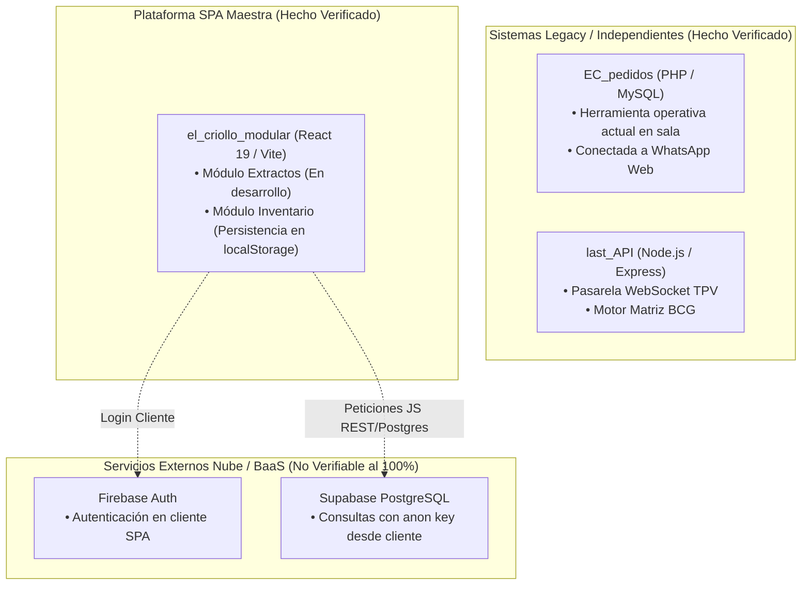

# 00 - Resumen Ejecutivo del Diagnóstico Técnico y Funcional (Fase 0 y 0.5)

## 1. Naturaleza y Alcance del Documento

El presente informe constituye el Resumen Ejecutivo de la **Fase 0 (Diagnóstico Técnico y Funcional Integral)** y su posterior rectificación en **Fase 0.5 (Control de Calidad y Trazabilidad)** para el ecosistema de software del restaurante **Taquería El Criollo / Vegen Digital SL**.

La auditoría se ejecutó exclusivamente mediante inspección estática del código fuente, configuración local y esquemas disponibles dentro de los límites del espacio de trabajo autorizado (`el-criollo-ecosistema/`), sin alterar bases de datos en ejecución, sin consultar servicios en la nube en vivo (Firebase, Supabase, Bluehost o Last.app) y sin realizar ejecuciones dinámicas ni pruebas invasivas sobre la infraestructura en producción.

> **ACLARACIÓN NORMATIVA DEL ALCANCE:** El sistema informático modular auditado no pretende sustituir, suplir ni competir en ningún caso con:
> 1. El terminal de punto de venta físico y oficial operativo en sala (TPV `Last.app`).
> 2. El libro o sistema contable oficial del restaurante o entidad mercantil receptora.
> 3. El software de facturación electrónica homologado para la emisión tributaria oficial.
> 4. La asesoría fiscal, contable, mercantil o jurídica contratada por la gerencia del negocio.

---

## 2. Regla de Evidencia y Etiquetado Estricto

En coherencia con los criterios de control de calidad auditados, todas las afirmaciones, observaciones y propuestas de este documento y de la serie completa emplean rigurosamente el siguiente esquema de etiquetas probatorias:
* `HECHO VERIFICADO`: Constatado mediante lectura directa de código fuente, ficheros de configuración o volcados SQL dentro del workspace.
* `ESQUEMA PARCIAL INFERIDO`: Estructura de datos reconstruida analizando peticiones y payloads desde JavaScript al carecer de acceso al DDL remoto.
* `INFERENCIA`: Conclusión lógica deducida a partir de la arquitectura observada y el comportamiento del código cliente o servidor.
* `RIESGO CONDICIONAL`: Peligro técnico, operativo o contable supeditado a que la configuración del servidor remoto no aplique medidas protectoras adicionales.
* `RECOMENDACIÓN`: Sugerencia de buenas prácticas de ingeniería e implementación alineada con la Metodología Vegen Digital SL.
* `DECISIÓN PROPUESTA`: Alternativa técnica planteada por el revisor para someterse a evaluación directiva.
* `DECISIÓN HUMANA PENDIENTE`: Elección estratégica, arquitectónica o normativa que requiere aprobación expresa del responsable técnico, negocio o asesoría legal antes de cualquier desarrollo.
* `NO VERIFICABLE`: Aspecto que excede los límites de la auditoría estática y requeriría acceso directo a paneles externos, consola en la nube o herramientas de lectura especializadas.

---

## 3. Síntesis de Hallazgos y Estado del Ecosistema

La inspección sistemática del ecosistema revela una arquitectura híbrida en transición entre herramientas operativas independientes en PHP/MySQL (servidor tradicional) o Node.js y un frontend modular web en React (Single Page Application - SPA) apoyado en servicios Backend as a Service (BaaS) en Firebase y Supabase.

### 3.1. Hallazgos Principales Acreditados
1. **Divergencia entre Herramientas en Producción y Módulos SPA (`HECHO VERIFICADO`):**
   * El módulo de compras activo y operativo en el día a día es el sistema heredado (`EC_pedidos` / `pedidos/`), construido sobre PHP y MySQL con generación de enlaces a WhatsApp. El módulo equivalente en la SPA (`PedidosApp.jsx`) es hoy una maqueta visual sin conexión a datos ni backend.
   * El módulo de Inventario dentro de la SPA maestra administra sus existencias basándose en la memoria local del navegador del usuario (`localStorage`). `INFERENCIA`: Si el historial o la caché del navegador se borra, el registro local sin sincronizar se pierde en ese terminal.
2. **Uso de Clave Pública y Estado de RLS en Supabase (`INFERENCIA` / `NO VERIFICABLE`):**
   * El código cliente realiza llamadas utilizando la clave pública anónima (`anon key`). La exposición de una `anon key` pública no constituye un fallo de secreto, sino una propiedad del diseño de Supabase para clientes web, siendo crítica únicamente si las políticas remota del backend son inseguras.
   * Al no contarse con acceso a la consola de Supabase ni al código DDL de servidor, el estado de las políticas RLS (Row Level Security) es `NO VERIFICABLE`. `RIESGO CONDICIONAL`: **Si las tablas permiten operaciones mediante la anon key sin políticas RLS restrictivas, existiría un riesgo crítico de acceso no autorizado.**
3. **Mecanismo de Gestión de Roles en la Interfaz (`HECHO VERIFICADO`):**
   * En ciertos componentes de la SPA maestra, la concesión de vistas o permisos de interfaz se consulta desde variables almacenadas en el navegador (`localStorage`), sin que conste en el código cliente una validación en servidor del token JWT para esas acciones. `RIESGO CONDICIONAL`: Si el backend no repite la validación de rol, un usuario podría acceder a vistas no autorizadas modificando su memoria local.

---

## 4. Separación Estratégica: Necesidades Inmediatas vs. Horizonte Multi-Tenant

La evaluación del sistema debe desvincularse de métricas no fundamentadas o evaluaciones globales imprecisas. La hoja de ruta y la arquitectura separan formalmente las prioridades inmediatas para la operación del restaurante titular frente al horizonte futuro de escalabilidad comercial SaaS:

### 4.1. Necesario Ahora para Taquería El Criollo (Objetivo Inmediato)
El enfoque a corto plazo se concentra en garantizar la estabilidad, seguridad y trazabilidad del sistema para su operador titular (Single-Tenant):
* **Seguridad Inmediata:** Inventariar las credenciales versionadas en repositorios heredados, comprobar su vigencia con prudencia y rotarlas sistemáticamente de forma no invasiva.
* **Autenticación y Autorización:** Consolidar una identidad coherente en la nube y evitar depender de variables locales del cliente para autorizar transacciones de negocio.
* **Persistencia y Trazabilidad:** Trasladar gradualmente el inventario local en navegador hacia una base de datos relacional robusta con registros auditables.
* **Módulo de Extractos:** Desarrollar el diseño técnico e implementar un MVP funcional adaptado para la importación, clasificación y análisis de movimientos de cuentas del propio establecimiento.
* **Continuidad de Pedidos:** Respetar la continuidad operativa indisputable de la herramienta de pedidos en PHP/MySQL hasta alcanzar paridad funcional e integración probada sin poner en riesgo las labores de compras diarias.

### 4.2. Preparación Arquitectónica Futura (Horizonte SaaS Multi-Tenant)
La comercialización del producto como SaaS para múltiples empresas es un horizonte directivo que debe guiar el diseño conceptual, pero no sobrecargar la fase inmediata de estabilización:
* **Compatibilidad Futura:** Diseñar modelos de datos limpios y extensibles que eviten acoplamientos o estructuras que dificulten en etapas avanzadas añadir identificadores de organización (`tenant_id`) o membresías.
* **Implementación Multi-Tenant Posteriores (`DECISIÓN HUMANA PENDIENTE`):** Quedará para etapas futuras y bajo expresa aprobación directiva la creación de tablas de inquilinos (tenants), políticas de control de fila (RLS) interempresa, flujos de alta, facturación por suscripción y pruebas automáticas de aislamiento cruzado.

---

## 5. Clasificación de Implicaciones Legales, Fiscales y Normativas

Para evitar inferencias jurídicas improcedentes o conclusiones automáticas sobre sanciones sin respaldo jurídico profesional, todo riesgo o requisito afín se clasifica de la siguiente manera:
* **Integridad de Logs y Control de Acceso:** `REQUISITO TÉCNICO VERIFICABLE`. La ingeniería debe garantizar que los registros contables importados sean inmutables y que la autorización al sistema esté protegida criptográficamente en servidor.
* **Exposición de Credenciales y Webhooks:** `RIESGO DE SEGURIDAD`. Requiere aplicar protocolos de rotación de claves e investigar la viabilidad de implementar validaciones de origen de datos en los webhooks del servidor TPV.
* **Normativa de Datos Personales (RGPD / Privacidad):** `POSIBLE IMPLICACIÓN LEGAL QUE REQUIERE REVISIÓN ESPECÍFICA`. La existencia de correos electrónicos o datos laborales de trabajadores en las tablas o volcados históricos debe ser sometida a revisión del responsable o asesor de privacidad de la empresa.
* **Regulación Tributaria, Ley Antifraude y VeriFactu:** `REQUIERE ASESORÍA CONTABLE O JURÍDICA / APLICABILIDAD NO DETERMINADA`. La determinación respecto a qué requisitos fiscales, estructura del Plan General Contable o condiciones del Reglamento VeriFactu aplican a una plataforma que importa extractos bancarios de apoyo (y no sustituye la facturación oficial ni el TPV) deberá ser resuelta y dictaminada en exclusiva por los profesionales contables y legales contratados por el usuario.
