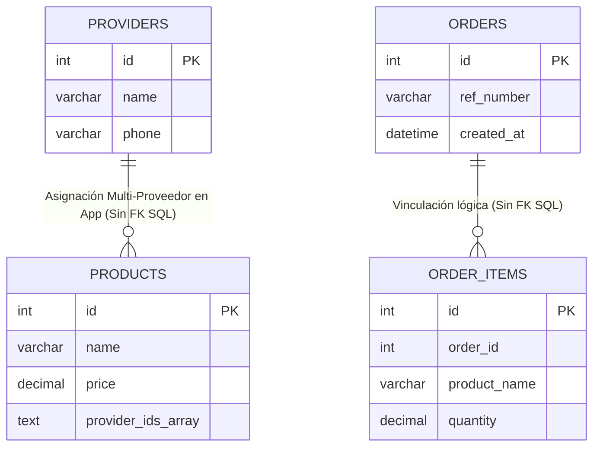

# 04 - Bases de Datos: Auditoría de Volcados e Inferencias Relacionales

## 1. Metodología y Límites de la Inspección Estática

El análisis de la capa de datos en el ecosistema `el-criollo-ecosistema/` comprende dos naturalezas metodológicas claramente separadas:
1. **Inspección Directa de Volcados SQL (`HECHO VERIFICADO`):** Lectura estática analítica de los cuatro archivos de exportación (Dumps) hospedados en el directorio autorizado `database-dumps/`: `athcomar_vegen_Last_API.sql`, `athcomar_inventario_el_criollo.sql`, `athcomar_inventario.sql` y `comprasWS_tables.sql`.
2. **Reconstrucción Estructural desde Cliente Web (`ESQUEMA PARCIAL INFERIDO`):** Deducción teórica de las entidades administradas en el motor PostgreSQL en la nube de Supabase para la SPA maestra, deducidas leyendo el código fuente JavaScript y las consultas al cliente ORM `@supabase/supabase-js` al no contarse en el repositorio con archivos DDL ni acceso remoto al panel orquestador.

---

## 2. Radiografía de Bases de Datos MySQL (Volcados Heredados)

### 2.1. Inventario y Características Acreditadas (`HECHO VERIFICADO`)

* **Integridad Relacional en Tablas Históricas (`HECHO VERIFICADO`):**
  * La inspección de las sentencias DDL en los volcados de MySQL certifica la definición de Claves Primarias (`PRIMARY KEY`) en tablas maestras mecánicas como `providers`, `orders`, `productos` y `transactions`.
  * Sin embargo, consta en el código SQL examinado una ausencia generalizada de restricciones de Clave Foránea obligatorias explícitas (`CONSTRAINT ... FOREIGN KEY ... REFERENCES ...`) entre las entidades transaccionales (por ejemplo, en las tablas de `movimientos` dentro de `athcomar_inventario` o en las líneas de pedido `order_items`).
  * `INFERENCIA / RIESGO CONDICIONAL`: La carencia de claves foráneas relacionales obliga al software en la capa de lógica del servidor o de aplicación a hacer cumplir la integridad referencial. Si un registro padre (ej. producto o proveedor) es eliminado en bruto sin una rutina de borrado en cascada del backend, podrían generarse registros huérfanos en los historiales de movimientos o líneas de compra.

* **Exposición de Datos en Volcados Locales (`HECHO VERIFICADO` / `RIESGO DE SEGURIDAD`):**
  * En las líneas concernientes a inserciones de muestra y tablas operacionales dentro del fichero `athcomar_inventario_el_criollo.sql`, se constata la presencia en texto de registros de personal, avatares, identificadores de correo de Gmail reales y hashes de contraseñas legacy correspondientes a operarios de sala.
  * `RECOMENDACIÓN`: De acuerdo con las normas de contención de seguridad (Fase 1), todo volcado histórico que se conserve como repositorio local deberá anonimizar y depurar previamente las identidades laborales, supeditado a validación contable o directiva para no perder trazabilidad legal justificada.

---

## 3. Esquema de Datos Supabase (PostgreSQL)

> **CLASIFICACIÓN OFICIAL DEL ESQUEMA:** `ESQUEMA PARCIAL INFERIDO DESDE CONSULTAS Y PAYLOADS DEL CLIENTE`.
> *Nota Aclaratoria:* La estructura, nombres de tabla y campos enunciados a continuación se infieren puramente desde los métodos de invocación del frontend en `el_criollo_modular/src/modules/`. **Se declara explícitamente que NO están verificados los tipos de datos exactos, su nulabilidad, los índices, las claves primarias/foráneas, los disparadores (triggers), las funciones de servidor ni las políticas reales que restrinjam estas entidades.**

### 3.1. Tablas y Atributos Observados en Peticiones Frontend
1. **Tabla `extractos` (Módulo de Conciliación Bancaria):**
   * *Campos inyectados en código JS:* `fecha`, `fecha_valor`, `concepto`, `importe`, `saldo`, `cuenta`, `categoria`, `subcategoria`, `referencia`, `hash_id`.
   * *Observación Analítica:* Las consultas en `ExtractosApp.jsx` solicitan filas en bloque y el analizador construye objetos a partir de los datos parseados de CSV.
2. **Tabla `empleados` y `fichajes` (Módulo de Horarios y Control):**
   * *Campos invocados en código JS:* `nombre`, `rol`, `puesto`, `estado`, `fecha_hora`, `tipo_registro` (entrada/salida).
3. **Tabla `produccion_registros` (Módulo de Producción):**
   * *Campos invocados en código JS:* `receta_id`, `cantidad_producida`, `merma_registrada`, `fecha_produccion`.

---

## 4. Auditoría de Políticas de Aislamiento y RLS

En estricta sujeción a la Regla de Evidencia aplicable sobre servicios remoros y Backend as a Service (BaaS), la evaluación sobre el control de acceso en la infraestructura de Supabase se escinde obligatoriamente en dos frentes probatorios:

| Dimensión Analizada | Elemento Técnico | Estado y Certificación del Hallazgo |
| :--- | :--- | :--- |
| **Lo Verificable (En Código Fuente)** | **Uso del Cliente Web Supabase** | `HECHO VERIFICADO`: La SPA maestra inicializa el SDK oficial `@supabase/supabase-js` para consultar e insertar registros desde la lógica del navegador. |
| **Lo Verificable (En Código Fuente)** | **Uso de Clave Pública `anon key`** | `HECHO VERIFICADO`: Las peticiones desde el frontend autentican con la `anon key` pública configurada en el cliente web. *(La clave anon no es un secreto violado, sino la clave de diseño para clientes).* |
| **Lo Verificable (En Payloads JS)** | **Ausencia de Columna `tenant_id` en Carga** | `HECHO VERIFICADO`: En los objetos JSON de carga construidos por `ImportModal.jsx` o `ExtractosApp.jsx`, no se constata el envío del campo `tenant_id` ni el filtrado por clave organizacional. |
| **Lo Verificable (En Payloads JS)** | **Ausencia de Intercambio Token Firebase** | `HECHO VERIFICADO`: No consta en las llamadas visibles al ORM del frontend que el token JWT adquirido vía Google Firebase Auth sea traspasado como cabecera de autorización a Supabase en el código inspeccionado. |
| **Lo No Verificable (En este Diagnóstico)**| **Estado Real de las Políticas RLS** | `NO VERIFICABLE`: La activación del motor Row Level Security (RLS) en las tablas remotas, sus sentencias de permiso (`CREATE POLICY`), grants y funciones asociadas residen en el servidor DDL de PostgreSQL, al cual este diagnóstico estático no tiene acceso de consulta. |
| **Lo No Verificable (En este Diagnóstico)**| **Integración Remoted Firebase ➔ Supabase** | `NO VERIFICABLE`: Se desconece si el propietario mantiene implementada en el servidor o consola una función puente, Webhook remoro o disparador que sincronice los UID de Firebase con los usuarios de base de datos de Supabase. |

### 4.1. Declaración Formal del Riesgo de Aislamiento
Frente a la imposibilidad de certificar de forma estática la consola en vivo, el riesgo se formula canónicamente bajo los siguientes términos inquebrantables de prudencia técnica:

> **RIESGO CONDICIONAL CERTIFICADO:** **Si las tablas en PostgreSQL permiten operaciones mediante la `anon key` pública sin políticas de seguridad a nivel de fila (RLS) estrictamente restrictivas y configuradas por identidad, existiría un riesgo crítico de acceso no autorizado y manipulación cruzada de registros contables por parte de usuarios externos o entre sesiones concurrentes.**

* `RECOMENDACIÓN METODOLÓGICA:` Antes de acometer cualquier expansión del sistema hacia un modelo comercial multiempresa o suscripción externa, la ingeniería deberá en primer lugar verificar administrativamente y en seco las sentencias RLS del servidor web o del esquema Supabase, asegurando que ninguna consulta abierta en la `anon key` entregue datos que excedan los provistos o autorizados expresamente al operario autenticado en sala.
