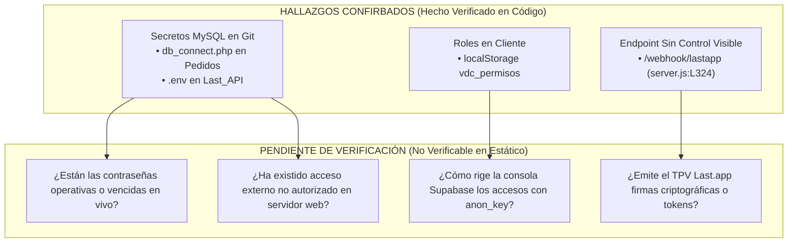

# 05 - Auditoría de Seguridad, Credenciales y Autorización

## 1. Alcance de la Auditoría y Clasificación de Claves

En estricta concordancia con los estándares protocolares del **Control de Calidad (Fase 0.5)**, la presente auditoría de seguridad clasifica los hallazgos relativos a credenciales de red, claves públicas, gestión de roles en cliente y puertos de escucha web en función estricta del nivel de evidencia acreditable desde el código del espacio de trabajo `el-criollo-ecosistema/`.

> **ACLARACIÓN TÉCNICA SOBRE LA `ANON KEY` PÚBLICA DE SUPABASE:** En los marcos de desarrollo con Supabase, la clave identificada en las variables o cliente frontend como `anon key` **no debe clasificarse incorrectamente como un secreto filtrado ni como una brecha en sí misma**.
> Se trata por diseño arquitectónico del identificador público con el que las aplicaciones de navegador y clientes móviles comunican con la pasarela de servicios. Su exposición o lectura por parte de un operador en la consola del navegador solo entraña un riesgo de seguridad crítico y condicional cuando las políticas del servidor posterior (**Row Level Security - RLS**) y las tablas relacionales carecen de restricciones granulares eficaces.

### 1.1. Diferenciación de Tipologías y Riesgos de Claves y Secretos
* **`Anon Key` Pública:** Clave expuesta por diseño en clientes web para identificar la aplicación; requiere defensa obligatoria en servidor mediante RLS.
* **`Service Role Key`:** Clave administrativa remoted soberana de Supabase que puentea toda política de seguridad; **jamás debe residir ni importarse en el código web frontend** (en la presente auditoría estática no se ha constatado su presencia en el bundle de cliente de `el_criollo_modular/`).
* **Credenciales Relacionales de Servidor MySQL:** Usuarios y contraseñas raíz o de servicio de bases de datos relacionales en servidores tradicionales (ej. cPanel / Bluehost); su presencia en código versionado en Git es una vulnerabilidad severa no tolerable.
* **Secretos de Conectores Web y Webhooks:** Cadenas criptográficas o firmas (ej. HMAC-SHA) destinadas a que un servidor receptor certifique que un evento HTTP de pasarela o TPV entrante procede en exclusiva de un proveedor legítimo y verídico.

---

## 2. Matriz de Hallazgos: Confirmado vs. Pendiente de Verificación

### 2.1. Hallazgos Confirmados (`HECHO VERIFICADO`)
1. **Secretos Reales Versionados en Repositorios Heredados (`HECHO VERIFICADO` / `RIESGO DE SEGURIDAD`):**
   * En el repositorio de compras operando en producción (`EC_pedidos` / `pedidos/backend/db_connect.php`), figura hardcodeado en el historial de Git un usuario de MySQL y una contraseña en bruto con vinculación hacia una base en cPanel/Bluehost (`[REDACTED]`).
   * En la pasarela TPV Node (`last_API/backend/.env`), se adjunta dentro de los ficheros rastreadores del proyecto una clave secreta de conexión a base de datos externa y variables relativas a puertos e instancias locales. *(Ninguno de estos valores se reproduce públicamente en este documento por protección de seguridad)*.
2. **Gestión y Lectura de Roles de Usuario desde Cliente (`HECHO VERIFICADO` / `REQUISITO TÉCNICO`):**
   * En componentes de la SPA (por ejemplo, en `Configuracion.jsx:L5` de `el_criollo_modular`), la lógica interroga variables almacenadas en el navegador (`localStorage.getItem('vdc_permisos')` o `loggedUser`) para tomar decisiones de presentación de menús de administrador o gerente de restaurante. `RIESGO CONDICIONAL`: Si los controladores remotos correspondientes en el backend no replican en el servidor la verificación criptográfica del rol, un operador podría manipular su almacenamiento web local para desbloquear controles o vistas sensibles de gestión.
3. **Endpoints de Escucha Abiertos y Sin Controles Visibles (`HECHO VERIFICADO` / `RIESGO DE SEGURIDAD`):**
   * El controlador del servidor analítico en `last_API/backend/src/server.js:L324` expone una ruta pública POST (`/webhook/lastapp`) destinada a recibir webhooks provenientes del TPV de sala. En la inspección estática de ese controlador, se verifica que la solicitud se procesa y reemite directamente vía WebSocket sin llamar a middlewares de validación de firma secreta ni comprobación de cabecera de autorización.
4. **Presencia de Datos Identificativos Personales en Volcados (`HECHO VERIFICADO` / `POSIBLE IMPLICACIÓN LEGAL`):**
   * El archivo `athcomar_inventario_el_criollo.sql` almacena registros en texto plano con nombres de empleados, cuentas reales de Gmail e identificadores que atañen a trabajadores. Su tenencia y tratamiento sin protocolo de depuración constituye una `POSIBLE IMPLICACIÓN LEGAL QUE REQUIERE REVISIÓN ESPECÍFICA` bajo las regulaciones y directrices de protección de datos aplicables (RGPD).

### 2.2. Hallazgos Pendientes de Verificación (`NO VERIFICABLE`)
* **Vigencia y Accesibilidad Remota de las Credenciales:** Excedería los límites no invasivos de esta auditoría verificar de forma dinámica en internet si las cuentas o puertos MySQL observados en `db_connect.php` continúan activos al día de hoy, si han sido bloqueados por cortafuegos IP (Firewall) o si el hosting externo rechaza conexiones exteriores fuera del servidor de Bluehost.
* **Configuración del Entorno de Producción y Políticas RLS:** Al carecerse de acceso a los paneles remoros del proveedor nube, es inspeccionable conocer qué reglas de contención de tráfico, cortafuegos o políticas SQL granulares imperan realmente en las bases en servicio de Taquería El Criollo.
* **Capacidad Oficial de Firmas en el TPV (`Last.app`):** Al no contarse dentro del workspace con la documentación oficial ni la especificación del proveedor de TPV `Last.app`, no es verificable de forma estática si dicha plataforma emite nativamente firmas HMAC-SHA o tokens estáticos en sus cabeceras HTTP de webhook que puedan ser aprovechadas para blindar el puerto de escucha.

---

## 3. Protocolo Remedial por Fases y Recomendaciones de Seguridad

Frente a la detección de secretos versionados, la Metodología Vegen Digital prohíbe explícitamente dictar purgas destructivas o masivas en el historial Git que pongan en peligro el acoplamiento y sincronía de los desarrolladores sin haber asegurado primero la estabilidad operativa del restaurante. Por consiguiente, se recomienda proceder con la siguiente separación metodológica estructurada:

### 3.1. Plan de Seguridad y Remediación Inmediata (Fase 1 y Prioridad Operativa)
> **DECLARACIÓN PROCESAL:** Ninguna de las acciones que se enlistan a continuación ha sido ejecutada por el revisor durante esta auditoría de diagnóstico; se consignan y formulan como `RECOMENDACIÓN` directiva para el equipo humano a cargo:

1. **Inventariar Secretos Expuestos:** Elaborar un registro administrativo interno en un repositorio cifrado identificando cada fichero del historial Git donde hayan surgido credenciales MySQL expuestas (`db_connect.php` y `.env`).
2. **Determinar Vigencia Operativa:** Confirmar y auditar pacíficamente con el equipo de infraestructura técnica de El Criollo si los usuarios y contraseñas descubiertos sostienen en tiempo real las llamadas cotidianas por WhatsApp en `EC_pedidos` y la analítica del TPV.
3. **Rotar los Activos Expuestos:** Desde el panel remoto o consola cPanel de las bases de datos (Bluehost), generar nuevas contraseñas complejas o cuentas de servicio y reinyectarlas de manera local en los servidores sin versionar sus valores en ficheros de texto plano.
4. **Validar Servicios en Producción:** Verificar fehacientemente que la conexión a datos remota del restaurante, la emisión de pedidos operada por los cocineros y el enlace TPV operan con total solidez y sin latencias anómalas al hacer uso de las contraseñas recién rotadas y refrescadas.
5. **Revocar las Credenciales Anteriores:** Una vez verificada la solidez operacional del servicio en marcha, proceder al bloqueo y eliminación irrevocable en el motor SQL de los antiguos usuarios o claves reveladas.
6. **Revisar Logs de Servidor:** Inspeccionar administrativamente en el proveedor de alojamiento los archivos contables y de auditoría transaccional de consultas SQL pasadas (Query Logs / Access Logs) con objeto de comprobar sistemáticamente si se hubiere registrado algún acceso exógeno, exfiltración, o alteración sospechosa en los almacenes por partes ajenas antes del cierre de rotación.
7. **Planificar Después la Reescritura del Historial:** Solo tras culminar con éxito los seis pasos precedentes se deberá calendarizar de común acuerdo y con copias de seguridad de solo lectura probadas una ventana de mantenimiento técnico para depurar de forma controlada el historial Git mediante herramientas sanitarias Homologadas (`git filter-repo`), coordinando responsablemente a todos los ingenieros para sincronizar sus clones limpios sin ocasionar rupturas operativas ni pérdidas en sus ramas locales.
