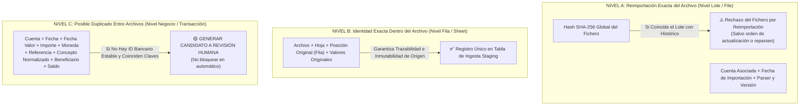

# 07 - Módulo de Extractos: Análisis de Parsers, Lógica Bancaria y Deduplicación

## 1. Alcance Técnico y Estado del Módulo

El análisis estático del módulo de gestión contable bancario abarca las interfaces ubicadas en `el_criollo_modular/src/modules/extractos/` y el prototipo histórico independiente en `extractos/` (`EC_extractos`). En estricto cumplimiento del control de calidad de la **Fase 0.5**, el presente informe deslinda con precisión los hallazgos verificados en el código de aquellas lógicas cuya comprobación requiere herramientas de lectura binaria complementaria de las que no se dispuso en esta fase documental.

---

## 2. Evaluación del Motor de Parseo e Importación Bancaria

### 2.1. Implementación Actual y Limitación Textual (`HECHO VERIFICADO`)
* La inspección del archivo `el_criollo_modular/src/modules/extractos/ImportModal.jsx` ratifica que el mecanismo principal de lectura de ficheros se sustenta en la llamada a `Papa.parse()`, perteneciente a la librería cliente **PapaParse**.
* **Limitación Arquitectónica (`HECHO VERIFICADO`):** PapaParse es un procesador proyectado y construido para parsear flujos en texto plano formateados como valores separados por comas (`.csv` o `.tsv`). No incluye conversores ni decodificadores internos capaces de interpretar libros en formato binario de Microsoft Excel (extensiones `.xls` con estructura BIFF o `.xlsx` basadas en ficheros comprimidos ZIP XML con tipo `application/octet-stream`).
* `INFERENCIA / REQUISITO TÉCNICO`: Al verificarse en el sistema de archivos del restaurante que los extractos aportados como muestra residen bajo las extensiones `.xls` y `.xlsx`, el intento de someter dichos documentos directtamente al analizador `Papa.parse()` desembocará infaltablemente en un rechazo por caracteres binarios ilegibles o excepciones de formato no soportado.
* `RECOMENDACIÓN METODOLÓGICA:` En la Fase 1 del cronograma, la ingeniería deberá dotar al componente importador de adaptadores de lectura habilitados para tratar planillas Excel en el navegador (utilizando librerías como `xlsx`, `exceljs` o conversores nativos), supeditado a validación previa sin perturbar el código existente.

---

## 3. Reingeniería y Niveles del Modelo de Deduplicación

> **RECHAZO DE SOLUCIONES UNIFICADAS INSUFICIENCTES:** Se descarta categóricamente el supuesto analítico previo según el cual la implantación de un identificador hash individual (ej. *SHA-256 + índice único*) representa una solución definitiva. El cálculo de un hash es en esencia una reducción técnica y no un criterio soberano de contabilidad. Imponer en la base de datos un índice único inmutable sin diferenciar la identidad de la importación frente a la legitimidad contable del gasto provocará falsos positivos de bloqueo inaceptables en un negocio de restauración HORECA.

Con el objetivo de proveer un marco analítico verificable antes de cualquier implementación, la estrategia de deduplicación contable de Taquería El Criollo se reestructura sobre tres niveles lógicos diferenciados:

### 3.1. Nivel A — Reimportación Exacta del Archivo
Enfocado en evitar la recarga redundante de planillas contables idénticas por parte del operador contable:
* **Parámetros Evaluados:**
  1. `Hash del archivo:` Suma de verificación criptográfica calculada sobre el contenido bruto de los bytes del documento.
  2. `Cuenta asociada:` Identificador contable o IBAN verificado de la entidad originaria de los cobros.
  3. `Parser y versión:` Registro explicito de qué motor y regla gramatical (ej. `SabadellParser_v1.2`) interpretó el fichero de origen.
  4. `Fecha de importación:` Marca temporal certera que identifica la sesión de carga en el servidor.
* **Comportamiento Recomendado (`REQUISITO TÉCNICO`):** Si un operador sube un fichero cuyo hash global del archivo concuerde con un lote importado satisfactoriamente en semanas anteriores, el sistema notificará al usuario la preexistencia del lote y frenará el proceso general sin sobreescribir ni dañar el historial de transacciones, facultando al administrador para permitir el reparseo opcional si hubiere mediado una corrección en las reglas de lectura de la aplicación.

### 3.2. Nivel B — Identidad Exacta Dentro del Archivo
Enfocado en auditar e inmutativizar el orden de las líneas tal y como figuran en el documento de origen del banco:
* **Parámetros Evaluados:**
  1. `Archivo:` Identificador de relación del documento inyectado en Nivel A.
  2. `Hoja:` Nombre o índice numérico de la pestaña contable tratada (vital en ficheros consolidados o multigrado en Excel).
  3. `Posición original:` Número correlativo e invariable de la fila o índice en la tabla original impartida por el banco.
  4. `Valores originales:` Copia cruda e inalterada de la cadena textual o JSON en bruto entregado para esa partida.
* **Comportamiento Recomendado (`REQUISITO TÉCNICO`):** Cada línea importada debe conservar en sus metadatos la hoja y posición original del documento fuente, habilitando al sistema para deshacer e invalidar un lote problemático o viciado en bloque sin dejar rastros residuales ni romper la secuencialidad referencial del libro contable.

### 3.3. Nivel C — Posible Duplicado Entre Archivos
Enfocado en detectar duplicidades reales entre descargas que cubran periodos de tiempo solapados sin amputar gastos legítimos en el restaurante:
* **Parámetros Evaluados:**
  1. `Cuenta`, `Fecha`, `Fecha valor`, `Importe` y `Moneda`.
  2. `Referencia:` Código de seguimiento alfanumérico emitido en el canal contable de la entidad (cuando exista y sea inmutable).
  3. `Concepto normalizado` y `Beneficiario:` Cadena depurada sin puntuación cambiante.
  4. `Saldo:` Balance de cuenta de caja posterior a la liquidación de la partida transaccional.
* **Regla de Operación Inamovible (`RECOMENDACIÓN` / `REQUISITO TÉCNICO`):** El Nivel C debe **generar candidatos a revisión y no bloquear automáticamente movimientos legítimos iguales**, salvo la existencia verificable y demostrada de un identificador bancario estable confirmado provisto de origen y certificado sin excepciones por el proveedor financiero.

---

## 4. Casuísticas Contables Obligatorias en la Deduplicación

Para dotar de solidez al motor financiero antes de someter a aprobación su esquema DDL relacional, la ingeniería deberá modelar e implementar de manera unitariamente comprobable los siguientes ocho escenarios críticos inherentes al manejo del dinero en sala y tesorería:

1. **Periodos Solapados:** El operador descarga en el banco un fichero para el intervalo del 1 al 20 del mes y, semanas después, descarga otro que cubre del 15 al 30. Los cobros correspondientes a los días del 15 al 20 no deben generar un rechazo completo de la segunda exportación del archivo; se importarán únicamente los registros nuevos del día 21 al 30 tras clasificar los coincidentes como precargados verificados de rango.
2. **Descargas Repetidas:** Generación de un extracto reiterado sobre un mismo mes por solicitud del asesor fiscal o gerente del local; en caso de variar el formato (ej. pasarse del Excel binario del banco al CSV simplificado), la coincidencia en cuenta, fecha valor, referencia e importe y saldo impedirá duplicar de nuevo los asientos en caja.
3. **Movimientos Idénticos Legítimos:** Ocurrencia normal en la restauración HORECA donde un restaurante ejecuta en el mismo día varias compras idénticas al mismo proveedor y por idéntico precio exacto (por ejemplo, el encargo reiterado de reposición urgente de hielo, bebidas o carne al mismo distribuidor pagando €65.00 con tarjeta de empresa en la mañana y en la tarde). Si se aplicase un índice único restrictivo sin evaluar la posición o el saldo bancario decreciente y la hora del cargo, el sistema rechazaría incorrectamente la segunda compra verídica del establecimiento.
4. **Devoluciones:** Retorno contable o abono en cuenta originario por el abono parcial de un pedido o merma devuelta al proveedor logístico con signo contrario al cargo primitivo. El importador vinculará y asociará por similitud nominal el cargo revertido en el libro con su respectiva partida antecedente original.
5. **Anulaciones:** Movimiento emitido de oficio y sin intervención humana por el banco o el terminal de cobros en tarjeta para equilibrar una partida errónea provocada en el cobro en mesa por un corte eléctrico o caída de red en sala; la anulación debe preservarse sin borrarse en la contabilidad para mantener fidedigno el registro de saldos.
6. **Correcciones Bancarias:** Ajustes contables retrasados aplicados días o semanas más tarde por las entidades financieras bancarias sobre cargos provisionales ejecutados en moneda extranjera o comisiones en revisión; la fecha de operación puede apartarse deliberadamente de su fecha valor original en varios días naturales.
7. **Filas Desplazadas:** Cargas consolidadas o de libros auxiliares de cocina donde las líneas pierden el orden cronológico o introducen partidas intercaladas correspondientes a cierres automáticos bancarios contables por fin de trimestre, obligando al importador a guiarse por identidad analítica de Nivel B y Nivel C sin suponer jamás una ordenación correlativa y fija en el libro Excel entrante.
8. **Conceptos Modificados por el Banco:** Fenómeno recurrente en cuentas transitorias de entidades (como en abonos provisionales de tarjetas en pasarelas bancarias o comercios electrónicos en España) donde el concepto en el día 1 figura genéricamente como *"LIQUIDACION PROVISIONAL TARJETA COMERCIO"* y reaparece días más tarde en las descargas mensuales rellenado con el desglose del beneficiario final verídico; la capa transaccional generará de oficio una alerta y bandera de revisión humana en la interfaz para que el administrador verifique la equivalencia sin provocar descuadres de inventario.
