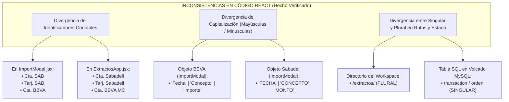

# 07a - Formatos Bancarios: Especificación Preliminar y Mapeo de Inconsistencias

> **ESTADO OFICIAL DEL DOCUMENTO:** `ESPECIFICACIÓN PRELIMINAR PENDIENTE DE VALIDACIÓN ESTRUCTURAL`.
> *Aclaratoria del Control de Calidad (Fase 0.5):* En concordancia con los hallazgos de auditoría estática documental y la Regla de Evidencia aplicable, se advierte y aclara de forma fehaciente que **ninguno de los archivos binarios Excel con muestras de los extractos alojados en el directorio `input-samples/extractos/` ha sido leído en su estructura interna, hojas, celdas o columnas por herramientas en texto plano durante este ciclo**, al carecerse temporalmente de conversores especializados para extensiones `.xls` (BIFF8) y `.xlsx` (`application/octet-stream`).
> Por ende, la información aquí condensada representa una especificación teórica basada en la intención de programación y en las evidencias constadas dentro de los componentes fuente en React y Javascript.

---

## 1. Clasificación del Estado de Evidencia en Datos Bancarios

Para erradicar toda ambigüedad en la posterior toma de decisiones técnicas por parte del equipo de ingeniería o de los profesionales contables, cada dato relativo a los formatos financieros y cabeceras bancarias del restaurante se diferencia sistemáticamente de acuerdo con su origen real de comprobación:

| Componente del Dato Bancario | Origen de Información Observado | Estado Exclusivo de Evidencia | Detalle Acreditado por el Control Documental |
| :--- | :--- | :--- | :--- |
| **Nombres de Archivo y Extensiones del Banco** | Listado en sistema de archivos local (`input-samples/extractos/`) | `OBSERVADO EN NOMBRE O FIRMA DE ARCHIVO` | Constan 5 documentos: `Cta. Sabadell.xls`, `Tarj. Sabadell.xlsx`, `Cta. BBVA MC.xls`, `Tarj. BBVA.xls`, `Planilla Movimientos - Consolidado.xlsx`. |
| **Cabeceras Programadas en BBVA** (`Fecha`, `Concepto`, `Importe`, etc.) | Inspección de código (`ImportModal.jsx:L4-L5`) | `INFERIDO DESDE CÓDIGO` | Se verifica en el fichero JavaScript la declaración imperativa que busca estas claves textuales precisas cuando procesa un string CSV. |
| **Cabeceras en Mayúsculas del Banco Sabadell** (`FECHA`, `CONCEPTO`, `MONTO`) | Inspección de código (`ImportModal.jsx:L7-L8`) | `INFERIDO DESDE CÓDIGO` | Refleja la expectativa gramatical de los programadores de la SPA, no una confirmación por lectura de las celdas de `Cta. Sabadell.xls`. |
| **Uso Operativo y Plan de Cuentas Contables en Sala** | Información de dominio y gerencia | `PROPORCIONADO POR CONTEXTO DE NEGOCIO` | Se da por entendido por cuenta de la gerencia que el restaurante emplea contablemente cuentas del Banco Sabadell y BBVA en su gestión regular. |
| **Estructura Interna, Hojas y Columnas en Excel Binario** | Contenido bruto en planillas `.xls` y `.xlsx` | `NO VERIFICADO` | Su comprobación queda supeditada en firme a la ejecución futura de una herramienta programática habituada a parsear libros Microsoft Excel. |

---

## 2. Inconsistencias Acreditadas en el Código Fuente (`HECHO VERIFICADO`)

Si bien la lectura interna de los libros de Excel permanece como `NO VERIFICADO`, la auditoría estática inter-repositorios ha acreditado más allá de toda duda razonable una profunda fragmentación en la nomenclatura de canales contables, mayúsculas y sustantivación entre los propios ficheros fuente en React de la plataforma modular maestra (`el_criollo_modular`):

### 2.1. Divergencia Nomenclatural en Cuentas y Canales (`HECHO VERIFICADO`)
* En el módulo importador (`src/modules/extractos/ImportModal.jsx`), los identificadores seleccionables con los que el usuario cataloga las descargas bancarias se enuncian de forma abreviada en el estado: `'Cta. SAB'`, `'Tarj. SAB'`, `'Cta. BBVA'`, `'Tarj. BBVA'`.
* Por el contrario, en el componente organizador de la tabla principal (`src/modules/extractos/ExtractosApp.jsx`), las opciones fijadas en el filtrador lateral de listas se expresan de manera nominal extensa: `'Cta. Sabadell'`, `'Tarj. Sabadell'`, `'Cta. BBVA MC'`, `'Tarj. BBVA'`.
* `INFERENCIA / RIESGO CONDICIONAL:` Al carecer de un catálogo canónico normalizado de cuentas o identificadores relacionales compartidos, un extracto inyectado y guardado bajo la etiqueta abreviada `'Cta. SAB'` resultará invisible para el filtro contable del administrador cuando este consulte y busque las operaciones asociadas al selector `'Cta. Sabadell'`.

### 2.2. Disparidad en Capitalización de Atributos (`HECHO VERIFICADO`)
* La lógica programada para procesar filas bancarias en `ImportModal.jsx` asume que cada banco nacional envía sus exportaciones con cabeceras de texto y capitalización completamente desiguales: el adaptador para BBVA busca propiedades en minúscula con inicial en mayúscula (`row.Fecha`, `row.Concepto`, `row.Beneficiario`), mientras que el parser asignado a Sabadell exige el emparejamiento exacto con literales completamente en mayúsculas (`row.FECHA`, `row.CONCEPTO`, `row.MONTO`).
* `RECOMENDACIÓN METODOLÓGICA:` Se impone unificar durante la futura etapa de desarrollo un adaptador y diccionario de sinónimos inter-bancarios tolerante a fallas de mayúsculas o minúsculas en el analizador de entrada, evitando que una modificación estética introducida en el Excel por la entidad bancaria bloquee la ingesta contable en el cliente.

### 2.3. Disputa Léxica Singular vs. Plural (`HECHO VERIFICADO`)
* A lo largo del arbolado arquitectónico en el workspace de Vegen Digital, se constata que las tablas relacionales de la base de datos mysql heredada en cPanel apelan al uso del inglés en singular y plural indistintamente (`provider_ids_array`, `transaction`, `order`), al tiempo que en los endpoints del cliente Supabase se invocan entidades en español y plural (`extractos`, `empleados`, `fichajes`).
* `DECISIÓN HUMANA PENDIENTE:` Antes de unificar los esquemas relacionales, el líder de arquitectura y el cliente titular del proyecto deberán dictaminar de común acuerdo y someter a aprobación una Guía de Estilo Estructurado para Esquemas (DDL) y Base de Datos que dirima si todo modelo del negocio debe expresarse unívocamente en castellano singular, castellano plural o terminología anglófona técnica en adelante.
