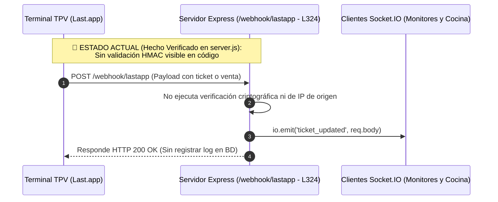
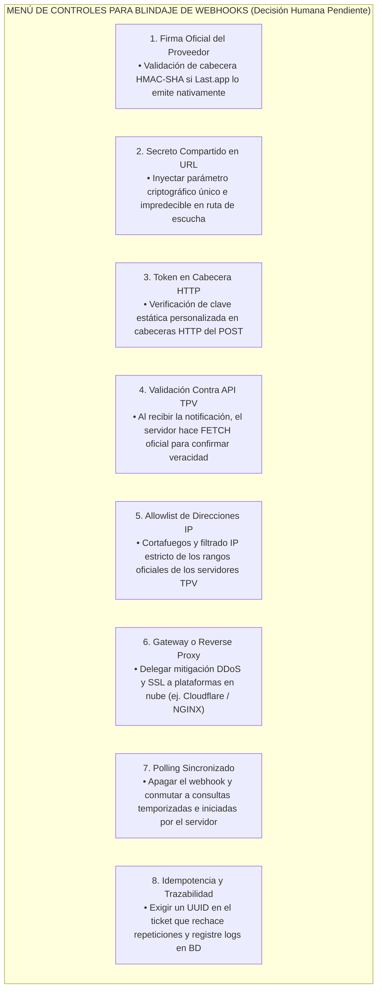

# 09 - Integración con TPV Last.app y Motor Analítico (Matriz BCG)

## 1. Naturaleza y Funciones del Servicio Analítico (`last_API`)

La inspección del repositorio `last_API/` evidencia la presencia de un backend independiente desarrollado y estructurado sobre **Node.js y Express**, operando en el puerto local 3001 y articulado contra una base de datos MySQL dedicada (`athcomar_vegen_Last_API`). Este servicio orquesta dos funciones transaccionales y de analítica en el ecosistema del restaurante:
1. **Pasarela de Sincronía TPV en Tiempo Real:** Recepción de notificaciones web (webhooks) presuntamente originadas por el terminal de cobro físico y oficial en sala (`Last.app`), para retransmitir actualizaciones e incidencias asociadas a tickets de venta de cocina y barra utilizando conexiones dinámicas basadas en **Socket.IO**.
2. **Motor Analítico Gastronómico (Matriz BCG):** Clasificación continua y persistencia del rendimiento y rentabilidad de los platos e insumos gastronómicos de acuerdo con la metodología contable y estratégica del Boston Consulting Group (Matriz BCG).

---

## 2. Radiografía Técnica del Servidor y Webhooks

### 2.1. Hallazgos Verificados en el Código Fuente (`HECHO VERIFICADO`)
* **Autenticación en Rutas API Internas (`HECHO VERIFICADO`):** Para las peticiones a endpoints operacionales que gestionan ingredientes, turnos y jornadas laborales del personal (`/api/ingredients`, `/api/shifts`), el servidor verifica la autenticidad del token mediante el conector de Google (`admin.auth().verifyIdToken(token)` en `server.js:L72`).
* **Estado de Protección en el Puerto Webhook de Entrada (`HECHO VERIFICADO` / `RIESGO DE SEGURIDAD`):**
  * En contraposición a la defensa de sus rutas API, el endpoint público habilitado en `server.js:L324-L327` para comunicarse con las terminales de venta (`/webhook/lastapp`) procesa cualquier petición recibida por POST reemitiéndola directamente al canal de Socket.IO (`io.emit('ticket_updated', req.body)`) y cerrando con un código de respuesta HTTP `200 OK`.
  * `HECHO VERIFICADO`: En la inspección estática no consta que dicho controlador invoque middlewares para validar firmas criptográficas (ej. HMAC-SHA), cabeceras de secreto compartido, tokens Bearer ni listas de control de direcciones IP autorizadas.
  * `RIESGO CONDICIONAL:` Si un atacante ajeno descubriera o alcanzase la URL de escucha en internet sin la interposición de un cortafuegos inverso (Reverse Proxy o API Gateway), podría inyectar comandas falsas, tickets manipulados o eventos espurios al canal WebSocket de cocina, perturbando el servicio ininterrumpido en la sala.

### 2.2. Capacidad Oficial de Seguridad de la Pasarela TPV (`NO VERIFICABLE`)
> **CLASIFICACIÓN DE EVIDENCIA EN FIRMAS TPV:** `NO VERIFICABLE SIN DOCUMENTACIÓN OFICIAL`.
> *Aclaratoria Técnica:* En estricto respeto a los límites documentales sin búsquedas en servidores externos o intromisiones informales, **no se debe presuponer sin evidencia técnica probatoria que el fabricante del TPV `Last.app` provea nativamente de firmas criptográficas HMAC-SHA256 en las cabeceras HTTP de sus webhooks automáticos**. Conocer con certeza qué mecanismos de blindaje de origen de datos soporta verdaderamente el software TPV oficial del restaurante requiere consultar formalmente su manual técnico de integración comercial.

---

## 3. Catálogo de Controles y Estrategias de Blindaje de Webhooks

A fin de dotar al líder directivo y a la ingeniería de un menú de opciones imparciales verificables antes de dictaminar cualquier reestructuración del puerto 3001, se enuncia el siguiente abanico de ocho controles de seguridad, sin seleccionar uno como definitivo hasta no certificar en firme las capacidades oficiales de la plataforma externa `Last.app`:

1. **Firma Proporcionada por `Last.app` (`DECISIÓN PROPUESTA`):** Validación de una huella criptográfica en cabecera HTTP (ej. `X-LastApp-Signature`) generada mediante algoritmo HMAC con secreto compartido y comparada en el servidor en modo de tiempo constante (para mitigar ataques de timing criptográfico).
2. **Secreto Compartido en Parámetro o Ruta:** Configuración de una ruta de escucha oculta e impredecible (ej. `/webhook/lastapp/a8f7d9...`) cuando el proveedor comercial de TPV no soporte insertar cabeceras HTTP personalizadas al transmitir eventos web.
3. **Token en Cabecera HTTP Personalizada:** Inyección por parte de la configuración TPV de una cabecera de autenticación estándar (ej. `Authorization: Bearer <TOKEN_ESTATICO_FIRMADO>`).
4. **Validación Contra API Oficial (Patrón Call-back / Check):** Al recibir la señal web que notifica una alteración en el ticket `#123`, el servidor Node ignora el contenido bruto del payload entrante y cursa una petición HTTPS oficial de lectura hacia el API remoted y firmado del TPV para constatar la veracidad del ticket y extraer sus importes reales.
5. **Allowlist (Lista Blanca de Direcciones IP Autorizadas):** Restricción perimétrica en el servidor o cortafuegos (Firewall / iptables) que descarta cualquier tráfico HTTP al puerto de webhooks que no provenga pura y exclusivamente de los bloques IP oficiales certificados por la corporación fabricante del TPV.
6. **API Gateway o Reverse Proxy con Mitigación DDoS:** Interposición de un servicio protector de nube exterior o proxy reverso en NGINX/Apache que aplique filtrado de tasa, validación SSL y rechace acometidas de saturación del canal o consumo irregular del ancho de banda.
7. **Polling Sincronizado y Programado (Retirada del Webhook):** Clavada o clausura definitiva del puerto de escucha receptora `/webhook/lastapp`, cambiando la filosofía hacia tareas programadas en el servidor Node que interroguen por HTTPS en intervalos periódicos seguros y firmados las ventas o cierres contables al API oficial de la TPV.
8. **Idempotencia y Trazabilidad por Registro en BD:** Incorporación obligatoria de una comprobación contra la base relacional del servidor que exija un identificador único por comanda o ticket, impidiendo que el reenvío malicioso o duplicado del mismo payload incremente o vicie falsamente las existencias, y persistiendo sistemáticamente un archivo auditable y transaccional de todo evento web entrante al establecimiento.

---

## 4. Persistencia de la Matriz BCG e Integración con la SPA

* **Hecho Verificado en Base de Datos (`HECHO VERIFICADO`):** Tanto el volcado SQL analizado como los controladores del backend (`server.js:L185`) evidencian y demuestran la existencia y uso transaccional de la tabla relacional `product_bcg_history`. Esta estructura cataloga las recetas y platillos servidos al público clasificándolos contablemente según sus niveles de margen bruto y rotación en sala dentro del menú del restaurante en los cuatro cuadrantes canónicos de rendimiento comercial:
  * `STAR` (Producto Estrella: Alta rentabilidad contable por plato y alta demanda constante en mesa).
  * `PLOW` / `PLOWHORSE` (Caballo de Batalla o Burro: Baja rentabilidad comercial unitaria por margen pero rotación elevadísima en volumen de servicio).
  * `PUZZLE` (Producto Enigma: Altísima rentabilidad monetaria individual y margen unitario con rotación ocasional o baja entre los clientes).
  * `DOG` (Producto Perro: Bajo volumen general de pedidos en sala acompañado de un margen de rentabilidad escaso u oneroso).
* **Situación Analítica y Desconexión actual de la SPA (`INFERENCIA` / `HECHO VERIFICADO`):** En la actualidad, las interfaces modulares proyectadas dentro de `el_criollo_modular` para el análisis empresarial (`VentasApp.jsx` y `KpisApp.jsx`) permanecen desconectadas del motor relacional que calcula esta Matriz BCG en `last_API`, lo que induce al usuario a alimentar las gráficas importando ficheros locales individuales tipo CSV en cada nueva sesión en su dispositivo.
* **Estrategia Directiva Sugerida (`DECISIÓN HUMANA PENDIENTE`):** Antes de abordar reformas estructurales (Fases 6 y 7), el cliente y sus responsables técnicos deberán deliberar administrativamente si el motor analítico que calcula las tablas de rendimiento BCG debe perpetuarse en el servidor Node dedicado del puerto 3001, o si por razones de eficiencia arquitectónica y escalabilidad a largo plazo conviene transponer progresivamente dichas fórmulas hacia funciones sin servidor en nube o conectores compartidos en el backend unificado seleccionado.
