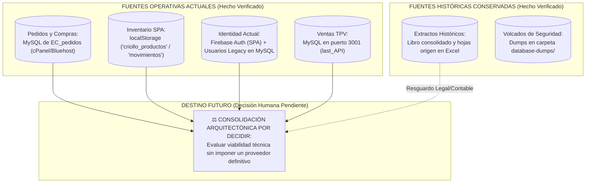

# 10 - Fuentes de Verdad: Mapeo Operativo, Histórico y Destinos Pendientes

## 1. Contexto de la Coexistencia Referencial en el Ecosistema

La inspección sistemática del ecosistema `el-criollo-ecosistema/` corrobora que diferentes módulos web e interfaces en servicio sostienen su operativa cotidiana apoyándose en repositorios de datos independientes y con tecnologías heterogéneas. En acato a las reglas de evidencia del **Control de Calidad (Fase 0.5)**, el presente documento abandona el mandato prematuro de declarar un motor soberano en la nube de forma dogmática, y pasa a desglosar el mapa de fuentes en función estricta de su rol actual y futuro:
* **Fuente Operativa Actual:** Repositorio en uso diario donde el operario ejecuta sus transacciones de negocio o autenticación.
* **Fuente Histórica:** Archivos de respaldo contable, hojas de Excel consolidadas o volcados de copia en disco con memoria financiera.
* **Fuente Propuesta:** Modelo relacional o plataforma en la nube recomendada técnicamente por el revisor como alternativa de convergencia.
* **Destino Pendiente de Decisión:** Elección arquitectónica de integración reservada de manera exclusiva y formal a la deliberación y aprobación humana previa.

---

## 2. Mapa de Distintas Fuentes de Verdad por Dominio del Dato

---

## 3. Desglose Estricto por Dominios de Operación

### 3.1. Dominio de Pedidos y Abastecimiento de Cocina
* **Fuente Operativa Actual (`HECHO VERIFICADO`):** Base de datos relacional MySQL (`athcomar_comprasWS`) hosteada en los servidores de cPanel/Bluehost, sobre la que opera el código en producción `pedidos/app.js` mediante los scripts de backend en PHP (`orders.php`).
* **Fuente Histórica (`HECHO VERIFICADO`):** Volcado de respaldo preservado estáticamente en `database-dumps/comprasWS_tables.sql`, junto a los registros acumulados en la tabla MySQL del servidor web en activo.
* **Fuente Propuesta (`DECISIÓN PROPUESTA`):** Centralización posterior del catálogo de insumos y proveedores dentro de una base de datos relacional con claves foráneas estrictas y control de filas (RLS).
* **Destino Futuro (`DECISIÓN HUMANA PENDIENTE`):** No se declara al motor Supabase ni a ningún otro proveedor nube de terceros como el destino definitivo para los pedidos del restaurante. El traspaso transaccional desde el servidor actual de cPanel quedará sujeto a que la gerencia valide primero la paridad funcional e instruya la adopción de una arquitectura unificada que brinde garantías de continuidad.

### 3.2. Dominio de Extractos Monetarios y Conciliación Bancaria
* **Fuente Operativa Actual (`HECHO VERIFICADO`):** Las importaciones y visualizaciones en la SPA maestra (`src/modules/extractos/`) consumen endpoints hacia la tabla `extractos` configurada en el cliente web (@supabase/supabase-js) mediante su clave pública anónima.
* **Fuente Histórica (`HECHO VERIFICADO`):** Los libros de Excel consolidados y las hojas contables de origen alojados en la carpeta `input-samples/extractos/` (ej. `Cta. Sabadell.xls`, `Planilla Movimientos - Consolidado.xlsx`), los cuales resguardan el histórico de cobros en sala y tesorería del negocio.
* **Fuente Propuesta (`RECOMENDACIÓN`):** Diseñar una tabla de ingesta intermedia con metadatos de auditoría contable (Niveles A, B y C) que evite la reimportación ciega de ficheros sin alterar los asientos bancarios originales.
* **Destino Futuro (`DECISIÓN HUMANA PENDIENTE`):** Selección del motor y esquema de conciliación definitivo supeditado a validación jurídica y contable especializada.

### 3.3. Dominio de Existencias, Almacén e Inventario
* **Fuente Operativa Actual (`HECHO VERIFICADO` / `RIESGO CONDICIONAL`):** En el módulo principal de la aplicación (`el_criollo_modular/src/modules/inventario/store.jsx`), la titularidad y persistencia del inventario reposa de forma aislada en el almacenamiento local del navegador (`localStorage`) mediante claves como `criollo_productos` y `criollo_movimientos`.
* **Fuente Histórica (`HECHO VERIFICADO`):** El proyecto legacy de inventarios conserva volcados independientes con tablas MySQL (`athcomar_inventario.sql`).
* **Fuente Propuesta (`REQUISITO TÉCNICO`):** Conectar el gestor de estado web (Zustand/reducers) con un servidor relacional provisto de claves foráneas entre proveedores, productos y recepciones.
* **Destino Futuro (`DECISIÓN HUMANA PENDIENTE`):** Pendiente de decisión directiva para acordar en qué plataforma y bajo qué reglas nomenclaturales (español o inglés) conviverá el maestro de insumos gastronómicos de cocina con el de pedidos.

### 3.4. Dominio de Identidad, Usuarios y Seguridad
* **Fuente Operativa Actual (`HECHO VERIFICADO`):** Coexistencia fragmentada con dos sistemas incompatibles operando sin sincronización:
  1. En la SPA maestra (`el_criollo_modular`), los operadores de sala inician sesión al verificar su identidad por Google en **Firebase Authentication**.
  2. En el módulo administrativo de Pedidos (`pedidos/`) y en el TPV (`last_API/`), subsisten tablas locales legacy de usuarios en MySQL de forma separada, al tiempo que ciertas autorizaciones visuales en la SPA leen sus permisos desde la memoria del navegador (`localStorage.getItem('vdc_permisos')`).
* **Fuente Histórica (`HECHO VERIFICADO`):** Los registros de contraseñas legacy y correos del personal conservados en las tablas `usuarios` del archivo de volcado `athcomar_inventario_el_criollo.sql`.
* **Fuente Propuesta (`DECISIÓN PROPUESTA`):** Sincronizar criptográficamente la autenticación del usuario mediante tokens firmados verificados de lado del servidor web o en base de datos, suprimiendo la lectura de permisos desde `localStorage`.
* **Destino Futuro (`DECISIÓN HUMANA PENDIENTE`):** Determinar tras deliberación técnica si el ecosistema unificará la emisión y comprobación de identidades sobre Firebase Auth, si transitará por completo al gestor nativo de cuentas de la base nube relacional (Supabase Auth) o si se habilitará un servicio intermedio de control por backend en Node.js.

---

## 4. Resumen y Mandato sobre Proveedores Definitivos

En obediencia a la cautela analítica mandatada, **se prohíbe formalmente en el presente diagnóstico declarar o dar por sentado a Supabase, Firebase, MySQL en Bluehost o Node.js como el destino definitivo o incuestionable para la totalidad del ecosistema del restaurante**.

La resolución con respecto al proveedor oficial que acogerá las bases y servicios en nube del cliente queda elevada como **DECISIÓN HUMANA PENDIENTE DE APROBACIÓN**, condicionada a que los responsables del proyecto valoren previamente los costes de infraestructura, la robustez relacional y los requerimientos del día a día del negocio en sala de Taquería El Criollo.
