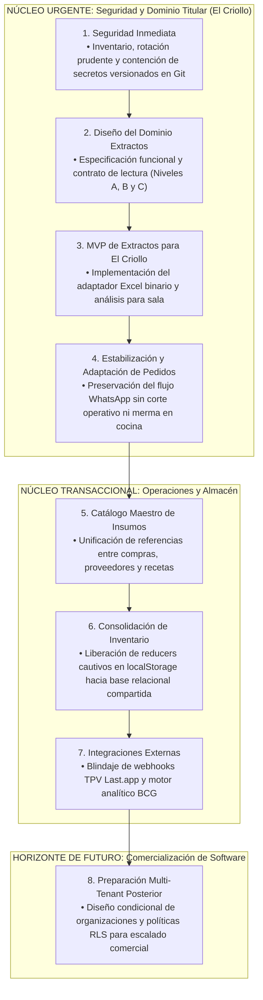

# 11 - Estrategia de Consolidación Arquitectónica

## 1. Principios de Consolidación Progresiva por Dominios y Contratos

La reingeniería y posterior consolidación del software informático de **Taquería El Criollo / Vegen Digital SL** rechaza por completo la adopción precipitada de un proveedor nube definitivo de forma anticipada o el refactoring masivo y destructivo del sistema en activo. En su lugar, el presente documento instruye una estrategia basada en la **consolidación progresiva por dominios y contratos de servicio**, amparada por las dos máximas operacionales del proyecto:
1. **Regla de Oro de Continuidad Operacional (`REQUISITO TÉCNICO`):** Ninguna intervención en el código, cambio de base de datos o traslado de servidor alterará ni interrumpirá en momento alguno la marcha normal de las compras, cobros y rutinas de cocina en el restaurante en vivo.
2. **Aislamiento por Contratos Relacionales (`RECOMENDACIÓN`):** Antes de elegir o descartar de manera irreversible una base de datos específica en nube (BaaS) o servidor local, cada módulo (Extractos, Pedidos, Inventario) definirá y documentará contratos relacionales verificables (esquemas de entrada, salida, tipos de datos y validaciones de autorización) capaces de integrarse en igualdad de condiciones con la infraestructura que finalmente resulte aprobada por la dirección humana.

---

## 2. Jerarquía Estricta de Priorización Estratégica

Para evitar desenfoques o adelantar horizontes comerciales que saturen la capacidad del equipo técnico o perturben el servicio titular (Single-Tenant), la hoja de ruta estratégica jerarquiza y obedece escrupulosamente el siguiente **orden prioritario transaccional**:

---

## 3. Desglose Táctico de los Ocho Escalones Estratégicos

### 1. Seguridad Inmediata (`REQUISITO TÉCNICO` / `RIESGO DE SEGURIDAD`)
* **Acción Remedial de Contención:** Inventariar de manera pormenorizada y segura las credenciales y ficheros sensibles detectados en repositorios heredados (`db_connect.php`, `.env`).
* **Protocolo de Trabajo:** Ejecutar una rotación controlada y pacifica de las cuentas en los servidores MySQL de cPanel (Bluehost) tras comprobar su vigencia en caliente con el personal, verificando los logs de acceso de los servidores y programando en una etapa de mantenimiento posterior y acordada con el equipo humano la limpieza sanitaria del historial en el repositorio Git.

### 2. Diseño del Dominio Extractos (`RECOMENDACIÓN`)
* **Acción Remedial:** Documentar e institucionalizar el contrato y esquema funcional del módulo financiero antes de comprometer líneas de código en producción.
* **Protocolo de Trabajo:** Diseñar una estructura de base de datos relacional y programar reglas de parseo capaces de acomodar el modelo de deduplicación en tres niveles (Reimportación exacta del fichero, identidad de línea en la hoja de cálculo y candidatos de posible duplicado por importe y saldo sin bloqueo automático de gastos coincidentes verificados en sala).

### 3. MVP de Extractos para El Criollo (`DECISIÓN PROPUESTA`)
* **Acción Remedial:** Dotar al equipo administrativo de un importador web capaz de procesar sin rechazo por formato los libros contables y bancarios reales manejados por la gerencia del restaurante.
* **Protocolo de Trabajo:** Incorporar y verificar en `ImportModal.jsx` el funcionamiento de librerías de parseo compatibles con ficheros binarios de Microsoft Excel (`.xls` y `.xlsx`), verificando las reglas de normalización de conceptos para Banco Sabadell y BBVA en beneficio de las conciliaciones internas del local titular.

### 4. Estabilización y Adaptación del Módulo de Pedidos (`HECHO VERIFICADO` / `REQUISITO TÉCNICO`)
* **Acción Remedial:** Asegurar en el día a día la inviolable continuidad operativa en cocina del sistema en producción actual (`EC_pedidos`).
* **Protocolo de Trabajo:** Proteger los endpoints PHP actuales frente a fallas transaccionales y retrasar cualquier desconexión del servidor en Bluehost hasta haber desarrollado de manera progresiva, probada y aceptada por el usuario un módulo equivalente provisto de buscador de alto rendimiento y generador fidedigno del mensaje formal por WhatsApp.

### 5. Catálogo Maestro de Insumos (`DECISIÓN HUMANA PENDIENTE`)
* **Acción Remedial:** Sellar las discrepancias ortográficas, gramaticales y de unidades de medida entre los diferentes repositorios del ecosistema de Vegen Digital SL.
* **Protocolo de Trabajo:** Convenir formalmente bajo qué reglas idiomáticas y estructura de base de datos coexistirá la relación multi-proveedor por ingrediente comercial del menú, construyendo un diccionario que evite ambigüedades contables cuando un insumo de compra alimente el cálculo contable en la cocina.

### 6. Consolidación de Inventario y Almacén (`RIESGO CONDICIONAL`)
* **Acción Remedial:** Erradicar de manera ordenada la dependencia del módulo principal del almacén respecto de la memoria efímera local y mutante del navegador del usuario (`window.localStorage`).
* **Protocolo de Trabajo:** Refactorizar los conectores del estado en `store.jsx` para que toda merma o entrada de almacén apunte hacia un motor de base de datos relacional robusto que preserve el historial de movimientos de inventario compartida entre terminales del restaurante en tiempo real.

### 7. Integraciones Externas y TPV (`NO VERIFICABLE` / `RECOMENDACIÓN`)
* **Acción Remedial:** Proteger el puerto de escucha local 3001 del servidor Node y definir el porvenir de la Matriz BCG.
* **Protocolo de Trabajo:** Solicitar la documentación técnica del proveedor del TPV oficial en sala (`Last.app`) para seleccionar empíricamente de entre el catálogo de ocho controles el mecanismo de blindaje que autorizará los webhooks entrantes, impidiendo inyecciones apócrifas en el monitor de cocina por medio de conexiones seguras y transacciones auditables en base de datos.

### 8. Preparación Multi-Tenant Posterior (`DECISIÓN HUMANA PENDIENTE`)
* **Acción Remedial:** Plantear la expansión arquitectónica y el diseño interempresa del ecosistema para una posterior comercialización SaaS como producto externo de software HORECA en el mercado español.
* **Protocolo de Trabajo:** Restringido en exclusiva para etapas avanzadas y una vez asegurado el funcionamiento soberano de Taquería El Criollo; abordará el diseño de políticas de seguridad a nivel de fila remorate por inquilino (RLS), aislamiento entre organizaciones mercantiles independientes, alta programada en la nube y pruebas exhaustivas verificadas en busca de prevenir fugas cruzadas de datos o accesos no autorizados interempresa.
