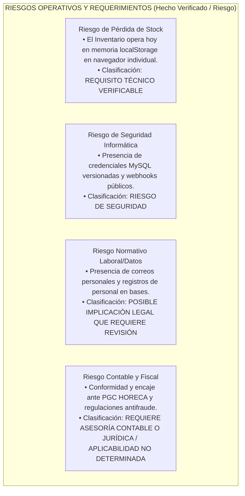

# 13 - Preguntas Abiertas y Riesgos Operativos Estratégicos

## 1. Naturaleza y Contexto de Decisión Directiva

El presente informe condensa los dilemas arquitectónicos, interrogantes directivos y riesgos de negocio que las gerencias técnicas y de operación comercial vinculadas al software informático de **Taquería El Criollo / Vegen Digital SL** deberán resolver con anterioridad, o en el transcurso ordenado y progresivo de las intervenciones programadas en el cronograma de implantación evolutiva.

En estricta sujeción a las garantías protocolares impuestas al diagnóstico durante el **Control de Calidad y Trazabilidad (Fase 0.5)**, se elimina y desautoriza toda alusión infundada sobre sanciones tributarias directas, multas automáticas o inculpaciones de ocultación contable basadas meramente en lecturas en seco de repositorios informáticos locales.

> **RECORDATORIO Y ACLARACIÓN DE ALCANCE:** Se advierte, reitera e instruye con plena nitidez al usuario y partes interesadas que **el sistema informático en análisis no tiene por propósito suplir, sustituir ni invalidar a:**
> 1. El terminal de cobro y punto de venta físico y oficial operativo en sala (TPV `Last.app`).
> 2. El sistema, libro o software contable de uso oficial mandatado y operado por el restaurante.
> 3. Los programas informáticos para la facturación tributaria y emisión legal de documentos en plaza.
> 4. La asesoría fiscal, contable, mercantil y jurídica especializada externa contratada en derecho por la corporación usuaria y titular del establecimiento mercenario o restaurador.

---

## 2. Clasificación Estricta y Diferenciación de Riesgos Operativos

La valoración del riesgo analítico para Taquería El Criollo separa el impacto operativo inmediato frente a los requerimientos propios y diferibles del horizonte futuro de la comercialización y expansión por suscripción:

### 2.1. Escenario Inmediato: Operación Propia en Sala y Tiendas (Single-Tenant: El Criollo)
* **Peligro de Pérdida Transaccional de Existencias de Almacén:** `REQUISITO TÉCNICO VERIFICABLE`.
  * Al depender el módulo transitorio de Inventario (`src/modules/inventario/store.jsx`) de la persistencia en `window.localStorage`, el borrado fortuito de la caché y de las cookies del navegador web utilizado en la tablet del cocinero o almacén provocará la eliminación instantánea y no recuperable localmente de los registros logísticos, ocasionando discrepancias operacionales y pérdida temporal del historial sin sincronizar.
* **Exposición Perimétrica en Credenciales y Endpoints Web:** `RIESGO DE SEGURIDAD`.
  * La presencia acreditada del fichero de conexión heredada en bruto (`pedidos/backend/db_connect.php`) con contraseñas en texto y la carencia observada en el código respecto a middleware de verificación de firmas criptográficas HMAC en el puerto receptor del TPV de sala (`last_API`), obligan y prescriben el cumplimiento y adopción de protocolos inmediatos de rotación de activos e implementación de controles de seguridad en las etapas iniciales (Fase 1 y 2).
* **Tratamiento y Conservación de Datos Personales del Personal:** `POSIBLE IMPLICACIÓN LEGAL QUE REQUIERE REVISIÓN ESPECÍFICA`.
  * La tenencia y registro en volcados históricos heredados (ej. `athcomar_inventario_el_criollo.sql`) de nombres de trabajadores, retratos fotográficos visuales e identificadores de correo personales de Gmail amerita ser objeto de revisión por el profesional con competencias tributarias o asesoría laboral a cargo para corroborar su adecuada conservación transitoria o purga confidencial al tenor estricto del Reglamento General de Protección de Datos (RGPD) o equivalentes mercantiles.

### 2.2. Escenario Futuro: Comercialización Externa SaaS (España e Internacional)
* **Conformidad Normativa, Contable, Tributaria y Reglamento VeriFactu:** `REQUIERE ASESORÍA CONTABLE O JURÍDICA / APLICABILIDAD NO DETERMINADA`.
  * Toda determinación vinculada a dirimir en qué supuestos, bajo qué estricta arquitectura y conforme a qué exigencias normativas precisas la plataforma web modular —en el caso de ampliarse para importar y tratar partidas financieras de extractos, nóminas o reportes bancarios y mercantiles provenientes de terceras empresas en suelo de España— debe adecuar sus esquemas al Reglamento VeriFactu (Ley Antifraude), a las pautas de inmutabilidad del Plan General Contable HORECA o a disposiciones normativas en materia de software informático, excede el alcance formal del código fuente evaluado e impondrá su dilucidación inalterada en consulta especializada preceptiva frente a los abogados, gestores profesionales del tributo o asesorías colegiadas del cliente en el momento oportuno.
* **Aislamiento Organizacional Relacional en Nube:** `REQUISITO TÉCNICO VERIFICABLE`.
  * Para ofertar y dar servicio seguro en nube como producto SaaS suscriptor en plaza a restaurantes externos independientes en el futuro, el motor de persistencia relacional que se elija deberá acreditar empíricamente en su arnés de testing y esquemas remotos el aislamiento impenetrable en servidor (mediante clave organizacional `tenant_id` y sentencias Row Level Security), impidiendo de raíz que un cliente pueda leer indebidamente tablas de inventarios de cocinas ajenas.

---

## 3. Cuestionario Directivo y Decisiones Pendientes

Para dotar de sustento formal a la ingeniería a medida que transite disciplinada por los sucesivos escalones de su hoja de ruta transaccional y resolvente por dominios, se formula el siguiente cuestionario directivo, el cual condensa las materias instituidas como **DECISIÓN HUMANA PENDIENTE DE APROBACIÓN ORGÁNICA**:

### 3.1. Gobernanza sobre Reparos e Históricos Heredados
1. **¿Cuál ha de ser el destino administrativo oficial asignado a los motores heredados MySQL (`athcomar_comprasWS`, `athcomar_inventario`) tras homologar exitosa y de acuerdo a las pruebas paralelas la transgresión y transposición funcional a la arquitectura del proveedor en nube unificado que se seleccione?** (`DECISIÓN HUMANA PENDIENTE`).
   * *Opciones planteadas:* Exportación total del contenido en archivos comprimidos de solo lectura protegidos con cifrado para el archivo contable corporativo y el ulterior cese programado pacífico y apagado tributariamente documentado del puerto MySQL o cPanel del hosting externo en Bluehost.
2. **En el proceso técnico de unificación de insumos contables y gastronómicos entre almacenes y pedidos, ¿qué catálogo departamental en activo ha de investir en adelante la supremacía referencial soberana para dirimir y homogeneizar las discrepancias en nombres ortográficos y unidades mecánicas de gramajes o envases?** (`DECISIÓN HUMANA PENDIENTE`).
   * *Contexto del conflicto:* El dominio Pedidos y el archivo TPV acostumbra computar cortes y pesos en unidades brutas (ej. Kilogramo del carnicero, caja de botellas del bodeguero), mientras las recetas contables albergadas en los Escandallos precisan particionar dichos envases al mililitro o al gramo servido individual.

### 3.2. Estructura de Costes y Capacidades en Conectores Externos
3. **¿Cuál es la política corporativa autorizada por negocio respecto al volumen, modalidad y presupuestos económicos tolerables en las comunicaciones mercantiles orientadas al envío ágil y remoto de pedidos por mensajería al proyectarse para los locales propios o clientes SaaS suscriptores por el sistema en el futuro?** (`DECISIÓN HUMANA PENDIENTE`).
   * *Contexto de operación:* En la herramienta productiva de hoy (`pedidos/app.js`), el despacho no acarrea coste monetario al proveedor tecnológico alguno por cuanto invoca del lado de cliente un salto en ventana del navegador móvil web utilizando enlaces directos (`window.open('https://wa.me/...')`). Si para operaciones corporativas avanzadas sin abrir pestañas en el móvil se instruyera exigir notificaciones transaccionales rastreables al segundo e invisibles para la pantalla web del cocinero, requeriríase cotizar y suscribir acceso oficial comercial a la infraestructura del WhatsApp Cloud API (Meta) o servicios centralizadores análogos, incurrendo en costes por cada mensaje despachado.
4. **¿A través de qué protocolo formal y en qué términos de tiempo y contrato de mantenimiento instruirá la dirección solicitar, recabar y verificar la documentación técnica oficial del fabricante de la plataforma TPV operativa en sala (`Last.app`), orientada a demostrar sin suposiciones de código qué mecanismos criptográficos oficiales o firmas HMAC emiten en sus notificaciones de webhooks?** (`DECISIÓN HUMANA PENDIENTE`).

### 3.3. Alcance Normativo y Contable en Bancos y Controles Horarios
5. **¿Con arreglo a qué especificaciones técnicas dictaminadas formalmente por las asesorías jurídicas, fiscales y contables del negocio se exigirá dar forma en adelante al esquema relacional e importador de movimientos transaccionales de bancos y jornadas laborales de personal de cocina?** (`REQUIERE ASESORÍA CONTABLE O JURÍDICA / DECISIÓN HUMANA PENDIENTE`).
   * *Alcance del dictamen solicitado:* Aclaración y resolución profesional respecto de si la tabla e interfaz web de conciliación financiera de las cuentas del banco o el registro digital de entradas y salidas horarias del equipo de sala ha de ceñirse o no en su persistencia local y remota a los imperativos de inmutabilidad del Reglamento VeriFactu (Ley Antifraude), a los estatutos laborales del personal HORECA de la jurisdicción nacional competente y a las pautas de protección y almacenamiento de las bases sobre las identidades personales operadas del restaurante bajo norma RGPD aplicable.
