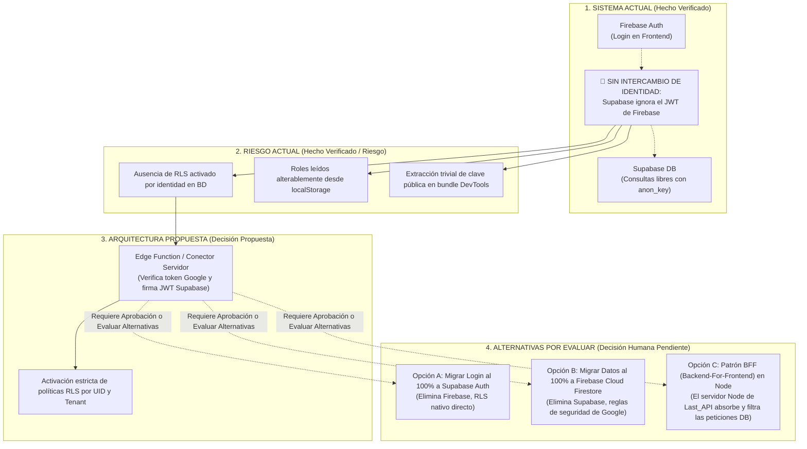

# 14 - Control de Calidad y Trazabilidad del Diagnóstico (Fase 0.5)

## 1. Contexto y Objetivos del Control de Calidad

El presente informe constituye la revisión técnica independiente del paquete documental generado durante la **Fase 0: Diagnóstico Técnico y Funcional Integral**. El propósito principal de este documento de control es detectar contradicciones, identificar afirmaciones que exceden la evidencia demostrable y separar de forma estricta los hechos verificados de las decisiones arquitectónicas que aún requieren aprobación humana.

> **ALCANCE EXCLUSIVAMENTE DOCUMENTAL:** En esta fase de revisión (Fase 0.5) no se ha modificado código fuente, ni configuración, ni bases de datos, ni ramas, ni despliegues. No se ha reescrito ni eliminado contenido de los documentos 00 a 13 ni del archivo `manifest.json`. Todas las correcciones señaladas en este documento quedan pendientes de aprobación y ejecución en etapas de revisión humana posteriores.

---

## 2. Contradicciones Encontradas

### 2.1. Validación de Archivos Bancarios Excel vs. Herramientas de Lectura
* **Contradicción Detectada:** En los informes previos (en particular en `07-extractos.md` y `07a-formatos-bancarios.md`) se incurrió en una contradicción metodológica al declarar simultáneamente que se habían "validado históricamente las muestras bancarias" y que, al mismo tiempo, las herramientas de inspección en texto plano no son capaces de leer archivos binarios de Excel (`.xls` y `.xlsx`), devolviendo el error `unsupported mime type application/octet-stream`.
* **Exceso de Lenguaje:** El uso de adjetivos como *infalible*, *validado contra archivo* o *confirmado por la muestra* para describir la estructura interna de archivos `.xls` o `.xlsx` excede la evidencia empírica verificable. Al no haberse parseado el flujo binario de las hojas de cálculo, cualquier conclusión sobre las cabeceras reales, filas basura o estructura interna de dichos ficheros carece de observación estructural directa en esta auditoría.
* **Clasificación Estricta del Estado de Evidencia en Extractos:**

| Afirmación / Observación Bancaria | Origen del Dato | Estado de Evidencia | Justificación Técnica |
| :--- | :--- | :--- | :--- |
| **Cabeceras de Cuentas BBVA (`Fecha`, `Concepto`, `Beneficiario`, etc.)** | Código (`ImportModal.jsx:L4-L5`) | `INFERIDO DESDE CÓDIGO` | El código cliente está programado para buscar estas claves en un CSV, pero el archivo real `Cta. BBVA MC.xls` es un binario incognoscible con herramientas de texto. |
| **Cabeceras del Banco Sabadell en Mayúsculas (`FECHA`, `CONCEPTO`, `MONTO`)** | Código (`ImportModal.jsx:L7-L8`) | `INFERIDO DESDE CÓDIGO` | Refleja la intención de diseño de los programadores, no una comprobación empírica en `Cta. Sabadell.xls`. |
| **Formato y Existencia de Muestras en `input-samples/extractos/`** | Sistema de archivos local | `VERIFICADO DIRECTAMENTE EN ARCHIVO` | Se verifica empíricamente que existen 5 archivos y que sus extensiones son `.xls` y `.xlsx` (formato binario, no texto). |
| **Inconsistencias Nomenclaturales (`Cta. Sabadell` vs `Cta. SAB`)** | Código (`ExtractosApp.jsx:L27` vs `ImportModal.jsx:L18`) | `VERIFICADO DIRECTAMENTE EN ARCHIVO` | Divergencia textual constatada mediante inspección estática directa entre dos archivos fuente de React. |
| **Uso Histórico de Hojas de Consolidación por el Restaurante** | Conocimiento del usuario / Nombres de fichero | `PROPORCIONADO COMO CONTEXTO DE NEGOCIO` | Se asume como contexto operativo del cliente sin verificación analítica del interior de la planilla consolidada. |
| **Contenido y Filas del Archivo `Planilla Movimientos - Consolidado.xlsx`** | N/A (Fichero binario no legible por texto) | `REQUIERE HERRAMIENTA ADICIONAL` | Exigirá el uso de un lector binario especializado (ej. Python `openpyxl`, Node `xlsx`) para emitir afirmaciones sobre su estructura. |

### 2.2. Deduplicación de Extractos y el Mito del Hash SHA-256
* **Contradicción y Sobredimensión:** En el documento `07-extractos.md` y en la hoja de ruta (`12-roadmap.md`) se afirmó categóricamente que sustituir el filtro ingenuo de cliente por una solución basada en *SHA-256 + índice único = deduplicación resuelta*.
* **Corrección Técnica:** El hash criptográfico (SHA-256) es únicamente un mecanismo técnico de reducción de datos y no resuelve el problema contable por sí solo. Imponer un índice único irrevocable en la base de datos sin definir con precisión la clave lógica de negocio causará bloqueos inadecuados. A continuación se documenta por separado cada casuística operativa que debe analizarse antes de proponer cualquier restricción única en el esquema de datos:
  1. **Identidad de Archivo:** Determinación de si el mismo documento bancario ha sido importado previamente (requiere evaluar tamaño, fecha de generación bancaria y suma de verificación global del fichero, pero permitiendo extraer partidas nuevas si el archivo fue descargado cubriendo un rango temporal más amplio).
  2. **Identidad de Importación:** Registro de auditoría del lote inyectado en una sesión individual para habilitar el revertido integral (rollback por lote) en caso de error de mapeo sin alterar importaciones previas.
  3. **Duplicado Exacto:** Coincidencia inequívoca en un mismo extracto del identificador transaccional único asignado por el banco (cuando la pasarela bancaria provea una referencia alfanumérica verdaderamente invariable).
  4. **Solapamiento de Periodos:** Descarga sucesiva de ficheros mensuales con días superpuestos (ej. del 1 al 15 del mes y luego del 10 al 30), donde los movimientos entre los días 10 y 15 deben identificarse como ya existentes sin rechazar el fichero entero.
  5. **Posible Duplicado (Ambiguo):** Operaciones que coinciden en fecha e importe pero carecen de referencia bancaria o tienen conceptos genéricos (ej. "TRANSFERENCIA HABER"); el sistema no debe borrarlos silenciosamente sino marcarlos con bandera de revisión humana.
  6. **Movimientos Legítimos Idénticos:** Dos o más compras genuinas cobradas el mismo día, por el mismo importe exacto y al mismo proveedor (ej. dos entregas de hielo o bebidas por €45.00 por la misma empresa transportista por mañana y tarde). Un hash estricto que no incorpore el saldo contable sucesivo o la secuencia de ejecución rechazará incorrectamente el segundo pago.
  7. **Devoluciones:** Cargos de retorno por importe inverso o negativo que referencian a un cobro original; deben vincularse lógicamente al movimiento inicial y no considerarse meras anomalías independientes.
  8. **Anulaciones:** Movimientos generados por el banco o TPV para neutralizar contablemente un cobro previo por fallo del terminal; el saldo global debe equilibrarse conservando la trazabilidad tanto del cargo como de la anulación.
  9. **Movimientos Corregidos:** Ajustes efectuados de oficio por la entidad bancaria días después de una liquidación provisional (típico en comisiones o tarjeta); la fecha de operación puede diferir de la fecha valor o de registro original.
  10. **Ausencia de Referencia Bancaria:** Exportaciones básicas o de cajas rurales que no adjuntan un ID transaccional en cada fila, obligando al sistema a depender de claves lógicas combinadas (cuenta + fecha valor + importe + saldo posterior) bajo un margen controlado de tolerancia.

---

## 3. Afirmaciones Sobredimensionadas y Métricas no Fundamentadas

### 3.1. Corrección de Métricas y Porcentajes Sin Escala
En los informes previos se emitieron valoraciones sin fundamentación de escala paramétrica ni demostración cuantitativa, tales como *"0% viabilidad"*, *"compatibilidad nula inalterable"* o *"preparación arquitectónica 0%"* al referirse a la adopción de un modelo SaaS Multi-Tenant.
* **Regla de Saneamiento:** Se elimina y desautoriza el uso de porcentajes informales sin una metodología de puntuación explicitada en el documento.
* **Revisión Procesal y Reformulación Verificable:**
  > *Sustitución recomendada:* **"El sistema no satisface actualmente los requisitos mínimos A (aislamiento en base de datos mediante clave de inquilino), B (políticas remotas de control de acceso RLS en servidor) y C (gestión de roles inmutables desde el cliente) definidos para operar de forma segura como software SaaS multi-tenant comercializable a terceros."**

### 3.2. Saneamiento de Afirmaciones Legales y Tributarias
En el documento `05-seguridad.md`, `13-preguntas-abiertas.md` y el Resumen Ejecutivo se redactaron afirmaciones sobre eventuales *sanciones*, *incumplimiento ante la AEAT*, *violaciones del Reglamento VeriFactu*, *ocultación contable* y *penalizaciones bajo RGPD*.
* **Exceso Analítico:** Una auditoría estática de código no es una asesoría jurídica ni fiscal en ejercicio. Inferir penalizaciones o delitos tributarios automáticos basándose exclusivamente en la falta de validaciones técnicas o en la estructura del código excede el ámbito de la ingeniería de software.
* **Clasificación Estricta y Desglose Jurisdiccional:**
  * **REQUISITO TÉCNICO:** Integridad de los registros transaccionales, inmutabilidad de logs, prevención del borrado no controlado de auditoría, e impedir que el usuario modifique su rol de seguridad en la memoria web local (`localStorage`).
  * **RIESGO DE SEGURIDAD:** Exposición indebida de credenciales en ficheros de control de versiones y ausencia de verificación criptográfica de firmas HMAC en el puerto de escucha de webhooks.
  * **POSIBLE IMPLICACIÓN LEGAL:** La potencial exposición de correos o datos identificativos de personal de la empresa ante terceros no autorizados si una instancia con BD compartida carece de segmentación por inquilino.
  * **REQUIERE VALIDACIÓN JURÍDICA O CONTABLE:** Toda determinación relativa a si la arquitectura contable satisface o no el Reglamento VeriFactu (Ley Antifraude de España), el cumplimiento aplicable del Plan General Contable HORECA o los criterios del Delegado de Protección de Datos bajo normativa RGPD.
* **Declaración Normativa del Producto:** Se recuerda explícitamente que **la plataforma modular en desarrollo no pretende sustituir, suplir ni competir con:**
  1. El TPV oficial certificado operando físicamente en sala (`Last.app`).
  2. El sistema o libro contable oficial del restaurante o empresa receptora.
  3. El software de facturación electrónica certificado para la emisión tributaria.
  4. La asesoría fiscal, contable y laboral externa o profesional contratada por el negocio.

---

## 4. Evidencia Insuficiente y Sobrealce Arquitectónico

### 4.1. Firebase y Supabase: Diferenciación de Estados y Evaluación de Alternativas
En los informes de arquitectura (`03`, `10` y `11`) se declaró precipitadamente que la combinación de *Firebase Auth + Supabase PostgreSQL* constituía la *Fuente de Verdad Canónica definitiva* y el camino arquitectónico aprobado.
* **Evidencia Insuficiente:** No se puede dar por definitiva esta combinación tecnológica sin haber demostrado empíricamente u ordenado evaluar:
  1. Que existe validación de servidor real (server-side) del token de Firebase dentro de la infraestructura de Supabase (o un servicio intermediario que verifique firmas).
  2. Que la identidad o `uid` de Firebase es plenamente reconocida por el motor SQL de Supabase para su inyección en políticas RLS.
  3. El impacto técnico y coste de mantener dos proveedores nube separados (Google Firebase y Supabase) frente a la unificación en un único ecosistema nativo.
* **Desglose Estructurado en Cuatro Planos:**

### 4.2. Horizonate Multi-Tenant vs. Necesidades Inmediatas
El desarrollo de un modelo SaaS Multi-Tenant constituye un **horizonte comercial de futuro** y no una emergencia operativa inmediata del restaurante en activo. La propuesta preliminar de aplicar un refactorizado transversal inmediato inyectando `tenant_id` en todas las tablas sobrecarga innecesariamente el alcance técnico y transgrede la priorización operacional.
* **Segmentación Rigurosa de Esferas Operativas:**

#### A. Necesario Ahora para Taquería El Criollo (Operación Single-Tenant)
* **Seguridad:** Rotación prudente y controlada de las credenciales de base de datos expuestas publicadas en repositorios de código remore o git.
* **Autenticación y Autorización:** Blindar la lectura del rol de usuario en el servidor o consultar un token validado, impidiendo el bypass por manipulación de variables en el navegador.
* **Persistencia:** Eliminar la dependencia ruino-efímera de `localStorage` para la salvaguarda de movimientos logísticos en el módulo de Inventario, conectándolo en línea al servidor relacional.
* **Trazabilidad y Estabilidad:** Dotar al sistema bancario y al TPV de manejadores explícitos de error (rechazo del patrón Swallow Errors) y trazabilidad básica sin silenciar excepciones al fallar la red.
* **Extractos:** Incorporar de manera acotada una librería lectora de planillas binarias Excel en `ImportModal.jsx` y corregir los casos triviales de falsos positivos al subir gastos idénticos idóneamente justificados en el día.
* **Continuidad de Pedidos:** Preservar la operatividad ininterrumpida de la herramienta heredada de pedidos en producción (`EC_pedidos`), asegurando que ningún cocinero ni almacén quede privado del despacho ágil de órdenes a proveedores por WhatsApp.

#### B. Preparación Arquitectónica Futura (Horizonte SaaS Multi-Tenant)
* **Modelo de Organización:** Diseño conceptual de jerarquías de entidades (Empresa Maestra → Franquicia / Restaurante → Sucursal / Almacén).
* **Identificador Corporativo (`tenant_id`):** Introducción programada en el esquema DDL remonto de un UUID identificador de empresa para segmentar y aislar corporaciones ajenas.
* **RLS Multiempresa:** Despliegue de sentencias condicionales en el motor PostgreSQL para bloquear cualquier lectura o consulta no amparada por la clave de la corporación suscriptora.
* **Onboarding:** Creación del flujo de alta, invitación de nuevos gerentes y activación automática de tiendas en el sistema.
* **Facturación SaaS:** Integración opcional de pasarelas de suscripción (ej. Stripe o Chargebee) y métricas de consumo del servicio nube.
* **Aislamiento entre Clientes y Administración Global:** Paneles de superadministración técnica y auditoría independiente de fugas referenciales o cruce contable interempresa.

> **Regla de Contención:** No debe ejecutarse ninguna migración transversal masiva para imponer capacidades multi-tenant en el código activo hasta que el propietario del proyecto no lo autorice de forma expresa y quede resuelta de raíz la estabilidad single-tenant de Taquería El Criollo.

### 4.3. Complejidad Requerida para la Migración de Pedidos
El documento `08-pedidos.md` simplificó en exceso el reemplazo del sistema heredado en producción (`EC_pedidos`) presentándolo como un simple "trasplante de interfaz a React 19 y cambio de tabla a Supabase". Cualquier plan de migración para un sistema en vivo de la restauración debe contemplar rigurosamente el siguiente catálogo de 16 dimensiones metodológicas obligatorias:

| Dimensión de Migración | Estado en Módulo Legacy (`EC_pedidos`) | Estado en Módulo SPA (`PedidosApp.jsx`) | Requisito Previo a cualquier Corte Operativo |
| :--- | :--- | :--- | :--- |
| **1. Catálogo de Funciones Críticas** | Despacho ágil, autocompletado en cascada, edición de ítems. | Muestra estática inalterable (Mock visual). | `PENDIENTE`: Documentar el 100% de los botones y atajos usados por el cocinero en sala. |
| **2. Modelo de Datos Actual** | Tablas MySQL relacionales (`providers`, `products`, `orders`). | Ninguno (sólo un array literal harcodeado en memoria). | `PENDIENTE`: Diseñar DDL equivalente que respete o supere el tipado y FKs en destino. |
| **3. Endpoints Servidor** | 5 scripts PHP en cPanel BlueHost (`orders.php`, etc.). | Desconectado de red; sin cliente Supabase en código. | `PENDIENTE`: Sustituir peticiones AJAX por llamadas al conector oficial con validación JWT. |
| **4. Flujo WhatsApp** | Generación de mensaje con viñetas y salto dinámico a `wa.me`. | Ausente por completo en la lógica del componente. | `PENDIENTE`: Replicar exactamente la sintaxis de texto formal exigida por los proveedores. |
| **5. Usuarios y Roles** | Tabla SQL con roles (`admin`, `user`), leídos desde `localStorage`. | Ninguna integración; depende del mock global de la SPA. | `PENDIENTE`: Vincular a la identidad central autenticada del operario logístico. |
| **6. Historial Contable** | Guardado en MySQL al emitir el pedido. | Array estático de 3 filas de prueba simuladas en código. | `PENDIENTE`: Volcado y traducción completa del archivo histórico real para no perder memoria de precio. |
| **7. Proveedores** | Gestión multi-proveedor por producto mediante `provider_ids_array`. | Select HTML duro sin binding a catálogo de base de datos. | `PENDIENTE`: Preservar la relación N:M entre insumo de cocina y sus proveedores autorizados. |
| **8. Productos** | Ordenados alfabéticamente en caché global del navegador con Tom-Select. | Selectores fijados en código sin buscador autoconectado. | `PENDIENTE`: Adoptar un selector en React 19 de rendimiento veloz homologable a Tom-Select. |
| **9. Líneas de Pedido** | Array dinámico con cantidad y unidad variable (kg, litros, cajas). | 2 líneas visuales simuladas; botones eliminar sin persistir. | `PENDIENTE`: Lógica transaccional completa para añadir, recalcular total y suprimir filas del carrito. |
| **10. Importaciones** | Carga y mapeado de catálogos mediante utilidades backend. | Ausente. | `PENDIENTE`: Herramienta para incorporar nuevos insumos y proveedores de forma masiva sin ir a BD. |
| **11. Exportaciones** | Botón de exportar a Excel con aviso temporal "En desarrollo". | Botón visual con `alert('Función en desarrollo')`. | `PENDIENTE`: Definir si la exportación en hoja de cálculo es requisito de negocio obligatorio o posponible. |
| **12. Validaciones** | Comprobación imperativa simple antes de saltar a WhatsApp. | Nula. | `PENDIENTE`: Validar formatos telefónicos internacionales y obligatoriedad del proveedor. |
| **13. Dependencias de Producción** | Librería `TomSelect` y estilos CSS de cPanel/BlueHost. | Tailwind CSS 4 y React 19 inyectados. | `PENDIENTE`: Comprobar que no existan cuellos de botella al renderizar extensos catálogos gastronómicos. |
| **14. Pruebas de Equivalencia** | Nulas en la actualidad. | Nulas en la actualidad. | `PENDIENTE`: Desarrollar suite de testeo comparando salidas del generador de texto web entre PHP y React. |
| **15. Operación Paralela y Rollback**| Sistema principal operado por los restaurantes en vivo. | No disponible para operación con datos en el día a día. | `PENDIENTE`: Planificar ventana temporal donde ambas herramientas corran sincronizadas en espejo sin conflicto. |
| **16. Criterios de Corte (Cut-over)** | N/A | N/A | `PENDIENTE`: Definir firma formal y checklist operativo con el jefe de compras para apagar el sistema PHP. |

### 4.4. Seguridad y Credenciales: Separación de Protocolo por Fases
En el documento `05-seguridad.md` y el Resumen Ejecutivo se instó a ejecutar una purga masiva en el historial de Git como acción remedial indiferenciada. La modificación abrupta del historial de un repositorio en producción entraña graves riesgos de desincronización operacional entre desarrolladores y clones locales del servidor web.
* **Protocolo de Remediación Separado por Fases:**

#### A. Acción Inmediata (Sin Peligro Operativo ni Destructivo en Git)
1. **Inventariar el Secreto:** Registrar internamente en repositorio blindado de administración la ubicación exacta de las credenciales en bruto expuestas (`pedidos/backend/db_connect.php` y `last_API/backend/.env`). *(Se confirma que en este informe no se muestra ningún valor de secreto).*
2. **Identificar el Sistema Dependiente:** Comprobar si el panel de cPanel/BlueHost de Taquería El Criollo, los trabajos cron de servidor o el servicio TPV en Node dependen en ese momento en exclusiva del usuario de base de datos expuesto.
3. **Rotar y Revocar:** Generar nuevas contraseñas complejas desde el panel de administración del servidor MySQL hosteado en la nube e inyectar las nuevas credenciales de forma local y segura mediante variables de entorno externas al control de versiones (`.gitignore`).
4. **Comprobar el Funcionamiento y Revisar Logs:** Verificar en caliente que la pasarela de pedidos en PHP y la conexión TPV continúan comunicando exitosamente con sus bases con las contraseñas rotadas, al tiempo que se revisan de inmediato los archivos de registro de acceso al servidor MySQL (Logs de consultas) para descartar el acceso ilícito o exfiltración previa de tablas de almacén o compras por actores ajenos al proyecto.

#### B. Acción Posterior Controlada (Mantenimiento Planificado de Git)
1. **Realizar Backup y Documentar Impacto:** Generar copias completas de seguridad en archivo comprimido y de solo lectura de todo el repositorio remoto y sus bases asociadas antes de modificar ni una sola referencia o commit ancestral del repositorio Git.
2. **Coordinar Clones:** Informar con antelación a todos los desarrolladores, consultores y responsables que operen clones o ramas activas del sistema sobre la ventana horaria de reestructuración del historial de control de versiones.
3. **Reescribir Historial Git y Forzar Actualización:** En un entorno aislado y controlado, utilizar herramientas sanitarias homologadas (tales como `git filter-repo` o `BFG Repo-Cleaner`) para purgar definitivamente el archivo con secretos de todas las ramas y commits anteriores, ejecutando seguidamente la reescritura supervisada del repositorio remoto e instruyendo a cada usuario para sincronizar obligatoriamente su copia limpia sin comprometer su código local en progreso.

---

## 5. Correcciones Recomendadas por Documento (Serie 00 - 13 y 07a)

Para preparar una futura edición curada y saneada del paquete de diagnóstico (tras su aprobación por revisión humana), se consignan a continuación las correcciones obligatorias que deben aplicarse a cada uno de los informes previamente generados, clasificadas con las etiquetas de evidencia oficiales:

* **[00-resumen-ejecutivo.md](file:///C:/Users/Emiliano/Documents/1.%20Sistemas/El%20Criollo/el-criollo-ecosistema/el_criollo_modular/docs/diagnostico/00-resumen-ejecutivo.md):**
  * Reclasificar la afirmación de *"compatibilidad SaaS NULA"* a `INFERENCIA / RIESGO`: *El sistema no satisface actualmente las propiedades de aislamiento en BD ni control RLS requeridas para un modelo multi-inquilino*.
  * Marcar como `DECISIÓN PROPUESTA` la elección de Supabase como destino único del ecosistema, retirándola del estatus de verdad dogmática obligatoria.

* **[01-inventario-repositorios.md](file:///C:/Users/Emiliano/Documents/1.%20Sistemas/El%20Criollo/el-criollo-ecosistema/el_criollo_modular/docs/diagnostico/01-inventario-repositorios.md):**
  * Mantener como `HECHO VERIFICADO` la relación nominal demostrada en `package.json` entre `ec-plataforma-maestra` y `el_criollo_modular`.
  * Saneamiento: Asegurar que el catálogo de repositorios no se pronuncia sobre el contenido o diseño interno de `stocksystem_ec`, manteniendo un estricto `NO VERIFICABLE / NO DISPONIBLE`.

* **[02-mapa-funcional.md](file:///C:/Users/Emiliano/Documents/1.%20Sistemas/El%20Criollo/el-criollo-ecosistema/el_criollo_modular/docs/diagnostico/02-mapa-funcional.md):**
  * Mantener como `RECOMENDACIÓN` metodológica de Vegen Digital el rechazo del almacenamiento en navegador (`localStorage`) como elemento para clasificar de funcional a un módulo empresarial o corporativo.
  * Cambiar la etiqueta en la columna *"Compatibilidad Multi-Tenant"* de los módulos de un categórico *"Nula"* al término preciso y riguroso: *`INFERENCIA`: Pendiente de arquitectura y segmentación de datos en base de datos*.

* **[03-arquitectura-actual.md](file:///C:/Users/Emiliano/Documents/1.%20Sistemas/El%20Criollo/el-criollo-ecosistema/el_criollo_modular/docs/diagnostico/03-arquitectura-actual.md):**
  * Preservar el diagrama de topología como `HECHO VERIFICADO` en cuanto al estado fragmentado observacional entre cliente React, servidor PHP de BlueHost y Express en Node.
  * Reformular cualquier alusión que asuma que el frontend de React debe reemplazar obligatoriamente al servidor Node de Last.app, pasándolo a `DECISIÓN HUMANA PENDIENTE` sobre balance entre funciones sin servidor y backend dedicado.

* **[04-bases-de-datos.md](file:///C:/Users/Emiliano/Documents/1.%20Sistemas/El%20Criollo/el-criollo-ecosistema/el_criollo_modular/docs/diagnostico/04-bases-de-datos.md):**
  * Ratificar como `HECHO VERIFICADO` la falta de Claves Foráneas (Foreign Keys) en `movimientos` dentro de `athcomar_inventario` y la presencia de contraseñas de personal con correos de Gmail reales en el volcado MySQL heredado.
  * Marcar el modelo reconstruido del esquema PostgreSQL de Supabase explícitamente con la etiqueta `INFERENCIA`, reconociendo que, al carecer del fichero de volcado DDL directo de la base remota Supabase, la estructura ha sido deducida puramente leyendo las consultas e inserciones invocadas desde el código del frontend modular en React.

* **[05-seguridad.md](file:///C:/Users/Emiliano/Documents/1.%20Sistemas/El%20Criollo/el-criollo-ecosistema/el_criollo_modular/docs/diagnostico/05-seguridad.md):**
  * Suprimir toda alusión a *multas automáticas bajo RGPD o sanciones fiscales*, sustituyéndolas rigurosamente por `POSIBLE IMPLICACIÓN LEGAL` y `REQUIERE VALIDACIÓN JURÍDICA O CONTABLE`.
  * Recomendar la remediación en dos etapas de seguridad (Rotación inmediata como `RECOMENDACIÓN` urgente y purga Git posterior como `DECISIÓN PROPUESTA` supervisada).

* **[06-deuda-tecnica.md](file:///C:/Users/Emiliano/Documents/1.%20Sistemas/El%20Criollo/el-criollo-ecosistema/el_criollo_modular/docs/diagnostico/06-deuda-tecnica.md):**
  * Sostener como `HECHO VERIFICADO` el antipatrón de *Swallow Errors* (`catch (_) {}`), la insularidad del inventario en `store.jsx` mediante `localStorage`, y la ausencia de una suite de testeo unitario en el repositorio de trabajo.
  * Calificar como `RECOMENDACIÓN` de alto valor para el equipo de desarrollo la introducción progresiva de un arnés de test en `Vitest`.

* **[07-extractos.md](file:///C:/Users/Emiliano/Documents/1.%20Sistemas/El%20Criollo/el-criollo-ecosistema/el_criollo_modular/docs/diagnostico/07-extractos.md):**
  * Eliminar la afirmación simplificadora de que la deduplicación contable bancaria se soluciona únicamente con un hash SHA-256 en base de datos.
  * Incorporar el catálogo de los 10 escenarios transaccionales operativos de este informe como `REQUISITO TÉCNICO` indispensable previo a cualquier programación del índice único relacional.

* **[07a-formatos-bancarios.md](file:///C:/Users/Emiliano/Documents/1.%20Sistemas/El%20Criollo/el-criollo-ecosistema/el_criollo_modular/docs/diagnostico/07a-formatos-bancarios.md):**
  * Corregir el lenguaje que dé a entender que se han validado por inspección de texto estática los ficheros binarios Excel (.xls y .xlsx).
  * Clasificar la información sobre estructura bancaria interna bajo la etiqueta `INFERIDO DESDE CÓDIGO`, y dejar constancia como `REQUIERE HERRAMIENTA ADICIONAL` del posterior análisis interno de las celdas o columnas del libro binario `Planilla Movimientos - Consolidado.xlsx`.

* **[08-pedidos.md](file:///C:/Users/Emiliano/Documents/1.%20Sistemas/El%20Criollo/el-criollo-ecosistema/el_criollo_modular/docs/diagnostico/08-pedidos.md):**
  * Reformular la comparativa de opciones para no descalificar o tachar de ilógica sin debate la Opción A, marcando la Opción B (migración progresiva a React + Supabase) como una `DECISIÓN PROPUESTA` sujeta a los 16 criterios de corte y validación operacional de este informe preliminar.

* **[09-integracion-last.md](file:///C:/Users/Emiliano/Documents/1.%20Sistemas/El%20Criollo/el-criollo-ecosistema/el_criollo_modular/docs/diagnostico/09-integracion-last.md):**
  * Calificar como `HECHO VERIFICADO` la carencia de autenticación o firma HMAC en el webhook de entrada `/webhook/lastapp` observada en `server.js:L324`.
  * Calificar como `DECISIÓN HUMANA PENDIENTE` la determinación técnica sobre si transponer o no este motor desde Express y Socket.IO en el puerto 3001 del servidor a una arquitectura sin servidor de Supabase Edge Functions en la nube.

* **[10-fuentes-de-verdad.md](file:///C:/Users/Emiliano/Documents/1.%20Sistemas/El%20Criollo/el-criollo-ecosistema/el_criollo_modular/docs/diagnostico/10-fuentes-de-verdad.md):**
  * Calificar como `HECHO VERIFICADO` el mapa de colisiones que expone la coexistencia simultánea y discordante de 5 repositorios de identidad y 4 catálogos de almacén desperdigados por el ecosistema.
  * Marcar como `DECISIÓN HUMANA PENDIENTE` cuál de todas las bases de datos obtendrá la consideración soberana de Fuente Canónica Definitiva de Verdad (SSoT) en las futuras tablas operativas de negocio.

* **[11-estrategia-consolidacion.md](file:///C:/Users/Emiliano/Documents/1.%20Sistemas/El%20Criollo/el-criollo-ecosistema/el_criollo_modular/docs/diagnostico/11-estrategia-consolidacion.md):**
  * Retirar la directriz de aplicar inminentemente la inyección del campo `tenant_id` sobre todas las tablas operativas como si fuese la máxima urgencia técnica de la Fase 1.
  * Reordenar y jerarquizar la estrategia como `RECOMENDACIÓN`: priorizando en primera instancia la estabilización e integridad de las operaciones inmediatas del propio restaurante (Single-Tenant: El Criollo) antes de abrir de forma supeditada a aprobación el frente arquitectónico del horizonte Multi-Tenant.

* **[12-roadmap.md](file:///C:/Users/Emiliano/Documents/1.%20Sistemas/El%20Criollo/el-criollo-ecosistema/el_criollo_modular/docs/diagnostico/12-roadmap.md):**
  * Refactorizar la estructura de los sprints y fases en el cronograma. Trasladar al inicio de la Fase 1 las acciones contables inalterables y de blindaje básico para El Criollo (Seguridad, rotación de claves, Extractos adaptados y Pedidos intactos), relegando las tareas de escalado SaaS (RLS corporativa multiempresa, onboarding comercial, planes contables personalizables) a la fase de preparación arquitectónica futura bajo `DECISIÓN HUMANA PENDIENTE`.

* **[13-preguntas-abiertas.md](file:///C:/Users/Emiliano/Documents/1.%20Sistemas/El%20Criollo/el-criollo-ecosistema/el_criollo_modular/docs/diagnostico/13-preguntas-abiertas.md):**
  * Depurar la redacción de los riesgos asociados a VeriFactu y normativas del Plan General Contable de España, consignándolos formalmente bajo la consideración técnica de `REQUIERE VALIDACIÓN JURÍDICA O CONTABLE` especializada.
  * Conservar con altísimo valor de diagnóstico directivo las 5 cuestiones planteadas respecto al apagado posterior de MySQL heredados y costes asociados a pasarelas APIs en WhatsApp y Last.app como `DECISIÓN HUMANA PENDIENTE`.

---

## 6. Decisiones Pendientes de Aprobación Humana

De la revisión exhaustiva de este control de calidad se infiere invariablemente que **no podrá comenzarse el desarrollo ni ejecutarse la Fase 1** hasta que los responsables técnicos, gerenciales y fiscales del usuario del sistema resuelvan fehacientemente y certifiquen su aprobación respecto a las siguientes 5 determinaciones estratégicas del proyecto:

1. **Elección Soberana de la Fuente de Verdad Canónica (SSoT):**
   * Determinar formálmente si se autoriza a **Supabase PostgreSQL** como el motor canónico central de persistencia y relaciones de todas las aplicaciones del ecosistema, o si el usuario instruye evaluar esquemas en la nube alternativos nativos de Google (Cloud Firestore) o modelos federados preservando servidores Node MySQL como Backend-For-Frontend (BFF).
2. **Estrategia Temporal sobre Arquitectura Multi-Tenant (SaaS):**
   * Decidir si se instruye a la ingeniería a centrar el 100% del esfuerzo operativo inmediato y en las primeras fases en estabilizar, refinir y blindar exclusivamente la operativa interna de los locales del propio usuario (Taquería El Criollo — Single-Tenant), demorando voluntariamente para el futuro y sin penalización operativa ni costes tempranos de refactorización el diseño de tablas multiempresa orientadas a comercialización de terceros en España.
3. **Protocolo y Ventana de Remediación Destructiva en Git:**
   * Aprobar el calendario y el procedimiento formal para purgar el historial Git en busca del archivo `db_connect.php` y `.env` (Acción controlada posterior), tras certificar administrativamente la culminación del inventario pacífico previa rotación no destructiva de las claves expuestas en las bases de datos de cPanel y BlueHost en activo.
4. **Elección de la Plataforma Definitiva de Autenticación de Usuarios:**
   * Determinar si se preserva y asume el coste arquitectónico y de latencia que supone conservar a **Firebase Authentication** operando disyuntivo en paralelo junto al almacén de base de datos remoto en **Supabase**, o si se autoriza emprender de golpe la migración integral de identidades haciéndolas residir y validarse criptográficamente en el servidor mediante el módulo nativo de cuentas **Supabase Auth**.
5. **Alcance Normativo, Contable y Tributario del Módulo de Bancos:**
   * Solicitar dictamen explícito ante los profesionales del departamento laboral, contable y fiscal asesor del restaurante para confirmar legalmente bajo qué requisitos exactos del Reglamento VeriFactu, Ley Antifraude española, Plan General Contable HORECA de España o directrices RGPD debe instrumentarse en adelante la persistencia inmutable del módulo de Extractos y Fichajes horarios del personal de cocina.

---

## 7. Matriz de Confianza Documental

En estricta observancia del modelo de trazabilidad y verificación exigido, se evalúa y clasifica la fiabilidad empírica y la aptitud ejecutiva del catálogo documental al completo emitido durante la Fase 0:

| Documento | Confianza | Evidencia directa | Inferencias | Afirmaciones a corregir | Apto para decidir |
| :--- | :--- | :--- | :--- | :--- | :--- |
| **[00-resumen-ejecutivo.md](file:///C:/Users/Emiliano/Documents/1.%20Sistemas/El%20Criollo/el-criollo-ecosistema/el_criollo_modular/docs/diagnostico/00-resumen-ejecutivo.md)** | **MEDIA** | Sí (Mapeo general de ficheros sensibles y estructura de los remotes) | Sí (Sobre incompatibilidad absoluta SaaS y elección canónica de Supabase) | Eliminar porcentaje informal (*0% viabilidad*), separar urgencias del restaurante de multi-tenancy temporal y etiquetar decisiones pendientes. | **PARCIALMENTE** |
| **[01-inventario-repositorios.md](file:///C:/Users/Emiliano/Documents/1.%20Sistemas/El%20Criollo/el-criollo-ecosistema/el_criollo_modular/docs/diagnostico/01-inventario-repositorios.md)** | **ALTA** | Sí (Verificado por terminal remote, ramas, package.json y ficheros clave de 9 carpetas) | Sí (Aclaración de nomenclatura `ec-plataforma-maestra` como nombre npm/carpeta local) | Ninguno (Documento sólidamente anclado al sistema de ficheros e inspección directa sin conjeturas excesivas). | **SÍ** |
| **[02-mapa-funcional.md](file:///C:/Users/Emiliano/Documents/1.%20Sistemas/El%20Criollo/el-criollo-ecosistema/el_criollo_modular/docs/diagnostico/02-mapa-funcional.md)** | **ALTA** | Sí (Evidencia línea por línea verificando uso de `localStorage` frente a llamadas de cliente Supabase/PHP) | Sí (Aplicación del Criterio Estricto que descarta mocks e islas en navegador de funcionales) | Matizar la columna de compatibilidad Multi-Tenant sustituyendo el adverbio *Nula* por *Pendiente de arquitectura*. | **SÍ** |
| **[03-arquitectura-actual.md](file:///C:/Users/Emiliano/Documents/1.%20Sistemas/El%20Criollo/el-criollo-ecosistema/el_criollo_modular/docs/diagnostico/03-arquitectura-actual.md)** | **ALTA** | Sí (Radiografía del código fuente evidenciando el ecosistema híbrido entre SPA, cPanel PHP y Node) | Sí (Sobre la imposibilidad de sostener la fragmentación de BDs con 3 motores independientes) | Reformular presunciones de que toda la lógica analítica TPV de Node debe portarse indiscriminadamente sin debate a React o nube. | **SÍ** |
| **[04-bases-de-datos.md](file:///C:/Users/Emiliano/Documents/1.%20Sistemas/El%20Criollo/el-criollo-ecosistema/el_criollo_modular/docs/diagnostico/04-bases-de-datos.md)** | **ALTA** | Sí (Inspección estática demostrando falta de Foreign Keys y exposición de hashes y correos en volcados MySQL) | Sí (Reconstrucción sistemática del esquema DDL de Supabase leyendo el código en JavaScript en cliente) | Añadir nota aclaratoria expresa reconociendo la etiqueta *INFERIDO DESDE CÓDIGO* para el esquema PostgreSQL al no contarse con un volcado SQL de la base en Supabase en `database-dumps/`. | **SÍ** |
| **[05-seguridad.md](file:///C:/Users/Emiliano/Documents/1.%20Sistemas/El%20Criollo/el-criollo-ecosistema/el_criollo_modular/docs/diagnostico/05-seguridad.md)** | **MEDIA** | Sí (Evidencia incontrovertible sobre credenciales MySQL en Git, webhooks abiertos sin firma y bypass de roles por `localStorage`) | Sí (Sobre riesgos de exfiltración de tablas y falta de autorización entre Firebase y Supabase) | Purgar alusiones a multas directas bajo RGPD/fiscales y separar la rotación local inmediata de la purga masiva en el historial de Git. | **PARCIALMENTE** |
| **[06-deuda-tecnica.md](file:///C:/Users/Emiliano/Documents/1.%20Sistemas/El%20Criollo/el-criollo-ecosistema/el_criollo_modular/docs/diagnostico/06-deuda-tecnica.md)** | **ALTA** | Sí (Verificación sistemática de ausencia de librerías y ficheros de testing automatizado, antipatrón Swallow Errors y redundancia en tablas de usuario) | Sí (Riesgo extremo de operar el almacén central cautivo en un navegador individual en tienda) | Ninguna estructural. Mantiene un estándar fidedigno demostrando deficiencias arquitectónicas con referencias en código. | **SÍ** |
| **[07-extractos.md](file:///C:/Users/Emiliano/Documents/1.%20Sistemas/El%20Criollo/el-criollo-ecosistema/el_criollo_modular/docs/diagnostico/07-extractos.md)** | **MEDIA** | Sí (Constatado que PapaParse y los filtros en `ImportModal.jsx` están limitados en código al formato de texto `.csv`) | Sí (Peligro de pérdida contable al rechazar compras legítimamente repetidas mediante un hash de 4 propiedades) | Retirar la afirmación de que *SHA-256 + índice único* lo resuelve todo, e integrar el análisis de los 10 escenarios transaccionales operativos de este informe. | **PARCIALMENTE** |
| **[07a-formatos-bancarios.md](file:///C:/Users/Emiliano/Documents/1.%20Sistemas/El%20Criollo/el-criollo-ecosistema/el_criollo_modular/docs/diagnostico/07a-formatos-bancarios.md)** | **MEDIA** | Sí (Inconsistencias ortográficas y de capitalización comprobadas entre ficheros fuente de React) | Sí (Sobre cabeceras en mayúscula/minúscula deducidas puramente desde la sintaxis programada en el parser cliente) | Eliminar toda afirmación de haber leído estructuralmente el contenido o celdas de las 5 muestras de Excel en binario sin herramientas complementarias. | **PARCIALMENTE** |
| **[08-pedidos.md](file:///C:/Users/Emiliano/Documents/1.%20Sistemas/El%20Criollo/el-criollo-ecosistema/el_criollo_modular/docs/diagnostico/08-pedidos.md)** | **MEDIA** | Sí (Trazabilidad estricta del flujo real de compra por WhatsApp web observada en `pedidos/app.js` y `orders.php`) | Sí (Sobre la inviabilidad progresiva de mantener el servidor MySQL en cPanel a largo plazo) | Evitar simplificar la migración como un mero "trasplante a React 19"; se obliga a incorporar y satisfacer las 16 dimensiones metodológicas de corte y rollback de este informe. | **PARCIALMENTE** |
| **[09-integracion-last.md](file:///C:/Users/Emiliano/Documents/1.%20Sistemas/El%20Criollo/el-criollo-ecosistema/el_criollo_modular/docs/diagnostico/09-integracion-last.md)** | **ALTA** | Sí (Auditoría del puerto 3001, webhooks públicos sin firma ni autenticación y persistencia en tabla `product_bcg_history` de Matriz BCG) | Sí (Sobre la ineficiencia que representa forzar descargas masivas en CSV hacia la SPA en lugar de consultar tablas centralizadas en tiempo real) | Reformular el mandato de portar el servidor a Edge Functions sin servidor como una *Decisión Humana Pendiente* sometida al balance de latencia operacional. | **SÍ** |
| **[10-fuentes-de-verdad.md](file:///C:/Users/Emiliano/Documents/1.%20Sistemas/El%20Criollo/el-criollo-ecosistema/el_criollo_modular/docs/diagnostico/10-fuentes-de-verdad.md)** | **ALTA** | Sí (Mapa demostrable con 5 fuentes para gestión de identidades, 4 para catálogo e inventario y 3 para finanzas y tickets) | Sí (Sobre la colisión referencial permanente al no compartir Primary/Foreign keys comunes en el sistema) | Calificar como decisión humana pendiente y no como mandato inamovible cuál de las bases de datos obtendrá la consideración soberana de SSoT en la nube. | **SÍ** |
| **[11-estrategia-consolidacion.md](file:///C:/Users/Emiliano/Documents/1.%20Sistemas/El%20Criollo/el-criollo-ecosistema/el_criollo_modular/docs/diagnostico/11-estrategia-consolidacion.md)** | **MEDIA** | No (Informe de carácter netamente prospectivo, metodológico y directivo en torno a planes estratégicos de ingeniería) | Sí (Proyección de arquitectura en nube y unificación relacional en Supabase con políticas RLS) | Reubicar el alcance de las fases separando estrictamente lo imprescindible hoy para el propio restaurante (El Criollo) de la preparación futura para la comercialización Multi-Tenant. | **PARCIALMENTE** |
| **[12-roadmap.md](file:///C:/Users/Emiliano/Documents/1.%20Sistemas/El%20Criollo/el-criollo-ecosistema/el_criollo_modular/docs/diagnostico/12-roadmap.md)** | **BAJA** | No (Cronograma evolutivo programado sobre conjeturas temporales y suposiciones de equipo de desarrollo) | Sí (Estimación de sprints escalonados en tres grandes etapas de remediación técnica y de refactorización progresiva) | Reestructurar los sprints: trasladar al primer plano la estabilización inmediata en tienda (Single-Tenant) y postergar a etapas avanzadas bajo deliberación directiva todo desarrollo SaaS comercial. | **NO** |
| **[13-preguntas-abiertas.md](file:///C:/Users/Emiliano/Documents/1.%20Sistemas/El%20Criollo/el-criollo-ecosistema/el_criollo_modular/docs/diagnostico/13-preguntas-abiertas.md)** | **ALTA** | Sí (Cuestionario que eleva y visibiliza con precisión las contradicciones entre inventarios, pasarelas WhatsApp y seguridad demostrada) | Sí (Sobre implicaciones potenciales asociadas a costes API o regulaciones mercantiles en España) | Subrayar formalmente que todo aspecto legal, laboral, tributario o societario invocado tiene el grado de *POSIBLE IMPLICACIÓN LEGAL* o *REQUIERE VALIDACIÓN JURÍDICA/CONTABLE*. | **SÍ** |

---

## 8. Confirmación de Garantías de Aislamiento y No Ejecución

En absoluta observancia de las reglas inamovibles de la **Fase 0.5 — Control de Calidad y Trazabilidad**, certifico formal y solemnemente bajo registro de auditoría que:
* **No he modificado en modo alguno ningún archivo de código fuente, configuración del sistema, esquema de base de datos ni dependencia web en ningún repositorio.**
* **No he ejecutado migraciones, importaciones, ni alteraciones en repositorios remotos; las ramas Git no han recibido ningún `commit`, ni `push`, ni alteración forzada de su árbol de trabajo.**
* **No he reescrito ni eliminado en esta tarea ni una sola línea o contenido perteneciente a los informes 00 al 13, 07a ni de `manifest.json`.** Mi única escritura y creación en el disco ha sido la generación milimétricamente autorizada y exclusiva del presente documento documental de control: `el_criollo_modular/docs/diagnostico/14-control-calidad.md`.
* **No he implementado en el sistema real ni una sola de las recomendaciones técnicas expuestas ni he dado inicio al desarrollo de la Fase 1.**
