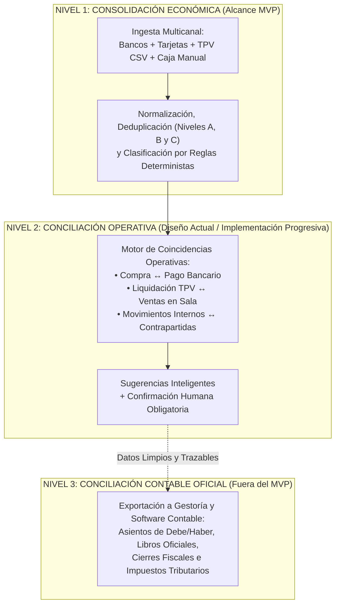

# 00 - Resumen Ejecutivo: Especificación Funcional y Técnica del Hub Económico y Módulo Extractos (Fase 1)

## 1. Naturaleza y Propósito de la Especificación

El presente documento funda el marco de diseño funcional y técnico para la primera versión operativa del **Hub Económico-Financiero** y del **Módulo de Extractos** de **Taquería El Criollo / Vegen Digital SL**, constituyendo el entregable principal de la **Fase 1** de reingeniería evolutiva.

En estricta sujeción a los dictámenes de auditoría previa (Fase 0 y Fase 0.5), esta especificación se articula exclusivamente sobre labores de **análisis, diseño arquitectónico y documentación**, absteniéndose deliberadamente de emitir código, crear tablas mecánicas o alterar servicios activos, preservando inalterado el entorno de producción del restaurante bajo la tutela de la **Regla de Oro de Continuidad Operacional**.

---

## 2. Objetivo de Negocio y Límites del Sistema

El propósito directivo del Hub Económico consiste en construir para **Taquería El Criollo** una visión económica, operativa y financiera completa, centralizada y verificable de su flujo de caja y rentabilidad comercial, vinculando de manera relacional transacciones dispersas originadas en el servicio HORECA en sala y en la administración central.

> **ALCANCE Y EXCLUSIÓN DECLARATORIA (`HECHO VERIFICADO` / `REQUISITO TÉCNICO`):**
> Se advierte, reitera e instruye que el sistema diseñado **NO TIENE POR OBJETO SUPLIR, SUSTITUIR, INVALIDAR NI REEMPLAZAR A:**
> 1. El terminal de punto de venta físico y oficial operativo en sala (**TPV Last.app**).
> 2. El software o sistema de facturación oficial certificado por las normativas tributarias.
> 3. El programa o software contable de uso institucional y legal en el negocio (ej. Holded, Quipu o equivalentes).
> 4. La asesoría fiscal, contable, mercantil y jurídica especializada del restaurante.
> 5. Los libros contables y tributarios oficiales mandatados por el Estado y el Plan General Contable (PGC).
>
> El Hub opera como un sistema transaccional de inteligencia y conciliación preparatoria que recopila, clasifica y estructura la información para la toma de decisiones directivas y facilita la exportación limpia hacia los auditores y gestores fiscales.

---

## 3. Fuentes Iniciales del Ecosistema

El diseño integra y vincula de forma transaccional información procedente de cinco canales transaccionales verificados en el diagnóstico documental:

| Fuente de Información | Detalle y Origen | Estado de Evidencia |
| :--- | :--- | :--- |
| **1. Cuentas y Tarjetas Bancarias** | 2 cuentas bancarias en BBVA, 1 tarjeta BBVA, 1 cuenta en Banco Sabadell y 1 tarjeta Sabadell (muestras ubicadas en `input-samples/extractos/`). | `HECHO VERIFICADO` |
| **2. Histórico Consolidado** | Libro de Excel consolidador en `input-samples/extractos/Planilla Movimientos - Consolidado.xlsx`, usado como fuente de clasificaciones históricas. | `HECHO VERIFICADO` |
| **3. Reportes de Ventas (Last.app)** | Importación manual en el MVP de reportes de venta en formato CSV descargados del TPV (ante la inoperancia actual de API oficial). | `INFERENCIA` / `RECOMENDACIÓN` |
| **4. Movimientos Manuales y Efectivo** | Registro auditado de cobros, gastos y retiros en efectivo o caja que no dejan rastro electrónico bancario pero impactan el saldo. | `REQUISITO TÉCNICO` |
| **5. Compras e Insumos HORECA** | Catálogo de pedidos y proveedores administrados en la herramienta operativa `EC_pedidos` y almacenes de cocina. | `HECHO VERIFICADO` |

---

## 4. Estructuración en Tres Niveles de Conciliación

Para evitar la confusión entre el control operativo diario y la contabilidad estricta, la especificación divide el procesamiento en tres fronteras analíticas:

1. **Nivel 1 — Consolidación Económica (`INCLUIDO EN MVP`):** Recopilación, depuración, deduplicación e identificación unificada del 100% de los flujos monetarios entrantes y salientes del negocio, aportando visibilidad directa del efectivo y saldos bancarios.
2. **Nivel 2 — Conciliación Operativa (`DISEÑO EN FASE 1 / APLICACIÓN PROGRESIVA`):** Vinculación lógica entre documentos operativos (pedidos, facturas de proveedores, liquidaciones de TPV en tarjeta) y los apuntes de salida o entrada en bancos, operando bajo un esquema de sugerencia y verificación por el administrador.
3. **Nivel 3 — Conciliación Contable Oficial (`FUERA DEL ALCANCE MVP`):** Generación de asientos tributarios formales con asignación de cuentas del Plan General Contable (Debe/Haber), amortizaciones, liquidación de impuestos y presentación oficial; esta responsabilidad continuará delegada al gestor contable a partir de los paquetes exportados por la plataforma.

---

## 5. Arquitectura de Dominio y Horizonte de Servicio

El diseño en la presente Fase 1 se concentra de forma exclusiva y soberana en un **único negocio local (Single-Tenant: Taquería El Criollo)**. Conforme a las recomendaciones de la Fase 0.5, el modelado del esquema se realiza con un alto grado de normalización y abstracción (mediante el concepto genérico de `contraparte` y adaptadores transaccionales por origen) para **evitar bloqueos estructurales futuros en caso de una eventual comercialización SaaS (Multi-Tenant)**, pero sin introducir complejidad en el desarrollo inicial ni imponer tablas organizacionales interempresa en el MVP.

---

## 6. Normativa de Etiquetas de Evidencia y Control

En cumplimiento de las 16 cláusulas obligatorias y el control de calidad de la Fase 0.5, todas las afirmaciones técnicas dentro de los 18 documentos de esta especificación se clasifican según las siguientes etiquetas de rigor analítico:
* `HECHO VERIFICADO`: Dato confirmado in situ en el código, arquetipo del sistema o muestras físicas disponibles.
* `ESQUEMA PARCIAL INFERIDO`: Estructura o modelo derivado de indicios en volcados SQL o controladores en repositorios legados.
* `INFERENCIA`: Conclusión deductiva fundamentada en prácticas del sector HORECA y estructura del software actual.
* `RIESGO CONDICIONAL`: Peligro técnico, operacional o normativo latente ante una mala implementación o falta de controles.
* `RECOMENDACIÓN`: Directriz de ingeniería de software o diseño arquitectónico sugerida por el evaluador técnico.
* `DECISIÓN PROPUESTA`: Solución técnica preferente sometida a valoración del titular del proyecto.
* `DECISIÓN HUMANA PENDIENTE`: Interrogante estratégico de negocio, contable o legal que requiere resolución previa del usuario y su equipo asesor.
* `NO VERIFICABLE`: Especificación que depende de cajas negras externas, manuales propietarios o servicios de terceros no accesibles localmente.
