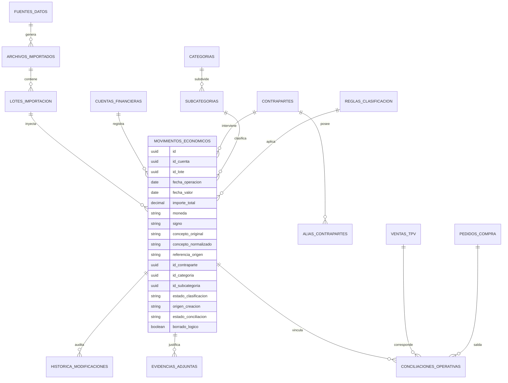

# 03 - Modelo de Datos Lógico (Agnóstico de Proveedor)

## 1. Principios de Modelado y Abstracción del Esquema

El modelo relacional que sustentará el Hub Económico-Financiero de **Taquería El Criollo** se estructura desde una filosofía de diseño **agnóstico respecto al proveedor de base de datos** (operable con idéntica solidez en PostgreSQL, MySQL 8 o motores administrados en nube como Supabase y Amazon RDS).

Inspirado por el **Control de Calidad de la Fase 0.5**, este documento prescinde intencionalmente de la creación automática de sentencias DDL físicas o migraciones en código, concentrándose en documentar de forma rigurosa las entidades lógicas, sus campos esenciales, tipos condicionales, relaciones referenciales, estados invariables y controles de auditoría transaccional.

---

## 2. Diagrama Relacional de Entidades (Entity-Relationship)

---

## 3. Diccionario Lógico y Especificación de Entidades

### 3.1. Bloque de Ingesta, Cuentas y Trazabilidad de Origen
* **`FUENTES_DATOS`:** Cataloga las pasarelas y entidades emisoras operadas en el restaurante.
  * *Campos esenciales:* `id` (UUID), `codigo_referencia` ("BBVA_CTA_1", "SAB_TARJ_1", "LAST_CSV", "CAJA_SALA"), `tipo_fuente` ("BANCO", "TARJETA", "TPV", "CAJA", "MANUAL"), `activo` (Boolean), `fecha_creacion`.
* **`CUENTAS_FINANCIERAS`:** Registra los instrumentos bancarios o de efectivo físicos de la empresa.
  * *Campos esenciales:* `id`, `id_fuente_datos`, `nombre_comercial` ("Cta. Sabadell", "Caja Sala"), `iban_cc` (Opcional cifrado), `moneda` (ISO 4217, defecto "EUR"), `saldo_actual`, `fecha_actualizacion`, `activo`.
* **`ARCHIVOS_IMPORTADOS`:** Custodia el registro inmutable y la evidencia binaria de todo documento subido (Nivel A de deduplicación).
  * *Campos esenciales:* `id`, `nombre_archivo`, `extension` (".xls", ".xlsx", ".csv"), `hash_sha256` (String único), `tamano_bytes`, `id_usuario_subidor`, `fecha_subida`, `ruta_almacenamiento` (Secure Bucket/Folder).
* **`LOTES_IMPORTACION`:** Agrupa transaccionalmente las líneas procesadas conjuntamente en una sesión web.
  * *Campos esenciales:* `id`, `id_archivo_importado`, `parser_utilizado` ("SabadellXls_v1", "BbvaCsv_v2", "LastCsv_v1"), `registros_totales`, `registros_ingresados`, `registros_duplicados`, `fecha_procesamiento`, `estado_lote` ("EXITOSO", "CON_ERRORES", "REVERTIDO").

### 3.2. Bloque Central del Hub: Movimientos y Contrapartes
* **`MOVIMIENTOS_ECONOMICOS`:** Entidad universal que consolida el flujo monetario real (Nivel 1).
  * *Campos esenciales:* `id`, `id_cuenta`, `id_lote` (Opcional si es manual), `hoja_origen` (String, Nivel B), `fila_origen` (Integer, Nivel B), `datos_originales` (JSON con contenido bruto no modificado), `fecha_operacion` (Date), `fecha_valor` (Date), `importe_total` (Decimal de alta precisión), `moneda`, `signo` ("INGRESO" | "GASTO"), `concepto_original` (Text), `concepto_normalizado` (Text sin puntuación ni ruidos), `referencia_origen` (Text, ID del banco si existe), `saldo_posterior` (Decimal, cuando proceda), `id_contraparte`, `id_categoria`, `id_subcategoria`, `id_regla_aplicada`, `estado_clasificacion` ("PENDIENTE" | "SUGERIDO" | "CONFIRMADO" | "REQUIERE_REVISIÓN"), `origen_creacion` ("IMPORTACIÓN_HISTÓRICA" | "MANUAL" | "REGLA" | "HISTÓRICO" | "FUTURA_IA"), `estado_conciliacion` ("NO_CONCILIADO" | "SUGERIDO" | "PARCIAL" | "CONCILIADO" | "DESCARTADO" | "REQUIERE_REVISIÓN"), `observaciones_humanas`, `borrado_logico` (Boolean, defecto `false`), `fecha_creacion`, `id_usuario_confirmacion`.
* **`CONTRAPARTES`:** Catálogo soberano y unificado de terceros con los que opera el negocio.
  * *Campos esenciales:* `id`, `razon_social`, `nombre_comercial` ("Carnes Valderrama", "BBVA Comisiones"), `cif_nif` (String tributario), `tipo_contraparte` (Enum 10 tipos de `02-dominio.md`), `id_externo_pedidos` (Referencia FK de compatibilidad al proveedor activo en `EC_pedidos`), `activo`.
* **`ALIAS_CONTRAPARTES`:** Diccionario semántico inter-sistemas para emparejamiento automático.
  * *Campos esenciales:* `id`, `id_contraparte`, `cadena_literal` ("VALDERRAMA SL", "Cta. SAB", "BBVA MC", "RECIBO DOMICILIADO CARNE"), `origen_alias`, `fecha_alta`.

### 3.3. Bloque Taxonómico y Motor de Reglas
* **`CATEGORIAS` & `SUBCATEGORÍAS`:** Taxonomía gerencial y contable del restaurante.
  * *Campos esenciales en Subcategorías:* `id`, `id_categoria_padre`, `codigo_clasificacion` ("GASTO_MATERIA_PRIMA_CARNES"), `nombre` ("Carnes y Aves"), `descripcion`, `obligatoria` (Boolean configurable), `activa`, `orden_visual`.
* **`REGLAS_CLASIFICACION`:** Motor determinista de etiquetado automático en cliente y servidor.
  * *Campos esenciales:* `id`, `nombre_regla`, `prioridad` (Integer, 1 = máxima prioridad), `id_fuente_foco`, `condicion_campo` ("CONCEPTO" | "IMPORTE" | "BENEFICIARIO" | "SIGNO"), `operador` ("CONTIENE" | "EXACTO" | "MAYOR_QUE" | "ENTRE"), `valor_parametro` (String / JSON), `id_contraparte_destino`, `id_subcategoria_destino`, `vigente` (Boolean), `contador_ejecuciones`, `fecha_creacion`.

### 3.4. Bloque de Conciliación Operativa, Ventas TPV y Evidencias
* **`VENTAS_TPV` (Modelo Normalizado del TPV):** Almacén de comandas importadas o recibidas por red.
  * *Campos esenciales:* `id`, `id_ticket_tpv`, `fecha_hora`, `importe_bruto`, `impuestos_cobrados`, `descuentos_aplicados`, `canal_venta` ("SALA" | "DELIVERY_GLOVO" | "PARA_LLEVAR"), `medio_pago` ("TARJETA" | "EFECTIVO" | "PLATAFORMA" | "MIXTO"), `estado_ticket` ("PAGADO" | "DEVOLUCIÓN" | "ANULADO"), `id_cierre_lote`.
* **`CONCILIACIONES_OPERATIVAS` (Nivel 2):** Motor relacional N:M con soporte para desfases y comisiones.
  * *Campos esenciales:* `id`, `id_movimiento_economico`, `id_venta_tpv` (Opcional FK), `id_pedido_compra` (Opcional FK de `EC_pedidos`), `id_documento_comprobante` (Opcional FK), `importe_asociado`, `comision_retenida`, `diferencia_tolerada`, `estado_conciliacion`, `fecha_vinculacion`, `id_usuario_conciliador`.
* **`EVIDENCIAS_ADJUNTAS` & `HISTORICAL_MODIFICACIONES`:** Capa de blindaje legal y auditoría inmutable.
  * *Campos esenciales en Historial:* `id`, `id_movimiento`, `tipo_accion` ("CREACION" | "EDICION_IMPORTE" | "CAMBIO_CATEGORIA" | "ANULACION" | "BORRADO_LOGICO"), `datos_anteriores` (JSON), `datos_nuevos` (JSON), `motivo_justificado`, `id_usuario`, `marca_tiempo`.

---

## 4. Restricciones e Índices Conceptuales de Alto Rendimiento

Para afianzar la velocidad del Hub Económico en consultas comparativas mensuales e impedir cuellos de botella sin bloquear transacciones legítimas del negocio en sala:
1. **Índices de Búsqueda Frecuente (Non-Unique Indexes):**
   * Índice sobre `MOVIMIENTOS_ECONOMICOS(fecha_operacion, id_cuenta)` para agilizar reportes mensuales y flujo de caja diario en el panel preparatorio.
   * Índice sobre `MOVIMIENTOS_ECONOMICOS(estado_clasificacion, estado_conciliacion)` para filtrar instantáneamente el inventario de cobros pendientes de verificación por el administrador.
2. **Índices de Restricción de Deduplicación:**
   * Índice Único estrito sobre `ARCHIVOS_IMPORTADOS(hash_sha256)`: Previene físicamente reingresos en Nivel A.
   * Índice Único sobre `MOVIMIENTOS_ECONOMICOS(id_lote, hoja_origen, fila_origen)`: Blindaje referencial de Nivel B garantizando que ninguna celda de un mismo libro Excel exportado se duplique localmente.
3. **Regla de Borrado Lógico Inamovible (`REQUISITO TÉCNICO`):**
   * Se prohíbe el borrado físico (`DELETE SQL`) de cualquier registro bancarizado o manual en estado confirmado. Cualquier eliminación autorizada alternará la bandera `borrado_logico = true` y estampará el log transaccional inalterable en `HISTORICAL_MODIFICACIONES` con la firma y motivación del usuario interviniente.
