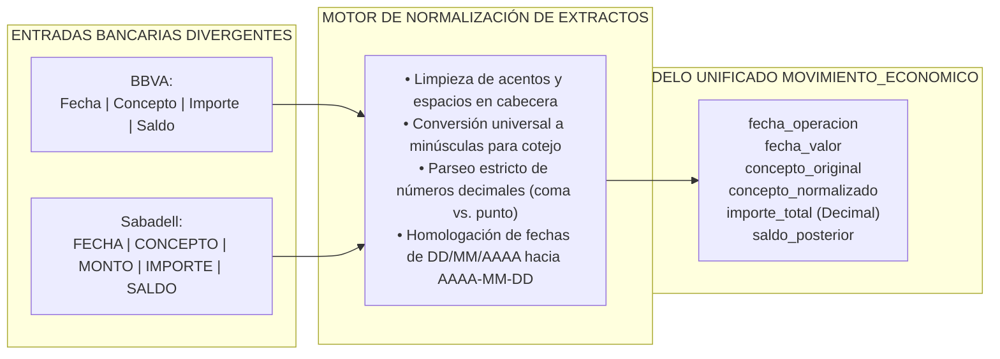

# 04 - Especificación de Importación y Parseo para Extractos Bancarios

## 1. Mapeo de Fuentes y Realidad de los Extractos Bancarios (`HECHO VERIFICADO`)

El ecosistema transaccional de **Taquería El Criollo** depende de la descarga periódica de información financiera desde dos entidades bancarias nacionales predominantes en su operativa. Durante la inspección estática del repositorio (`input-samples/extractos/`), se ha corroborado más allá de toda duda razonable la existencia de 4 muestras representativas del día a día del restaurante:

| Archivo Bancario Acreditado | Entidad y Canal | Extensión y Formato Observado | Reto Arquitectónico y Limitación Detectada |
| :--- | :--- | :--- | :--- |
| **`Cta. BBVA MC.xls`** | Cuenta Corriente BBVA | `.xls` (BIFF8 / Excel 97-2003) | Requiere librería especializada para interpretar tablas en formato binario de Excel. |
| **`Tarj. BBVA.xls`** | Tarjeta Bancaria BBVA | `.xls` (BIFF8 / Excel 97-2003) | Posibles fechas valor desplazadas respecto a la fecha del gasto en sala o compra online. |
| **`Cta. Sabadell.xls`** | Cuenta Corriente Sabadell | `.xls` / TSV empaquetado | En Sabadell, las cabeceras se presentan frecuentemente en mayúsculas sostenidas (`FECHA`, `MONTO`). |
| **`Tarj. Sabadell.xlsx`** | Tarjeta de Crédito Sabadell | `.xlsx` (ZIP XML Octet-Stream) | Formato comprimido XML inalcanzable para parsers de texto plano o clientes CSV convencionales. |

---

## 2. Reingeniería del Componente Importador (`ImportModal.jsx`)

### 2.1. Superación de la Limitación de Texto Plano (`REQUISITO TÉCNICO` / `HECHO VERIFICADO`)
* La auditoría de la Fase 0.5 dictaminó que la llamada a `Papa.parse()` contenida actualmente en el módulo de extractos del restaurante se circunscribe al tratamiento de archivos CSV o texto separado por comillas, provocando el rechazo instantáneo al intentar inyectar cualquiera de los ficheros de las extensiones `.xls` o `.xlsx`.
* **Solución Técnica Obligatoria en Fase 2:** La ingeniería refactorizará el importador web incorporando un adaptador multiformato en el navegador (utilizando paquetes comerciales y estables de JavaScript para Excel como `xlsx` o `exceljs`). Al seleccionar un documento en el modal del cliente, un enrutador inteligente detectará la extensión y firma MIME en los bytes de cabecera:
  * Si detecta `.csv` o `.tsv`: Invoca enrutamiento rápido por `PapaParse`.
  * Si detecta `.xls` o `.xlsx`: Desempaqueta y transforma el libro en memoria temporal hacia un arreglo de objetos JSON normalizados por fila preservando la fidelidad de la celda.

---

## 3. Contrato de Mapeo y Normalización de Cabeceras Bancarias

Para armonizar las divergencias acreditadas entre BBVA y Banco Sabadell con relación al uso de minúsculas y mayúsculas (`ImportModal.jsx:L4-L8`), el motor importador operará respaldado por el siguiente **Diccionario de Mapeo Interbancario**:

### 3.1. Reglas AlgorítMICAS de Normalización de Valores (`RECOMENDACIÓN`)
1. **Normalización de Fechas (Operación vs. Valor):** Las planillas del BBVA y Sabadell suelen estampar fechas en sintaxis castellana (`DD/MM/AAAA` o `DD-MM-AAAA`). El parser evaluará ambas columnas si existieran: la `fecha_operacion` corresponderá al momento en que el cocinero o gerente efectuó el pago en la tienda; la `fecha_valor` fijará el instante de liquidación bancaria del cobro. Ambas se persistirán en el modelo de base en formato canónico ISO (`AAAA-MM-DD`).
2. **Normalización Monetaria y Signo:**
   * En extractos bancarios europeos en España, las cantidades negativas corresponden habitualmente a salidas y compras (ej. `-124,50 €` o `-124.50`), mientras los abonos por cobro de mesa en tarjeta figuran positivos (`+840,00 €`).
   * El algoritmo limpiará literales monetarios (`€`, `EUR`, espacios de millares), sustituirá comas decimales por puntos y separará el importe total real en valor absoluto hacia la columna `importe_total (Decimal)` al tiempo que clasifica transaccionalmente la columna `signo` como `"GASTO"` para salidas monetarias o `"INGRESO"` para abonos a cuenta.
3. **Depuración del Concepto Normalizado:** El campo `concepto_original` preservará intocable el literal crudo del banco (ej. *"RECIBO DOMICILIADO 0012/9903 CARNICERÍA VALDERRAMA S.L."*). Para alimentar el motor de deduplicación y reglas posteriores, la propiedad `concepto_normalizado` expurgará cadenas alfanuméricas aleatorias de recibo, signos de puntuación inconstantes y pasará el resto de palabras a letras minúsculas depuradas (ej. *"carniceria valderrama"*).

---

## 4. Auditoría Transaccional en la Ingesta Bancaria

Ningún movimiento procedente de un extracto de BBVA o Sabadell ingresará al Hub Económico de forma huérfana. Toda carga por lotes vinculará obligatoriamente los siguientes cuatro controles de auditoría:
1. **Huella de Lote (`id_lote`):** Asignación de un UUID único a la importación de la sesión para posibilitar el borrado selectivo de un Excel defectuoso en bloque por el administrador mediante un solo clic en la interfaz.
2. **Posición Relacionada (Nivel B de Conciliación):** Grabación correlativa del número de pestaña (`hoja_origen`) y número de línea original (`fila_origen`), asegurando que cada movimiento en la base de datos se pueda auditar visualmente contrastando directamente contra el renglón físico de la hoja de Excel en posesión de la asesoría fiscal o del banco.
3. **Copia de Respaldo Cruda (`datos_originales`):** Persistencia en formato JSON inmutable con todos los atributos literales devueltos por el libro transmutado, impidiendo cualquier sospecha posterior de modificación o falseamiento documental durante inspecciones tributarias o verificaciones de gerencia.
4. **Alerta por Conceptos Transitorios de Entidades (`RIESGO CONDICIONAL`):** En cuentas de tarjetas bancarias, Sabadell y BBVA en ocasiones reportan movimientos preliminares como *"LIQUIDACION PROVISIONAL COMERCIO"* para sustituirlos días después en la exportación definitiva mensual por el beneficiario nominal exacto; el importador asignará de oficio a estas filas el estado `REQUIERE_REVISIÓN` en el panel preparatorio.
