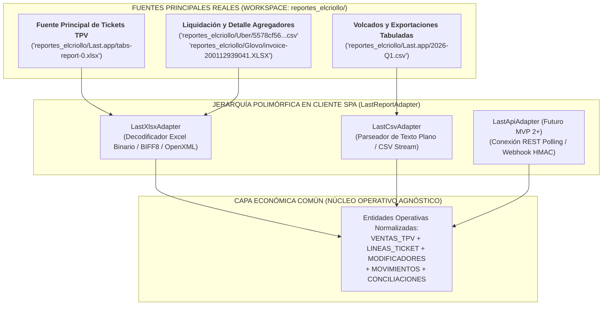

# 05 - Contrato de Importación y Adaptadores Operativos de TPV y Delivery (Last.app, Uber Eats, Glovo)

> **NOTA DE RECTIFICACIÓN OPERATIVA Y TERMINOLOGÍA ECONÓMICA (ADDENDUM FASE 1 - `HECHO VERIFICADO POR NEGOCIO`):**  
> En estricto acato a los archivos reales del espacio de trabajo autorizado (`el-criollo-ecosistema/reportes_elcriollo/`) y en coordinación con las directrices de los documentos [17-addendum-reportes-tpv-delivery.md](file:///C:/Users/Emiliano/Documents/1.%20Sistemas/El%20Criollo/el-criollo-ecosistema/el_criollo_modular/docs/fase-1-extractos/17-addendum-reportes-tpv-delivery.md) y [17-matriz-reportes-operativos.md](file:///C:/Users/Emiliano/Documents/1.%20Sistemas/El%20Criollo/el-criollo-ecosistema/el_criollo_modular/docs/fase-1-extractos/17-matriz-reportes-operativos.md), la arquitectura adopta formal y definitivamente la jerarquía **`LastReportAdapter`** (`├── LastXlsxAdapter`, `├── LastCsvAdapter`, `└── LastApiAdapter futuro`).  
> Se establece que los libros Excel reales **`reportes_elcriollo/Last.app/tabs-report-0.xlsx`** y **`tabs-report-0 (1).xlsx`** (`tabs-report`) actúan como la **fuente principal conocida** en exclusiva para los hechos operativos de: **Ticket registrado, Productos del ticket y Método declarado**, desplazando al archivo secundario `reportes_elcriollo/Last.app/Reporte Ventas y Asientos (2).xlsx` hacia la función subordinada de control de validación.

---

## 1. Misión Arquitectónica y Vocabulario Económico (No Contabilidad Oficial)

El principio cardinal que tutela este contrato es el **Aislamiento Modular de la Capa Económica Común (Regla de Oro de Vegen Digital SL)**: el modelo relacional prohíbe que el núcleo del Hub conozca o dependa de las peculiaridades propietarias con que Last.app, Uber Eats o Glovo redactan los encabezados de sus ficheros Excel o texto plano.

Cualquier conmutación futura de terminal TPV o plataformas de delivery quedará resuelta reescribiendo o incorporando un módulo adaptador en el cliente SPA, preservando intacta la trazabilidad económica. 

*Norma de terminología y alcance:* En todo este contrato se opera bajo conceptos estrictos de **movimiento económico, descuento, coste, comisión, ajuste, incidencia, clasificación, conciliación, dato fiscal informativo y preparación para gestoría**, prescindiendo en su totalidad de términos de contabilidad oficial o libros mercantiles tales como *"asiento"*, *"libro contable"*, *"cuenta patrimonial"*, *"imputación tributaria"* o *"deducción contable"*.

---

## 2. Identificación de Identificadores y Distinción Estricta

Para salvaguardar la exactitud del motor de normalización e impedir el rechazo inadecuado de filas al procesar planillas de múltiples orígenes, se impone la separación formal obligatoria entre los siguientes atributos y códigos operativos:

1. **`Tab Id`**: Identificador técnico autogenerated (UUID o alfanumérico largo) emitido internamente en la base de datos origen del sistema TPV Last.app para el registro de sesión. **Prohíbese utilizar `Tab Id` como sinónimo de código de cuenta.**
2. **`Tab Code`**: Código corto de referencia visual o número de orden atribuido en la pantalla de sala para facilitar el trabajo de camareros y cocina en barra (ej. `#C18A7`). No guarda identidad ni sustituye al atributo `Tab Id`.
3. **`código de cuenta`**: Referencia operativa del ticket del consumidor. Si en reportes externos (como bancarios o sumarios de agregadores) este valor no viene incluido o desglosado, la interfaz estipulará formalmente el estado **`NO DISPONIBLE`**.
4. **`número de factura`**: Correlativo informativo fiscal asociado a la expedición oficial del comprobante tributario en la tienda (ej. `LI2-12`). En cuentas abiertas, preliminares o tickets sin fiscalizar, este campo figura en el modelo como **`NO DISPONIBLE`**.
5. **`identificador interno`**: Cadena o código criptográfico propio asignado independientemente por plataformas externas de delivery (ej. Order UUID de Uber Eats o ID en Glovo).
6. **`posición de fila`**: Renglón o índice numérico secuencial que ocupa un registro digital en la planilla o archivo al cargarse en la interfaz.
7. **`archivo de origen`**: Ruta relativa verificable en el workspace, nombre y huella criptográfica SHA-256 del fichero objeto de importación.

---

## 3. Identidades Diferenciadas en el Conector de Ingesta

El conector `LastReportAdapter` prohíbe imponer de entrada una clave única definitiva, rígida y prematura que bloquee lecturas encimadas legítimas en un entorno hostelerio dinámico donde las mesas se reabren o modifican. En su lugar, el sistema implementa **dos mecanismos algorítmicos diferenciados y funcionalmente separados**:

### 3.1. Identidad de Fila Importada (Trazabilidad Interna de Ingesta)
Sirve estrictamente para garantizar la trazabilidad forense intralotes y reconocer reimportaciones exactas del mismo fichero Excel sin distorsionar ni truncar las cuentas contables en curso.
* *Atributos evaluados:* Aplica en exclusiva sobre **`archivo`** de origen, **`hoja`** de trabajo de Excel, **`posición`** (índice de renglón en el libro) y la suma hash de los **`valores originales`** crudos de la fila.

### 3.2. Candidato a Mismo Ticket entre Archivos (Motor de Coincidencias)
Sirve para evaluar y proponer relacionalmente qué registros provenientes de documentos o plataformas separadas representan potencialmente el mismo hecho comercial o gastronómico del turno.
* *Atributos evaluados:* Evalúa, de acuerdo a su disponibilidad individual, la conjunción flexible de: **`ubicación`**, **`número de factura`**, **`fecha y hora`**, **`código de cuenta`**, **`fuente`**, **`total`**, **`canal`** y **`método de pago`**.
* *Mandato de separación arquitectónica:* Este mecanismo **tiene prohibido depender en ningún caso de la posición de fila ni del nombre del archivo** para reconocer descargas solapadas, ya que los periodos exportados varían por completo según el día en que la gerencia extrae la planilla desde cPanel o nube.

---

## 4. Sugerencias Operativas y No Eliminación en Registros Incompletos

**Prohíbese eliminar, purgar, filtrar o silenciar durante la ingesta** los registros de Excel que carezcan de número de factura, importe positivo o método de cobro explicitado (`REQUISITO TÉCNICO`). Descartar un registro en apariencia defectuoso violenta la auditoría integral en sala y oculta eventuales incidencias con el efectivo.

Asimismo, **prohíbese confirmar o clasificar de manera automática y definitiva** la naturaleza comercial del registro. Todo apunte atípico o carente de cobro estándar se incorporará al repositorio analítico sin alterar saldos inmediatos en caja o banco, asignándole un **estado de sugerencia** conforme al dictamen determinista de lectura:

* **`POSIBLE_CUENTA_CERO`**: Asignado a cuentas leídas con total monetario igual a 0.00 sin línea pagada positiva. Sugiere sesión de barra abierta sin consumo final de comensal.
* **`POSIBLE_ANULACIÓN`**: Asignado ante comandas donde el atributo de reembolso equipara al importe tarifado, sugiriendo una cancelación por cocina prior de cobro.
* **`POSIBLE_INVITACIÓN`**: Asignado ante consumos completos dotados de un descuento aplicable del 100%, sugiriendo atención o cortesía autorizada de gerencia.
* **`POSIBLE_PRUEBA`**: Asignado a operaciones en ventana técnica o con cobros simbólicos de test en el datáfono.
* **`INCOMPLETO`**: Asignado ante celdas que por error en la exportación muestren en blanco simultáneamente su fecha de activación o su importe total monetario, segregándolo a cuarentena de revisión web.
* **`REQUIERE_REVISIÓN`**: Alerta directiva en portada de consola. Se gatilla si una comanda muestra importe total positivo sin factura ni instrumento de cobro declarado, prohibiendo su pase al Nivel 2 hasta que sea inspeccionada.

> **MANDATO DE SUPERVISIÓN HUMANISTA EN SALA:**  
> **Solo la revisión humana cualificada (gerente, titular o administrador) posee potestad facultativa en la interfaz web para convertir una sugerencia analítica en una clasificación confirmada.**

---

## 5. Parseo y Preservación de Productos y Modificadores en Celda Textual

En los volcados reales `reportes_elcriollo/Last.app/tabs-report-0.xlsx` y `tabs-report-0 (1).xlsx`, el campo observada bajo el encabezado `productos` articula en una sola celda tabular una jerarquía textual multi-línea estructurada mediante saltos e indentaciones (`HECHO VERIFICADO POR NEGOCIO`).

### 5.1. Siete Metadatos Obligatorios de Preservación
Para proteger ante la gestoría externa la cadena forense de evidencia mercantil, el parser web `LastXlsxAdapter.parseProductsCell` preservará en el modelo transaccional y su historial de auditoría de forma innegociable **siente (7) atributos de trazabilidad y preservación de lectura**:
1. **`texto original`**: Copia literal e intacta de la cadena multilineal extraída de la celda de Excel.
2. **`líneas originales`**: Vector preservado renglón a renglón.
3. **`orden`**: Número secuencial del renglón dentro de su propia celda origen.
4. **`indentación observada`**: Magnitud real y recuento literal de espacios o tabulaciones al frente del renglón.
5. **`resultado parseado`**: Mapeo lógico en memoria separando ítems principales y extras gastronómicos.
6. **`errores`**: Declaración expresa de cualquier ruptura, carácter ilegible o anomalía estructural en el texto.
7. **`versión del parser`**: Número de revisión del script decodificador web en curso.

### 5.2. Tolerancia Arquitectónica ante Indentación y Formatos Variables
**Prohíbese asumir por defecto o presuponer en código que la indentación para modificadores o extras gastronómicos constará invariablemente de cuatro espacios exactamente.** El decodificador integrará tolerancia robusta frente a variaciones tipográficas tales como:
* Espacios variables de indentación;
* Tabuladores (`\t`);
* Líneas vacías en medio del bloque;
* Modificadores en texto carentes de cantidad frontal (sin prefijo numérico);
* Precios opcionales y recargos monetarios explicitados con símbolos variados;
* Combos promocionales o agrupaciones de menús en una sola comanda;
* Productos con descripción multilineal extensa;
* Caracteres especiales de codificación o tipografía especial;
* Formato desconocido no conforme con los patrones tipográficos convencionales.

*Protocolo ante irresolución de jerarquía:* Si el analizador web enfrenta una celda cuya jerarquía de dependencia entre platillo y extra **no pueda determinarse fehacientemente**:
* **Prohíbese descartar, recortar o suprimir el contenido;**
* **Debe conservarse inalterado el texto original capturado;**
* Asignará a la línea la etiqueta disciplinaria de estado: **`PARSEO_PARCIAL`** o **`REQUIERE_REVISIÓN`** en el módulo operativo.

---

## 6. Mantenimiento y Preservación Ante Pagos Mixtos

Ante una orden del TPV saldada en tienda mediante una combinación simultánea de instrumentos de cobro en mostrador y cuya celda en `tabs-report-0.xlsx` o reportes asociados exprese dicha multiplicidad (por ejemplo, cobro combinado en efectivo y tarjeta bancario) pero omita detallar los importes numéricos parciales aportados en cada medio, el conector aplicará sin excepción el siguiente protocolo preservador:

1. **Conservará íntegro el texto original** de la celda de cobro sin manipular su literalidad.
2. **Registrará los métodos detectados** en el vector analítico transaccional (ej. `["EFECTIVO", "TARJETA"]`).
3. **Marcará obligatoriamente la transacción bajo el estado `DESGLOSE_NO_DISPONIBLE`**, protegiendo el cierre contable del turno.
4. **Prohíbese inventar importes parciales:** Bajo ningún motivo el algoritmo calculará mitades aritméticas ficticias ni estimará proporciones arbitrarias para fraccionar la suma del cobro.
5. **Permitirá y habilitará la revisión posterior** por parte de la gerencia en sala al cotejar sus tiques del datáfono físico de Banco Sabadell con las sumas contadas en el cajón de efectivo.
