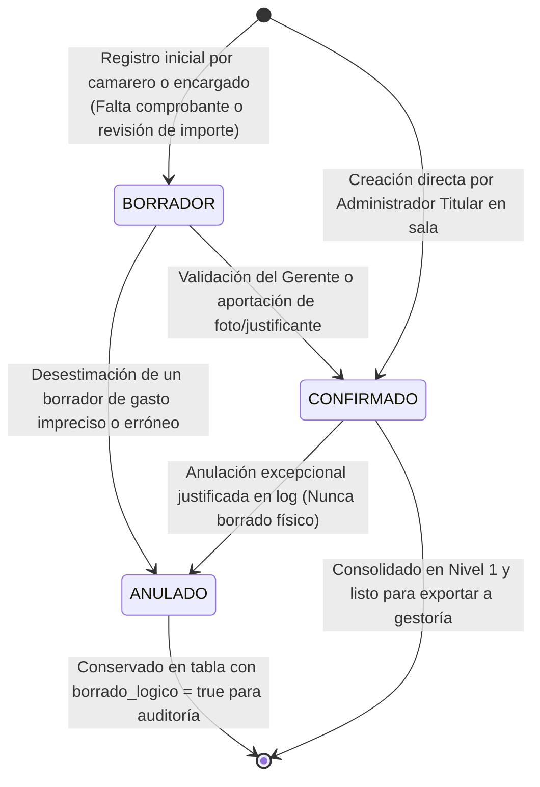

# 06 - Gestión de Movimientos Manuales, Efectivo y Auditoría Operativa

## 1. Naturaleza y Propósito del Registro Manual en HORECA

En la operación ordinaria de **Taquería El Criollo**, una fracción indispensable de los cobros y desembolsos cotidianos acontece al margen de los circuitos electrónicos bancarios o del datáfono en tarjeta. Las reparaciones urgentes en la sala, compras expresas de insumos faltantes en el mercado local con dinero en metálico, el pago de propinas al personal o la inyección de fondo de caja (caja chica), exigen una puerta de entrada segura y auditada en el Hub Económico-Financiero.

El presente documento estipula las garantías funcionales y transaccionales que gobiernan el ciclo de vida del **Movimiento Manual (`movimiento_manual`)**, asegurando veracidad e impidiendo fugas ilegítimas o discrepancias contables inexploradas.

---

## 2. Tipología y Atributos Obligatorios del Asiento Manual (`REQUISITO TÉCNICO`)

El sistema admitirá y tipificará unívocamente la siguiente gama de ocho operaciones ajenas a los archivos bancarios:
1. **Gastos en Efectivo:** Compras operativas en tienda liquidadas con el efectivo disponible de la caja (ej. reposición urgente de limones o hielo).
2. **Ingresos en Efectivo:** Cobros por banquetes o adelantos de eventos depositados físicamente en caja fuera del TPV.
3. **Pagos Informales o Excepcionales:** Abonos de mensajería rápida, reparaciones de cerrajería o plomería en sala que emiten nota de servicio o recibo simplificado en mano.
4. **Movimientos de Caja:** Arreglos, conteos periódicos de efectivo y traspasos entre la caja del comedor y la caja fuerte del almacén.
5. **Ajustes y Mermas de Cierre:** Explicación formal de diferencias de arqueo al cierre del turno diurno o nocturno en sala.
6. **Aportaciones de Capital o Socios:** Inyección extraordinaria de circulante temporal al restaurante proveniente del patrimonio de la gerencia o socios para cubrir eventualidades.
7. **Retiradas de Caja o Depósitos Bancarios:** Extracción supervisada del efectivo acumulado durante la semana en el establecimiento con destino al ingreso presencial en ventanilla en las cuentas bancarias BBVA o Sabadell.
8. **Otros Movimientos Autorizados:** Categoría de respaldo para partidas transaccionales aprobadas por la gerencia general con observación expresa.

### 2.1. Estructura Estricta del Registro Manual
Para garantizar rigor de auditoría y evitar apuntes ambiguos o incompletos, toda alta manual exigirá indefectiblemente el relleno de los siguientes atributos relacionales:
* **`Usuario responsable:`** Identificador criptográfico e irrevocable de la sesión activa en el sistema (ej. Gerente de Sala / Encargado de Turno).
* **`Fecha y hora de creación:`** Marca temporal inmutable del sistema que atestigua cuándo se ejecutó el ingreso informático en la plataforma.
* **`Motivo y justificación detallada:`** Campo de texto descriptivo (mínimo de longitud configurable) explicando con nitidez la razón del movimiento, proveedor interviniente o circunstancia de sala.
* **`Origen monetario o destino:`** Asignación explícita de la cuenta patrimonial afectada (ej. `Caja Sala`, `Caja Chica Almacén` o cuenta bancaria receptora del depósito).
* **`Evidencia o documento adjunto (Opcional en alta / Recomendado en cierre):`** Subida de comprobante gráfico (fotografía tomada desde el teléfono al recibo de caja, ticket en papel o factura simplificiada en PDF).
* **`Historial de modificaciones:`** Trazabilidad transaccional en la tabla de log `HISTORICAL_MODIFICACIONES`.
* **`Estado de revisión y confirmación:`** Rótulo invariable que gobierna el ciclo de validación del gasto en la plataforma.

---

## 3. Ciclo de Vida del Movimiento Manual y Control de Estados

El diseño rechaza conceder a cualquier operador la potestad de eliminar información patrimonial a su arbitrio. Se estipula un flujo de estados con **inmutabilidad transaccional en producción**:

### 3.1. Diferenciación Tríada de Estados (`HECHO VERIFICADO` / `REQUISITO TÉCNICO`)
1. `BORRADOR (DRAFT)`: Estado preparatorio temporal donde un empleado anota un gasto veloz de caja en la tablet de cocina, a la espera de adjuntar el recibo o de que el gerente supervise el importe. No repercute firmemente en el saldo consolidado oficial del panel económico principal hasta su aprobación.
2. `CONFIRMADO (CONFIRMED)`: Asiento monetario legitimado transaccional e plenamente funcional dentro de la conciliación operativa. Aporta o resta efectivo del balance general e impacta al instante sobre las gráficas de margen y proveedores.
3. `ANULADO (VOIDED)`: Movimiento transaccional revocado por error de tipeo o cancelación posterior de compra en mercado. El sistema preserva la fila en la tabla para toda la eternidad con el campo `borrado_logico = true`, congelando su importe a cero en el balance calculable y adjuntando en el log la motivación escrita por el supervisor.

---

## 4. Flujo Seguro de Alta, Edición y Autorización

### 4.1. Prohibición Absoluta de Borrado Destructive sin Registro (`REQUISITO TÉCNICO`)
* Bajo ningún supuesto técnico, usuario con rol de administrador o superusuario podrá ejecutar una sentencia física de borrado (`DELETE` en SQL) sobre un movimiento manual en la plataforma una vez haya entrado al circuito contable de sala.
* Toda rectificación sobre una cifra confirmada (ej. cambiar un gasto cargado por error de €50,00 a su importe auténtico de €5,00) activará la rutina en segundo plano y estampará en la tabla `HISTORICA_MODIFICACIONES` un registro indeleble con las columnas: `id_movimiento`, `tipo_accion = "EDICION_IMPORTE"`, `datos_anteriores = {"importe": 50}`, `datos_nuevos = {"importe": 5}`, `id_usuario = <SESSION_ID>`, y `marca_tiempo`.

### 4.2. Autorización por Roles en Sala (`RECOMENDACIÓN`)
* **Rol Operador / Encargado:** Facultado para abrir apuntes en efectivo bajo el estado `BORRADOR` o inscribir cobros de gastos menores en caja sala hasta un umbral máximo programable (ej. €100,00 por jornada diaria).
* **Rol Administrador Titular / Gerencia:** Autorizado en plenitud para confirmar borradores, editar importes aportando causa legítima en el cuadro justificado, realizar traspasos consolidados de efectivo al banco y decretar el paso al estado `ANULADO` en los apuntes erróneos, custodiando así la transparencia en la tesorería de Taquería El Criollo.
