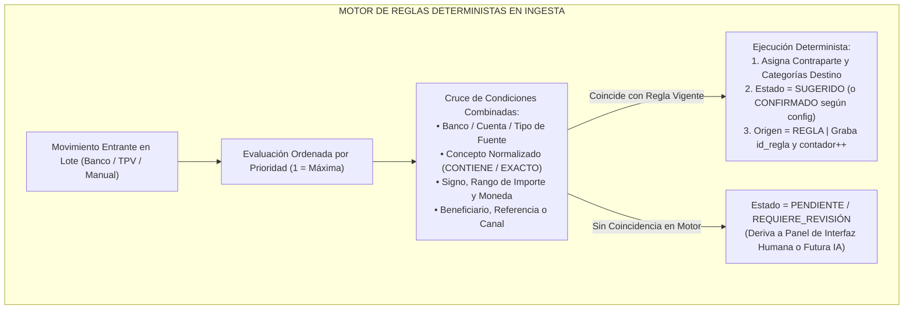
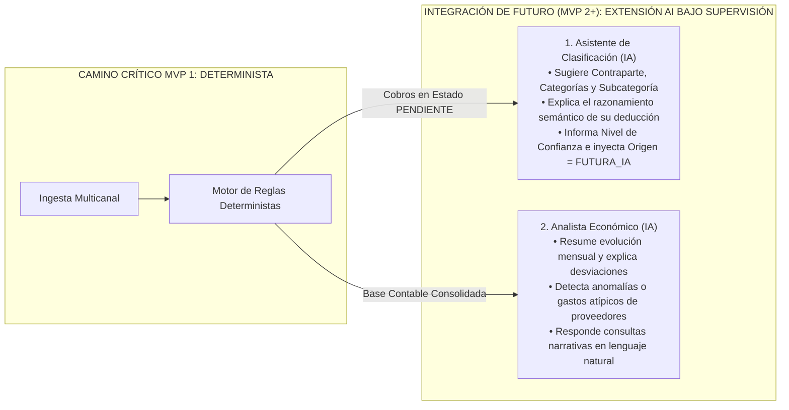

# 07 - Motor de Clasificación, Taxonomía de Subcategorías y Reglas Deterministas

## 1. Mapeo y Atributos Universal de Clasificación

El Hub Económico de **Taquería El Criollo** reemplaza las listas estáticas de clasificación desordenadas por un modelo relacional de etiquetado estructurado en capas. Todo movimiento económico (bancarizado, importado de Last.app por CSV o cargado manualmente en caja) albergará en su esquema de datos los diez atributos obligatorios de trazabilidad de su categorización:
1. `Contraparte`: Asignación del interviniente (Proveedor, Banco, Empleado, Administración, etc.).
2. `Categoría`: División contable gerencial de alto nivel en el menú o tesorería.
3. `Subcategoría`: Desglose granular especializado y dimensionado para el control analítico.
4. `Estado de Clasificación`: Posición en la secuencia transaccional del dato (`PENDIENTE`, `SUGERIDO`, `CONFIRMADO`, `REQUIERE_REVISIÓN`).
5. `Origen del Etiquetado`: Canal programático o humano de asignación (`IMPORTACIÓN_HISTÓRICA`, `MANUAL`, `REGLA`, `HISTÓRICO`, `FUTURA_IA`).
6. `Regla Aplicada (`id_regla`)`: Huella relacional al motor determinista responsable del emparejamiento por defecto.
7. `Confianza de Sugerencia`: Nivel probabilístico o certeza algorítmica del emparejamiento transitorio (Alto, Medio, Bajo).
8. `Usuario Confirmador`: Identificador de la cuenta directiva u operario que refrendó formalmente la clasificación en el panel.
9. `Fecha de Confirmación`: Marca temporal exacta de la validación contable de sala.
10. `Observaciones de Clasificación`: Anotación adicional aclaratoria para casos especiales ante la gestoría contable.

---

## 2. Taxonomía Granular: Diseño y Gestión de Subcategorías

La subcategoría constituye una dimensión innovadora incorporada para que el restaurante analice con alta precisión qué materia prima o servicio presiona sus costes operativos sin duplicar cuentas generales (ej. dentro de la categoría general de *"Materia Prima Alimentos"*, clasificar con subcategorías separadas *"Carnes y Aves"*, *"Verduras y Frescos"*, *"Tortillas y Maíz"* y *"Lácteos y Quesos"*).

### 2.1. Arquitectura Taxonómica (`REQUISITO TÉCNICO` / `RECOMENDACIÓN`)
* **Jerarquía Estricta:** Toda subcategoría colgará invariablemente como dependiente de una única categoría padre mediante clave foránea en base de datos (`id_categoria_padre`), impidiendo incoherencias lógicas en el sistema (ej. asignar *"Tortillas y Maíz"* dentro de *"Gastos de Gestoría y Asesoría Legal"*).
* **Obligatoriedad Configurable:** Para ciertas categorías generales sensibles en la hostelería (ej. Compras de Insumos), la gerencia podrá conmutar la bandera `obligatoria = true`. Si un movimiento recae en dicha categoría y el operador deja vacía la subcategoría, el asiento conservará automáticamente el estado de clasificación `REQUIERE_REVISIÓN`, impidiendo archivar un gasto incompleto antes de enviar el paquete a contabilidad.
* **Ciclo de Activación e Inactivación:** Se prohíbe eliminar subcategorías que cuenten con movimientos en el historial del negocio. Cuando el restaurante deje de servirse de un proveedor o ingrediente, el administrador aplicará `activa = false`. El término dejará de ser seleccionable para nuevas importaciones, pero preservará intacto su nombre y sumatorio en los reportes analíticos del pasado.
* **Orden y Mapeo Histórico (`HECHO VERIFICADO`):** Al procesar en la Fase 3 el libro Excel consolidado `Planilla Movimientos - Consolidado.xlsx`, un diccionario de mapeo transpondrá automáticamente los conceptos libres históricos del restaurante hacia las flamantes parejas ordenadas de Categoría/Subcategoría aprobadas al iniciar el sistema.
* **Proceso de Definición Humana (`DECISIÓN HUMANA PENDIENTE`):** No se impone desde el código una taxonomía rígida o inamovible de cocina. Al desplegar el MVP, el administrador titular del local y su asesoría fiscal validarán en el panel de configuración inicial el catálogo normativo de subcategorías a operar.

---

## 3. Motor de Reglas Deterministas en el Camino Crítico

Para que el etiquetado cotidiano no consuma tiempo manual de los encargados, el Hub implementa en el camino crítico transaccional un motor determinista y auditable de **Reglas de Clasificación (`REGLAS_CLASIFICACION`)**.

### 3.1. Funcionalidades Avanzadas del Motor Determinista (`REQUISITO TÉCNICO`)
* **Prioridad y Resolución de Conflictos:** Las reglas ejecutan su evaluación ordenadas de menor a mayor por su campo `prioridad` (1 es la regla rey de máxima precedencia). Ante un conflicto donde dos reglas distintas concuerden con un mismo cobro en banco (ej. una regla genérica para *"BBVA"* y una específica para *"COMISION TARJETA BBVA"*), el sistema aplicará en firme y en tiempo constante la de mayor prioridad e interrumpirá la evaluación, estampando la auditoría e incrementando `contador_ejecuciones`.
* **Vigencia Temporal y Prueba Previa (Sandbox):** Antes de guardar o modificar una regla en el panel directivo, la interfaz incorpora el botón transaccional **"Probar Regla (Simulador)"**. Esta rutina contrastará en seco la expresión de búsqueda contra los últimos 500 movimientos preexistentes en la base de datos sin alterar ningún registro, arrojando en pantalla un resumen con los cobros que serían clasificados con la configuración propuesta y confirmando el resultado esperado al usuario antes de guardarla.
* **Ejecución Masiva Controlada y Reversión:** Tras dar de alta una nueva regla, el sistema ofrecerá ejecutar una barrida retroactiva controlada en lote sobre todos los movimientos que permanezcan con estado `PENDIENTE` o `SUGERIDO`. En caso de verificar en el panel un impacto inadecuado sobre registros del mes, el botón de auditoría **"Revertir Ejecución Masiva"** deshacerá al instante las clasificaciones adjudicadas por dicha regla devolviéndolas a su estado primitivo sin dejar rastros erróneos ni duplicados.

---

## 4. Puntos de Extensión para Inteligencia Artificial Generativa (IA)

Con el fin de preservar el determinismo técnico y la inmutabilidad contable, la **Inteligencia Artificial Generativa no se implementa en el camino crítico del MVP obligada para clasificar al vuelo ni interferir con la ingesta habitual del dinero en sala**. 

No obstante, en coherencia con una arquitectura moderna escalable y preparada para el futuro de la hostelería inteligente, la estructura de la base de datos y de la API web reserva puntos limpios de integración modular de lectura para desplegar en el **MVP 2+** dos agentes especializados bajo supervisión estricta:

### 4.1. Garantías de Control y Restricciones del Módulo IA (`REQUISITO TÉCNICO` / `RIESGO DE SEGURIDAD`)
Tanto el *Asistente de Clasificación* como el *Analista Económico* operarán subordinados de forma irrevocable al siguiente manifiesto de protección transaccional en el restaurante:
1. **Inalterabilidad del Dato Confirmado:** Prohibido que un agente de IA modifique, altere u sobreescriba una contraparte, categoría, importe o cuenta en cualquier movimiento económico cuyo estado sea `CONFIRMADO` por intervención humana previa o consolidación por regla soberana.
2. **Prohibición de Asesoría Contable Oficial:** Los dictámenes en texto natural devueltos por el Analista Económico exhibirán obligatoriamente un rótulo aclaratorio indicando su naturaleza orientativa e inteligencia de datos HORECA, negando valor jurídico o contable tributario y remitiendo en exclusiva a la gestoría o contable oficial del negocio ante consultas de impuestos legales.
3. **Respeto Estricto a Datos Estructurados:** La IA consultará y argumentará sus respuestas alimentándose únicamente de tablas relacionales, esquemas agregados en JSON limpios o consultas parametrizadas verificables en la base de datos consolidadas de la empresa.
4. **Trazabilidad Tecnológica Obligatoria:** Cuando el asistente de IA sugiera una subcategoría a un gasto que el motor determinista dejó en `PENDIENTE`, estampará en la fila la etiqueta de origen `"FUTURA_IA"`, registrará en log la versión del modelo evaluador invoked (ej. `Model_v1.4`), el texto del razonamiento lógico y dejará el movimiento en estado `SUGERIDO`, requiriendo la revisión y clic confirmatorio de sala.
5. **Privacidad de Datos y Desactivación Instantánea:** Los módulos integrarán un interruptor general en el panel de configuración directivo llamado **"Inhabilitar Asistentes IA"**, que desconectará por completo estas llamadas en milisegundos. Asimismo, la arquitectura saneará criptográficamente contraseñas, números de cuenta en bruto e identidades de camareros con protección laboral antes de remitir un solo byte hacia conectores de inferencia externos.
