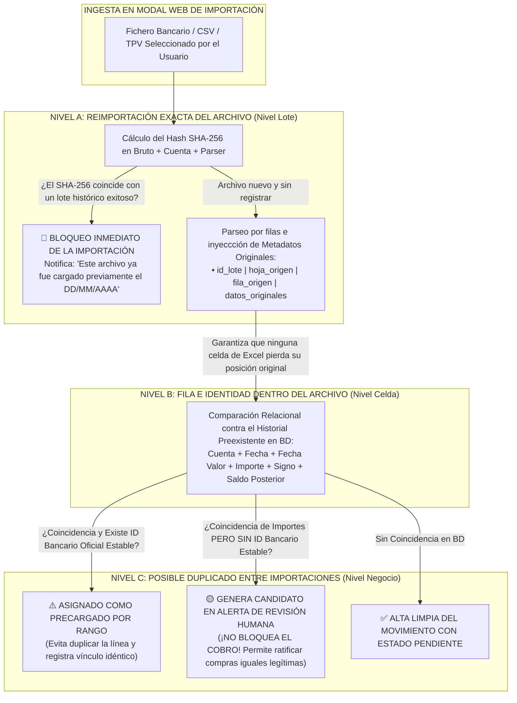

# 08 - Motor y Tres Niveles del Sistema de Deduplicación

## 1. Fundamentación Operativa de la Deduplicación HORECA

En el ejercicio cotidiano del restaurante **Taquería El Criollo**, los operadores y administradores manipulan en reiteradas ocasiones archivos del banco descargados sin una estricta coherencia temporal de fechas, solicitan cierres reiterados a la misma entidad bancaria o suben a la aplicación listas del TPV que abarcan jornadas yuxtapuestas. 

Como sentenció la auditoría documental de la Fase 0.5, pretender solucionar la deduplicación imponiendo al motor relacional de base de datos un hash único y universal calculado mecánicamente sobre el importe y la fecha, incurre en un error inaceptable para la hostelería: bloquearía compras auténticas e idénticas efectuadas al mismo distribuidor de refrescos, hielos o carne en un mismo día con tarjeta o efectivo del restaurante.

Para dotar de solidez impenetrable e inteligente al Hub Económico, la especificación de diseño orquesta el tratamiento de duplicados mediante un **Sistema Transaccional en Tres Niveles Lógicos**:

---

## 2. Desglose Estricto de los Tres Niveles de Deduplicación

### 2.1. Nivel A — Reimportación Exacta del Archivo (Nivel Fichero)
* **Objetivo Funcional:** Proteger a la base de datos contable frente al error administrativo del cajero o contable que intenta subir accidentalmente la misma planilla Excel o fichero CSV del banco Sabadell dos o más veces al panel web.
* **Mecánica de Evaluación:** En el instante en que el archivo se deposita en la zona de importación de la SPA (`ImportModal.jsx`), el cliente web calcula al instante la suma criptográfica de control en bruto (`hash_sha256`) sobre los bytes del fichero y consulta contra la tabla `ARCHIVOS_IMPORTADOS`.
* **Comportamiento Programado (`REQUISITO TÉCNICO`):** Si la huella coincide exactamente con un documento ingresado con estado `EXITOSO` en fechas precedentes, el importador bloquea la operación y despliega un cuadro informativo impidiendo saturar el libro con datos o alterar los balances consolidados. El administrador mantendrá un botón excepcional de sobreescritura habilitado si, por labores de reingeniería, hubiera actualizado las reglas de lectura de ese parser o quisiera subsanar un error.

### 2.2. Nivel B — Fila dentro del Archivo y Trazabilidad de Origen
* **Objetivo Funcional:** Preservar una radiografía inalterable del orden cronológico y físico original en que el banco o el TPV emitió cada transacción contable en el documento importado al restaurante.
* **Mecánica de Evaluación:** Cuando el adaptador para Excel o CSV itera transaccionalmente por los registros del archivo homologado, etiqueta indissoluble a cada objeto JSON transaccional con cuatro atributos inquebrantados: `id_lote`, `hoja_origen` (ej. "Cuenta Corriente Sabadell"), `fila_origen` (índice correlativo numérico 1, 2, 3... de la hoja Excel) y la columna JSON `datos_originales` con los literales sin parsear del banco.
* **Comportamiento Programado (`RECOMENDACIÓN`):** Este blindaje referencial asegura la reversibilidad total y auditable de un lote defectuoso en pocos segundos: el administrador podrá acudir al historial de importaciones del panel, seleccionar un lote con errores de formato y ordenar su reversión limpia sin tocar ni comprometer los cobros o registros generados por lotes anteriores de la misma tienda.

### 2.3. Nivel C — Posible Duplicado Entre Importaciones y Candidatos
* **Objetivo Funcional:** Conciliar con inteligencia descargas repetidas de internet o periodos mensuales solapados sin incurrir nunca en el pecado contable de amputar o rechazar un gasto de almacén o compra operativa legítimamente repetida en el día.
* **Mecánica de Evaluación:** Al parsear una línea entrante que ha superado el Nivel A y conserva su posición de Nivel B, el motor ejecuta una consulta de comparación relacional en `MOVIMIENTOS_ECONOMICOS` buscando equivalencias de: `id_cuenta + fecha_operacion + importe_total + signo + moneda`.
* **Regla de Oro de la Deduplicación en Nivel C (`REQUISITO TÉCNICO` / `RECOMENDACIÓN`):**
  * Si el banco (ej. BBVA o Sabadell) proveyó en su fichero de un **identificador bancario oficial estable, único y corroborado** (`referencia_origen`) y este ya figura asimilado en la base contable para esa cuenta, la transacción entrante se reconoce como un solapamiento verificado del libro; el motor descarta su alta y la enlaza transaccionalmente con el registro previo sin perturbar la caja de sala.
  * Por el contrario, si la exportación del banco carece de código único inmutable y **la coincidencia radica exclusivamente en la igualdad de importe monetario, signo, fecha o texto del concepto**, el sistema tiene categóricamente prohibido bloquear o descartar de forma automática la operación entrante. Procederá a registrarla marcando de oficio su estado como `REQUIERE_REVISIÓN` en la columna de clasificación e inyectando un candidato visual en la pantalla de alertas del panel transaccional con la leyenda: *"Posible duplicado detectado con el movimiento #9281 (Coincidencia de importe €65,00 y distribuidor). Verifique si se trata de un solapamiento bancario o si corresponden a dos compras operativas verídicas e idénticas en el restaurante hoy."*

---

## 3. Resolución Algorítmica de Casuísticas Obligatorias de Sala

La especificación del motor en el Hub Económico otorga un tratamiento resolutivo y probado en seco para los siete escenarios cotidianos del negocio:

| Casuística Operativa HORECA | Impacto en Sistemas Convencionales | Solución Resolutiva e Inteligente del Motor en el Hub Económico |
| :--- | :--- | :--- |
| **1. Archivos Solapados en Fecha** | El sistema duplica ciegamente los cobros o rechaza en bloque todo el segundo documento. | El Nivel C evalúa línea por línea del tramo coincidente (ej. del día 15 al 20 del mes), salta los registros idénticos que ya ostentan referencia bancaria o saldo calcado y permite continuar sin pausa con la ingesta limpia de los nuevos gastos ocurridos a partir del día 21. |
| **2. Misma Compra Repetida en el Día**| Un índice SQL restrictivo rechaza la segunda factura verídica pagada al distribuidor en metálico o con tarjeta. | Al no existir referencia bancaria única que confirme duplicidad del Excel, el Nivel C ingresa la segunda compra idéntica (€65,00 por reposición urgente de bebidas), generará un candidato precavido y autorizará al gerente a ratificar y confirmar ambas compras en sala con un clic, reflejándolas con exactitud en la contabilidad general de la empresa. |
| **3. Filas Desplazadas en Excel** | El orden de las líneas cambia en la exportación posterior por cierres automáticos trimestrales del banco, provocando duplicaciones indebidas. | El motor relacional no se guía por presunción de ordenación correlativa ciega en los ficheros; compara y discrimina al vuelo recurriendo a las claves analíticas de Nivel C (saldo posterior decreciente, fecha valor del movimiento y monto del cobro en valor absoluto) y preserva en Nivel B la posición original de cada hoja independiente. |
| **4. Conceptos Cambiantes del Banco**| Un cobro figura el lunes como *"LIQUIDACION PROVISIONAL TARJETA"* y se reimporta días después ya relleno como *"CARNICERIA VALDERRAMA SL"*, duplicando el saldo retirado en caja. | Al coincidir al centavo en cuenta bancaria, fecha valor contable, importe exacto gastado y balance de saldo decreciente tras la operación, el motor de Nivel C correlacionará ambas filas transaccionalmente y sugerirá vincular y actualizar la etiqueta provisional del banco por la leyenda nominal definitiva y real sin ocasionar duplicidad en el flujo dinerario en sala. |
| **5. Devoluciones y Abonos a Cuenta**| Una devolución parcial de un pedido a proveedor entra como positivo y desconcierta al contabilizador de gastos. | El analizador normalizador clasifica el movimiento entrante con signo contrario al gasto original (ej. Ingreso de +€45,00 por merma de carne devuelta) y transfiere su resolución de emparejamiento al motor de conciliación operativa (Nivel 2), vinculando el abono al pedido del almacén en `EC_pedidos`. |
| **6. Anulaciones Automáticas por Fallos**| Un corte eléctrico o caída de red en sala o datáfono motiva que el banco cargue y anule una operación de cobro el mismo día, engrosando los listados con partidas irrelevantes en apariencia. | Para salvaguardar la inalterabilidad de los balances bancarios decrecientes verificados en el libro del mes, las anulaciones y contracargos del banco no se suprimen de la tabla transaccional; se importan amparadas y se emparejan administrativamente en pareja dentro del panel conciliatorio de caja para neutralizar entre sí el balance en cero euros en la gráfica de resultados del establecimiento. |
| **7. Cargos Recurrentes Idénticos** | Cuotas bancarias repetidas mes a mes, gastos diarios de limpieza del local o abonos periódicos que comparten montos fijos exactos entre sí. | La divergencia evidenciada en las fechas operativas (fechados en días o meses discontinuos) disipa de inmediato en el Nivel C cualquier sospecha algorítmica de duplicidad bancaria innecesaria, permitindo que el motor determinista aplique sus reglas al instante y califique en firme el cobro bajo su categoría y subcategoría designada. |
