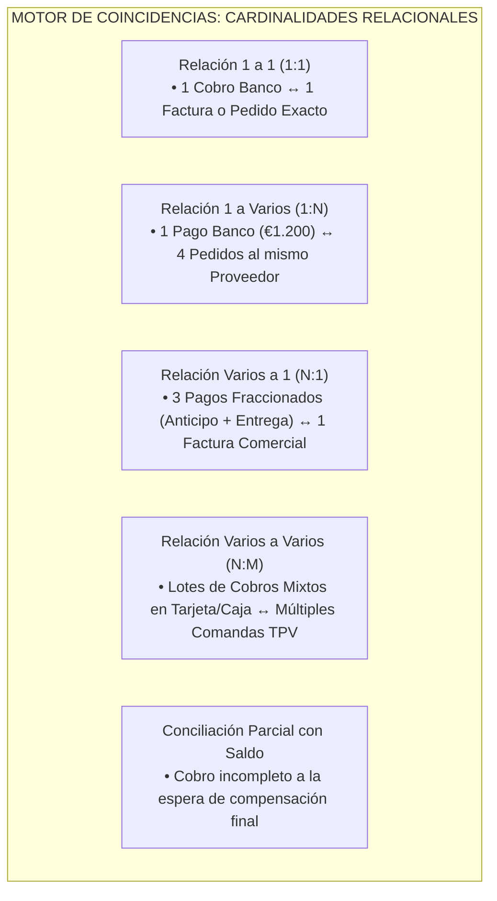

# 09 - Motor de Conciliación Operativa (Nivel 2) y Coincidencias

## 1. Misión Funcional de la Conciliación Operativa en el Hub

Mientras que el Nivel 1 (Consolidación Económica) unifica todos los apuntes transaccionales entrantes y los etiqueta taxonómicamente por reglas o intervención del operador, el **Nivel 2 — Conciliación Operativa** del Hub Económico trasciende la lectura plana para reconstruir la lógica operativa de fondo: **vincular relacionalmente cada salida o entrada monetaria con el documento operativo real de la tienda que justificó dicho cobro** (pedidos en cocina, tickets en el TPV, facturas comerciales o remesas entre cajas y bancos).

En observancia estricta a la **Metodología Vegen Digital** y al **Control de Calidad (Fase 0.5)**, este diseño se enmarca en una terminología netamente económica y enfocada a la **preparación para gestoría**, prescindiendo de conceptos propios de contabilidad oficial, tales como *"asientos"*, *"libros contables"*, *"cuentas patrimoniales"* o *"deducciones contables"*. Asimismo, la interconexión monetaria se sujeta a la tipificación de reportes reales del workspace documentada en [17-matriz-reportes-operativos.md](./17-matriz-reportes-operativos.md) y al circuito con agregadores externos estipulado en [18-delivery-uber-glovo.md](./18-delivery-uber-glovo.md).

---

## 2. Tipología Modular de Vinculaciones Relacionales

Para abarcar el abanico transaccional de un restaurante moderno y dinámico en España sin imponer una correspondencia rígida o unívoca que provoque falsos rechazos, el motor de conciliación soporta nativamente cinco cardinalidades de vinculación:

### 2.1. Funcionalidades de Ajuste, Tolerancies y Comisiones (`REQUISITO TÉCNICO`)
* **Diferencia Tolerada y Configuración por Análisis Histórico:** Prohíbese codificar en software porcentajes arbitrarios fijos de comisión o imponer ventanas rígidas inmutables para el emparejamiento temporal de cobros. **Las tolerancias monetarias ante pequeñas discrepancias o redondeos y los rangos de fechas admisibles deben ser siempre parámetros configurables dentro de la consola, y solo se podrán validar y aprobar tras realizar un análisis exhaustivo del histórico de transacciones del establecimiento.**
* **Comisiones y Tasas del Agregador o Datáfono:** En lugar de silenciar las diferencias cuando el Banco Sabadell abona la remesa nocturna de tarjetas con deducción bancaria, o cuando Uber Eats y Glovo liquidan deduciendo su tarifa comercial, el motor permite desgajar dicho diferencial hacia una categoría operativa de *"Costes de Intermediación y Comisiones de Pasarela"*, cerrando el emparejamiento sin distorsionar el importe de la venta bruta servida.
* **Preservación Obligatoria de Diferencias:** Las discrepancias que subsistan tras aplicar los parámetros configurados no podrán forzarse, sobrescribirse ni purgarse del sistema; **toda diferencia entre fuentes transaccionales deberá conservarse de manera íntegra para su posterior auditoría y revisión humana.**

---

## 3. Identidades Diferenciadas: Trazabilidad vs. Candidato en Conciliación

Para que el motor de vinculación (Nivel 2) dialogue sin interferencias con el módulo de ingesta y deduplicación (Nivel 1), la arquitectura impone formalmente una estricta separación entre dos mecanismos algorítmicos diferenciados:

### 3.1. Identidad de Fila Importada (Trazabilidad Intralotes de Ingesta)
Diseñada en exclusiva para salvaguardar el historial forense de cada importación de Excel o CSV y prevenir duplicidades por descargas idénticas accidentales. Evalúa en bloque los parámetros propios del documento digital: **`archivo`**, **`hoja`**, **`posición`** (índice de renglón) y **`valores originales`** crudos de la fila.

### 3.2. Candidato a Mismo Ticket entre Archivos (Motor de Coincidencias)
Estructurado específicamente para proponer vinculaciones entre apuntes bancarios o de delivery (ej. `reportes_elcriollo/Uber/5578cf56...csv`) y tickets originados en el mostrador del restaurante (`reportes_elcriollo/Last.app/tabs-report-0.xlsx`).
* *Atributos evaluables:* El algoritmo evaluará de forma combinada, y **únicamente según su disponibilidad real en cada archivo**, las dimensiones: **`ubicación`**, **`número de factura`**, **`fecha y hora`**, **`código de cuenta`**, **`fuente`**, **`total`**, **`canal`** y **`método de pago`**.
* *Prohibición estructural:* **Este mecanismo no debe depender en ningún caso de la posición de fila ni del nombre del archivo de origen** para reconocer descargas solapadas o coincidencias temporales, ya que dichos atributos puramente digitales varían al exportar turnos en semanas sucesivas.
* *Sin imposición de clave única definitiva:* Prohíbese imponer todavía en este estadio una clave primaria única, definitiva e inflexible; el sistema se limita a emitir **sugerencias de candidato** y **posibles coincidencias**, confiriendo exclusivamente al juicio humano del gerente en sala la potestad de confirmar la vinculación relacional entre ficheros.

---

## 4. Casos Canónicos de Conciliación Operativa en el Ecosistema

El motor gestionará en las pantallas las sugerencias conciliatorias sobre seis escenarios característicos identificados a lo largo del diagnóstico arquitectónico y las muestras del restaurante:

| Escenario de Conciliación (Nivel 2) | Entidades Operativas Intervinientes | Lógica del Motor de Coincidencias y Sugerencias Relacionales |
| :--- | :--- | :--- |
| **1. Pedido o Factura ↔ Pago en Banco** | `MOVIMIENTOS_ECONOMICOS` (Gasto Banco) ↔ Pedidos de Almacén (`EC_pedidos`) o Facturas de Proveedor. | Compares el proveedor registrado en el almacén mediante su tabla de sinónimos con el beneficiario del cobro importado en el extracto, verificando la correspondencia en euros dentro de las tolerancias configuradas tras análisis histórico. |
| **2. Ventas TPV ↔ Liquidación Datáfono**| `VENTAS_TPV` (Tickets por Tarjeta) ↔ `MOVIMIENTOS_ECONOMICOS` (Ingreso en Cta. Sabadell / BBVA). | Agrupa la facturación por tarjeta capturada en la fuente principal de tickets (`tabs-report`), contrastando el volumen bruto contra la remesa bancaria depositada con el rango de demora configurable aprobado. |
| **3. Tarjeta Bancaria ↔ Cargo en Cuenta**| `MOVIMIENTOS_ECONOMICOS` (Extracto Tarjeta Sabadell) ↔ `MOVIMIENTOS_ECONOMICOS` (Cargo Liquidación). | Concilia las compras minoristas abonadas con la tarjeta corporativa de la tienda contra el cargo que la entidad crediticia liquida a fin de ciclo sobre la cuenta matriz. |
| **4. Traspaso Interno ↔ Contrapartida**| Salida de Efectivo (`Caja Sala`) ↔ Ingreso por Depósito (`Cta. Corriente BBVA`). | Detecta los depósitos físicos de efectivo transportadas por la gerencia al banco, vinculando ambos extremos bajo la categoría de contraparte `CUENTA_PROPIA` para proteger la congruencia en la preparación para gestoría. |
| **5. Devolución ↔ Compra Original**| Gasto o Compra Precedente en Almacén ↔ Abono o Devolución inyectado en Banco. | Vincula una entrada dineraria por merma o abono comercial de un proveedor con el movimiento de compra originario, evitando distorsiones al evaluar costes culinarios. |
| **6. Efectivo en TPV ↔ Arqueo de Caja**| Tickets de Venta Pagados con Efectivo (`tabs-report`) ↔ Movimientos y Comprobante PDF (`cashbook.pdf`). | Concilia la facturación recaudada en monedas y billetes en el mostrador del TPV contra los conteos y arqueos físicos confirmados al cierre de jornada. |

---

## 5. Máquina de Estados de Conciliación Operativa (`REQUISITO TÉCNICO`)

El ciclo de vida transaccional en la conciliación de cada movimiento económico se somete de manera indeclinable a los siguientes seis estados canónicos:

1. **`NO_CONCILIADO`**: Movimiento económico de caja, banco o agregador importado y normalizado por el Nivel 1, que permanece libre y sin vincular a ningún comprobante o ticket del turno.
2. **`SUGERIDO`**: Estado transitorio en el cual el motor algorítmico propone un candidato de coincidencia tras evaluar, según disponibilidad y sin utilizar posición de fila, los campos relacionales del ticket o remesa. **No adquiere firmeza relacional ni impacta balances contables hasta no recibir la validación explícita del gerente**.
3. **`PARCIAL`**: Vinculación comercial en la cual solo se ha cubierto una fracción del importe total exigible (ej. un abono a cuenta de un proveedor), conservando legible y pendiente la diferencia residual monetaria en espera de compensación final.
4. **`CONCILIADO`**: Estado definitivo conferido una vez que el usuario verifica la coherencia entre el movimiento monetario bancario, el ticket o pedido originario y las comisiones comerciales asociadas, completando el expediente para su envío a gestoría.
5. **`DESCARTADO`**: Condición adjudicada cuando el administrador rechaza una sugerencia incorrecta o certifica que un pequeño movimiento bancario (ej. comisiones de mantenimiento o tasas del banco) carecerá de contraparte o pedido en almacén.
6. **`REQUIERE_REVISIÓN`**: Alerta prioritaria en el Panel Económico. Se activa indefectiblemente ante desajustes numéricos que superan las tolerancias configuradas o cuando existen discrepancias inexplicables entre el abono bancario y los registros transaccionales, bloqueando toda automatización hasta la intervención directa de gerencia.
