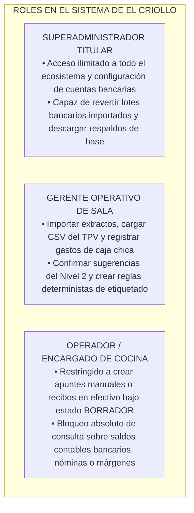
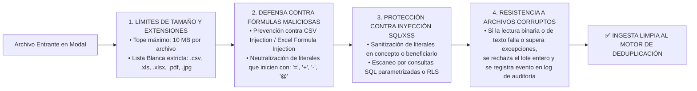

# 12 - Marco Integral de Seguridad Informática y Protección Patrimonial

## 1. Misión Directiva: Blindaje del Dato Monetario y Bancario

El Hub Económico y Módulo de Extractos de **Taquería El Criollo** manipulará por definición los activos de información más críticos del restaurante: números de cuenta bancarios (IBAN), historiales salariales de nóminas, costos reales pactados con proveedores gastronómicos y márgenes netos de caja.

El presente documento funda el **Marco Técnico de Seguridad de la Fase 1**, estructurando políticas y controles de defensa perimetral y transaccional que resguarden la confidencialidad, integridad y disponibilidad del sistema en activo, sin prejuzgar ni obligar de forma prematura al uso exclusivo de una tecnología externa transitoria.

---

## 2. Gestión de Identidades, Autenticación y Autorización

### 2.1. Comparativa Transaccional de Autenticación: Firebase vs. Supabase Auth
En obediencia a la prudencia técnica del **Control de Calidad (Fase 0.5)**, la especificación **no impone un dictamen indiscutible al elegir entre las plataformas Firebase Auth y Supabase Auth**, pasando a desglosar las dependencias operacionales de cada solución ante la dirección del proyecto:

| Criterio Operacional y Técnico | Firebase Authentication (Conectores Activos en SPA/Node) | Supabase Auth (Integrada con Servidor Relacional RLS) | Dictamen y Dependencias para el MVP en Tienda |
| :--- | :--- | :--- | :--- |
| **Estado Verificado en Código** | `HECHO VERIFICADO`: Operativo para inicio por Google en la SPA (`el_criollo_modular`) y validado criptográficamente por token en las rutas del servidor TPV (`last_API/server.js:L72`). | `INFERENCIA`: Requiere configuración en cliente web (`@supabase/supabase-js`) si se aprueba adoptar la Alternativa A como motor soberano relacional consolidador. | `DECISIÓN HUMANA PENDIENTE`: Determinar directivamente si el Hub perpetúa la emisión del token por cuenta de Firebase o transita a la gestión unificada de usuarios en Supabase. |
| **Acoplamiento Relacional (SQL)** | **Desacoplado:** El token JWT del usuario se verifica del lado de Node o Firebase, obligando a programar un middleware o función intermedio si se desea filtrar registros bancarios relacionales en la base Postgres en nube. | **Acoplamiento Total (RLS):** El ID de sesión entra integrado a las tablas del motor SQL; permite redactar políticas Row Level Security nativas (`WHERE auth.uid() = id_usuario`) para proteger cobros sin intermediarios en red. | `RECOMENDACIÓN`: Si el motor de base definitivo resultara ser Supabase (Alternativa A), la armonización hacia Supabase Auth aportará ahorros notables y evitará duplicidades. |
| **Gestión de Roles y Permisos**| **Por Custom Claims o Base Local:** Exige inyectar reclamos de seguridad al token o verificar los permisos en tablas SQL del servidor de base (nunca delegarlos de nuevo a lecturas inseguras desde `window.localStorage`). | **Por Tabla de Perfiles en DB:** Los roles (`ADMINISTRADOR`, `GERENTE`, `OPERADOR`) residen inquebrantados en una tabla relacional de perfiles vinculados firmados criptográficamente junto a las credenciales de ingreso de tienda. | `REQUISITO TÉCNICO`: En cualquiera de ambas alternativas, la lectura y verificación de roles transmutados se comprobará indefectiblemente en el servidor o motor relacional. |

### 2.2. Matriz de Control de Acceso Basada en Roles (RBAC) (`REQUISITO TÉCNICO`)
El acceso a pantallas y acciones del MVP obedecerá irremisiblemente las siguientes fronteras de autorización por roles:

---

## 3. Protección de Datos Sensibles, Archivos Privados y Secretos

1. **Datos Bancarios (IBAN y Tarjetas):** Los literales de números de cuenta o tarjetas corporativas que enlacen con BBVA o Sabadell se persistirán con las **seis cifras centrales enmascaradas** para consultas visuales por camareros o encargados (ej. `ES91 0182 **** **** **12 8840`), exponiéndose sin cifrar en pantalla pura y exclusivamente frente a cuentas provistas con el rol de `SUPERADMINISTRADOR`.
2. **Custodia de Archivos y Comprobantes Privados:** Todas las hojas de Excel bancarias subidas por el modal de importación, reportes CSV o fotografías adjuntas en recibos manuales del restaurante se preservarán dentro de **Almacenes Portadores Protegidos (Buckets Privados / Secure Blob Storage)** gobernados por políticas estrictas (ACL), impidiendo cualquier enlace público o descarga anónima por terceros desde internet sin la firma previa del token de sesión verificado.
3. **Secretos e Inmutabilidad en Git (`RIESGO DE SEGURIDAD`):** Prohíbese de forma rotunda incrustar contraseñas, claves privadas temporales (`service_role_key` en nubes o accesos directos MySQL del estilo `db_connect.php`) en los ficheros fuente o repositorios versionados en Git de Vegen Digital SL. Toda credencial correrá inyectada por variables de entorno locales de servidor (`.env.production`), custodiadas herméticamente en seco fuera del historial web del proyecto.

---

## 4. Blindaje y Validación Segura de Importaciones Web (`REQUISITO TÉCNICO`)

Dado que el Hub importará documentos generados desde sistemas externos e incontrolables (descargas de portales del banco o del TPV `Last.app`), el motor analizador instrumentará cuatro capas defensivas antes de transponer una sola celda del fichero hacia la base contable transaccional:

### 4.1. Prevención contra Inyección de Fórmulas en CSV (CSV Injection) (`REQUISITO TÉCNICO` / `RIESGO CONDICIONAL`)
* *Riesgo Operativo Detectado:* Si un atacante altera un registro nominal en el TPV o un distribuidor malicioso emite un reporte bancario con el texto `=cmd|' /C calc'!A0`, al exportarse o leerse localmente en la hoja de Excel en cliente del administrador del restaurante podría desencadenar la ejecución silenciosa y malévola de código malicioso o robo de datos (Formula Injection / Excel DDE).
* *Protocolo de Blindaje:* Al procesar y parsear las cadenas correspondientes a `concepto_original`, `concepto_normalizado`, y `beneficiario` en el cliente y servidor, el enrutador inspeccionará si el primer carácter empieza o consta del signo igual (`=`), más (`+`), menos (`-`), tabulación (`\t`), retorno (`\r`) o arroba (`@`). Si concurriera, el parser inyectará un carácter de comilla simple (') o espacio preparatorio protector al comienzo de la celda de texto, neutralizando así para siempre su ejecución como fórmula ejecutable en hojas de cálculo tributarias e impidiendo la contaminación cruzada o desinformación en el restaurante.
