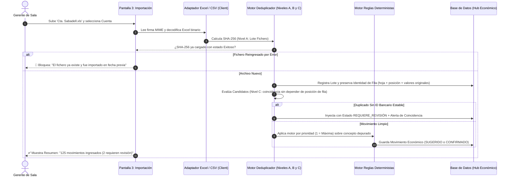
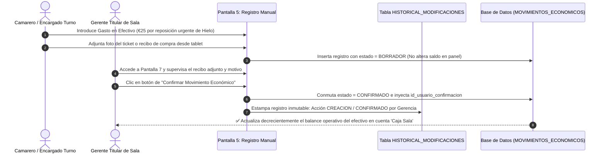
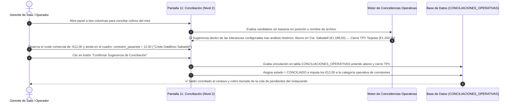
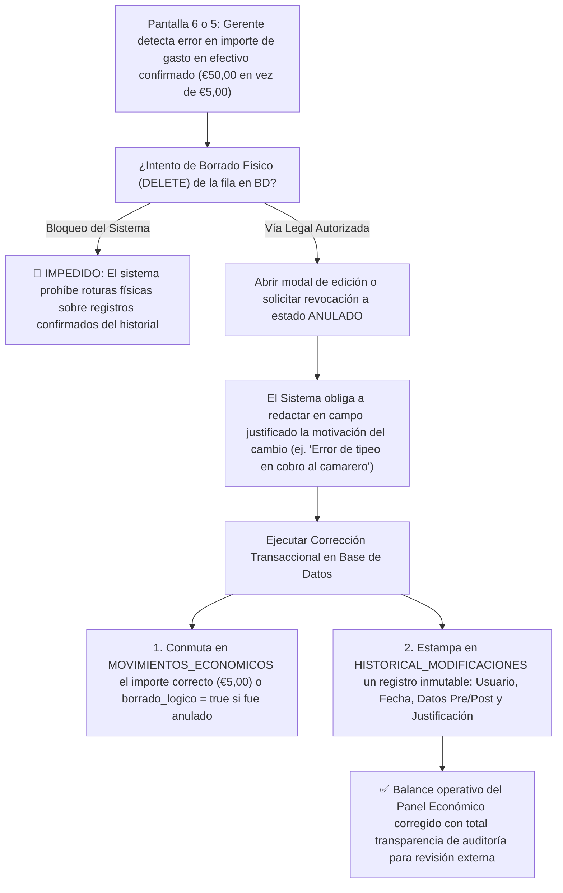
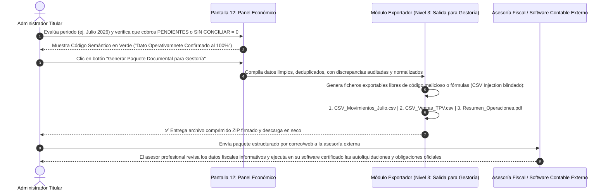

# 13 - Diseño Arquitectónico de Pantallas y Flujos Operativos (MVP)

## 1. Misión de Interfaz: Experiencia Usable para HORECA y Terminología Económica

La interfaz visual que albergará al **Hub Económico-Financiero** en la SPA maestra de **Taquería El Criollo** se concibe bajo un imperativo innegociable de usabilidad: el gerente o supervisor del restaurante debe ser capaz de consultar el flujo real de caja, importar un extracto bancario de Sabadell o conciliar una remesa de tarjetas en sala en menos de cuatro clics y desde dispositivos móviles o de escritorio interactuando en caliente.

En rigurosa sujeción a la **Metodología Vegen Digital**, el **Control de Calidad (Fase 0.5)** y los documentos directivos [17-matriz-reportes-operativos.md](./17-matriz-reportes-operativos.md) y [18-delivery-uber-glovo.md](./18-delivery-uber-glovo.md), el léxico de la aplicación descarta términos propios de la contabilidad oficial de libros mercantiles (*asientos, cuentas patrimoniales, tributación*), articulando en su lugar una terminología económica orientada a los **movimientos económicos, costes, comisiones, incidencias, conciliaciones, datos fiscales informativos y preparación para gestoría**.

El presente documento especifica el catálogo normativo integrado por **las 14 pantallas obligatorias del MVP**, detallando para cada una sus objetivos, actores autorizados, campos transaccionales y controles lógicos, complementado por diagramas Mermaid operacionales verificables.

---

## 2. Catálogo Técnico y Especificación de las 14 Pantallas del MVP

| Pantalla del MVP | Objetivo Operativo en Sala | Rol Usuario Autorizado | Campos y Componentes Clave en Interfaz | Acciones, Filtros y Validaciones LóGICAS de Estado |
| :--- | :--- | :--- | :--- | :--- |
| **1. Fuentes y Cuentas** | Supervisar inventario de cuentas bancarias, pasarelas de cobro y cajas operadas por el restaurante. | `ADMINISTRADOR`, `GERENTE` | Rótulo comercial ("Cta. Sabadell"), tipo de instrumento, moneda EUR, IBAN o cuenta enmascarado (`ES91 ****`), saldo operativo en línea, fecha de última importación y estado `activo`. | *Acciones:* Crear cuenta, Editar saldo inicial de referencia, Inhabilitar cuenta.<br>*Filtros:* Por tipo de instrumento (Banco, Tarjeta, Caja, Delivery).<br>*Validaciones:* Prohíbese desactivar o borrar físicamente cuentas con movimientos económicos vinculados en el historial de sala. |
| **2. Historial de Importaciones** | Consultar cargas masivas pasadas y posibilitar el deshacer en bloque o reversión limpia de lotes con errores. | `ADMINISTRADOR`, `GERENTE` | ID de Lote UUID, Nombre del fichero ("Cta. BBVA MC.xls"), suma Hash SHA-256 en cabecera, parser ejecutado, filas ingresadas, filas descartadas, fecha/hora y usuario responsable. | *Acciones:* Inspeccionar lote de filas, **Revertir Lote (Deshacer)**, Descargar archivo de respaldo Excel/CSV original.<br>*Filtros:* Por fecha de subida, cuenta asignada o estado (`EXITOSO`, `ERROR`, `REVERTIDO`). |
| **3. Importación de Extractos** | Carga y parseo en cliente web de archivos bancarios oficiales de BBVA y Sabadell. | `ADMINISTRADOR`, `GERENTE` | Selector desplegable de cuenta receptora (`CUENTAS_FINANCIERAS`), Zona Drag & Drop para archivos (`.csv`, `.xls`, `.xlsx`), barra de progreso e informe preliminar del motor de deduplicación. | *Acciones:* Seleccionar archivo, Parsear e inyectar planilla, Cancelar subida, Ver detalles de coincidencias detectadas.<br>*Validaciones:* Tope máximo de 10 MB, escaneo por CSV Injection y bloqueo total si el Hash SHA-256 del fichero ya fue cargado previamente. |
| **4. Importación Reportes TPV y Delivery**| Ingesta de reportes operacionales del TPV (**Last.app**) y agregadores (**Uber Eats / Glovo**), aplicando separación formal entre identificadores. | `ADMINISTRADOR`, `GERENTE` | Modal multi-formato con selector de turno o plataforma, zona de carga de archivos (**XLSX, CSV, PDF**) operada por **`LastReportAdapter`**, tabla de tickets normalizados, parseo textual de productos/modificadores y estados analíticos de sugerencia. | *Acciones:* Subir fuente principal `reportes_elcriollo/Last.app/tabs-report-0.xlsx`, volcados de Uber (`5578cf56...csv`) o Glovo (`invoice-200112939041.XLSX`), Confirmar importación operativa.<br>*Validaciones:* Separación estricta entre **`Tab Id`** y **`código de cuenta`** (indicando `NO DISPONIBLE` ante carencia). Diferenciación entre **Identidad de fila importada** (`archivo`, `hoja`, `posición`, `valores originales`) y **Candidato a mismo ticket** (`ubicación`, `factura`, `fecha`, `código de cuenta`, `fuente`, `total`, `canal`, `método`). Prohibido eliminar filas incompletas o confirmar automáticamente su naturaleza, imputando sugerencias (`POSIBLE_CUENTA_CERO`, `POSIBLE_ANULACIÓN`, etc.). En pagos mixtos prohíbese inventar saldos y se marca `DESGLOSE_NO_DISPONIBLE`. En celdas de productos, presérvanse los 7 metadatos sin asumir indentación fija en 4 espacios y marcando `PARSEO_PARCIAL` ante duda sin borrar datos. |
| **5. Registro Manual de Movimientos** | Ingreso transaccional auditado para gastos liquidados con dinero o adelantos por caja de sala ajenos a bancos. | `ADMINISTRADOR`, `GERENTE`, `OPERADOR` *(Borrador)* | Rótulo con tipo de operación (Gasto, Ingreso, Traspaso), cuenta de efectivo origen ("Caja Sala"), importe numérico, signo, fecha operativa, texto de justificado y botón de subida de fotografía/recibo. | *Acciones:* Guardar como Borrador, **Confirmar Movimiento Económico**, Adjuntar recibo PDF/Foto, Anular registro.<br>*Validaciones:* Prohíbese borrado físico; toda rectificación en un cobro confirmado exigirá aportar motivación escrita en el log relacional. |
| **6. Movimientos Consolidados** | Tabla maestra central de Nivel 1 donde coexisten y se inspeicionan todos los flujos económicos entrantes o salientes de la taquería. | `ADMINISTRADOR`, `GERENTE` | Grilla web infinita o paginada conteniendo: fecha valor, cuenta emisor/receptor, concepto normalizado, contraparte vinculada, categoría/subcategoría y monto en euros coloreado (verde ingreso, rojo salida). | *Acciones:* Exportar CSV/Excel operativo del filtro, Editar etiquetas o contraparte, Ver historial relacional de modificaciones.<br>*Filtros:* Por rango de fechas, cuenta bancaria o caja, signo dinerario y estado en la clasificación o conciliación operativa. |
| **7. Pendientes Clasificación** | Cola de trabajo y alertas web donde desembocan los movimientos transaccionales en `PENDIENTE` de clasificar taxonómicamente. | `ADMINISTRADOR`, `GERENTE` | Listado enfocado únicamente en cobros o pagos sin etiqueta: fecha valor operativa, importe, concepto original crudo, selector autoconectante de `CONTRAPARTES` y menú en cascada para Categoría y Subcategoría HORECA. | *Acciones:* Confirmar clasificación individual con un clic, Crear nueva Regla sobre el concepto operativo seleccionado.<br>*Validaciones:* Si una categoría padre se fijó como obligatoria en configuración, impide conmutar a `CONFIRMADO` si la subcategoría quedó en blanco. |
| **8. Reglas Deterministas** | Consola para que la gerencia diseñe, ordene por prioridad y verifique el motor algorítmico de etiquetado automático de movimientos. | `ADMINISTRADOR`, `GERENTE` | Tabla de reglas enumeradas por prioridad (1 = Máxima), con selector de cuenta foco, condición ("CONTIENE", "EXACTO"), cadena o monto a contrastar y asignación al rubro de gasto por defecto. | *Acciones:* Crear regla, Cambiar orden de prioridad, **Probar Regla (Simulador en Seco / Sandbox)**, Ejecución masiva y Reversión selectiva.<br>*Validaciones:* Sandbox sin alterar base confirmando en pantalla qué movimientos del pasado encajarían antes de activar la regla. |
| **9. Catálogo de Contrapartes** | Libro maestro universal organizando a todo tercero, comisionista o proveedor mayorista en sus diez tipologías relacionales. | `ADMINISTRADOR`, `GERENTE` | Identificador, razón social comercial, CIF/NIF (dato fiscal informativo), tipo de contraparte (Proveedor, Cliente, Banco, Empleado, Administración), vínculo con ID en `EC_pedidos` y tabla con diccionario de Alias. | *Acciones:* Dar de alta contraparte, Añadir nuevos Alias semánticos ("Cta. SAB", "Valderrama SL"), Desactivar tercero HORECA.<br>*Validaciones:* Mapeo inter-sistemas asegurando congruencia y emparejamiento con el sistema de abastecimiento en cPanel. |
| **10. Categorías y Subcategorías**| Consola de administración para la taxonomía jerárquica y granular de categorías operativas de la tienda. | `ADMINISTRADOR` | Árbol visual ramificable por nodo padre (Categoría) e hijo dependiente (Subcategoría), con descripción del rubro, interruptores de `obligatorio` y `activo` y selector para orden visual. | *Acciones:* Crear o editar subcategoría, Conmutar obligatoriedad, Inhabilitar categoría en desuso sin perder su historial antiguo.<br>*Validaciones:* Prohibición inalterable de borrar del código y base de datos una subcategoría que cuente con movimientos vinculados pasados. |
| **11. Conciliación Operativa (N2)**| Consola para el emparejamiento relacional entre cobros/ingresos bancarios y documentos reales de tienda (Pedidos/TPV/Delivery). | `ADMINISTRADOR`, `GERENTE` | Pantalla dividida a dos columnas: Izquierda exhibiendo saldos salientes o entrantes del banco y agregador sin conciliar; Derecha ofreciendo facturas de almacén de `EC_pedidos` o tickets por tarjeta concordantes. | *Acciones:* **Confirmar Sugerencia de Conciliación**, Conciliar de forma parcial dejando saldo transitorio a cuenta, Desglosar comisiones comerciales.<br>*Filtros:* Por candidato inteligente en relaciones 1:1, 1:N o N:M, evaluadas bajo las tolerancias monetarias y de fecha previamente configuradas en consola tras analizar el histórico real. |
| **12. Panel Económico (Dashboard)**| Centro de inteligencia directiva visual ilustrando la salud operativa, rentabilidad, flujos y alertas transaccionales en el establecimiento. | `ADMINISTRADOR`, `GERENTE` | Tarjetas dinámicas con Saldo Total, Ingreso Operativo y Gastos de Tienda, gráfico con curvas del Flujo de Caja en el mes, ranking de concentración en proveedores y contadores para cobros en `REQUIERE_REVISIÓN`. | *Acciones:* Cambiar periodo o mes analítico de consulta, Filtrar visualizaciones por cuenta o canal de venta (Sala vs. Delivery).<br>*Validaciones:* Incorporación inalterable del código semántico del dato (*Verde Confirmado / Azul Estimado / Amarillo Pendiente / Rojo Incompleto*). |
| **13. Auditoría e Historial Log** | Registro inmutable de consulta forense para supervisar toda alteración con transacciones o revocaciones por parte del personal. | `SUPERADMINISTRADOR TITULAR` | Tabla relacional inmutable con fecha/hora al milisegundo, usuario responsable, acción ("EDICION_IMPORTE", "BORRADO_LOGICO"), JSON con datos originales pre y post y justificación escrita por el supervisor. | *Acciones:* Filtrar historial por usuario, tipo de suceso, categoría o intervalo del calendario y descargar reporte forense.<br>*Validaciones:* Exclusividad de solo lectura para todos los usuarios en sala; prohíbese que ningún rol suprima del sistema este registro auditatorio. |
| **14. Configuración del Hub** | Consola de parámetros directivos de sistema, umbrales transaccionales, tolerancias configurables y seguridad. | `SUPERADMINISTRADOR TITULAR` | Campo de umbral en euros para tolerancia en conciliación, rango de días admisibles en emparejamientos bancario-delivery, selector de moneda oficial, interruptores para funciones futuras e inicializador de rubros operativos. | *Acciones:* Guardar parámetros directivos, Solicitar o renovar conexión externa con bases de datos en nube e instrumentar copias de respaldo.<br>*Validaciones:* Las tolerancias y márgenes en días o euros son exclusivamente parámetros configurables y no podrán aprobarse sin análisis previo del histórico del local, prohibiendo inventar comisiones fijas. Restringido por completo en exclusiva tras validación criptográfica para la gerencia. |

---

## 3. Diagramas Mermaid de Flujos Operativos y Transaccionales en Tienda

Para dotar al desarrollo venidero (Fase 2) de trazabilidad milimétrica en la lógica entre cliente y servidor, se documentan los ocho flujos operacionales, exentos de neologismos de contabilidad oficial:

### 3.1. Flujo 1: Importación de Extractos Bancarios (BBVA / Sabadell)


### 3.2. Flujo 2: Importación de Reportes TPV (Last.app) y Agregadores (Uber Eats / Glovo)
```mermaid
sequenceDiagram
    autonumber
    actor ADM as Administrador / Gerente
    participant UI as Pantalla 4: Importación TPV / Delivery
    participant ADAPT as Adaptador Polimórfico (LastReportAdapter)
    participant DB as Base de Datos (VENTAS_TPV + Cuentas Transitorias)
    participant N2 as Motor de Conciliación Triangulada (Nivel 2)

    ADM->>UI: Sube 'reportes_elcriollo/Last.app/tabs-report-0.xlsx', '5578cf56...csv' o 'invoice-200112939041.XLSX'
    UI->>ADAPT: Detecta firma y ejecuta parser especializado (LastXlsxAdapter / LastCsvAdapter)
    ADAPT->>ADAPT: Distingue Tab Id vs. código de cuenta. Si no existe, anota NO DISPONIBLE.
    ADAPT->>ADAPT: Evalúa Candidatos entre archivos (ubicación, factura, fecha, código, total, canal, método) sin basarse en posición de fila
    ADAPT->>ADAPT: Si falta factura o cobro, prohíbe eliminar fila e imputa sugerencia (POSIBLE_CUENTA_CERO, INCOMPLETO, REQUIERE_REVISIÓN)
    ADAPT->>ADAPT: En celda productos preserva los 7 metadatos sin asumir indentación de 4 espacios; en pagos mixtos no inventa montos y marca DESGLOSE_NO_DISPONIBLE
    ADAPT->>DB: Inyecta ventas pagadas en efectivo directo al balance operativo de 'Caja Sala'
    ADAPT->>DB: Deriva ventas con tarjeta al lote transaccional 'Cierres TPV Tarjetas'
    ADAPT->>DB: Asigna ventas delivery a contraparte deudor en 'Cta. Transitoria Delivery (Uber/Glovo)'
    DB-->>UI: ✅ Notifica: "Lote XLSX/CSV procesado: €1.240 Tarjetas | €410 Efectivo | €680 Delivery"
    UI->>N2: Deriva al Nivel 2 para emparejamiento con tolerancia configurable tras análisis histórico
```

### 3.3. Flujo 3: Registro y Confirmación de Movimiento Manual (Gastos en Efectivo)


### 3.4. Flujo 4: Resolución de Movimientos Pendientes en la Cola de Clasificación
```mermaid
flowchart TD
    IN["Pantalla 7: Cola de Movimientos PENDIENTES o REVISIÓN"] --> SEL["El Usuario selecciona un movimiento ('RECIBO CARNICERÍA VALDE')"]
    SEL --> ASIG["El Usuario despliega y asigna:<br>1. Contraparte: 'Carnes Valderrama SL'<br>2. Categoría Padre: 'Materia Prima Alimentos'<br>3. Subcategoría: 'Carnes y Aves'"]
    ASIG --> CHECK{"¿La subcategoría obligatoria está completa?"}
    CHECK -->|No (Quedó en Blanco)| ERR["⚠️ Rechaza confirmar y retiene en estado REQUIERE_REVISIÓN"]
    CHECK -->|Sí (Datos Íntregos)| SAVE["✅ Guarda con estado = CONFIRMADO y estampa fecha y usuario responsable"]
    SAVE --> OPT{"¿Desea crear una Regla Determinista basándose en este concepto para el futuro?"}
    OPT -->|Sí| TO_REG["➡️ Deriva a Pantalla 8 (Reglas) para autocompletar expresiones"]
    OPT -->|No| DONE["🏁 Retorno a la cola de movimientos pendientes de clasificación"]
```

### 3.5. Flujo 5: Creación, Pruebas en Sandbox y Ejecución Masiva de Regla Determinista
```mermaid
flowchart TD
    START["Pantalla 8: Crear Regla (ej. Concepto CONTIENE 'COMISION TARJETA BBVA')"] --> PRIO["Asignar Prioridad (1 = Máxima) + Cuenta Foco + Contraparte ('Banco BBVA')"]
    PRIO --> SIM["Clic en Botón 'Probar Regla (Simulador en Seco / Sandbox)'"]
    SIM --> BARR["El Motor contrasta contra 500 registros del historial SIN ALTERAR LA BD"]
    BARR --> SHOW["Muestra Resumen: 'La regla aplicaría a 24 movimientos del pasado mes'"]
    SHOW --> DEC{"¿El resultado proyectado es verídico y coherente?"}
    DEC -->|No (Afecta cobros ajenos)| ADJUST["🔧 Modificar parámetro de palabra clave o restringir rango de importe"]
    DEC -->|Sí (Correcto y Probado)| GUARD["💾 Guardar Regla Vigente en BD"]
    GUARD --> MAS["Ejecución Masiva Controlada sobre movimientos PENDIENTES en BD"]
    MAS --> END["✅ El Motor clasifica 24 cobros con estado SUGERIDO y aumenta contador_ejecuciones"]
```

### 3.6. Flujo 6: Conciliación Operativa Inteligente (Nivel 2) con Comisiones de Pasarela


### 3.7. Flujo 7: Corrección de Movimientos Confirmados con Trazabilidad y Borrado Lógico


### 3.8. Flujo 8: Cierre de Periodo Operativo y Exportación de Paquete para Gestoría

