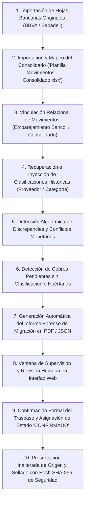

# 15 - Especificación del Protocolo y Proceso de Migración Histórica

## 1. Naturaleza del Proceso: Conciliación entre Libro Original y Consolidado

En el ecosistema de **Taquería El Criollo**, el historial contable de meses pasados coexiste fragmentado entre dos fuentes primarias alojadas en `input-samples/extractos/`: las cuatro exportaciones originales de bancos y tarjetas (las "Hojas Bancarias Originales") y un archivo central manual llamado `Planilla Movimientos - Consolidado.xlsx` (el "Consolidado Histórico").

La presente especificación diseña y documenta el **Protocolo Transaccional de Migración y Conciliación Histórica del MVP**, el cual gobernará el traspaso ordenado y seguro de este patrimonio contable hacia el nuevo Hub Económico en la **Fase 3 del cronograma**, acatando las garantías de la Regla de Evidencia y el Control de Calidad de Fase 0.5.

> **RECORDATORIO PROCESAL IMPERATIVO (`HECHO VERIFICADO` / `REQUISITO TÉCNICO`):**  
> De acuerdo al mandato expreso asignado a esta Fase 1, **el presente documento es pura y exclusivamente una especificación de análisis, diseño arquitectónico y planificación teórica**. **NO SE HA EJECUTADO NI SE EJECUTARÁ EN ESTE ACTO NINGUNA MIGRACIÓN REAL, TRANSACCIONAL NI DE DATOS**, absteniéndose la ingeniería de ejecutar sentencias SQL de inserción, tocar tablas activas o modificar los archivos Excel de muestra custodiados en el directorio local.

---

## 2. Jerarquía de Fuentes de Verdad en la Migración (`RECOMENDACIÓN`)

Para evitar distorsiones entre lo que el banco liquidó en caja y lo que los encargados anotaron a mano en el pasado, el protocolo instituye una división inquebrantada en la soberanía de los datos:
* **Fuente Soberana de Movimientos y Saldos Monetarios:** Las hojas bancarias originales del BBVA y Sabadell (`Cta. BBVA MC.xls`, `Tarj. Sabadell.xlsx`, etc.). Ellas dictaminan con absoluta supremacía legal la fecha de operación, importe monetario exacto en céntimos y signo transaccional (Ingreso/Gasto).
* **Fuente Soberana de Clasificaciones y Etiquetas Contables:** El archivo `Planilla Movimientos - Consolidado.xlsx`. Se utilizará puramente como almacén de inteligencia histórica para recuperar el proveedor o categoría HORECA asociada a cada cobro del pasado.
* **Tratamiento de Discrepancies:** Cualquier divergencia donde el consolidado manual difiera en fecha o importe de la hoja del banco original no sobreescribirá jamás al banco; se marcará automáticamente con el rótulo de alerta `REQUIERE_REVISIÓN` para su dictamen humano por la gerencia.

---

## 3. Desglose Estricto de las 10 Fases del Protocolo de Migración

El algoritmo que ejecutará la carga histórica se desarrollará en el servidor y cliente siguiendo escrupulosamente los **diez pasos secuenciales verificados de migración**:

### Paso 1: Importación de Hojas Bancarias Originales (`HECHO VERIFICADO`)
* **Mecánica:** El administrador carga en el importador web los ficheros originales del banco Sabadell y BBVA en orden cronológico ascendente.
* **Garantía:** El analizador de Nivel A y Nivel B estampa el UUID del lote y graba cada partida monearia con estado de clasificación `PENDIENTE`, construyendo el cimiento financiero verificable en la tabla `MOVIMIENTOS_ECONOMICOS`.

### Paso 2: Importación del Consolidado (`Planilla Movimientos - Consolidado.xlsx`)
* **Mecánica:** El administrador selecciona en un modal dedicado la planilla Excel que la gerencia operaba como archivo consolidado de cocina en tienda.
* **Garantía:** El importador no vierte estas filas directamente sobre el saldo general contable ni duplica ingresos; las carga transitoriamente en una tabla o estructura intermedia de vinculación (`lote_consolidado_staging`).

### Paso 3: Relación y Emparejamiento de Movimientos
* **Mecánica:** El motor de conciliación compara cada renglón del consolidado temporal contra las líneas del banco ya importadas en el Paso 1, cruzando las claves: `fecha_operacion (con margen de ±3 días) + importe_total (exacto al céntimo) + cuenta_asignada`.
* **Garantía:** Al confirmar el encaje entre ambas líneas, establece un enlace transaccional temporal sin alterar el texto primitivo del banco en sala.

### Paso 4: Recuperación de Clasificaciones Históricas
* **Mecánica:** Una vez correlacionada la línea del banco con su equivalente en el consolidado, la rutina lee de la hoja de Excel temporal el literal de la columna de proveedor, categoría o notas libres que el contable escribió a mano meses atrás.
* **Garantía:** El motor consulta el diccionario del sistema HORECA (`ALIAS_CONTRAPARTES`), traduce las notas antiguas hacia la nueva taxonomía y graba en el movimiento bancario real los campos `id_contraparte`, `id_categoria` e `id_subcategoria`, asignando a su propiedad de origen el literal oficial `"IMPORTACIÓN_HISTÓRICA"`.

### Paso 5: Detección de DiscrepANCIAS y Conflictos Monetarios (`RIESGO CONDICIONAL`)
* **Mecánica:** El sistema analiza en profundidad los registros donde no hubo un encaje perfecto al centavo (ej. en el banco Sabadell figura una salida de -€55,40 pero en la planilla manual se anotó -€55,00 por redondeo inadvertido).
* **Garantía:** Se prohíbe truncar o falsear el saldo real del banco. El cobro preservará los €55,40 originales del extracto y adoptará la bandera `REQUIERE_REVISIÓN` en la pantalla de alertas directivas indicando: *"Discrepancia detectada entre Banco (€55,40) y Consolidado Histórico (€55,00). Verifique diferencia de -€0,40"*.

### Paso 6: Detección de Pendientes de Clasificación o Huérfanos
* **Mecánica:** Barrido algorítmico individualizando los apuntes bancarios originales que no lograron emparejar con ninguna línea del consolidado (gastos de comisiones bancarias o cobros no anotados) y también aquellas filas del consolidado Excel que no ostentaron correlato en los bancos oficiales (que corresponden presumiblemente a **gastos efectuados con efectivo por caja chica**).
* **Garantía:** Los cobros huérfanos del banco quedan en estado `PENDIENTE` en la cola general; las líneas de efectivo huérfanas en el consolidado se ofrecen para importarlas en caliente sobre la cuenta patrimonial interna `Caja Sala`.

### Paso 7: Generación del Informe Forense de Migración
* **Mecánica:** Al finalizar el cálculo en seco, el servidor emite un informe estructurado en PDF y JSON de lectura directiva con el balance global del proceso: *"Total de movimientos en banco: 1.420 | Clasificaciones recuperadas exitosamente del consolidado: 1.350 (95,0%) | Discrepancies en importe para verificar: 14 | Gastos en efectivo identificados para Caja: 56"*.

### Paso 8: Ventana de Supervisión y Revisión Humana en Interfaz Web
* **Mecánica:** El informe forense y la tabla de partidas en conflicto se exhiben al gerente en una vista de revisión dedicada en el navegador.
* **Garantía:** El supervisor recorre los 14 casos de discrepancias, aprueba el importe legítimo del banco, ratifica o corrige la subcategoría de carne o bebidas en cocina y acepta las líneas en efectivo del almacén con tres clics ágiles sin salir del panel.

### Paso 9: Confirmación del Traspaso (`DECISIÓN HUMANA PENDIENTE` / `REQUISITO TÉCNICO`)
* **Mecánica:** Una vez que el administrador constata que las cifras coinciden con precisión matemática con sus cierres tributarios y libros del local, pulsa el botón maestro **"Confirmar Traspaso Histórico y Cerrar Lotes"**.
* **Garantía:** La base de datos efectúa una transacción atómica transmutando masivamente el estado de clasificación de los miles de cobros procesados desde `SUGERIDO` hacia `CONFIRMADO`, integrándolos al balance del Panel Económico e inhabilitando su borrado físico.

### Paso 10: Preservación Inalterada de Origen y Sellado de Resguardo
* **Mecánica:** El sistema empaqueta digitalmente las 4 hojas bancarias y la planilla consolidada Excel, estampa su huella criptográfica inalterable Hash SHA-256 en la tabla `ARCHIVOS_IMPORTADOS` y encripta y traslada los ficheros a un almacén portador protegido del restaurante en la nube.
* **Garantía:** Se prohíbe eliminar del sistema de archivos local o remoto los documentos de origen, resguardándolos por años ante auditorías de la Agencia Tributaria o del asesor contable y legal de la corporación.
