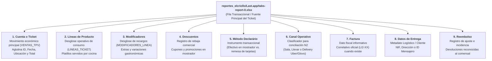

# 17 - Addendum Fase 1: Incorporación de Reportes Reales del Ecosistema (Last.app, Uber Eats y Glovo)

## 1. Contexto del Addendum y Realidad Operativa del Negocio

Durante el desarrollo de la Fase 1, la integración de ventas del mostrador y sala fue modelada preliminarmente bajo abstracciones tabuladas. Tras una revisión integral con la dirección de **Taquería El Criollo** e incorporando al diseño arquitectónico los archivos reales de producción suministrados por el negocio (`HECHO VERIFICADO POR NEGOCIO`), se normativiza la arquitectura bajo criterios de fidelidad operativa al ecosistema real operado en la taquería.

El análisis estricto del espacio de trabajo autorizado (`el-criollo-ecosistema/reportes_elcriollo/`) consolida tres mandatos operativos inapelables:
1. **Identificación de Fuentes Principales por Hecho Concreto:** Prohíbese proclamar una fuente soberana universal o una supremacía absoluta teórica. Los libros Excel denominados `tabs-report` (`tabs-report-0.xlsx` y `tabs-report-0 (1).xlsx`) constituyen la **fuente principal conocida** exclusivamente para los hechos económicos de: *Ticket registrado*, *Productos del ticket* y *Método declarado*, desplazando en esa tarea concreta al informe consolidado previo.
2. **Jerarquía Multi-Formato y Agregadores:** La actividad económica del establecimiento se distribuye de manera interdependiente entre el terminal TPV de sala **Last.app** (en libros **XLSX**, **XLS** y **CSV** con justificantes **PDF**) y los agregadores logísticos **Uber Eats** y **Glovo** (en volcados **CSV**, **XLSX** y facturas **PDF**), donde cada archivo actúa como fuente principal para su parcela mercantil (pedido externo, comisión, liquidación o abono en banco).
3. **Proscripción de Nombres Genéricos y Contabilidad Oficial:** En toda la especificación, diagramas y contratos del Hub Económico queda terminantemente prohibido hacer uso de identificadores genéricos artificiales o términos propios de la contabilidad oficial de libros mercantiles. Toda mención documental o prueba de software debe referenciar un archivo real verificado, utilizando vocabulario económico orientado a la **gestión, clasificación, conciliación y preparación para gestoría**.

En estricta sujeción a las directrices de la **Metodología Vegen Digital**, el **Control de Calidad (Fase 0.5)** y la **Regla de Oro** HORECA, este documento constituye el marco directivo para la ingesta y auditoría de reportes operacionales.

> **ALERTA Y RECORDATORIO PROCESAL (`REQUISITO TÉCNICO` / `HECHO VERIFICADO`):**  
> El presente Addendum de Fase 1 es **exclusivamente documental y de diseño arquitectónico**.  
> **NO se ha modificado código de la aplicación, NO se han escrito migraciones DDL, NO se han importado datos reales, NO se ha instalado ninguna dependencia por NPM, NO se ha hecho commit ni push y NO se ha comenzado la implementación de la Fase 2**.

---

## 2. Inventario Oficial y Clasificación de Fuentes Autorizadas

Todos los reportes reales se alojan de manera exclusiva en la ubicación autorizada del workspace: `el-criollo-ecosistema/reportes_elcriollo/`, dividida en las subcarpetas `Last.app/`, `Uber/` y `Glovo/`. Su correlación técnica detallada y análisis de riesgos se desglosa en la matriz obligatoria de [17-matriz-reportes-operativos.md](./17-matriz-reportes-operativos.md).

### 2.1. Jerarquía Operativa por Hecho Económico Concreto
Prohíbese utilizar expresiones dogmáticas como "fuente soberana universal", "supremacía absoluta", "100% de granularidad" o "fuente indiscutida". Cada documento se asume documentalmente como la **fuente principal conocida** para un hecho específico del servicio:

| Hecho operativo o económico | Fuente principal conocida |
| :--- | :--- |
| **Ticket registrado** | `Last.app tabs-report` (`tabs-report-0.xlsx` y `tabs-report-0 (1).xlsx`) |
| **Productos del ticket** | `Last.app tabs-report` (`tabs-report-0.xlsx` y `tabs-report-0 (1).xlsx`) |
| **Método declarado** | `Last.app tabs-report` (`tabs-report-0.xlsx` y `tabs-report-0 (1).xlsx`) |
| **Pedido Uber** | Uber detalle (`5578cf56...csv`) |
| **Pedido Glovo** | Glovo detalle (`invoice-200112939041.XLSX`) |
| **Comisión** | Plataforma de delivery (Uber / Glovo) |
| **Liquidación** | Plataforma de delivery (Uber / Glovo) |
| **Dinero acreditado** | Banco (Extractos bancarios de BBVA y Sabadell) |
| **Caja** | Movimientos y cierre de caja (`Movimientos.xlsx` y justificante `cashbook.pdf`) |

*Regla obligatoria frente a discrepancias:* Las diferencias numéricas o conceptuales entre las distintas fuentes no deben modificarse ni ocultarse. **Las diferencias entre fuentes deben conservarse íntegras y ser presentadas a revisión humana posterior.**

---

## 3. `tabs-report` como Fuente Principal para Tickets y Consumo en Sala

En virtud de la inspección de las muestras reales del negocio, se establece arquitectónicamente que los libros **`reportes_elcriollo/Last.app/tabs-report-0.xlsx`** y **`tabs-report-0 (1).xlsx`** asumen la condición de fuente principal conocida para el registro del servicio gastronómico, desplazando al documento previamente referenciado (`Reporte Ventas y Asientos`), el cual pasa a desempeñar un rol de **control de validación secundario**.

### 3.1. Estructura y Mapeo de Hechos Operativos del Archivo `tabs-report`
El libro `tabs-report` condensa sobre **una misma fila o registro transaccional** las variables clave del servicio en tienda. Al procesarse en el analizador de `LastReportAdapter`, se extraen las magnitudes económicas para su clasificación, evitando términos contables oficiales:

---

## 4. Estricta Distinción entre Identificadores Técnicos y Operativos

Queda terminantemente prohibido confundir o unificar de manera ambigua los distintos códigos e índices que caracterizan un registro en las plataformas HORECA (`REQUISITO TÉCNICO`). En todos los documentos, clases y conectores se impondrá la siguiente separación semantica:

* **`Tab Id`**: Identificador técnico de sesión y base de datos generado internamente en Last.app (cadena UUID o hash largo). **Prohíbese utilizar `Tab Id` como sinónimo o equivalente del código de cuenta.**
* **`Tab Code`**: Código corto o referencia alfanumérica asignada al ticket en la pantalla del TPV para la identificación visual por parte de camareros (ej. `#C18A7`). Es un atributo operativo completamente separado y diferente de `Tab Id`.
* **`código de cuenta`**: Número o referencia operativa del encargo. Cuando una planilla o extracto no disponga de esta columna, se anotará normativamente el estado **`NO DISPONIBLE`**.
* **`número de factura`**: Correlativo fiscal informativo expedido en la tienda para identificar el comprobante emitido al cliente (ej. `LI2-12`). Si una cuenta no llegó a emitirse con factura formal, el campo mantendrá el estado **`NO DISPONIBLE`**.
* **`identificador interno`**: Código único propio y exclusivo de una plataforma de delivery externa (ej. Order UUID de Uber Eats o ID de pedido en Glovo). No existe equivalencia algorítmica ni conversión automática entre este campo y los identificadores de Last.app.
* **`posición de fila`**: Número del renglón físico que ocupa un registro digital en el libro o planilla Excel durante la importación en memoria.
* **`archivo de origen`**: Ruta relativa, nombre y huella criptográfica SHA-256 del fichero objeto de análisis.

---

## 5. Identidades Diferenciadas: Fila Importada vs. Candidato de Conciliación

Para resguardar la exactitud informática y evitar tanto falsos duplicados como colisiones temporales, se definen obligatoriamente dos mecanismos independientes de identificación:

### 5.1. Mecanismo 1: Identidad de Fila Importada (Trazabilidad y Reimportación Exacta)
Este mecanismo sirve en exclusiva para auditar la trazabilidad interna dentro de una importación puntual y detectar reimportaciones idénticas de un mismo libro Excel sin interferir en el emparejamiento de cuentas de cocina.
* *Parámetros permitidos:* Puede evaluar en combinación los valores temporales del fichero: **`archivo`**, **`hoja`**, **`posición`** (de fila) y **`valores originales`** de la cadena importada.

### 5.2. Mecanismo 2: Candidato a Mismo Ticket entre Archivos (Motor de Coincidencias)
Este mecanismo orienta el proceso transaccional del Nivel 2, evaluando de forma combinada y flexible qué apuntes de distintos informes representan el mismo evento económico.
* *Parámetros evaluables:* Debe evaluar, según disponibilidad y tolerancias fijadas en el sistema, la combinación de las siguientes dimensiones operativas: **`ubicación`**, **`número de factura`**, **`fecha y hora`**, **`código de cuenta`**, **`fuente`**, **`total`**, **`canal`** y **`método de pago`**.
* *Prohibición estricta:* **No debe depender en ningún caso de la posición de fila ni del nombre del archivo** para reconocer descargas solapadas o emparejamientos transversales, ya que los renglones cambian entre exportaciones semanales sucesivas.
* *Sin clave rígida prematura:* Prohíbese imponer todavía una clave única definitiva y restrictiva sobre este proceso; el mecanismo produce sugerencias de candidato que se someten a supervisión directiva en la interfaz SPA.

---

## 6. Tratamiento y Clasificación Sugerida para Registros Incompletos

**Prohíbese estrictamente clasificar de forma automática y definitiva** un registro sin factura, con saldo anormal o sin cobro explícito bajo los aditivos conclusivos de *anulación*, *invitación*, *prueba*, *consumo interno*, *merma* o *impagado* (`REQUISITO TÉCNICO` / `HECHO VERIFICADO POR NEGOCIO`). 

Todo registro no convencional ingresado desde las planillas conservará intacto su texto e importe, imputando exclusivamente **estados de sugerencia** analíticos sin modificar saldos definitivos, conforme a la siguiente tabla directiva:

| Estado de Sugerencia del Sistema | Condición Observada en la Ingesta | Mandato de Validación y Revisión Humana |
| :--- | :--- | :--- |
| **`POSIBLE_CUENTA_CERO`** | Cuenta donde el total figura con importe 0.00 sin pago positivo asociado. | Sugiere cuenta de mesa o barra cerrada sin consumo. No genera saldos definitivos. |
| **`POSIBLE_ANULACIÓN`** | Registro con reembolso igual a total o marca originaria de cancelación de orden. | Sugiere comanda abortada. Debe ser validado antes de excluirse de conciliación. |
| **`POSIBLE_INVITACIÓN`** | Ticket con consumo servido y rebaja de cortesía 100% u observación de personal. | Sugiere atención comercial del restaurante. Espera ratificación de la gerencia. |
| **`POSIBLE_PRUEBA`** | Operación en periodo de test o con importe simbólico en datáfono. | Sugiere movimiento técnico ajeno a ventas reales de tienda. |
| **`INCOMPLETO`** | Fila del Excel con celdas faltantes en marca, fecha o total al momento de lectura. | Bloqueado en cuarentena analítica para reparación o revisión de archivo. |
| **`REQUIERE_REVISIÓN`** | Cuenta con saldo económico positivo sin factura y sin método de pago declarado. | Alerta visual prioritaria en el Panel Económico. Solicita inspección detallada. |

> **REGLA INQUEBRANTABLE DE APROBACIÓN HUMANA:**  
> **Solo la revisión humana experta (por parte de la gerencia o del responsable comercial) puede convertir una sugerencia algorítmica en una clasificación confirmada.**

---

## 7. Parseo Estricto de Productos y Modificadores en Celda Textual

En las planillas transaccionales de Last.app, la columna de `productos` concentra en una única celda de Excel una estructura multi-línea textual (`HECHO VERIFICADO POR NEGOCIO`). Para salvaguardar la integridad forense del dato, el parser especializado obedece a un protocolo estricto de preservación y tolerancia ante formatos variables:

### 7.1. Obligatoriedad de Preservación Completa
El analizador de `LastReportAdapter` **tiene prohibido descartar o purgar contenido**. Antes y durante la decodificación, el sistema deberá preservar invariablemente en el modelo y en la auditoría del log los siete (7) metadatos de trazabilidad:
1. **`texto original`**: Cadena completa cruda de la celda de productos, sin recortar ni adulterar.
2. **`líneas originales`**: Arreglo completo de renglones despiezados del texto entrante.
3. **`orden`**: Posición secuencial intralínea verificada durante el recorrido del parser.
4. **`indentación observada`**: Número exacto de espacios o caracteres de tabulación capturados por cada renglón.
5. **`resultado parseado`**: Objeto estructurado dividiendo ítems principales y recargos subordinados en memoria.
6. **`errores`**: Registro explícito de anomalías de sintaxis o discrepancias posicionales encontradas en la cadena.
7. **`versión del parser`**: Sello temporal y número de versión del script de decodificación ejecutado.

### 7.2. Flexibilidad Jerárquica sin Presupuestos Rígidos
**Prohíbese presuponer dogmáticamente que la indentación en la celda será siempre exactamente de cuatro espacios.** El parser deberá contemplar y procesar con fluidez los siguientes escenarios variables de redacción digital:
* Espacios de indentación variables en magnitud;
* Tabuladores posicionales (`\t`);
* Líneas vacías en medio del texto;
* Modificadores gastronómicos que carezcan de cantidad o multiplicador frontal;
* Precios o diferenciales monetarios opcionales explícitos en línea;
* Estructuras de combos promocionales (menús agrupados);
* Productos con descripciones extensas divididas en formato multilínea;
* Caracteres especiales de codificación regional o símbolos gastronómicos;
* Formato desconocido o no reconocido por las expresiones regulares convencionales.

*Mecanismo de seguridad:* Cuando por ambigüedad sintáctica o complejidad en el formato del texto **no pueda determinarse la jerarquía de dependencia** entre productos y modificadores:
* **No descartar jamás el contenido;**
* **Conservar intacto el texto original en la entidad del ticket;**
* Asignar automáticamente a la orden la marca analítica **`PARSEO_PARCIAL`** o **`REQUIERE_REVISIÓN`** para intervención humana en el panel web.

---

## 8. Gestión y Preservación del Desglose en Pagos Mixtos

Cuando una orden del TPV sea abonada combinando múltiples instrumentos de cobro en barra (por ejemplo, cobro mixto entre efectivo y tarjeta) y el reporte transaccional emita dicha indicación sin detallar los montos monetarios de cada fracción, el conector operará bajo el siguiente mandato estricto de veracidad y cautela:

1. **Conservación integral:** Se conserva inalterado el texto original capturado en la columna de cobro.
2. **Registro de instrumentos:** Se registran relacionalmente los métodos de pago detectados en la expresión (ej. "EFECTIVO + TARJETA").
3. **Señalización de bloqueo analítico:** Se marca automáticamente el estado operativo del cobro como **`DESGLOSE_NO_DISPONIBLE`**.
4. **Prohibición de inventar cifras:** **Queda terminantemente prohibido inventar importes, deducir proporciones teóricas (ej. 50/50) o dividir artificialmente sumas parciales.**
5. **Revisión diferida:** El registro se posicionará accesible para revisión y completitud posterior en pantalla por la gerencia al verificar sus cierres físicos con el datáfono y el cajón en sala.

---

## 9. Terminología Económica y Preparación para Gestoría (No Contabilidad Oficial)

El Hub Económico y el módulo de extractos conciben su arquitectura en el marco de la inteligencia operativa y la **preparación para gestoría**. El sistema **no pretende suplir ni reemplazar las obligaciones formales, los libros contables mercantiles ni la autoliquidación tributaria ante Hacienda del restaurante**, funciones delegadas al despacho contable profesional externo y al software tributario certificado.

Por consiguiente, este Addendum y todo el cuerpo técnico eliminan el léxico contable oficial e imponen las siguientes equivalencias semanticas de diseño funcional:

| Término Contable Oficial Prohibido / Reformulado | Vocabulario Económico Operativo Adoptado en el Hub |
| :--- | :--- |
| *Asiento / Asiento contable* | **Movimiento económico** o Registro transaccional HORECA |
| *Libro contable / Libro mayor* | **Historial de movimientos consolidados** / Tabla relacional de sala |
| *Cuenta patrimonial / Plan de cuentas* | **Catálogo de categorías y subcategorías** operativas de tienda |
| *Deducción contable / Amortización* | **Ajuste operativo** / Coste de intermediación o Merma en servicio |
| *Atributo fiscal automático / Imputación tributaria* | **Dato fiscal informativo** (para comprobación por asesor) |
| *Libro de caja / Cierre contable de caja* | **Arqueo y comprobantes de movimientos** de efectivo en mostrador |
| *Contabilidad oficial de la empresa* | **Preparación documental e inteligencia de datos para gestoría** |

---

## 10. Circuito Relacional con Agregadores y Configuración de Tolerancias

La interconexión monetaria entre los pedidos servidos por cocina en Last.app, las liquidaciones retenidas por Uber Eats o Glovo y los ingresos en el banco Sabadell o BBVA es gobernada bajo una arquitectura de conciliación por compensación documentada en profundidad en [18-delivery-uber-glovo.md](./18-delivery-uber-glovo.md).

### 10.1. Regla en Tolerancias Monetarias y Plazos
* **Prohibición de invención o dogmatismo:** Prohíbese codificar en la especificación porcentajes fijos inalterables de comisión de las plataformas de delivery o ventanas temporales fijas para la alineación bancaria.
* **Configuración basada en evidencia histórica:** Toda tolerancia económica de diferencia en la conciliación y los rangos admisibles de fechas deben ser **parámetros configurables en la consola de administración, debiendo ser aprobados por la dirección del negocio únicamente tras analizar el histórico real de transacciones** verificados en el local comercial.
