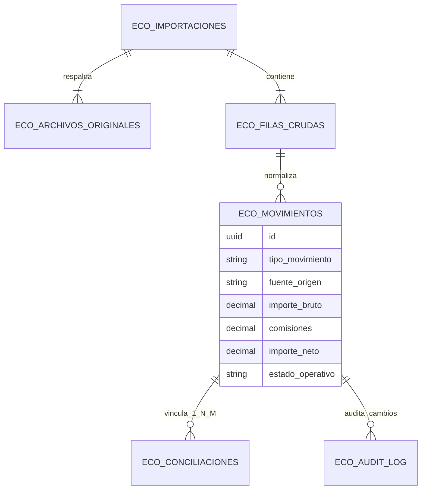

# FASE 2B — DECISIÓN ARQUITECTÓNICA DEL HUB ECONÓMICO

**Documento de Especificación Arquitectónica y Matriz de Decisión**
**Proyecto:** Taquería El Criollo / Ecosistema Vegen Digital SL
**Fecha:** Agosto 2026
**Estado:** PROPUESTA ARQUITECTÓNICA DOCUMENTADA (Sin cambios en producción)
**Alcance:** Dominio Económico-Financiero y Módulo de Extractos

---

## 1. CONTEXTO APROBADO

La presente decisión arquitectónica se fundamenta en el marco técnico y metodológico establecido en las fases anteriores del proyecto:

1. **Fase 1 Documental (Cerrada):** Ubicada en `el_criollo_modular/docs/fase-1-extractos/`, define formalmente el alcance funcional, la jerarquía operacional por hecho concreto, la purga de neologismos dogmáticos de contabilidad oficial y la catalogación de las 12 fuentes operativas del local.
2. **Fase 2A — Laboratorio Aislado de Parsers y Previsualización (Aprobada):** Ubicado en `el_criollo_modular/labs/import-preview/`, demostró mediante pruebas automatizadas (10/10 subtests superados) y verificación matemática sobre 48 archivos reales de negocio (sumando 36.086 filas transaccionales) que el sistema puede leer, detectar y normalizar de forma segura archivos **XLS, XLSX y CSV** procedentes de reportes bancarios (Sabadell, BBVA), TPV (Last.app) y Delivery (Uber Eats, Glovo).
3. **Dictamen de Tránsito:** El estado del módulo se encuentra formalmente en **`GO_CON_OBSERVACIONES_PARA_DISEÑO_DE_ARQUITECTURA`**.
4. **Estado de Dependencias y Desviaciones:**
   * La biblioteca `xlsx` (v0.18.5) fue instalada **únicamente** dentro del laboratorio aislado (`labs/import-preview/`) como una desviación procesal estrictamente documentada para validar los formatos binarios y XML de Excel. Su adopción dentro del núcleo productivo **NO está aprobada aún**.
   * La biblioteca `papaparse` (v5.5.3) ya existía previamente en el manifiesto de la aplicación principal (`el_criollo_modular/package.json`) para la lectura básica de CSV en el MVP actual.

---

## 2. OBJETIVO

Determinar y documentar la arquitectura técnica óptima para la implementación de la primera versión operativa (MVP) del **Hub Económico de Taquería El Criollo**, garantizando el cumplimiento estricto de la **Regla de Oro** (*ninguna modificación del sistema o migración debe comprometer la operatividad del servicio HORECA activo*) y la **Metodología Vegen Digital**.

La decisión arquitectónica abarca de manera integral los siguientes vectores:
* Persistencia transaccional y relacional de datos.
* Sistemas de Autenticación (AuthN) y Autorización (AuthZ / RLS).
* Almacenamiento inmutable y seguro de archivos originales (reportes bancarios, TPV, delivery).
* Ubicación y entorno de ejecución del procesamiento y parseo de archivos (Cliente vs. Servidor / Edge).
* Modelo mínimo de datos para la primera vertical operativa de importación.
* Trazabilidad integral de operaciones y auditoría inmutable.
* Estrategia de seguridad (anonimización RGPD, protección de endpoints, aislamiento).
* Entornos de despliegue y topología de red.
* Políticas de copias de seguridad (*backups*) y planes de recuperación (*disaster recovery* / PITR).
* Análisis de costes operativos iniciales y proyección futura.
* Hoja de ruta para la transición progresiva hacia una arquitectura **multi-tenant** (soporte para futuros locales o marcas de Vegen Digital SL).
* Estrategia de integración progresiva de los parsers del laboratorio de Fase 2A al código productivo sin interrupción del servicio.

---

## 3. INSPECCIÓN DEL ESTADO ACTUAL

En cumplimiento del protocolo no invasivo, se inspeccionó estáticamente el espacio de trabajo autorizado (`el-criollo-ecosistema/`). A continuación se presentan los hallazgos categorizados rigurosamente:

### 3.1. Manifiestos, Dependencias y Configuración de Construcción (`package.json`, `vite.config.js`)
* **HECHO VERIFICADO:** El manifiesto principal (`el_criollo_modular/package.json`) declara una aplicación React 19 (`^19.2.4`) empaquetada con Vite (`^8.0.1`) y estilizada con Tailwind CSS v4 (`^4.2.2`). En sus dependencias de producción coexisten dos SDKs de nube: `@supabase/supabase-js` (`^2.100.0`) y `firebase` (`^12.11.0`). Para lectura de archivos únicamente está presente `papaparse` (`^5.5.3`). No se encuentra `xlsx` ni lockfiles secundarios fuera del laboratorio.
* **INFERENCIA:** El proyecto transita o debate arquitectómicamente entre el ecosistema Firebase (Google) y Supabase (PostgreSQL), habiendo añadido ambos clientes de nube en la etapa inicial del desarrollo.
* **RIESGO:** El tamaño del paquete (*bundle size*) se incrementa sustancialmente al empaquetar en el cliente dos SDKs masivos con propósitos superpuestos, además del riesgo de desincronización arquitectónica entre servicios de autenticación y bases de datos.
* **RECOMENDACIÓN:** Unificar la estrategia arquitectónica en torno a un proveedor primario que garantice capacidades relacionales ACID e integrar lazy-loading de librerías de parseo.
* **DECISIÓN PENDIENTE:** Aprobar formalmente la inclusión productiva de `xlsx` (o una alternativa enfocada como `exceljs` / `@e965/xlsx`) en el `package.json` raíz en el momento de iniciar la Fase 2 productiva, o trasladar el parseo a una función en la nube.

### 3.2. Servicios de Nube y Variables de Entorno (`.env.local`, `firebaseConfig.js`, `lib/supabase.js`)
* **HECHO VERIFICADO:** En `.env.local` existen declaradas variables operativas para ambos servicios: `VITE_SUPABASE_URL`, `VITE_SUPABASE_ANON_KEY`, `VITE_FIREBASE_API_KEY`, `VITE_FIREBASE_AUTH_DOMAIN`, `VITE_FIREBASE_PROJECT_ID`, `VITE_FIREBASE_STORAGE_BUCKET`, `VITE_FIREBASE_MESSAGING_SENDER_ID`, `VITE_FIREBASE_APP_ID` y `VITE_FIREBASE_MEASUREMENT_ID`. El archivo `src/firebaseConfig.js` inicializa la app de Firebase exclusivamente con `getAuth(app)`. El archivo `src/lib/supabase.js` exporta el cliente REST con la clave anónima.
* **INFERENCIA:** Actualmente Firebase se emplea de forma exclusiva como proveedor de identidad (Auth), mientras que Supabase se está postulando o utilizando como motor de base de datos relacional.
* **RIESGO:** **Riesgo crítico de seguridad e integridad.** Al autenticar usuarios en Firebase Auth y realizar peticiones de base de datos a Supabase con una clave `anon_key` desde el navegador sin un intercambio formal de tokens JWT homologados por Supabase, el motor PostgreSQL **no tiene conocimiento del usuario autenticado**. En consecuencia, las políticas de Seguridad a Nivel de Fila (RLS) en Supabase quedan anuladas, abiertas al público con la clave anónima o son impracticables.
* **RECOMENDACIÓN:** Migrar la autenticación de usuarios hacia **Supabase Auth** para habilitar la seguridad RLS nativa sin fisuras, o bien instrumentar un backend intermedio / Edge Function que verifique el token de Firebase antes de interactuar con la base de datos con rol de servicio.
* **DECISIÓN PENDIENTE (D-20):** Elegir entre la migración completa a Supabase (Auth + BD + Storage) o el mantenimiento de un esquema híbrido con custom JWT pre-firmados.

### 3.3. Autenticación, Rutas y Módulos Existentes (`src/`)
* **HECHO VERIFICADO:** En `src/App.jsx`, el enrutamiento y renderizado de la interfaz depende directamente del estado del observador `onAuthStateChanged(auth)` de Firebase. Si no hay sesión activa, se fuerza el renderizado del componente `Login.jsx`. Dentro de `src/modules/` existen 10 submódulos temáticos (`configuracion`, `escandallos`, `extractos`, `horarios`, `inventario`, `kpis`, `pedidos`, `prediccion`, `produccion`, `ventas`).
* **HECHO VERIFICADO (Módulo Extractos Actual):** El archivo `src/modules/extractos/ExtractosApp.jsx` ejecuta peticiones `supabase.from('extractos').select('*')` con un mecanismo de resiliencia rudimentario en `localStorage` (`db_extractos`). El componente `ImportModal.jsx` de producción utiliza exclusivamente `Papa.parse` para procesar 5 plantillas fijas de CSV para cuentas y tarjetas de BBVA y Sabadell. No existe código productivo en `src/` que lea archivos Excel (`.xls`, `.xlsx`), ni que procese Last.app, Uber Eats o Glovo, ni que guarde físicamente el archivo cargado en nube.
* **INFERENCIA:** El código productivo de Extractos es un prototipo funcional de primera generación orientado exclusivamente a conciliación manual rudimentaria sobre CSV, el cual quedó obsoleto frente al descubrimiento en Fase 1/2A de que la operación de Taquería El Criollo transacciona mayoritariamente en reportes de Excel multicuenta.
* **RIESGO:** El uso intenso de `localStorage` como almacenamiento temporal de extractos completos (36.086 filas evidenciadas en Fase 2A) saturará rápidamente la cuota del navegador (~5-10 MB), arriesgando fallos catastróficos por cuota excedida (`QuotaExceededError`) y exponiendo datos financieros sensibles en texto plano en la memoria local del puesto de trabajo.
* **RECOMENDACIÓN:** Erradicar el uso de `localStorage` para almacenar tablas masivas transaccionales. Sustituirlo en el MVP por paginación del lado de la base de datos (PostgreSQL LIMIT/OFFSET), caché en memoria con React Query / SWR, y almacenamiento blindado inmutable del archivo fuente en object storage.
* **DECISIÓN PENDIENTE (D-21):** Aprobación del rediseño modular de `src/modules/extractos/` en la Fase 2 productiva para reemplazar el prototipo actual por el motor multicapa validado en el laboratorio de Fase 2A.

### 3.4. Estructura y Función de `app/`
* **HECHO VERIFICADO:** El directorio `el_criollo_modular/app/` contiene una aplicación web estática independiente en Vanilla JavaScript y CSS (`app.js`, `index.html`, `menu.json`, `style.css`), sin dependencias de Node. Su lógica está diseñada para mostrar un menú digital en video para clientes, con botones de redirección a Uber Eats, Glovo y JustEat según el local (ej. Palencia).
* **INFERENCIA:** Es una interfaz orientada al cliente final (*customer-facing*) y totalmente ajena al ERP de gestión interna y al Hub Económico.
* **RIESGO:** Confusión de límites arquitectónicos o despliegue accidental del backoffice interno en la misma ruta pública que el menú digital de los restaurantes.
* **RECOMENDACIÓN:** Mantener un aislamiento total entre `app/` (Portal del Cliente / Menú) y `src/` (Plataforma Maestra ERP / Backoffice HORECA). No aplicar jamás lógica de procesamiento bancario o comercial en la carpeta `app/`.
* **DECISIÓN PENDIENTE:** Confirmar si en el despliegue final `app/` residirá en un dominio/subdominio dedicado (ej. `menu.elcriollo.es`) separado del backoffice (ej. `erp.elcriollo.es`).

---

## 4. ALTERNATIVAS ARQUITECTÓNICAS COMPARadas

Para fundamentar la elección del motor transaccional del Hub Económico, se han evaluado rigurosamente cuatro topologías arquitectónicas:

```mermaid
graph TD
    subgraph ALT_A [Alternativa A: SPA + Supabase]
        SPA_A[Vite SPA] -->|Supabase Auth| SUPA_AUTH[Auth & JWT]
        SPA_A -->|REST / RPC + RLS| SUPA_PG[(PostgreSQL Administrado)]
        SPA_A -->|Storage SDK + RLS| SUPA_STO[Supabase Object Storage]
    end

    subgraph ALT_B [Alternativa B: SPA + API Propia + PostgreSQL]
        SPA_B[Vite SPA] -->|HTTPS REST| API_NODE[Node/Express API VPS]
        API_NODE -->|ORM / SQL| PG_VPS[(PostgreSQL en Render/VPS)]
        API_NODE -->|S3 SDK| S3_STO[AWS S3 / Cloudflare R2]
    end

    subgraph ALT_C [Alternativa C: SPA + MySQL Bluehost]
        SPA_C[Vite SPA] -->|HTTPS PHP/Node| API_BH[Servidor cPanel Bluehost]
        API_BH -->|SQL| MYSQL_BH[(MySQL Compartido)]
        API_BH -->|I/O Disco Local| DISK_BH[Carpetas Servidor cPanel]
    end

    subgraph ALT_D [Alternativa D: Firebase Híbrido]
        SPA_D[Vite SPA] -->|Firebase Auth| FB_AUTH[Firebase Identity]
        SPA_D -->|NoSQL SDK| FB_FS[(Firestore NoSQL)]
        SPA_D -->|Firebase Storage| FB_STO[Google Cloud Storage]
        FB_FS <-.->|Sincronización Compleja| DB_REL[(BD Relacional Auxiliar)]
    end
```



### 4.1. Alternativa A — SPA + Supabase Integral
* **Descripción:** Plataforma frontend React/Vite comunicada directamente al backend como servicio (BaaS) de Supabase. Integra **Supabase Auth** (reemplazando Firebase Auth), **PostgreSQL** administrado con seguridad de acceso RLS nativa, **Supabase Storage** (basado en S3) con políticas de control ligadas a RLS, y **Edge Functions** (Deno) únicamente para tareas transaccionales pesadas o procesamiento asíncrono.
* **Fortalezas:** Integración nativa ACID insuperable, seguridad RLS sin fisuras al unificar identidad y base de datos, tiempo de puesta en marcha inmediato al aprovechar la infraestructura ya iniciada en `lib/supabase.js`, coste cero inicial y mantenimiento de infraestructura nulo.
* **Debilidades:** Acoplamiento con el ecosistema Supabase (aunque mitigable por basarse al 100% en PostgreSQL estándar y S3 de código abierto), y requerir la migración de las pantallas de Login actuales que usan Firebase Auth.

### 4.2. Alternativa B — SPA + API Propia Node/Express + PostgreSQL
* **Descripción:** Frontend React/Vite conectado vía HTTP/REST a una API propia programada en Node.js (Express/NestJS) desplegada en un VPS o PaaS (Render, Railway, Hetzner). La API administra las conexiones a un servidor PostgreSQL dedicado y almacena archivos en buckets externos (AWS S3 o Cloudflare R2).
* **Fortalezas:** Control total y absoluto sobre la lógica de negocio, middleware, sanitización en el servidor y portabilidad extrema entre proveedores de nube sin atadura a BaaS.
* **Debilidades:** **Velocidad de desarrollo altamente penalizada**. Exige programar desde cero el enrutamiento, controladores, autenticación JWT, políticas de autorización de endpoints, manejo de errores y validación de esquemas (boilerplate masivo). Coste económico inicial de servidores desde el primer día y carga constante de administración y monitoreo DevOps.

### 4.3. Alternativa C — SPA + API PHP/Node + MySQL en Bluehost
* **Descripción:** Frontend React/Vite consumiendo endpoints programados en PHP o Node sobre el servicio de hosting compartido existente de Bluehost (cPanel). Persistencia en MySQL tradicional y almacenamiento de reportes en carpetas del disco local del servidor de hosting.
* **Fortalezas:** Aprovecha la suscripción de hosting ya pagada para la web o POS, coste cero añadido de servidores.
* **Debilidades:** **Inviable para un Hub Económico HORECA masivo**. El hosting compartido de cPanel carece de aislamiento de recursos; los límites de tiempo de ejecución de scripts y memoria (`max_execution_time`, `memory_limit`) provocarán colapsos al parsear reportes de 36.000 filas. MySQL administrado desde cPanel ofrece menor expresividad analítica para conciliaciones contables (ausencia de funciones avanzadas o extensiones como en Postgres), y guardar extractos bancarios confidenciales en el sistema de ficheros compartido representa un vector severo de vulnerabilidad.

### 4.4. Alternativa D — Firebase Híbrido (NoSQL + SQL Auxiliar)
* **Descripción:** Uso del actual Firebase Auth en combinación con **Firestore** (NoSQL de documentos) para datos operacionales y Firebase Storage para archivos, complementando el sistema con un motor relacional externo (o sincronización de eventos) para intentar resolver las conciliaciones N:M y auditoría contable.
* **Fortalezas:** Excelente sincronización en tiempo real para interfaces POS interactivas, SDK maduro y escalabilidad masiva sin gestión de infraestructura.
* **Debilidades:** **Fatal contradicción arquitectónica**. Firestore es una base de datos NoSQL documental que carece por definición de uniones (*joins*), restricciones relacionales ACID, claves foráneas y agregaciones complejas. Intentar conciliar miles de extractos bancarios contra ventas TPV y comisiones de delivery en un entorno NoSQL requiere realizar infinitas lecturas individuales por documento (disparando los costes de facturación de Google) y resolver los joins en la memoria del cliente o mediante una costosísima sincronización con una base SQL secundaria, multiplicando por tres la complejidad y el riesgo de inconsistencias contables.

---

## 5. CRITERIOS Y MATRIZ DE EVALUACIÓN PONDERADA

Cada alternativa ha sido calificada en una escala de **1 a 5** (1 = Inaceptable/Inseguro, 5 = Óptimo/Excelente), multiplicada por el peso específico del criterio para el escenario operativo de Taquería El Criollo (Total pesos = 100).

| Criterio de Evaluación | Peso | Alt. A (SPA + Supabase) | Alt. B (Node + Postgres) | Alt. C (MySQL Bluehost) | Alt. D (Firebase Híbrido) |
|---|:---:|:---:|:---:|:---:|:---:|
| **1. Seguridad del MVP (RLS y Aislamiento)** | **15** | **5** *(75 pts)* | **4** *(60 pts)* | **2** *(30 pts)* | **4** *(60 pts)* |
| **2. Integridad Relacional y ACID** | **15** | **5** *(75 pts)* | **5** *(75 pts)* | **3** *(45 pts)* | **2** *(30 pts)* |
| **3. Velocidad de Implementación** | **12** | **5** *(60 pts)* | **3** *(36 pts)* | **3** *(36 pts)* | **3** *(36 pts)* |
| **4. Coste Inicial de Puesta en Marcha** | **8** | **5** *(40 pts)* | **4** *(32 pts)* | **5** *(40 pts)* | **4** *(32 pts)* |
| **5. Coste Operativo y Escalabilidad Futura**| **7** | **4** *(28 pts)* | **3** *(21 pts)* | **4** *(28 pts)* | **3** *(21 pts)* |
| **6. Facilidad de Mantenimiento / Zero-DevOps**| **10** | **5** *(50 pts)* | **3** *(30 pts)* | **3** *(30 pts)* | **3** *(30 pts)* |
| **7. Backups y Recuperación (PITR/Recovery)** | **8** | **4** *(32 pts)* | **4** *(32 pts)* | **3** *(24 pts)* | **4** *(32 pts)* |
| **8. Almacenamiento Seguro de Originales** | **7** | **5** *(35 pts)* | **4** *(28 pts)* | **2** *(14 pts)* | **5** *(35 pts)* |
| **9. Eficacia en Conciliaciones 1:N y N:M**| **7** | **5** *(35 pts)* | **5** *(35 pts)* | **4** *(28 pts)* | **2** *(14 pts)* |
| **10. Auditoría Inmutable y Trazabilidad** | **6** | **5** *(30 pts)* | **5** *(30 pts)* | **3** *(18 pts)* | **3** *(18 pts)* |
| **11. Transición a Arquitectura Multi-Tenant**| **5** | **5** *(25 pts)* | **5** *(25 pts)* | **2** *(10 pts)* | **3** *(15 pts)* |
| **RESULTADO PONDERADO TOTAL** | **100**| **485 / 500 (97.0%)** | **404 / 500 (80.8%)** | **303 / 500 (60.6%)**| **323 / 500 (64.6%)** |

### 5.1. Justificación Cualitativa de las Puntuaciones Clave
* **Por qué la Alternativa A obtiene 485 puntos:** Al otorgar un peso combinado de **30%** a la Seguridad (15) e Integridad Relacional (15), el modelo Supabase sobresale de forma rotunda. La capacidad de enlazar el token de sesión del usuario directamente a las políticas de seguridad en la base de datos (`auth.uid() = user_id`) elimina la posibilidad de accesos cruzados. Asimismo, elimina semanas de desarrollo de backend tradicional, permitiendo que la inversión de desarrollo se centre en las reglas funcionales HORECA, la conciliación automática y las interfaces WOW.
* **Por qué se descarta la Alternativa C (Bluehost - 303 pts):** Aunque su coste es nulo (el servidor ya se paga), su puntuación de seguridad (2/5) y almacenamiento (2/5) lo descalifica. Alojar archivos bancarios con datos sensibles corporativos en carpetas de un servidor cPanel compartido vulnera las mejores prácticas de seguridad de datos. Además, la ausencia de mecanismos nativos de RLS exigiría comprobar permisos manualmente en cada script PHP o SQL.
* **Por qué se descarta la Alternativa D (Firebase - 323 pts):** El peso de la Integridad Relacional (15) y las Conciliaciones N:M (7) expone la incompatibilidad del NoSQL para un Hub Económico. Intentar conciliar un ingreso bancario del Banco Sabadell (1 movimiento) con un lote de 350 tickets individuales de Uber Eats (conciliación 1:N / N:M con comisiones y reembolsos intercalados) en Firestore requeriría descargar cientos de documentos al navegador, realizar el matching por código y re-escribir el estado transaccionando miles de escrituras billables, provocando sobrecostes y un rendimiento deficiente.

---

## 6. DICTAMEN DE PERSISTENCIA RELACIONAL

Para dar soporte formal y verificable a la realidad operativa del local y a la matriz de reportes del Addendum de Fase 1, se establece que **los siguientes 19 agregados y entidades exigen obligatoriedad de persistencia relacional en PostgreSQL**:



### 6.1. Definición de los Agregados de Dominio
1. **Agregado de Ingesta y Trazabilidad de Origen:**
   * **`importacion` (Lote de Carga):** Encabezado del lote. Registra el timestamp, operador responsable, fuente declarada (ej. `LAST_APP_TABS`, `BANCO_SABADELL_CTA`), rango de fechas detectado, suma monetaria total y estado del procesamiento (`BORRADOR`, `VALIDANDO`, `CONFIRMADO`, `RECHAZADO`).
   * **`archivo_original` (Evidencia Documental):** Referencia inmutable al objeto almacenado en Supabase Storage. Registra nombre original, tamaño, MIME type, hash criptográfico SHA-256 del fichero en crudo para auditar inalterabilidad ante inspecciones, e ID del lote de carga.
   * **`fila_importada` (Dato Crudo / Staging):** Almacena en un campo `JSONB` el contenido íntegro y literal de cada fila del Excel o CSV leída por el parser del laboratorio de Fase 2A, conservando el número de fila original (`line_number`) y un campo de validación de sintaxis sin modificar una sola letra del original.
2. **Agregado Bancario y de Caja:**
   * **`movimiento_bancario`:** Dato normalizado extraído de los extractos bancarios (Sabadell, BBVA). Campos con tipificado SQL estricto: `fecha_operacion (DATE)`, `fecha_valor`, `concepto_limpio`, `contraparte_banco`, `importe (NUMERIC(12,2))`, `saldo_posterior`, y referencia UUID a la `fila_importada`.
   * **`movimiento_caja`:** Movimientos en efectivo del local, retiros de fondo, pagos a proveedores menores desde caja, arqueos y depósitos en efectivo que se trasladarán al banco.
3. **Agregado TPV y Ventas (Last.app):**
   * **`ticket_lastapp` (Fuente Primaria):** Proyección normalizada del `tabs-report`. Almacena código de cuenta, mesa/referencia, canal de venta (Sala, Barra, Delivery, Web), número de factura, forma de pago declarada, fecha/hora exacta, importe total, propina, rebajas y estado del ticket.
   * **`linea_producto` & `modificador`:** Desglose transaccional opcional por plato y suplementos del ticket para cruces de rentabilidad de escandallos (se normalizará cuando se active el enlace con producción).
   * **`pago_ticket`:** Desglose transaccional del cobro del ticket (ej. Ticket de 50€ pagado 30€ en Tarjeta Visa y 20€ en Efectivo).
4. **Agregado Delivery (Canales Externos: Uber Eats, Glovo):**
   * **`pedido_delivery`:** Registro individual por pedido de plataforma delivery. Almacena el `order_id` externo de Uber/Glovo, hora de cobro, bruto del pedido y descuentos de marketing compartidos o propios.
   * **`comision_delivery`, `ajuste_delivery` & `liquidacion_delivery`:** Entidades esenciales para resolver la brecha entre la venta teórica TPV y la realidad bancaria. Almacenan la comisión porcentual retenida por Uber/Glovo, el coste de envío compensado, los ajustes negativos (reembolsos por incidencias en platos) y el ID de liquidación grupal (*payout*) que aglutina el pago semanal transferido al Banco Sabadell o BBVA.
5. **Agregado de Conciliación y Reglas del Motor:**
   * **`conciliacion` & `linea_conciliada`:** Entidades asociativas que enlazan en relaciones 1:N o N:M los movimientos bancarios o de liquidación de plataformas contra los registros operativos del TPV. Registran el margen de discrepancia tolerada, el estado (`CONCILIADO_AUTO`, `CONCILIADO_MANUAL`, `DISCREPANCIA_DETECTADA`) y las justificaciones documentales adjuntas.
   * **`regla` & `categoria` & `contraparte`:** El motor de categorización inteligente. Almacena patrones de texto o reglas heurísticas (ej. *Si el concepto bancario contiene 'UBER EATS BV', asignar a canal Delivery/Uber y conciliar con tabla liquidaciones*), asociando contrapartes comerciales normalizadas (ej. *Iberdrola*, *Makro*, *Vegen Digital SL*).
6. **Agregado de Auditoría Inmutable:**
   * **`revision_humana` & `auditoria` (Audit Log):** Registro transaccional imborrable (sin permisos `UPDATE` ni `DELETE`, solo `INSERT`) que documenta cada acción sobre el Hub: quién subió un archivo, quién modificó una categoría, qué regla de conciliación se forzó a mano y en qué marca de tiempo precisa ocurrió, cumpliendo con los estándares de trazabilidad forense del sector HORECA.

### 6.2. Principio de Separación: Dato Original vs. Dato Normalizado
Para garantizar que el sistema nunca pierda la realidad histórica (incluso si se modifica un algoritmo de parseo o una regla contable en el futuro), se instituye como principio inquebrantable el **Aislamiento en 2 Fases (Raw Staging -> Normalization)**:

```text
Archivo Excel/CSV (Storage Inmutable)
       │
       ▼ [Lectura Parser Fase 2A]
Tabla Staging (eco_filas_crudas) ────► JSONB literal (Inmutable, sin redondeos, con textos crudos)
       │
       ▼ [Motor de Normalización & Validación]
Tablas Normalizadas (eco_movimientos_*) ─► Tipos estrictos SQL (DATE, NUMERIC, UUID, Claves Foráneas)
```
*Si en el futuro se descubre una anomalía de formato en reportes antiguos de Uber o Last.app, se podrá re-ejecutar la normalización directamente desde `eco_filas_crudas` (JSONB) sin necesidad de que el operador humano tenga que buscar y volver a subir el archivo Excel físico de hace 6 meses.*

---

## 7. MODELO MÍNIMO PARA LA PRIMERA IMPLEMENTACIÓN (MVP FASE 2)

Para poner en marcha de forma quirúrgica y robusta la primera vertical operativa, **NO se procederá a crear masivamente decenas de tablas vacías**. De acuerdo al flujo estricto autorizado por el usuario:
`Subir archivo → detectar → inspeccionar → previsualizar → validar → confirmar importación → consultar historial`, se define la siguiente **Estructura Relacional Mínima Viable (MVP SQL Schema)**:

### 7.1. Especificación del Modelo Mínimo Viable
Para ejecutar la primera vertical y conectar el laboratorio de Fase 2A al corazón productivo de Extractos, se necesitarán **únicamente 4 tablas relacionales** en PostgreSQL (Supabase):

#### 1. Tabla de Cabeceras: `eco_import_batches`
Almacena el registro de cada sesión de importación.
```sql
CREATE TABLE public.eco_import_batches (
    id UUID PRIMARY KEY DEFAULT gen_random_uuid(),
    created_at TIMESTAMPTZ DEFAULT now() NOT NULL,
    user_id UUID NOT NULL, -- FK a auth.users (Supabase)
    source_type TEXT NOT NULL, -- 'BANCO_SABADELL', 'BANCO_BBVA', 'LASTAPP_TABS', 'UBER_EATS', 'GLOVO', etc.
    file_path TEXT NOT NULL, -- Ruta en Supabase Storage: 'importaciones/2026/08/hash_nombre.xlsx'
    file_sha256 TEXT NOT NULL, -- Hash de integridad inmutable
    file_name TEXT NOT NULL,
    total_rows INTEGER NOT NULL DEFAULT 0,
    status TEXT NOT NULL DEFAULT 'BORRADOR', -- 'BORRADOR', 'PREVISUALIZACION_APROBADA', 'IMPORTACION_CONFIRMADA', 'ARCHIVADO'
    meta_info JSONB DEFAULT '{}'::jsonb -- Rango de fechas detectadas, cuenta asociada, observaciones
);
```

#### 2. Tabla de Staging Crudo: `eco_raw_import_rows`
Recibe el vertido instantáneo del parser del laboratorio antes de que afecte a los números operados del restaurante.
```sql
CREATE TABLE public.eco_raw_import_rows (
    id BIGINT GENERATED ALWAYS AS IDENTITY PRIMARY KEY,
    batch_id UUID NOT NULL REFERENCES public.eco_import_batches(id) ON DELETE CASCADE,
    row_number INTEGER NOT NULL, -- Número de fila exacta en el Excel / CSV (ej. Fila 14)
    raw_content JSONB NOT NULL, -- Diccionario con el contenido exacto leida por xlsx/papaparse
    validation_status TEXT NOT NULL DEFAULT 'PENDIENTE', -- 'VALIDO', 'ADVERTENCIA_DUPLICADO', 'ERROR_SINTAXIS'
    validation_notes JSONB DEFAULT '[]'::jsonb -- Array de mensajes generados en la previsualización
);
```

#### 3. Tabla de Movimientos Confirmados: `eco_movimientos_hub`
La tabla transaccional limpia que reemplaza a la antigua tabla plana `extractos`, agrupando de manera estandarizada todos los hechos monetarios una vez superada la validación humana en la previsualización.
```sql
CREATE TABLE public.eco_movimientos_hub (
    id UUID PRIMARY KEY DEFAULT gen_random_uuid(),
    created_at TIMESTAMPTZ DEFAULT now() NOT NULL,
    batch_id UUID NOT NULL REFERENCES public.eco_import_batches(id) ON DELETE RESTRICT,
    raw_row_id BIGINT NOT NULL REFERENCES public.eco_raw_import_rows(id) ON DELETE RESTRICT,

    -- Dimensiones operacionales universales del Hub
    tipo_fuente TEXT NOT NULL, -- 'BANCO', 'TPV', 'DELIVERY', 'CAJA'
    subfuente_canal TEXT, -- 'SABADELL_CTA', 'BBVA_TARJ', 'SALA_TPV', 'UBER_EATS', etc.
    fecha_contable DATE NOT NULL,
    fecha_valor DATE,

    -- Identificadores externos para evitar duplicidades N:M
    external_ref_id TEXT, -- Núm de factura Last.app (F-2301), OrderID de Uber, o hash de transacción bancaria

    -- Dimensiones monetarias estrictas
    concepto TEXT NOT NULL,
    importe_principal NUMERIC(12, 2) NOT NULL, -- Positivo (ingreso/cobro) o Negativo (gasto/pago)
    comisiones_asociadas NUMERIC(12, 2) DEFAULT 0.00,
    importe_neto NUMERIC(12, 2) NOT NULL,

    -- Estados y categorización
    categoria TEXT DEFAULT 'Sin Categorizar',
    subcategoria TEXT,
    conciliado BOOLEAN DEFAULT false,

    CONSTRAINT uk_external_ref_per_source UNIQUE (tipo_fuente, subfuente_canal, external_ref_id)
);
```

#### 4. Tabla de Auditoría Inmutable: `eco_audit_logs`
Garantiza el control de calidad, trazabilidad e historia probatoria exigidos en el diagnóstico de Fase 0.5.
```sql
CREATE TABLE public.eco_audit_logs (
    id BIGINT GENERATED ALWAYS AS IDENTITY PRIMARY KEY,
    timestamp TIMESTAMPTZ DEFAULT now() NOT NULL,
    user_id UUID NOT NULL,
    action_type TEXT NOT NULL, -- 'UPLOAD_FILE', 'PREVIEW_VALIDATED', 'CONFIRM_IMPORT', 'MANUAL_EDIT'
    target_table TEXT NOT NULL, -- Nombre de la entidad alterada
    target_id TEXT NOT NULL, -- UUID de la fila alterada o del batch
    payload_snapshot JSONB NOT NULL -- Estado anterior y estado nuevo (Diff transaccional)
);
```

---

## 8. CONCLUSIÓN ARQUITECTÓNICA Y RECOMENDACIÓN OFICIAL

1. **Adopción Definitiva de Alternativa A (SPA + Supabase Integral):** Se recomienda formal y categóricamente refactorizar el módulo de Extractos y el Hub Económico sobre la infraestructura de **Supabase PostgreSQL**. Esta elección maximiza la seguridad con políticas RLS al nivel de la base de datos, aporta solidez ACID relacional innegociable en sistemas financieros HORECA, elimina servidores intermedios complejos y se fundamenta en un coste inicial nulo con escalabilidad lineal a prueba de futuro.
2. **Estrategia de Integración del Laboratorio de Fase 2A (Zero Downtime):**
   * En la Fase 2 productiva, se autorizará la instalación en el `package.json` raíz de la librería `xlsx` (o su homólogo optimizado), importándola mediante importación dinámica asíncrona (`const XLSX = await import('xlsx')`) únicamente cuando el usuario acceda al módulo de importación de extractos, protegiendo el tiempo de carga global (*bundle loading*) del resto del ERP HORECA.
   * La lógica modular desarrollada en `labs/import-preview/src/` (detectores de firma, normalizadores de columnas de Last.app, Uber, Glovo y bancos, y validadores de sintaxis) se transladará intacta al directorio productivo `src/modules/extractos/services/parsers/`.
3. **Respeto Absoluto a la Regla de Oro:** El despliegue futuro de las 4 tablas mínimas del MVP (`eco_import_batches`, `eco_raw_import_rows`, `eco_movimientos_hub`, `eco_audit_logs`) y sus buckets asociados en Supabase Storage se realizará **sin tocar ni alterar en lo absoluto** la tabla existente `extractos` que actualmente sirve al prototipo ni la lógica de caja operada, garantizando cero tiempo de inactividad o regresiones sobre la operativa actual del local.

---
*Este documento ha sido generado con fines estrictamente expositivos y documentales para la toma de decisión por parte de la dirección de Taquería El Criollo / Vegen Digital SL. No se ha realizado ninguna modificación en código fuente de producción (`src/` o `app/`), ni en bases de datos remotas ni en los entornos operados en línea.*
