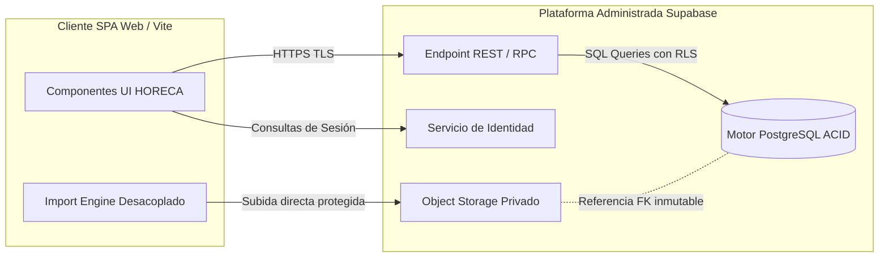

# 04 - Especificación de la Arquitectura Preseleccionada (Fase 2B)

## 1. Declaración Formal de Estado

Como resultado del estudio técnico comparativo efectuado, se formaliza la adopción preliminar del siguiente esquema:

**Arquitectura:** `SPA React/Vite + Supabase/PostgreSQL`
**Estado:** `ALTERNATIVA PRESELECCIONADA PARA EL MVP`

Se reitera de forma explícita que esta combinación técnica **no se declara en el presente momento como la arquitectura definitiva para su entrada directa en producción**. La validación y aprobación final de esta propuesta quedan expresamente supeditadas a:
1. La implementación y prueba exitosa del plan de endurecimiento en la **Fase 2C**.
2. El esclarecimiento e implementación de una política coherente para la gestión de la identidad y la autenticación operativa.
3. El diseño formal y auditoría de las políticas de seguridad (RLS y Storage Rules) a nivel del proveedor.
4. La definición del procedimiento y rutinas probatorias para copias de seguridad (backups) independientes.

## 2. Topología y Componentes de la Arquitectura Preseleccionada

### 2.1. Capa Cliente (Frontend SPA)
* **Entorno:** Aplicación de Página Única (*Single Page Application*) desarrollada en React 19 y compilada mediante Vite (`el_criollo_modular`).
* **Función:** Renderizado de componentes visuales HORECA, captura de eventos de usuario, navegación interna y presentación del módulo transitorio para carga de informes operativos (bancos, TPV, delivery).
* **Motor de Ingesta Aislado:** Integración dentro de una carpeta o dominio interno desacoplado (`src/domain/import-engine/` o equivalente) de las funciones verificadas en el laboratorio de la Fase 2A, configurado con técnicas de carga diferida (*lazy loading*) para librerías especializadas pesadas.

### 2.2. Capa Servidor (Plataforma Administrada Supabase / PostgreSQL)
* **API y Conectividad REST/RPC:** Comunicación sin servidor intermedio dedicado mediante el cliente HTTP de Supabase, que traduce peticiones estructuradas en el navegador a sentencias de consulta transaccionales contra PostgreSQL a través de una pasarela protegida por encriptación HTTPS/TLS.
* **Motor de Base de Datos PostgreSQL:** Almacenamiento primario en PostgreSQL con cumplimiento riguroso de ACID (Atomicity, Consistency, Isolation, Durability), índices referenciales formales, llaves foráneas y soporte nativo al tipo transaccional `JSONB` para almacenar estructuras operativas sin pérdidas de fidelidad ni redondeos no consensuados.
* **Storage de Archivos Originales:** Resguardos binarios y tabulares de cada archivo y reporte en un almacenamiento en bloque (*object storage*) privado.
* **Políticas de Protección (Row Level Security):** Seguridad administrada a nivel de tabla y registro, delegando la autorización en las credenciales criptográficas del JWT asociado a la petición transaccional que emite la SPA.

## 3. Límites de Responsabilidad en el MVP

El alcance de la arquitectura preseleccionada en su etapa MVP (Producto Mínimo Viable) se restringe conscientemente para asegurar certidumbre y mantenibilidad:
* **Foco en el Ciclo de Importación:** La primera iteración y validación transaccional se concentrará de forma estricta sobre la vertical operativa de: `Subir archivo → detectar → inspeccionar → previsualizar → validar → confirmar importación → consultar historial`.
* **Escalabilidad Gradual:** En lugar de construir prematuramente decenas de tablas operativas para dominios futuros no verificados empiricamente (por ejemplo, automatismos bancarios complejos o integraciones directas por API en tiempo real), la arquitectura inicial instanciará una capa intermedia normalizada que actuará como frontera probatoria antes de dar forma y desplegar los dominios económicos definitivos.
