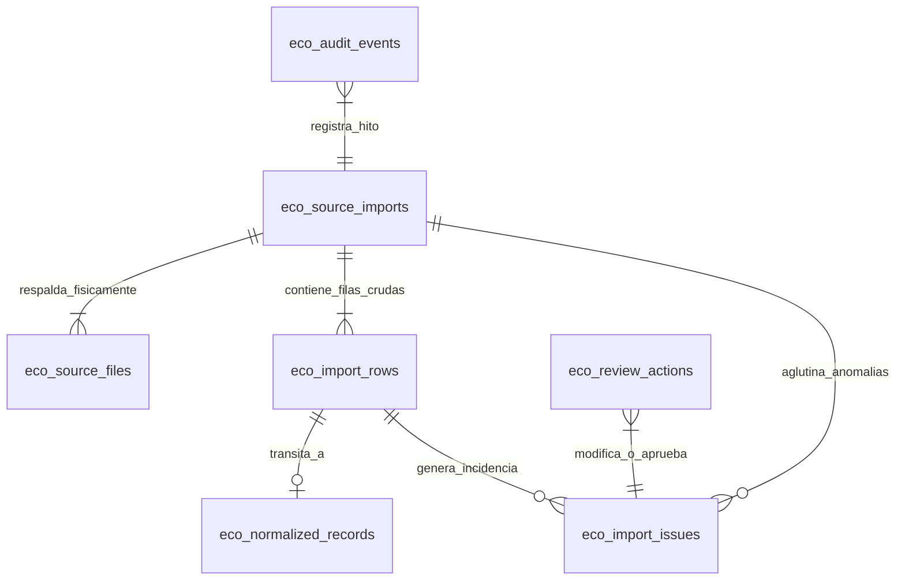

# 05 - Modelo Mínimo y Corregido de Datos Transicionable (Fase 2B)

## 1. Principios del Modelado para la Primera Vertical

El modelo de datos requerido para sostener el inicio productivo de la **Fase 2** renuncia resuelta y explícitamente al intento de consolidar en una única tabla universal (tal como una hipotética tabla monolítica `eco_movimientos_hub`) los diversos hechos contables, fiscales y operativos del local. Dicha simplificación conllevaría la pérdida de especificidad del dominio gastronómico y complicaría de manera excesiva la posterior desagregación analítica por módulo.

En su lugar, y para respetar los límites autorizados de la primera vertical operativa (`Subir archivo → detectar → inspeccionar → previsualizar → validar → confirmar importación → consultar historial`), el modelo se estructura en torno al **ciclo de vida del procesamiento de la importación**. Se instrumenta una frontera en dos capas: el dato crudo (*staging / raw*) y una proyección intermedia normalizada que servirá para verificar y afianzar la arquitectura antes de edificar los repositorios contables y financieros definitivos de la empresa.

---

## 2. Estrategia Single-Tenant y Frontera Organizativa (`organization_id`)

### 2.1. Alcance Operativo Actual
El Producto Mínimo Viable (MVP) se concibe para un único cliente y operador operando una infraestructura compartida o aislada (**Single-Tenant** para Taquería El Criollo / Vegen Digital SL). Por consiguiente, se excluye expresamente en esta etapa el desarrollo de:
* Pantallas y flujos de alta o registro (*onboarding*) de nuevas empresas terceras.
* Selectores visuales o interruptores complejos para cambio simultáneo de empresa u organización.
* Módulos de facturación de servicios de software (SaaS), control de suscripciones o cuotas diferenciadas de almacenamiento por cliente comercial exterior.
* Políticas de seguridad RLS jerárquicamente entrelazadas y complejas orientadas a la segmentación multi-tenant en caliente.

### 2.2. Coste y Beneficio de Incluir el Campo Fijo `organization_id`
No obstante el enfoque single-tenant, se evalúa y adopta la decisión técnica de incrustar desde la creación inicial de los esquemas un campo referencial fijo: `organization_id` (de tipo `TEXT` o `UUID`), poblado sistemáticamente con el identificador inmutable de **Vegen Digital SL** (o el código maestro designado para la Taquería El Criollo):
* **Coste Arquitectónico de Incluir el Campo:** Prácticamente insignificante. El único esfuerzo adicional consiste en incluir una columna simple y un valor por defecto en los constructores de inserción del backend y en los tipos TypeScript/JavaScript de los DTO de carga.
* **Beneficio Estratégico y de Escalabilidad Futura:** **Extremadamente alto**. Al fijar el `organization_id` desde el día uno del proyecto, todas las sentencias SQL, consultas, índices y registros del historial crecen y se pueblan portando su etiqueta organizativa inherente. Si en una fase distante se amplía el negocio para cobijar nuevas marcas operadas por la misma matriz o para transicionar a un esquema verdaderamente multi-tenant, **no será necesario reestructurar las tablas transaccionales existentes, ni escribir complejas migraciones de datos alterando millones de filas contables consolidadas** para poblar retroactivamente una clave organizativa vacía o inexistente.

---

## 3. Esquema Mínimo Evaluado (7 Entidades Temporales para Ingesta)

A continuación se detalla la especificación estructural de las siete tablas esenciales del ciclo de importación y auditoría para la primera vertical operativa.

### 3.1. `eco_source_imports` (Cabeceras del Lote de Importación)
Representa la sesión y ciclo global de ingesta que el usuario abre al proporcionar un informe operativo.
* **`id` (UUID - PK):** Identificador primario unívoco de la importación.
* **`organization` / `organization_id` (TEXT/UUID - NOT NULL):** Frontera fija del tenant o marca ("VEGEN_DIGITAL").
* **`fuente` (TEXT - NOT NULL):** Categorización del emisor de datos de acuerdo con el Addendum de Fase 1 (ej: `LASTAPP`, `SABADELL`, `BBVA`, `UBER_EATS`, `GLOVO`).
* **`tipo_reporte` (TEXT - NOT NULL):** Denominación técnica concreta del formato de archivo, coherente con la Matriz de Reportes (ej: `TABS_REPORT_XLSX`, `CUENTA_CSV`, `PAYMENTS_XLSX`).
* **`estado` (TEXT - NOT NULL):** Ciclo transaccional y operativo (valores controlados: `INICIADO`, `INSPECTION`, `VALIDANDO`, `LISTO_PARA_CONFIRMACION`, `CONFIRMADO`, `RECHAZADO`, `ABORTADO`).
* **`usuario` / `user_id` (UUID/TEXT - NOT NULL):** Identificador inequívoco del operador que inició el proceso en la interfaz HORECA.
* **`fechas` (JSONB / Rango):** Registro estricto del intervalo de tiempo comprendido por las filas del reporte (`fecha_min`, `fecha_max`).
* **`version_parser` (TEXT - NOT NULL):** Versión exacta del motor y submódulos de parseo y normalización aplicados a la ingesta (ej: `v2a.1.0-lab`).
* **`totales_filas` (INTEGER - NOT NULL):** Conteo acumulado de las filas con transacciones presentes en el fichero.
* **`totales_errores` (INTEGER - NOT NULL):** Número total de discrepancias computadas durante la etapa preliminar de inspección y validación.

### 3.2. `eco_source_files` (Registro Documental del Archivo Original)
Vincula y protege el rastro criptográfico del archivo aportado antes de su procesamiento programático.
* **`id` (UUID - PK):** Clave primaria del documento archivado.
* **`import_id` (UUID - FK):** Referencia al lote maestro `eco_source_imports`.
* **`ruta_privada` (TEXT - NOT NULL):** Ubicación canónica en el contenedor o bucket reservado en almacenamiento de objetos (Storage).
* **`nombre_original` (TEXT - NOT NULL):** Nombre literal del archivo en el sistema de ficheros del operador en el momento de la carga.
* **`nombre_interno` (TEXT - NOT NULL):** Denominación sanitizada asignada por el sistema al almacenarlo para evadir riesgos de rutas invalidas o colisiones.
* **`mime_declarado` (TEXT):** Tipo de contenido (`Content-Type`) afirmado por el cliente o navegador emisario (ej: `application/vnd.ms-excel`).
* **`mime_detectado` (TEXT - NOT NULL):** Identificación fáctica obtenida por el motor del servidor tras examinar la firma o los bytes cabecera (*magic numbers* / XML signatures) en la inspección preliminar.
* **`extension` (TEXT - NOT NULL):** Extensión de archivo formal constatada al resolver la detección (`csv`, `xls`, `xlsx`).
* **`tamanio` (BIGINT - NOT NULL):** Peso físico total del fichero medido en bytes.
* **`sha256` (TEXT - NOT NULL, UNIQUE):** Huella criptográfica SHA-256 calculada inmutablemente sobre los bytes del documento con el fin de auditar la inalterabilidad y detener cargas idénticas repetidas en el tiempo.
* **`estado` (TEXT - NOT NULL):** Condición técnica en el servidor (`SUBIDO`, `CUARENTENA_SUPERADA`, `ARCHIVADO`, `RECHAZADO_SEGURIDAD`).
* **`retencion` (TEXT/DATE):** Política de expiración o conservación obligatoria proyectada para ese informe físico documental.

### 3.3. `eco_import_rows` (Capa Staging / Vertido Literal y Crudo)
Almacén de cada registro granular extraído del documento transaccional por el motor de parseo, sin alteraciones interpretativas ni agregados sintéticos.
* **`id` (BIGINT - PK GENERATED ALWAYS AS IDENTITY):** Clave autoincrementable o UUID del registro de staging.
* **`import_id` (UUID - FK):** Vínculo a `eco_source_imports`.
* **`archivo` / `source_file_id` (UUID - FK):** Puntero a la cabecera `eco_source_files` que respalda el dato originario.
* **`hoja` (TEXT):** Nombre literal de la pestaña o libro de trabajo dentro del Excel donde fue localizada la fila (ej: `Liquidación`, `Pestaña 1`, `Sheet1`).
* **`posicion` / `row_number` (INTEGER - NOT NULL):** Número exacto de la fila original correspondiente en el archivo CSV o libro Excel origen para trazabilidad visual.
* **`contenido_original` (JSONB - NOT NULL):** Diccionario literal del 100% del texto crudo capturado por el parser para cada columna del reporte, sin modificar una sola tilde o decimal.
* **`hash_fila` (TEXT - NOT NULL):** Resumen criptográfico de la fila calculada sobre el contenido crudo, destinado a detectar coincidencias o duplicidades parciales entre distintos extractos bancarios que se sobreponga un par de días en el calendario.
* **`estado_validacion` (TEXT - NOT NULL):** Resultado de la validación sintáctica individual efectuada de forma aislada (`EN_ESPERA`, `VALIDO`, `ADVERTENCIA`, `ANOMOLO`, `IGNORADO`).
* **`advertencias` (JSONB - DEFAULT '[]'::jsonb):** Matriz que encapsula avisos preventivos o notificaciones de discrepancia arrojados durante la inspección técnica (ej: *formato de fecha alternativo*, *comanda sin identificador de mesa*).

### 3.4. `eco_normalized_records` (Capa Intermedia / Normalización de Transito)
**Aclaración Técnica Obligatoria:** Esta tabla se define expresamente como un área transitoria de normalización y homogeneización analítica de los datos entrantes. **NO constituye la estructura económica o contable definitiva de producción ni sustituye el modelado futuro de los dominios bancarios o del TPV en la arquitectura consolidada.** Su propósito durante el MVP es demostrar que los parsers son capaces de traducir representaciones dispares (las 12 fuentes identificadas) en una estructura homogénea verificable por código.
* **`id` (UUID - PK):** Clave primaria del registro normalizado temporal.
* **`import_row_id` (BIGINT - FK UNIQUE):** Vínculo estricto uno a uno contra el registro raíz de staging en `eco_import_rows` del cual procede la normalización.
* **`tipo_registro` (TEXT - NOT NULL):** Taxonomía transaccional genéricaizada (`BANCO_OPERACION`, `TPV_TICKET_TABS`, `DELIVERY_PEDIDO`, `DELIVERY_PAYOUT`).
* **`contenido_normalizado` (JSONB - NOT NULL):** Estructura que proyecta el dato transformado bajo convenciones formales del ERP HORECA: fechas convertidas al estándar `YYYY-MM-DD`, importes interpretados debidamente en números flotantes o enteros decimalizados signados y canales clasificados según la nomenclatura de negocio.
* **`estado` (TEXT - NOT NULL):** Estatus del procesamiento en la etapa intermedia (`PREPARADO`, `CONVALlDADO`, `RETENIDO`, `MIGRADO_A_DOMINIO`).
* **`external_reference` (TEXT):** Identificador operacional natural del negocio rescatado por el parser (por ejemplo, el número de factura de Last.app `F-2026-0812` o la referencia bancaria del Sabadell), clave indispensable al verificar congruencia 1:N o N:M y prevenir duplicaciones de importación sucesivas.
* **`confidence` (NUMERIC / FLOAT):** Coeficiente ponderado de confiabilidad de la extracción o normalización calculada por las heurísticas del motor (ej: `1.00` para datos nítidos con estructura confirmada en laboratorio; menor valor ante inferencias o formatos semirrigidos).
* **`parser_version` (TEXT - NOT NULL):** Etiqueta de la compilación o versión de reglas utilizadas al proyectar la normalización del dato.

### 3.5. `eco_import_issues` (Registro de Incidencias e Inobservancias)
Concentrador estructurado donde residen los reparos formales e infracciones de negocio descubiertas a nivel general de archivo o al auditar filas individuales.
* **`id` (UUID - PK):** Clave única de la incidencia.
* **`import_id` (UUID - FK):** Referencia al lote importado.
* **`row_id` (BIGINT - FK NULLABLE):** Enlace optativo a la fila individual culpable en la tabla de staging (`eco_import_rows`), en caso de corresponder a un error o advertencia localizado.
* **`codigo` (TEXT - NOT NULL):** Código sistemático para su catalogación inmutable por las rutinas de interfaz de usuario (ej: `ERR_DATE_MALFORMED`, `WARN_DUP_REF`, `ERR_COLUMN_MISSING`).
* **`severidad` (TEXT - NOT NULL):** Escalas de trascendencia del reparo (`CRITICAL`, `WARNING`, `INFO`).
* **`descripcíon` (TEXT - NOT NULL):** Narrativa descriptiva humana comprensible por el operador HORECA en sala o administración.
* **`estado` (TEXT - NOT NULL):** Condición de tratamiento en la pantalla de revisión (`PENDIENTE`, `RESUELTO`, `JUSTIFICADO`, `RECHAZADO`).

### 3.6. `eco_review_actions` (Histórico de Intervenciones y Decisiones Humanas)
Almacena con inalterable meticulosidad todas y cada una de las interacciones u homologaciones ejecutadas por los operadores HORECA para solventar las incidencias o corregir discrepancias transaccionales detectadas durante las previsualizaciones de carga.
* **`id` (UUID - PK):** Clave del acto interventor.
* **`issue_id` / `record_id` (UUID/BIGINT - FK):** Referencia simultánea y auditable hacia el problema detectado y/o al registro normalizado alterado.
* **`usuario` / `user_id` (TEXT/UUID - NOT NULL):** Operador o administrador facultado que aplicó la intervención (ej: Responsable financiero o supervisor de sala).
* **`accion` (TEXT - NOT NULL):** Verbo operacional expreso acometido en el sistema (`EDITAR_VALOR_CAMPO`, `FORZAR_APROBACION_DUPLICADO`, `DESCARTAR_FILA`, `APROBAR_SIN_CAMBIOS`).
* **`valores_anteriores` (JSONB - NULLABLE):** Captura exacta del contenido normalizado o crudo previo a ejecutarse la intervención humana.
* **`valores_posteriores` (JSONB - NULLABLE):** Captura resultante confirmada en el registro tras la edición o acción humana sobre el sistema.
* **`comentario` (TEXT - NULLABLE):** Explicación justificativa provista libremente por el operador para certificar el motivo del cambio ante futuras auditorías u observaciones directivas.
* **`fecha` (TIMESTAMPTZ - NOT NULL):** Marca de tiempo concisa con milisegundos y huso horario del momento exacto del acto humano.

### 3.7. `eco_audit_events` (Trazabilidad e Historia del Ecosistema)
Libro de registro general y permanente del módulo, operando de acuerdo con un patrón estricto de solo inserción (*append-only / insert-only*), que compendia los hitos y eventos transcurridos de extremo a extremo a lo largo del proceso.
* **`id` (BIGINT GENERATED ALWAYS AS IDENTITY - PK):** Clave correlativa inquebrantable del evento.
* **`usuario` / `user_id` (TEXT/UUID - NOT NULL):** Sujeto operador iniciador o participante de la llamada.
* **`accion` (TEXT - NOT NULL):** Categorización técnica inmutable de la etapa del flujo (`IMPORT_START`, `FILE_UPLOADED`, `PARSING_COMPLETED`, `PREVIEW_APPROVED`, `ROLLBACK_REQUESTED`).
* **`entidad` (TEXT - NOT NULL):** Nombre o etiqueta conceptual de la tabla o agrupación intervenida o impactada (`eco_source_imports`, `eco_source_files`, `eco_normalized_records`).
* **`entity_id` (TEXT - NOT NULL):** Clave externa o primaria (`id`) representativa de la fila en la tabla que fue sometida a la acción reportada.
* **`metadata` (JSONB - NOT NULL DEFAULT '{}'::jsonb):** Bloque de texto para consignar contexto complementario relevante a la acción: origen IP del navegador, agente de usuario, totales verificados o tiempos consumidos por los parsers en la nube.
* **`fecha` (TIMESTAMPTZ - NOT NULL DEFAULT now()):** Sello oficial de registro en el reloj del sistema de base de datos.
