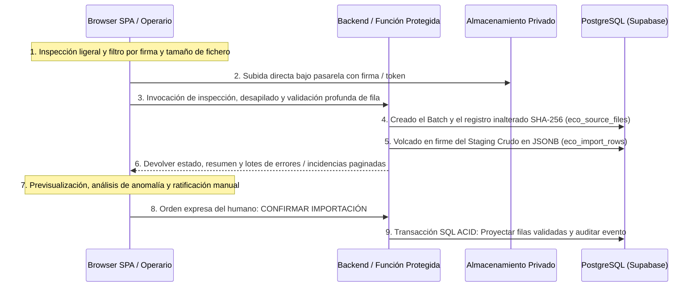

# 08 - Estrategias y Ubicación Arquitectónica del Procesamiento de Importación (Fase 2B)

## 1. Desvinculación de Asunciones Frontend Monolíticas

Un error de diseño recurrente al programar plataformas sobre React o frameworks SPA radica en la pretensión ingenua de procesar, validar, transformar e importar archivos bancarios o masivos mercantiles y operacionales en su integridad dentro del hilo de ejecución javascript de la interfaz gráfica local web del usuario. 

El presente estudio rechaza frontalmente la presunción teórica de que todo flujo transaccional seguro y de alta densidad contable sea susceptible de resolverse de modo monolítico en el navegador del operador HORECA. Por consiguiente, se prescribe una clara segmentación por etapas de evolución técnica (Prototipo vs. MVP Operative) acompañada de una división estricta de responsabilidades entre lo ejecutable en el navegador web y lo reservado obligatoriamente a servicios protegidos de backend en el servidor o funciones dedicadas en la nube.

---

## 2. Recomendación Separada por Ciclo y Fase del Proyecto

### 2.1. Procesamiento en Prototipos y Laboratorios (Fase 2A y Prácticas Iniciales)
* **Topología:** Procesamiento 100% en local, ejecutado mediante pruebas comunitarias o herramientas interactivas de comando de terminal de Node en el laboratorio aislado (`labs/import-preview/`), o a través de entornos desechables locales en el navegador sin almacenamiento transitorio inquebrantable en servidores en la nube.
* **Propósito Operacional:** Verificar con celeridad agudeza y fidelidad en los detectores analíticos de la empresa (`fileTypeDetector`, `unifiedReader`), confirmar que los adaptadores son capaces de identificar sin fallos el `tabs-report` o un informe de Uber Eats, sin condicionar o perturbar durante el desarrollo local la seguridad ni los schemas de la base de datos oficial HORECA.

### 2.2. Procesamiento en el MVP Operativo (Estrategia Híbrida Seguro-Distribuida)
En contraste directo con el prototipado monobloque local, para el inicio inminente y los pasos productivos de la **Fase 2 (MVP Operativa)** se prescribe y diseña el despliegue de una **Estrategia Híbrida** en el ciclo transaccional de carga de reportes para Taquería El Criollo.

El ciclo operativo oficial constará de las siguientes fases secuenciadas irremplazables:
1. **Inspección Inicial Aislada (Navegador SPA):** Al arrastrar el documento contable o el fichero de Last.app y situarlo en la pantalla HORECA de importación, el cliente local aplica un análisis de firma in situ ultramecanizado: autentica si el tamaño del bloque se halla bajo el umbral de los 10 MB prescritos y verifica formalmente la correspondencia entre los bytes cabecera del archivo y su extensión declarada (`XLS`, `XLSX` o `CSV`), deteniendo manipulaciones elementales antes de transferir datos por red y evitando sobrecargas innecesarias en la base de datos.
2. **Subida Privada y Custodia del Original:** Habiendo prosperado este examen higiénico primario, la SPA efectúa la transferencia binaria codificada por red no interpelada hacia el Storage o depósito privado de nube especificado en el anterior entregable.
3. **Validación Definitiva en Backend / Función de Servidor:** Se interviene un servicio de ejecución de backend transaccionalmente seguro (por ejemplo una Función Serverless administrada de Supabase o API privada no adulterable) al cual el navegador le hace entrega de la referencia o URL reservada de archivo almacenado. En la intimidad protegida y escalable de este entorno en nube (o tras capa API protegida), el motor transaccional del servidor computa de forma inapelable el **hash SHA-256** exacto de la totalidad de bytes para contrastar al instante por duplicidad contra la tabla contable del restaurante (`eco_source_files`). Confirmada su originalidad no repetida, el parser en servidor descifra, inspecciona y desapila todas las filas, poblando en lotes transaccionados (acid batch inserts) la capa del Staging en crudo de la base relacional (`eco_import_rows` y el concentrador de anomalías `eco_import_issues`).
4. **Previsualización Paginada en Cliente web (HORECA UI):** En lugar de abigarrar y sobrecargar la memoria web en el terminal del operador transvasando al hilo del explorador listas con 36.000 objetos complejos de javascript, la SPA consulta mediante sentencias paginadas limpias y rápidas el motor de base de datos para recuperar por lotes sucesivos (p.ej. de 50 en 50 filas, o visualizando en primer plano las incidencias detectadas) la vista preliminar del resultado contable. 
5. **Confirmación Humana e Inserción Contable Definitiva:** Previsualizados los datos sintéticos calculados por la inspección preliminar de filas en tablas transitorias por el responsable de negocio o sala en el local, el usuario invocarà voluntariamente el botón *"CONFIRMAR IMPORTACIÓN"*. Esta orden instruirá al motor relacional transaccional (vía procedimiento almacenado RPC de PostgreSQL o función protegida) para transferir y persistir inamoviblemente sin intervención local y dentro de una transacción única ACID protegida las filas aceptadas al almacén contable intermedio o definitivo de la empresa, cancelando automáticamente los bloqueos si ocurre el más mínimo contratiempo al volcar un solo céntimo contable en la importación.

---

## 3. Desglose de Responsabilidades y Fronteras de Procesamiento

Para instruir inequívoca y formalmente al ingeniero al estructurar las funciones y bibliotecas de código operables al arrancar el proyecto en su vertical MVP, se fija la separación de responsabilidades obligatoria por frontera de procesamiento computacional:

| Operación / Responsabilidad Analítica | Área de Ejecución Habilitada | Fundamentación Técnica Verificable |
|---|:---:|:---:|
| **Comprobación Preliminar de Extensión y Peso** | **Navegador SPA Web** | Permite rechazar al instante sin sobrecargas, esperas arbitrarias ni costes de tráfico de red ficheros erráticos o no autorizados superpuestos de >10 MB. |
| **Cálculo Oficial e Inalterable del SHA-256** | **Servidor / Función Protegida** | Un cálculo criptográfico computado exclusivamente desde una interfaz SPA del lado del cliente podría ser burlado, interceptado por consola web adulterando los resúmenes del hash si un archivo duplicado fuese enmascarado antes de subir al sistema de control de duplicados de base de datos. |
| **Desmontaje y Lectura Intensiva de Libros Excel (`xlsx`/`xls`)**| **Servidor / Función Protegida** | Evita que al procesar 36.086 filas transaccionales en un navegador móvil, tablet POS o terminal computacional en sala de restaurante con recursos limitados se provoquen demoras o sobrecargas incompasivas pergeñando caídas, interrupciones o fallos que infrinjan la **Regla de Oro**. |
| **Normalización, Extracción de Hechos e Interpolación** | **Servidor / Función Protegida** | Asegura una uniformidad infalible coherente, preservada y libre de redondeos intempestivos o desajustes motivados por configuraciones variables de zona horaria o de separador de millar/decimal en el sistema operativo del cliente (por ejemplo si un operador accede desde Windows en formato US vs. un POS en castellano español). |
| **Detección de Coincidencia Parcial 1:N o Intersecciones N:M** | **Motor Base de Datos (SQL)** | Es inviable y anti-patrón de software descargar al frontend todo el historial anterior bancario del negocio para cruzar operacionales: dicha analítica transaccional se encomienda en firme al motor PostgreSQL empleando sentencias y optimizaciones puras `JOIN` y consultas computadas interactivas. |
| **Renderizado y Navegación Paginada de Previsualización** | **Navegador SPA Web** | Concentración del 100% de la energía del motor cliente en proporcionar una experiencia de usabilidad **WOW**, de rápida respuesta, transiciones ágiles y filtros dinámicos que simplifiquen en pantalla al usuario HORECA entender en qué filas erradicar fallos, resolver ausencias contables o salvar anomalías interpretativas operadas sin fisuras visuales o caídas locales. |
