# 15 - Plan Técnico para la Fase 2C (Endurecimiento, Verificación y GO/NO-GO para Staging)

## 1. Naturaleza y Alcance de la Fase 2C

De conformidad con el principio de avance verificable y para dar respuesta a los requerimientos bloqueantes identificados en la presente fase documental, se diseña y especifica el contenido técnico de la futura **Fase 2C**. Esta etapa se constituirá como un **ciclo de endurecimiento intensivo, breve, puramente ejecutable e ineludible**, desarrollado sobre entornos temporales en aislamiento de laboratorio, con el objetivo de saldar las deudas de verificación antes de proponer a la dirección la promoción definitiva de la primera vertical hacia el entorno productivo de **Taquería El Criollo / Vegen Digital SL**.

En estricta obediencia al mandato documental de la presente intervención (Fase 2B), este plan define el contenido procedimental de cada prueba exigida **sin escribir código ejecutable de tests en esta tarea**, preservando la pulritud estática y no invasiva de este estudio.

---

## 2. Inventario Obligatorio de las 14 Etapas y Pruebas del Plan de Endurecimiento

El desarrollo operacional en firme de la futura Fase 2C transcurrirá aplicando punto por punto sin omisión alguna el siguiente protocolo de verificaciones encadeadas:

```mermaid
flowchart TD
    subgraph DEFENSA_PREVENTIVA [Pruebas de Defensa y Tolerancia a Fallos]
        P1[1. Extensión Falsa] --> P2[2. Archivos Corruptos]
        P2 --> P6[6. Encabezados Variables]
    end
    subgraph VALIDACION_FORMATOS [Pruebas con Archivos Reales del Negocio]
        P3[3. XLS Real] --> P4[4. XLSX Real - tabs-report]
        P4 --> P5[5. CSV Real Bancario]
    end
    subgraph ESTABILIDAD_TRANSACCIONAL [Integridad Transaccional e Idempotencia]
        P7[7. Reimportación / SHA-256] --> P8[8. Confirmación Duplicada]
        P8 --> P9[9. Privacidad / Anonymizer]
    end
    subgraph AUDITORIA_Y_CONTROL [Auditoría, Conteo y Decisión Final]
        P10[10. Auditoría de Outputs] --> P11[11. Estadísticas de Productos TPV]
        P11 --> P12[12. Conteo de Hechos Normalizados]
        P12 --> P13[13. Revisión de Dependencias]
        P13 --> P14[14. Decisión Final GO / NO-GO Staging]
    end
```

### 2.1. Pruebas de Tolerancia a Fallos y Defensa Perimetral
1. **Pruebas de extensión falsa:**
   Simular deliberada y explícitamente en el entorno de pruebas la subida y transferencia por terminal web o llamada API de un archivo binario o imagen cualquiera renombrada intencionalmente con los sufijos engañosos `.xlsx` y `.csv`. Verificar fehacientemente y constatar mediante registro en el test que el motor en servidor de análisis de firma por *Magic Numbers* interrumpe de inmediato su curso, desvinculando la tarea con rechazo defensivo en claro en lugar de reportar caídas infrecuentes del intérprete o excepciones web no administradas.
2. **Pruebas de archivos corruptos:**
   Proporcionar al motor de parseo libros Excel transaccionales con cabeceras incompletas y archivos XML deliberada y agresivamente mutilados. Comprobar que la envolvente preventiva de excepciones del dominio desacoplado intercepta el fallo local de desapilado, retornando un objeto transaccional con código de error controlado (`ERROR_CORRECTO_DE_ESTRUCTURA`) y sin congelar transatoriamente el hilo de ejecución ni bloquear las interfaces del resto del sistema.
3. **Pruebas de tolerancia ante encabezados variables y columnas permutadas (Punto 6 del Plan):**
   Inspeccionar qué acontece cuando se modifica intencionadamente en un libro contable o extracto de banco el orden tradicional en que las columnas se disponen en horizontal (por ejemplo alterar de posición "Importe" con "Concepto" en Sabadell), o si el banco agrega inesperadamente al comienzo del CSV cinco líneas publicitarias. Verificar la destreza del detector de fuentes (`sourceDetector`) para ubicar sin equívocos el encabezado veraz de las tablas HORECA independientemente del orden o línea original, o rechazar si la estructura es incomprensible con un mensaje auditable en `eco_import_issues`.

### 2.2. Verificación Exhaustiva con Ficheros Reales y Muestras del Negocio
4. **Pruebas de carga con libro XLS real (Punto 3 del Plan):**
   Ejecutar el parseo completo de extremo a extremo utilizando una muestra veraz y preservada que conste formalmente en formato **XLS clásico (Binario 97-2003)** provista durante la Fase 1 o en aportaciones corporativas del Banco BBVA/Sabadell. Verificar la ausencia de desajustes, cerciorándose de que no se pierde ni un solo céntimo en decimales ni difiere ninguna fecha de su correspondencia gregoriana fáctica en calendario originario del local.
5. **Pruebas de carga con libro XLSX real y complejo (Punto 4 del Plan):**
   Aproximar en firme al motor transitorio de prueba el informe estrella y fuente primaria por antonomasia de la Taquería El Criollo: los libros **`tabs-report-0.xlsx` y `tabs-report-0 (1).xlsx` de Last.app**. Comprobar de modo fehaciente que las miles de celdas combinadas, productos, modificadores de escandallo, canales y propinas u otras incidencias operativas se extraen preservando el cien por cien del contenido literal y crudo capturado como JSONB.
6. **Pruebas de carga con extractos en CSV real (Punto 5 del Plan):**
   Sustituir pruebas simuladas arbitrarias e integrar muestras transaccionales reales procedentes del historial contable original de cuentas bancarias y tarjetas en formato **CSV**. Acreditar el respeto impecable del motor a los separadores y signos monetarios originales en operaciones bancarias reales por cuenta comercial del restaurante de Vegen Digital SL en Palencia y sus marcas afines.

### 2.3. Estabilidad Transaccional, Idempotencia y Cumplimiento del RGPD
7. **Pruebas de reimportación, bloqueo de duplicidad por SHA-256 (Punto 7 del Plan):**
   Tomar un archivo contable transaccionado, completada su carga y verificación exitosa, e intentar someter a continuación con plena voluntariedad a una nueva e idéntica carga y procesamiento por parte de un operador anónimo o administrador idénticamente logueado. Acreditar empíricamente que al resolver la comprobación criptográfica y tabular sobre la cabecera `eco_source_files`, el motor transaccional deniega y aborta por duplicidad manifiesta en milisegundos su repique innecesario en la base de datos sin duplicar transitoriamente una sola línea transaccional.
8. **Pruebas contra la confirmación duplicada in situ y reintentos en sala (Punto 8 del Plan):**
   Eslavonar una llamada programática o simular transacciones dobles simultáneas interactivas y repetidas al unísono pretendiendo ratificar e invocar en paralelo el botón transaccional "Confirmar Importación" sobre un mismo lote de prueba transitorio precargado. Proferir evidencia constatada en test en orden a demostrar y ratificar transitoriamente que al confirmarse a firme la primera petición (alterándose el estatus al nivel inamovible `CONFIRMADO`), la segunda llamada repetida fracasa fulminantemente merced al cerrojo transaccional del motor o el índice único combinatorio (`external_reference`), protegiendo impasible el balance sin redundar ingresos ni retenciones bancarias en los registros consolidados corporativos.
9. **Pruebas obligadas de Privacidad e Inmutabilidad del Anonymizer (Punto 9 del Plan):**
   Procesar una muestra contable o de reportes operativos de plataformas como Uber Eats o Glovo que albergue conscientemente en abierto datos civiles reales no enmascarados, nombres propios de comensales e identificaciones o teléfonos domiciliarios del cliente final de los restaurantes HORECA de sala o delivery. Acreditar documental e inequívocamente en la prueba que no ingresa al sistema en claro ninguno de estos atributos sensibles; comprobando que antes o durante su acomodo sobre elstaging relacional de PostgreSQL, el filtro del motor (`anonymizer.js`) neutraliza y anonimiza o altera a alias autorizados e irreversiblemente resguardados por el ordenamiento y preceptos formales dictados por el Reglamento General de Protección de Datos en España y directivas directas de Vegen Digital SL.

### 2.4. Auditoría de Outputs, Conteo Estadístico y Revisión Tecnológico-Legal
10. **Auditoría preventiva sobre outputs crudos y depuración del sistema de ficheros (Punto 10 del Plan):**
    Verificar que, tras ejecutar en cadena la totalidad de las importaciones, validaciones intensivas y transmutaciones sobre archivos Excel o CSV masivos de sala e ingeniería HORECA descritas en este plan, **el sistema de ficheros en disco de los servidores no alberga temporal ni permanentemente ningún fichero de salida, reporte en texto plano desprotegido, registro log o CSV sin cifrado susceptible de inspección en claro tras los ensayos**. Confirmando con contundencia transaccional inviolable que toda traza operativa reside única y exclusivamente dentro de las tablas protegidas relacionales del motor ACID en la nube (`eco_import_rows`, `eco_normalized_records` y `eco_audit_events`), o bien en contenedores privados inasequibles bajo cifrado no público en red web o por la internet del local web.
11. **Prueba y generación de estadísticas de productos en el parser de Last.app (Punto 11 del Plan):**
    Verificar que durante la lectura del libro `tabs-report`, el motor transita más allá del desapilado bruto de celdas para agregar e computar una estadística verificable e indiscutible que consolide y cuantifique en la salida cuántos productos individuales de cocina o bar gastronómico HORECA transaccionados, qué cuantía en modificadores y aderezos computó y cómo distribuye por canal comercial la orden operativa, habilitando una métrica estadística verificable que la futura interfaz HORECA mostrará visualmente al operador al instante para confirmar antes y después si el libro Excel reportado casa con la liquidación facturada por la sala o cocina en la hornada comercial y contable examinada de la semana.
12. **Conteo cuantitativo e inquebrantable de hechos normalizados transicionados (Punto 12 del Plan):**
    Verificar cuantitativa y comparativamente que tras superarse el tránsito desde el staging crudo en bruto de una carga tabulable probatoria verificada y libre de errores en `eco_import_rows` hacia la capa transaccional intermedia normalizada (`eco_normalized_records`), **el número exacto de filas con contenido transitorio apto es estrictamente consuno e idénticamente contrapunteable al conteo verificado de hechos u objetos normalizados resultantes originados en dicha capa temporal**, demostrándore probatoriamente sin equívocos que los transformadores no omitieron descuidos accidentales ni duplicaron por descuido de codificación un solo asiento financiero intermedio durante su re-espejado en base de datos al motor transaccional.
13. **Revisión institucional y técnica de dependencias (Punto 13 del Plan):**
    Ejecutar una auditoría formal y documentable orientada a corroborar in situ y para el registro documental administrativo y directivo las condiciones colaterales de la librería examinada en laboratorio (`xlsx` 0.18.5 o su eventual reemplazante abierta transicionada como `exceljs`), certificando sin vacilaciones su licenciamiento no lesivo en clave comercial al momento transitorio de paso a despliegue en sala HORECA; verificando a partes iguales que las rutinas adlátere carecen por igual en repositorios de vulnerabilidades activas de riesgo inaceptado impunes sin parchear y garantizando sin paliativos ni fisuras computacionales el aislamiento absoluto y encapsulamiento estricto tras del marco delimitador del enrutado en `src/domain/import-engine/`.

---

## 3. Decisión Final de Promoción (GO / NO-GO para Staging)

14. **El Hito Directivo 14: Emisión de la Decisión Formal de GO / NO-GO para el Entorno Staging:**
    Concluidos uno por uno sin excepción los trece anteriores exámenes y comprobaciones exigidas de endurecimiento técnico programados a lo largo y ancho en la futura Fase 2C, el ingeniero o arquitecto técnico responsable redactará un acta resolutoria documentando con rigor verificable las evidencias capturadas ante cada ensayo. En mérito del resultado fáctico expuesto por las pruebas sobre el comportamiento del sistema probadas transitoriamente:
    * **Dictamen del GO PARA STAGING Y MVP:** Emitido exclusivamente si, y sólo si, todas las deudas bloqueantes tasadas en este estudio son satisfactoriamente sorteadas, si los parses superan al cien por cien la resistencia y si el modelo relacional demuestra no presentar mella ante duplicados o bloqueos. Su emisión dará carta de libertad en el proyecto a la gerencia técnica de Vegen Digital SL para ordenar y comenzar en el acto el despliegue fundacional en firme de las migraciones SQL, la activación transitorio adaptativa del motor en la nube y la implementación de código transaccional de la primera vertical sin caídas web, demoras lesivas sobre el servicio en sala operado de las Taquerías El Criollo en ningún instante comercial u horario transitorio del restaurante o TPV.
    * **Dictamen del NO-GO RETENCIONAL PREVENTIVO:** Emitido resueltamente y sin dilaciones ante la eventual aparición imperceptible temporal de vulnerabilidades en el parseo no saldadas o fallas al gestionar identidades en caliente sobre RLS en la base de datos o almacenamiento de nube provista temporalmente. Su emisión paralizará indefinida o hasta su completa corrección demostrada todo intento impaciente o irreflexivo de transaccionalización, carga contable HORECA en firme o transicion a los ecosistemas o servidores productivos y computacionales de los locales en sala.
